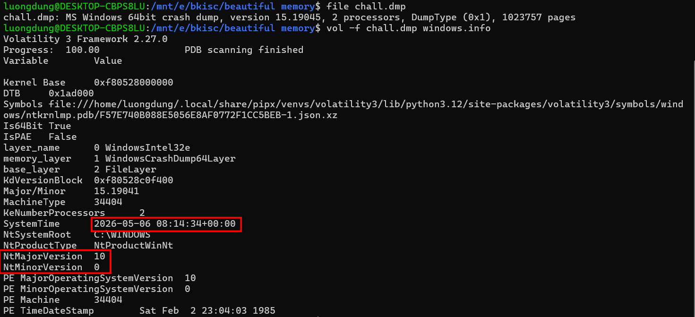
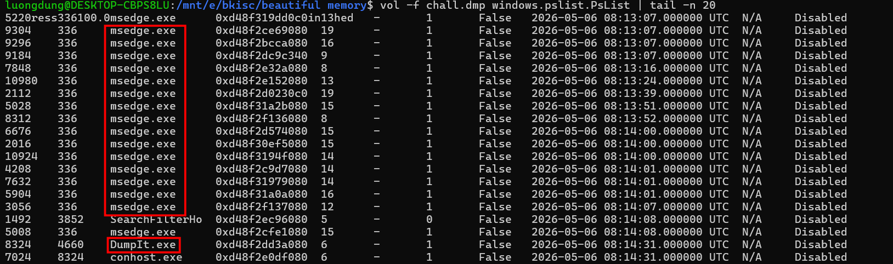
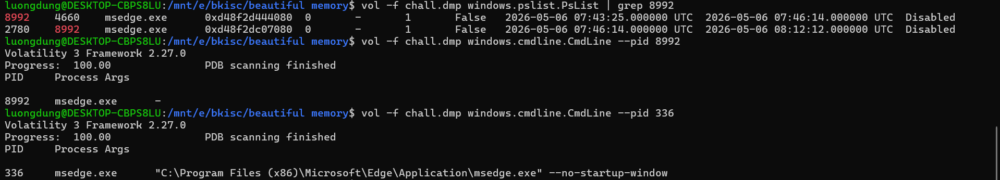
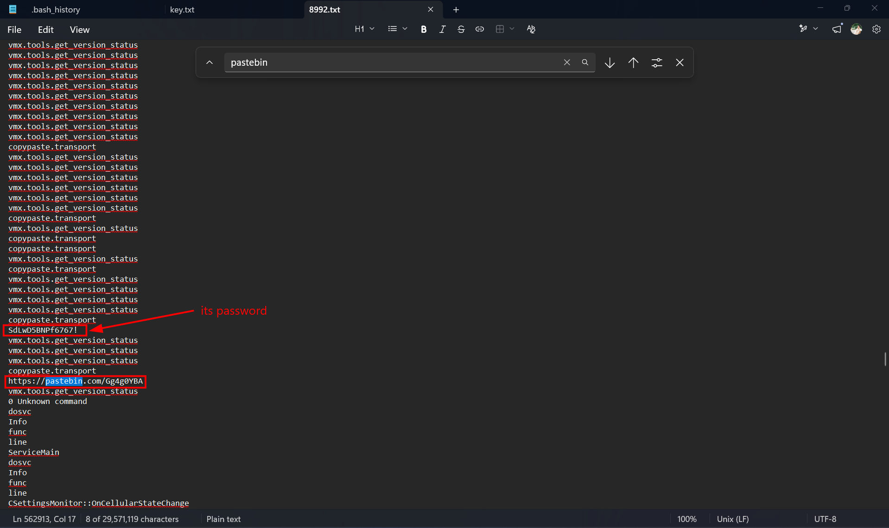
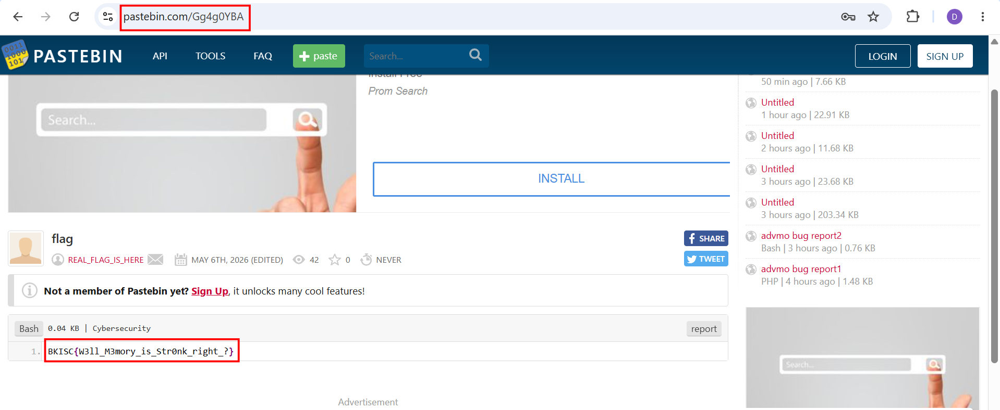

# Beautiful memory
**Challenge scenario**: 

## Overview
The challenge provided a memory dump of a Windows machine. It was Windows version 10 and the dumped time was on 06/05/2026, nearly when the competition begins.

I checked for `psree` and `pslist` first, and found out that before the dump took place, the process msedge.exe (showing that users has used Microsoft Edge for browser) was used significantly.

As can be seen, 
A large number of Edge child processes were created continuously between 08:13:07 and 08:14:08. Among these processes, I spotted one that stood out.

## msedge.exe

This msedge.exe with PID of 8992 has only one process child which has the PID of 2780, which was spawned immediately at the time that the parent process was killed. Furthur more, when I checked for its `cmdline`, it is empty, which is different to normal ones, such as the 336 as in the picture. 
With those suspicion, I dumped the process of PID 8992 for furthur analysis using `memap` plugin.
Strings through this process and I found a pasbin URL.

And also its password, visible with high entropy.

And here's our flag. Luckily, the password of this `pastebin` is located inside the process dump, near the keyword `pastebin`.

**FLAG: BKISC{W3ll_M3mory_is_Str0nk_right_?}**

---

