# Deleted secret
**Challenge scenario**: During a cybercrime investigation, law enforcement seized a suspect's machine while the system was still live. To prevent data loss from an imminent power failure, investigators performed a rapid acquisition of the disk. Analyze the resulting image to identify and document any relevant digital evidence.

## Thunderbird ImapMail
The challeng provided a 10GB `.ad1` file !!!
I first found this python script in `C:\Users\supapadey\Documents\Boomaya`

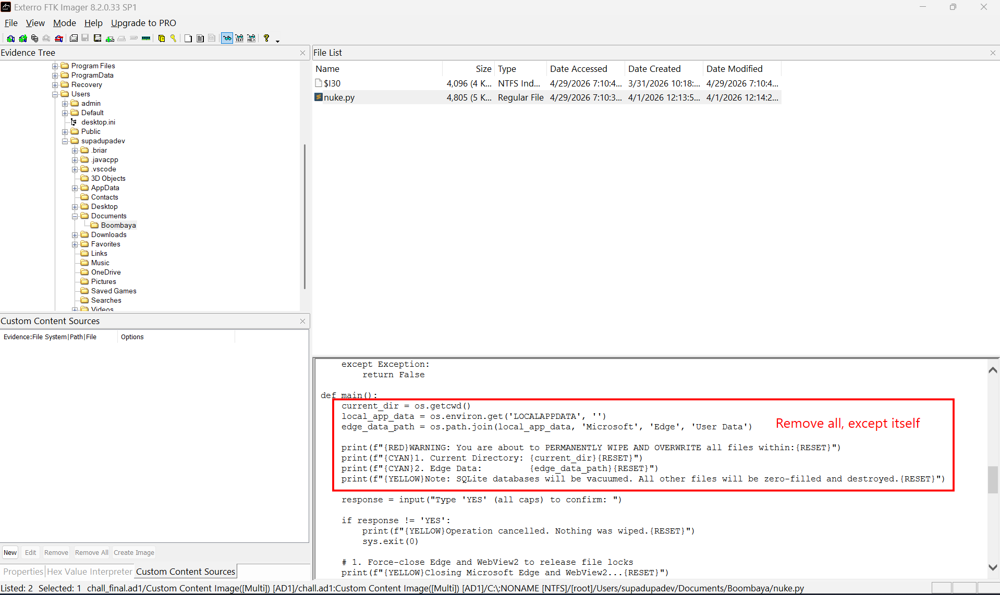

It will overwrite files in current directory by 0x00 bytes, then remove it. This makes data harder to recover since those have been overwritten. 

Then get the Edge data path, which is `C:\Users\<User>\AppData\Local\Microsoft\Edge\User Data`, and kill Microsoft Edge and WebView2 processes.

Digging in the disk, especially for emails sent, I found a suspicious mail from Thunderbird.
`Thunderbird is Mozilla's email client, similar to Outlook. It stores emails locally on computer, usually in: C:\Users\supadupadec\AppData\Roaming\Thunderbird\Profiles\sth.default-release\`

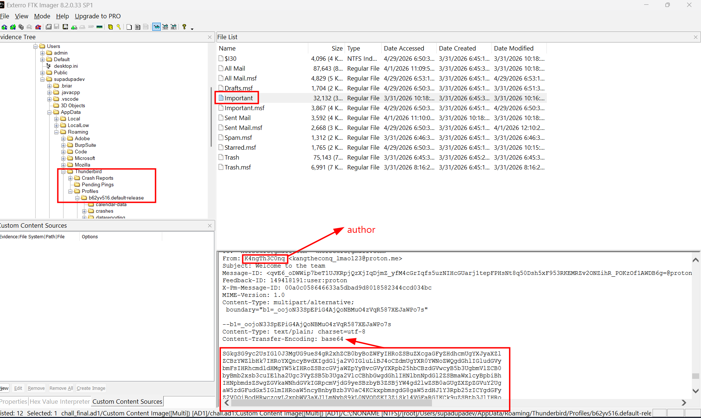


Which is decoded to 

```
Hi Horse, it's Pony. Glad to hear the new hardware arrived safely; that's our ticket in. I’ve attached the internal targets and the specific operational steps you need to follow. Make sure you keep all the sensitive files in a single, dedicated directory so we can wipe the evidence instantly if things go south.

Link to instructions & target: https://limewire.com/d/CU86J#vbJIxTaZDb

One more things, you must download Briar and named exactly Horse, and add my contact briar://ad32him26td22szu2lbst4hikyyjmklv4repsgj5fre2u4dwfz2ao. You must give me yours too.
```

Some IOCs collected from this mail are:
- Attacker email: kangtheconq_lmao123@proton.me
- Name: K4ngTh3C0nq
- Victim email: horsekfc@gmail.com
- Downloaded files: `instructions` and `target`
- Download link: https://limewire.com/d/CU86J#vbJIxTaZDb (inaccessible)
- Briar contact: briar://ad32him26td22szu2lbst4hikyyjmklv4repsgj5fre2u4dwfz2ao
- Briar username required: Horse

Confirming that `instructions` and `target` has been installed through a inaccessible link, but it can be found nowhere in the disk, so it must has be deleted by `nuke.py`. But luckily, its content is still being stored in `Windows.edb`.

```
Windows.edb is the central database 
used by Windows Search to store the operating system’s search index.
Instead of reading every file from scratch each time you search 
in Start Menu or File Explorer, Windows Search scans files in advance, 
extracts useful information, and stores that information in Windows.edb.
The default path of this is
C:\ProgramData\Microsoft\Search\Data\Applications\Windows\Windows.edb
```

I extracted this file from the disk with the hope of recovering deleted items. But to parse this file we need `sidr.exe`

`SIDR (Search Index DB Reporter) is a Rust-based tool designed to parse Windows search artifacts from Windows 10 (and prior) and Windows 11 systems. The tool handles both ESE databases (Windows.edb) and SQLite databases (Windows.db) as input and generates three detailed reports as output. (As README)`
Public repository: [here](https://github.com/strozfriedberg/sidr)

Cloned and used it to export a `.csv` file, combined with `TimelineExplorer`.

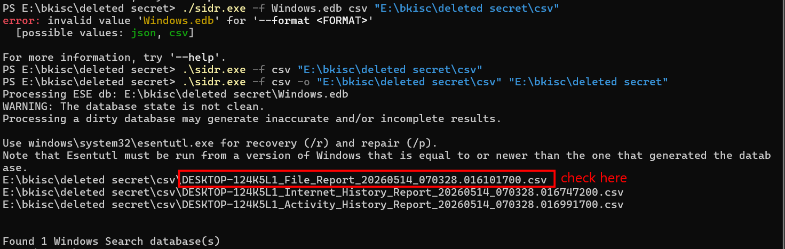

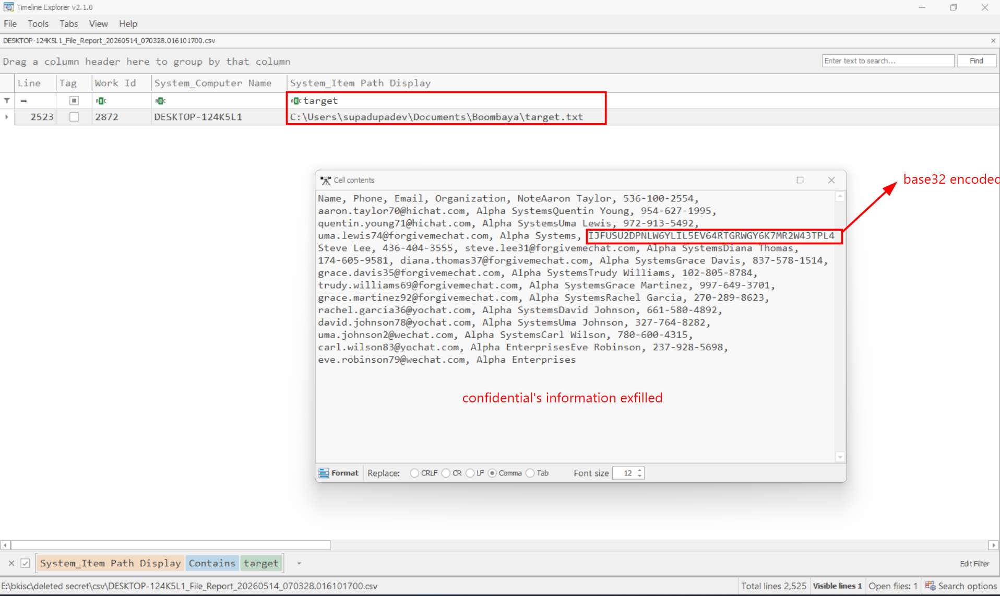

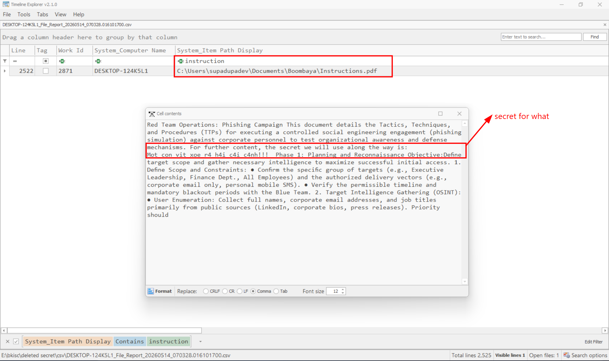

`Target.txt` contains confidential informations, where as `Instructions.pdf` contains a secret. The base32 encoded string in `Target.txt` is actually the first part of the flag.

- First part: `BKISC{Woah_I_r34lly_dunno_`
- Secret: `Mot_con_vit_xoe_r4_h4i_c4i_c4nh!!!`

## Decrypt Briar chat

The mail that I decoded earlier mentioned about briar app.
`Briar on PC is an open-source messaging application specifically designed for activists, journalists, or anyone needing an extremely secure method of communication with browser verification or surveillance capabilities.`

So should I try decrypt the original chat from Briar?
In `Downloads` directory, there is a file called `Briar-Desktop-0.6.5-beta.msi`, confirming that `supadupadev` has installed Briar for conversations.

Also in User supadupadev's folder, I found a `.briar` folder, containing encrypted file for password and chats.
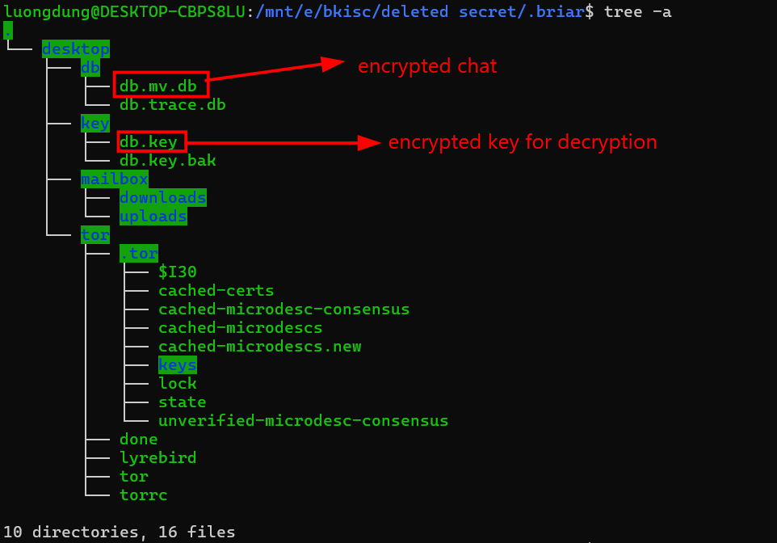

Briar Desktop use user's password to protect database key. From Briar app password use Scrypt KDF to encrypt key which use to decrypt db.key. And since it was using Scrypt, it is anti-bruteforce.

So first I decrypt user's password with DPAPI, the decryption mechanism is exactly the same as in `Homework` challenge. Extracted SAM, SECURITY, SYSTEM and used `Impacket` tool (or Mimikatz is fine) and get user's password NTLM hash.
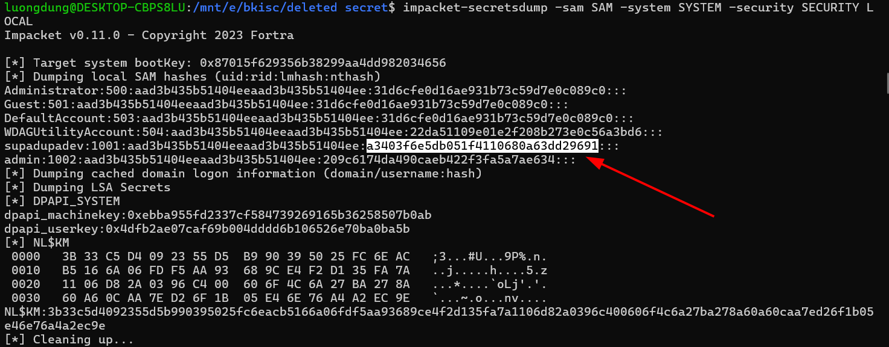

From [CrackStation](https://crackstation.net/), it is `KangKong`

The author hinted that to decrypt Briar's password, should look for `Pinned` directory in `Appdata/Local/Microsoft/Windows/Clipboard` to recover password. Extracting this folder revealed something interesting

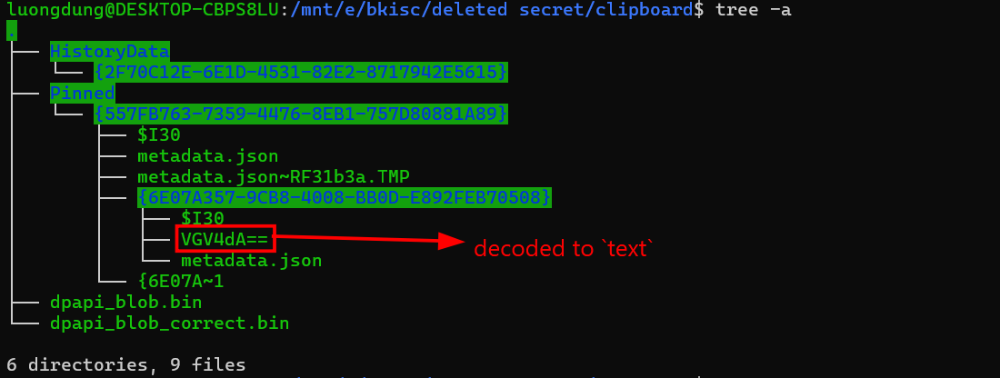

`The following from now on until decrypted successfully Briar's password I did use many LLM promptes, since it is very Crypto-related, so I will not go much detail for its encryption mechanism here.`

Using `tree -a` command showed an interesting file, which is `VGV4dA==` decoded to `text`. It is a `data` file only, so I used `xxd` command.

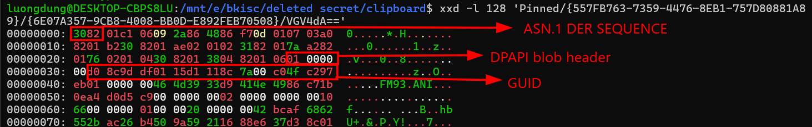

I parsed ASN.1 of Clipboard file using `openssl` command.

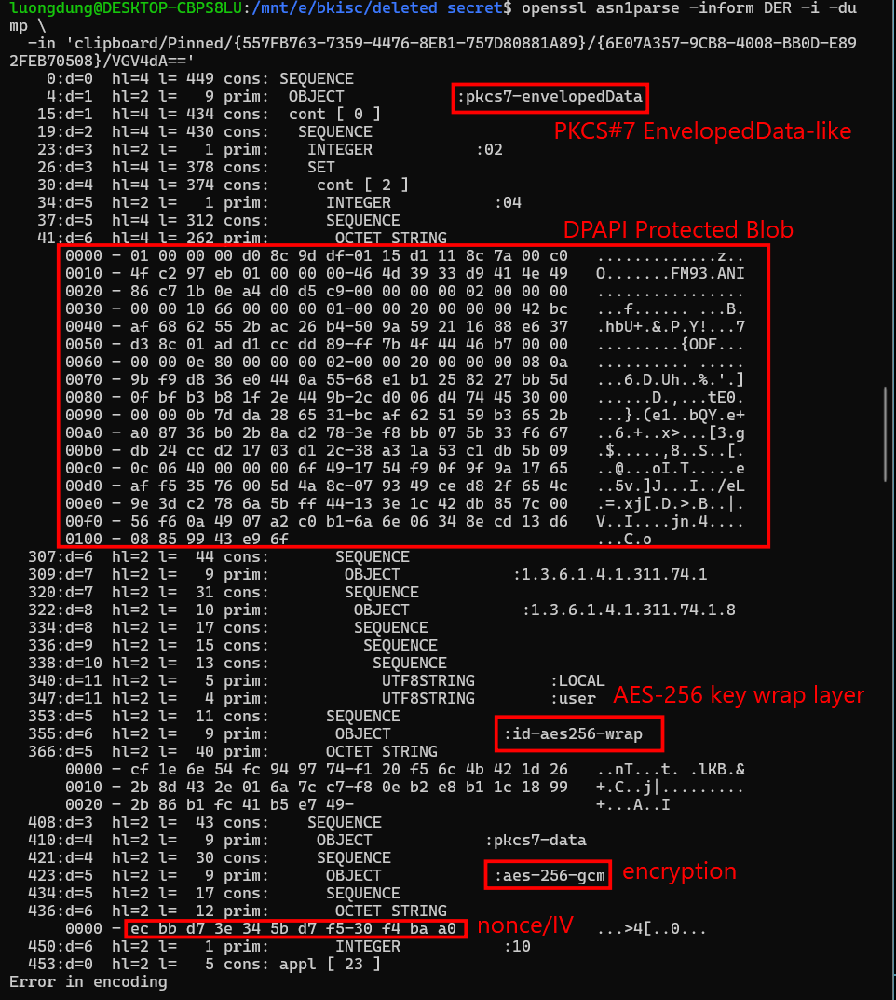

From that DPAPI blob, I saved it to dpapi_blob_correct.bin to decrypt it later.

But to decrypt this blob, I need the DPAPI masterkey. The DPAPI masterkey can be decrypted using `impacket` tool, which user's password `kangkong`, SID and GUID.
SID and GUID is stored in `C:\Users\supadupadev\AppData\Roaming\Microsoft\Protect\`

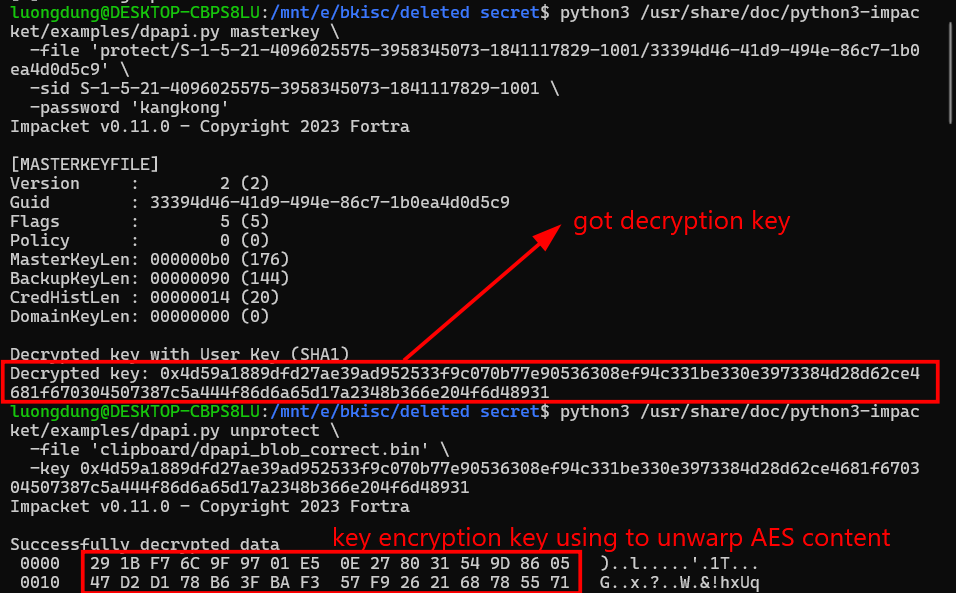

To summary (not to get vague):
```
User's password kangkong
--> decrypt DPAPI masterkey
--> decrypt DPAPI blob
--> KEK (Key Encryption Key)
--> AES key wrap
--> key content
--> AES-GCM decrypt
--> plaintext clipboard
```

Getting the KEK, I used this python scrip to handle the rest (Mind-blowing with cryptography).

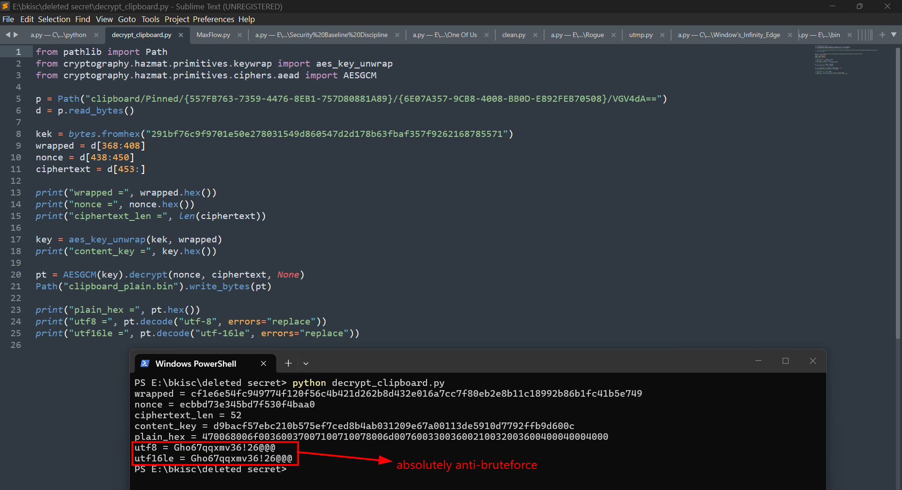

So the password we need to open Briar was `Gho67qqxmv36`.

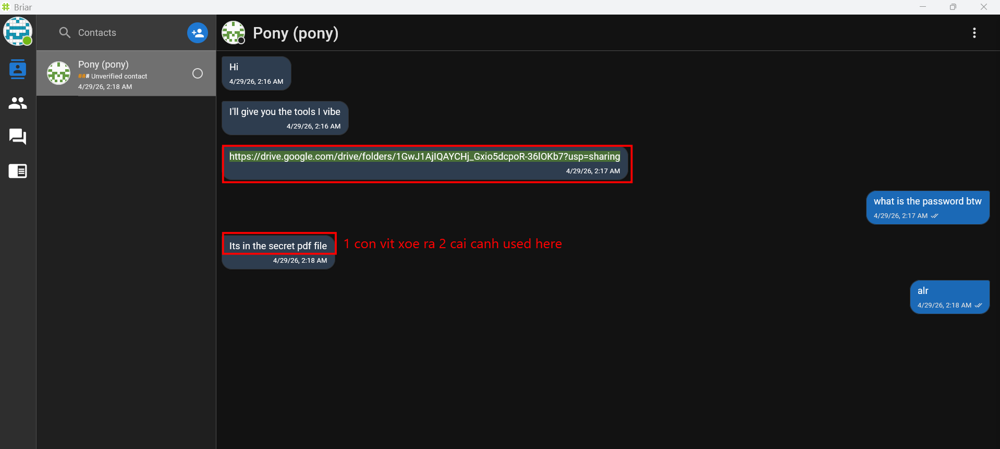

It forwarded a Google Drive link, downloaded the zip file and unzipped it with password that we have from earlier `Instructions.pdf`, which is `Mot_con_vit_xoe_r4_h4i_c4i_c4nh!!!` to get a malicious executable.

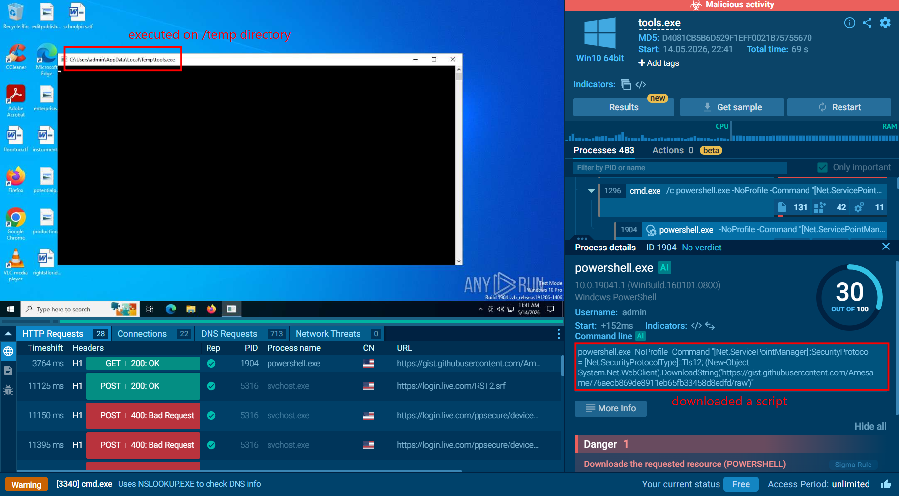

Throwing this file on `any.run` for public dynamic analysis, it executed on `\Temp` directory, run Powershell commands, especially this one. It downloaded a script from a Github link.

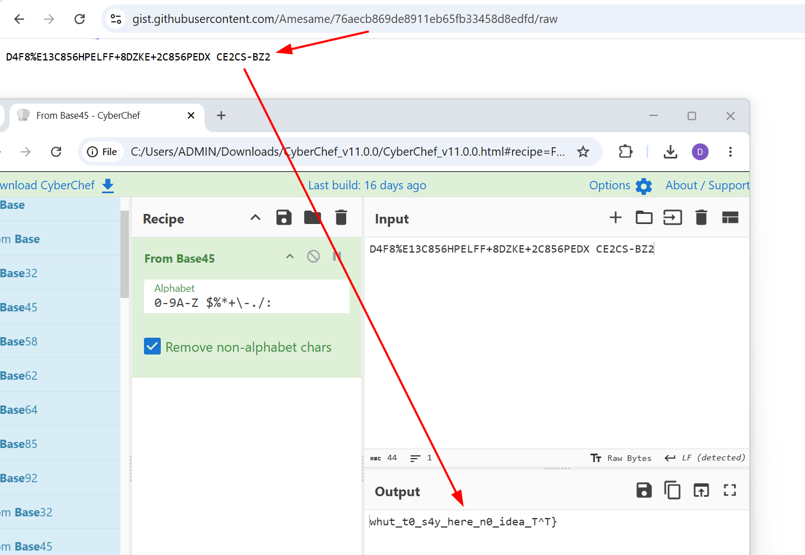

It contains the second part of the flag (after decode Base45).


## Sumarize

- nuke.py in `/Documents` deleted all files in current directory, but parts of its content and metadata is stored in `Windows.edb`. Parsing by `sidr` recovered data.
- Decrypt user's password using SAM, SECURITY, SYSTEM and `impacket` tool.
- Using user's password to decrypt DPAPI's masterkey, along with SID and GUID.
- Decrypt Clipboard data using ASN1 parser, AES GCM... (Cryptography Related)
- Using Briar's password to decrypt Briar's chat --> Link to GoogleDrive, unzip `.zip` file with password --> tools.exe
- Dynamic analysis --> Malicious script from Github


**FLAG: BKISC{Woah_I_r34lly_dunno_whut_t0_s4y_here_n0_idea_T^T}**
