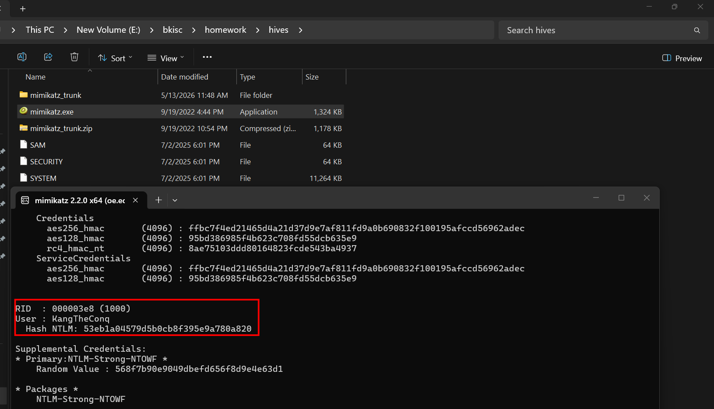
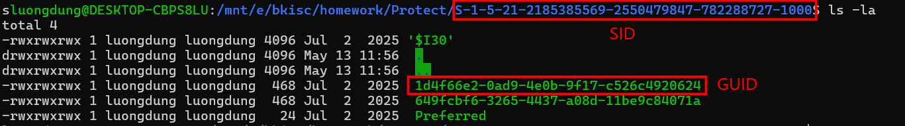
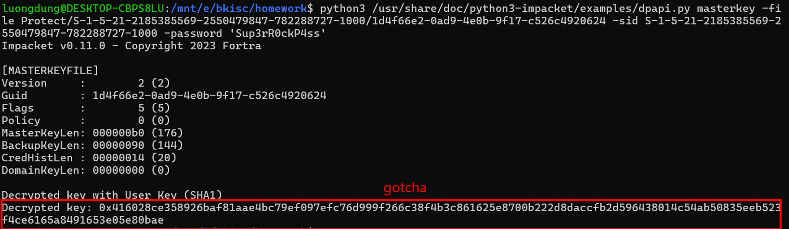
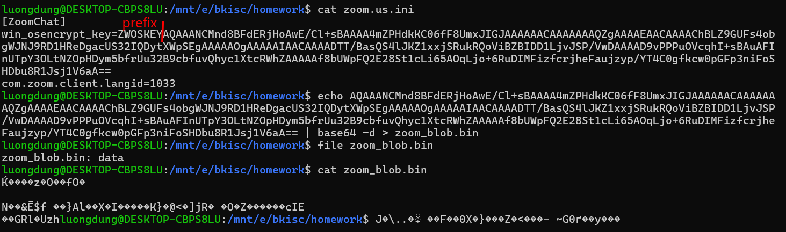
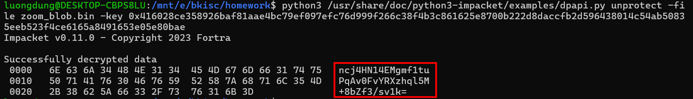
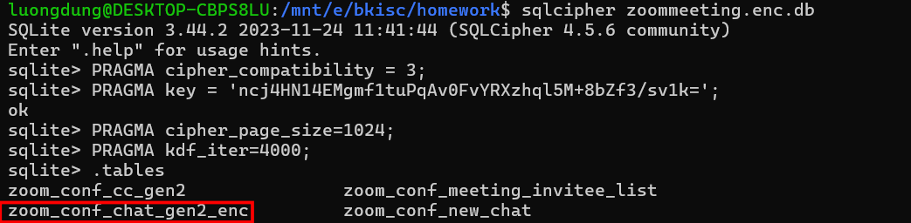
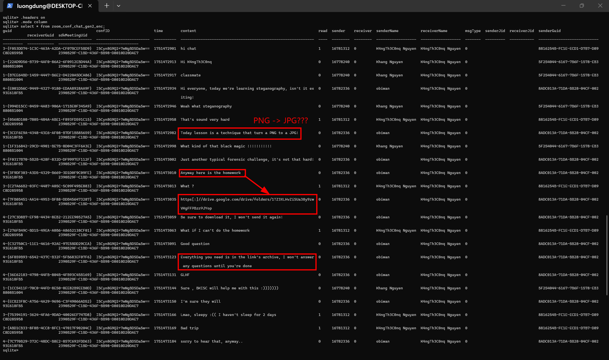
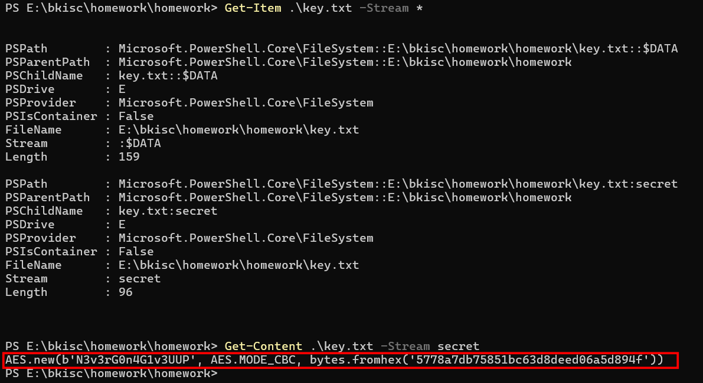
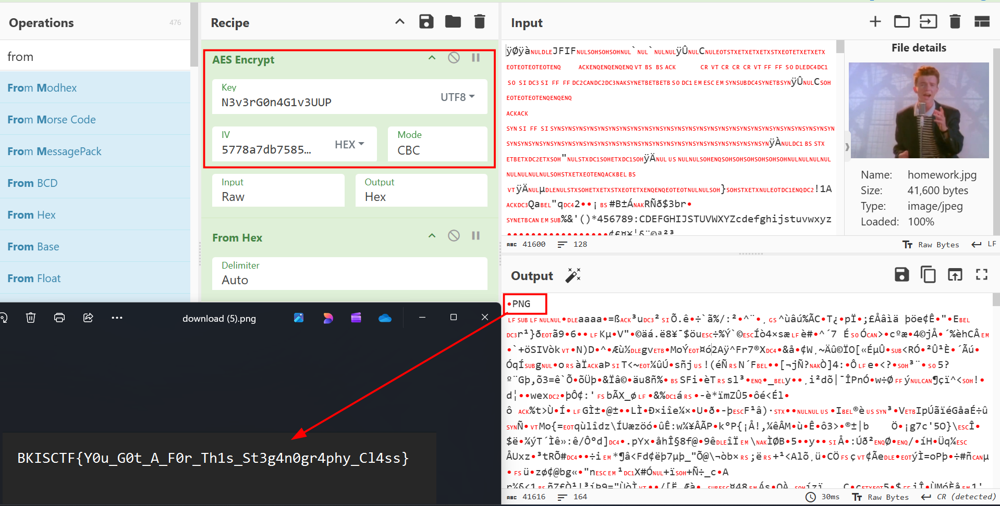

# Homework
**Challenge scenario**: My friend and I were sleeping in our online class, when the session ended in group chat our teacher said the deadline is tomorrow, but we don't know what it is. Can you help us ?

## Overview
A disk forensics challenge, and a `.ad1` file was provided. Located into user KangTheConq and Zoom was downloaded, combine with the scenario which is the homework for an online class showing that the online class took place on Zoom, and the homework for that class is perhaps in Zoom's chat.
Refer to [this write-up](https://infosecwriteups.com/decrypting-zoom-team-chat-forensic-analysis-of-encrypted-chat-databases-394d5c471e60), the chat was encrypted in `C:\Users\KangTheConq\AppData\Roaming\Zoom\data\zoommeeting.enc.db`, this database was encrypted by SQLCipher. Zoom stores the passphrase of SQLCipher in Zoom.us.ini under DPAPI-protected blob.
The flow to decrypt would be like this:
1. Get NT hash or password user Windows (user KangTheConq)
2. Decrypt DPAPI masterkey
3. unwrap win_osencrypt_key trong Zoom.us.ini
4. Take SQLCipher passphrase
5. Open zoommeeting.enc.db to query chat.

## Decrypt Zoom's chat
So first I need to get the NT hash (or password), but here I used NT hash. To get NT hash of all users, I extracted SAM, and SYSTEM in `C:\Windows\System32\config` directory and used this command:
`lsadump::sam /system:E:\bkisc\homework\hives\SYSTEM /sam:E:\bkisc\homework\hives\SAM` in `mimikatz.exe`
So the NT hash of KangTheConq user is
`53eb1a04579d5b0cb8f395e9a780a820`

Throwing this hash on [CrackStation](https://crackstation.net/) to get the real password of KangTheConq user, which is `Sup3rR0ckP4ss`.

Next I need to find the SID and GUID, which is located in `C:\Users\KangTheConq\AppData\Roaming\Microsoft\Protect\`.
I exported the folder to get the SID and GUID

With these informations, I can now decrypt DPAPI's masterkey, which is `0x416028ce358926baf81aae4bc79ef097efc76d999f266c38f4b3c861625e8700b222d8daccfb2d596438014c54ab50835eeb523f4ce6165a8491653e05e80bae`

Now let's unwrap Zoom SQLCipher passphrase, using decrypted key to decrypt zoom_blob.bin. But first I need to find where this `.bin` file is. From `zoom.us.ini`, located in `C:\Users\KangTheConq\AppData\Roaming\Zoom\data`, we take the payload after `ZWOSKEY` prefix, then decode Base64 it to have the `.bin` file we need.

Now I should have the SQLCipher password of Zoom DB.

which is `ncj4HN14EMgmf1tuPqAv0FvYRXzhql5M+8bZf3/sv1k=`

Using sqlcipher to open and encrypted SQLite database.

In these tables, `zoom_conf_chat_gen2_enc` contains in-meeting chat messages, so query this table will show what happens during the lesson.
`PRAGMA cipher_compatibility = 3` tells SQLCipher to behave liek SQLCipher version 3
`PRAGMA key = '...'` gives SQLCipher the passphrase to decrypt the database.
`PRAGMA kdf_iter=4000` means Key Derivation Function iterations. SQLCipher does not use that key directly as AES key. Instead, it runs through PBKDF2 many times to derive the real AES encryption key. 4000 means 4000 iterations
`PRAGMA cipher_page_size=1024;` tells SQLCipher that each encrypted database is 1024 bytes, which is the default page size of SQLCipher v3.

## Doing homework
Querying the `zoom_conf_chat_gen2_enc` databae shows the in-meeting class chat.

The homework is given in a Google Drive file, relating converting a PNG file to a JPG file, and it said that this is all I need to get the flag, sounds like decoy but it is actually is.
A `.jpg` file and a `key.txt` file was provided, it said nothing about the encryption mechanism. But the AES key and IV is hidden in ADS of `key.txt`

Using Cyberchef to encrypt the rest and I finished this homework exercise.

**FLAG: BKISCTF{Y0u_G0t_A_F0r_Th1s_St3g4n0gr4phy_Cl4ss}**

