# The interview
**Challenge scenario**: 

## Flag part 1
A generous number of artifacts was provided, this is an artifact dump from Android `/data` snapshot. I did not remember what the scenario was, but from `The interview` challenge's name, SMS messages would be a suitable place to deliver interview's information.
So I checked for SMS messages first, it is stored as SQLite Database in `/data/data/com.android.providers.telephony/databases/mmssms.db`. 
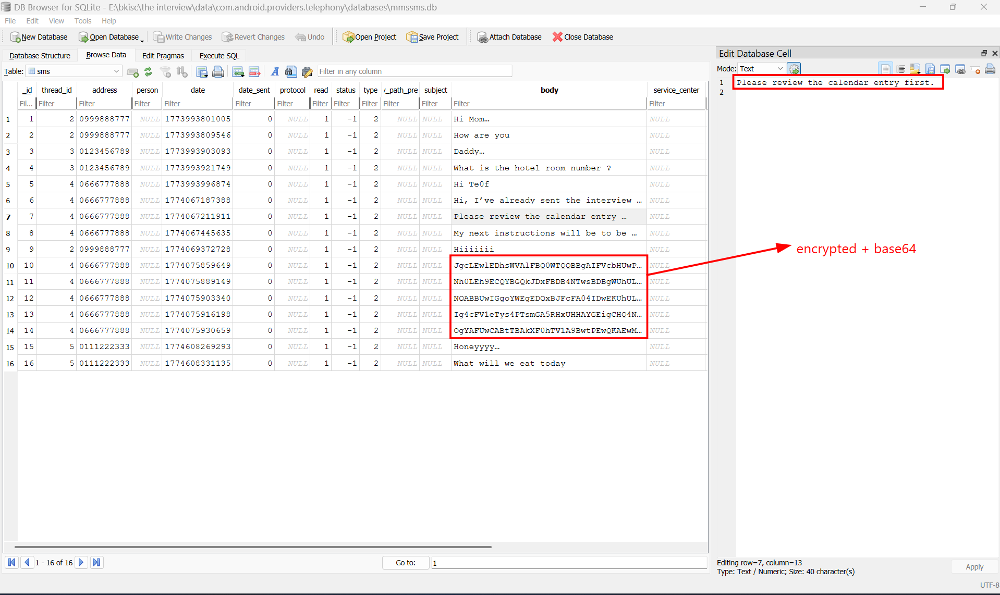
The hint is that check for the calendar entry first.
Again, it is stored as SQLite Database in `data\com.android.providers.calendar\databases\calendar.db`
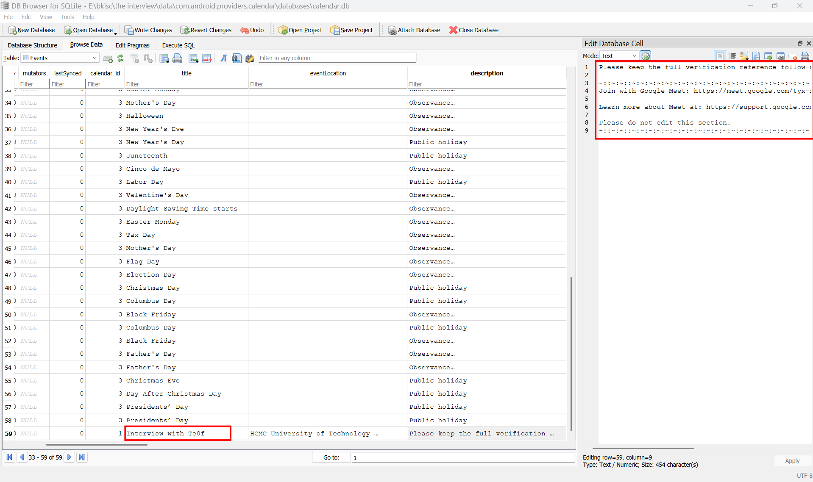

The full description is as this:
```
Please keep the full verification reference follow-up the coordination: ronaldoisthechampionofworldcup2026

-::~:~::~:~:~:~:~:~:~:~:~:~:~:~:~:~:~:~:~:~:~:~:~:~:~:~:~:~:~:~:~:~:~:~:~:~:~:~::~:~::-
Join with Google Meet: https://meet.google.com/tyx-xdmm-gku

Learn more about Meet at: https://support.google.com/a/users/answer/9282720

Please do not edit this section.
-::~:~::~:~:~:~:~:~:~:~:~:~:~:~:~:~:~:~:~:~:~:~:~:~:~:~:~:~:~:~:~:~:~:~:~:~:~:~::~:~::-
```
Here I spotted a malicious string, which is `ronaldoisthechampionofworldcup2026` (nah I'm not sure). In earlier SMS database, there are some Base64 encoded strings, but it becomes trash when I tried to decode it. But combine with this string, looking like some kind of key, to I tried RC4, XOR, AES.
And turns out, five encrypted strings in SMS database has been XOR with `ronaldoisthechampionofworldcup2026` and encode Base64.

Decrypt those strings reveals the first part of the flag, and also hint for flag part 2.
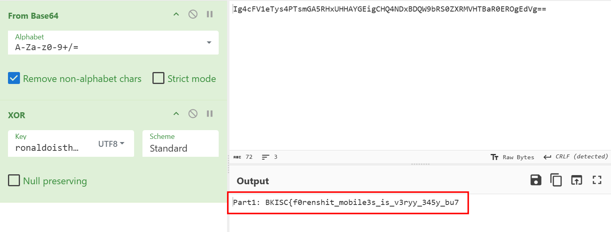
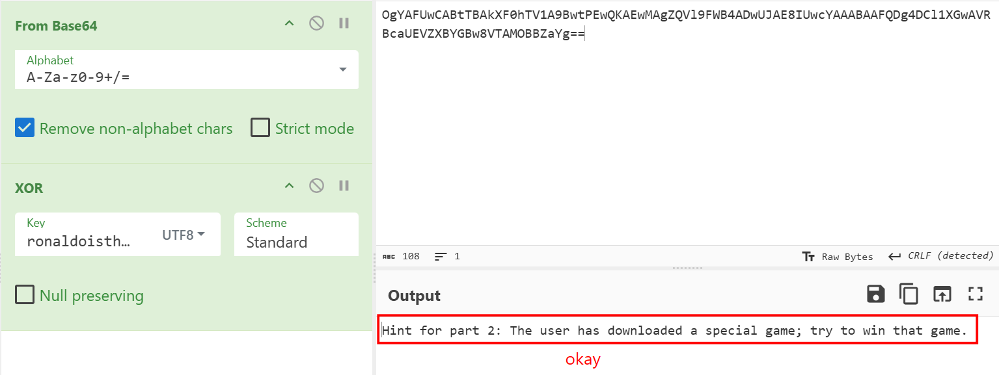

`FLAG PART 1: BKISC{f0renshit_mobile3s_is_v3ryy_345y_bu7`

## Flag part 2
From part 1's hint, I found the special game in Downloads folder, located in `\media\0\Download`
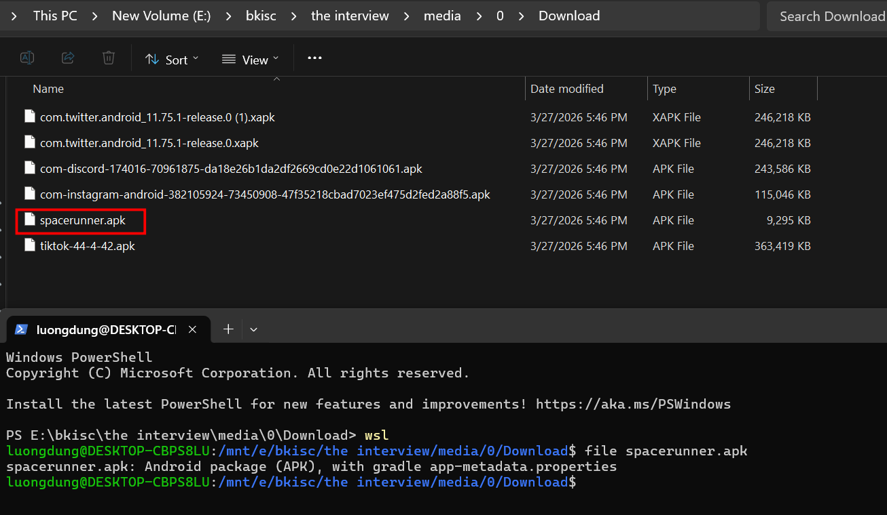

So I guess I need to revere this thing now. Here I used `jadx-gui.exe`, which is the graphical interface of JADX on Windows. It's used to decompile Android APKs into more readable Java/Kotlin code.

I found this getPart2 function in `com.bkisc.spacerunner.GameState`.
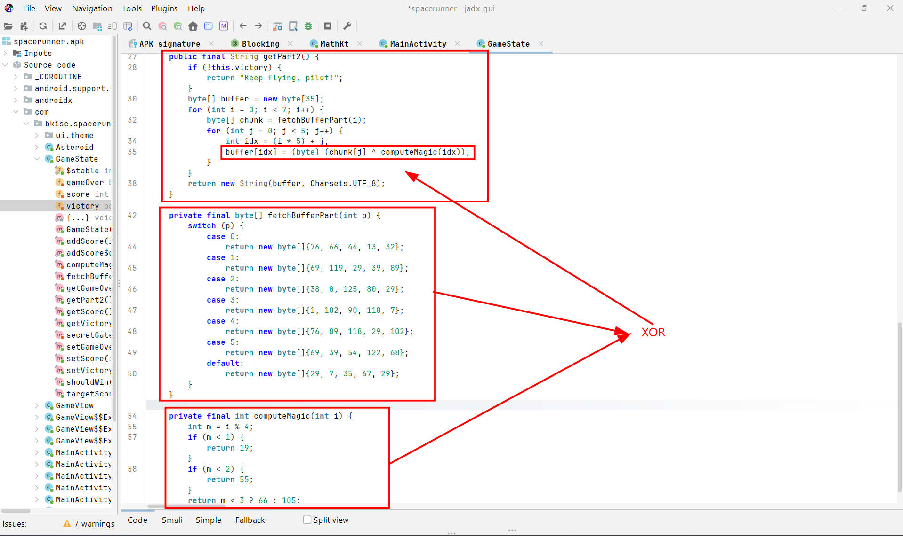
The flow is easy. It takes each byte array in `fetBufferPart`, and XOR with calculated `computeMagic((i*5)+j)`. 
I used the Python script to get the second part of the flag.
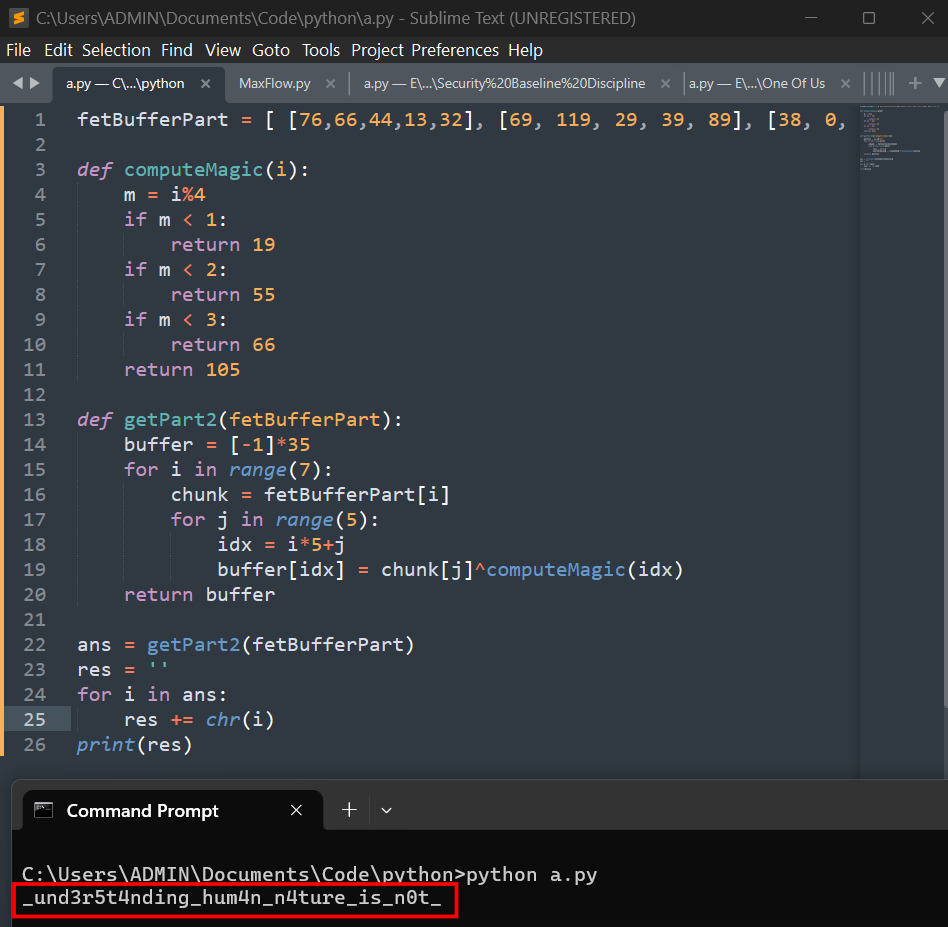

`Flag part 2: _und3r5t4nding_hum4n_n4ture_is_n0t_`

## Flag part 3

From `calendar.db`, I found Mail of ThuMinh, which is the HR. And it is also Tiktok, Instagram, X, and Pinterest user's IDs. 

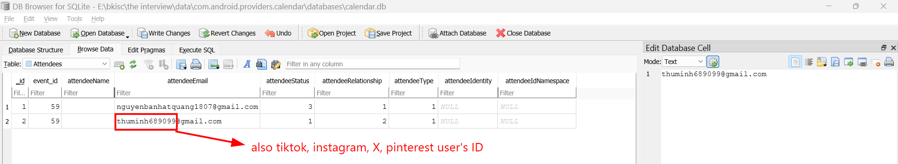

Staking ThuMinh's X revealed a pastebin `URl`.

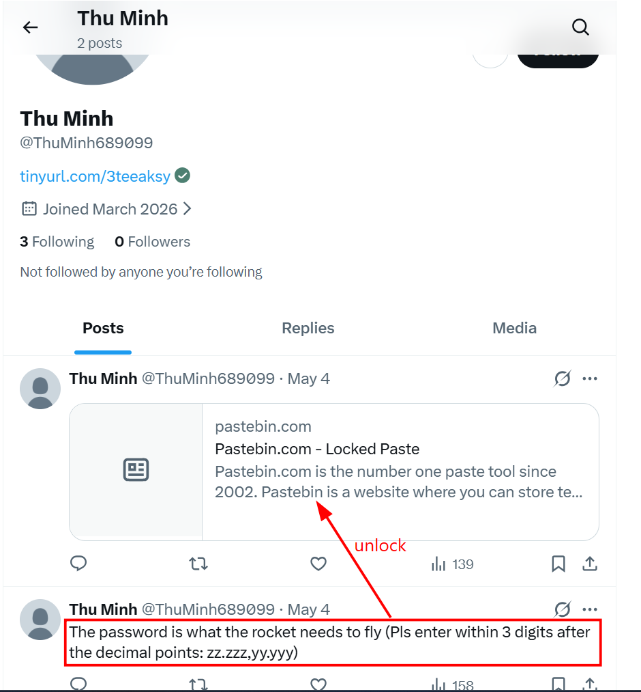

But what's the password, I looked for this user on Tiktok, and it requires me to find her office, given this picture.

`I can't upload the picture since its size, so here is GoogleDrive link`

[location image link](https://drive.google.com/file/d/1oeG9GsLLj7SlSVMw-_DSoN-JSTWmMbpS/view?usp=sharing)

For the first building on the left of the picture, I used Google Lens to inspect, and it is HUI Building (Hong Bang International University )

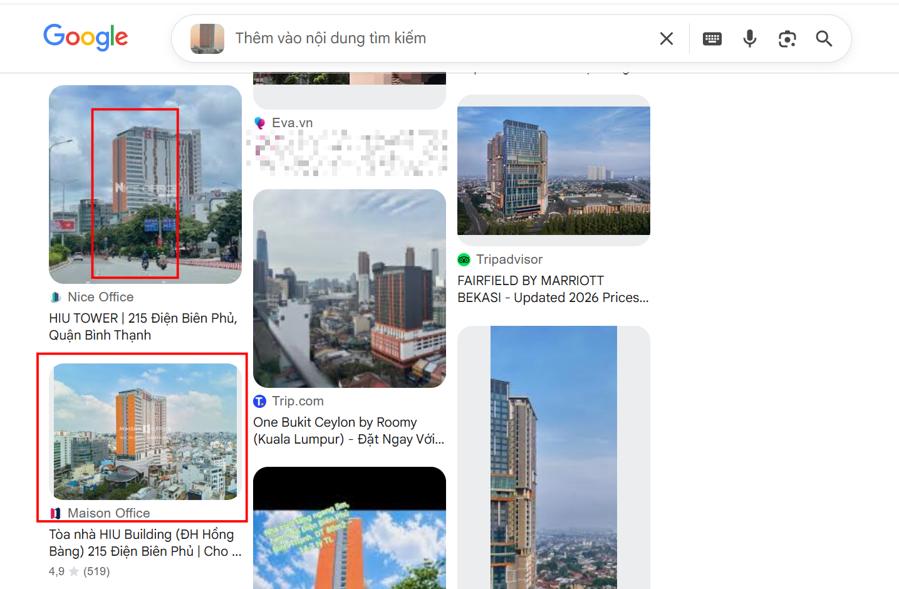

Doing the same for the pink building on the right of the picture, but Google failed this time. So I used [this](https://earth.google.com/web/search/%c4%91%e1%ba%a1i+h%e1%bb%8dc+h%e1%bb%93ng+b%c3%a0ng/@10.8003567,106.7062972,4.39018977a,828.50755041d,35y,0h,0t,0r/data=CiwiJgokCQdrRSI_qCVAEZ3yVdzbZSVAGSu-ge-Ks1pAIanl7k1_o1pAQgIIAToDCgEwQgIIAEoNCP___________wEQAA?authuser=0) map, and searched for any pink building around `HUI building` and found that it is UEF (University of Economics and Finance) (Campus 2).

The image can be found [here](https://drive.google.com/file/d/14mEQk9EzK2Z_VCUB3K1gbqDfVx5lhEms/view?usp=sharing) (due to size iamge lol)

Now I should pay attention to details, such as adjacent green rooftops, water tanks... around that suspicious location. 

From those details, I have found author's office [here](https://drive.google.com/file/d/1qePbqD4-gsQW46R_v2wnFdJcALJV1tt_/view?usp=sharing)

From Google Earth, I found its coordinate, and used Gemini to get the exact format of the password as described in X account.

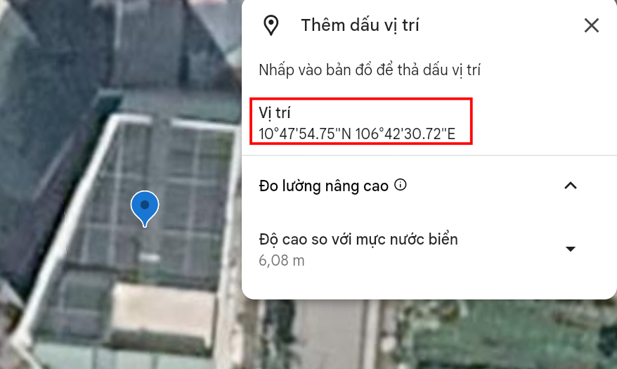

The exact location was `10.798,106.708` which is also the pastebin password. And the third part of the flag was found here.

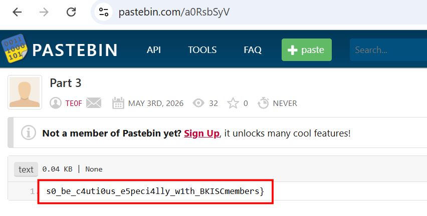

**FLAG: BKISC{f0renshit_mobile3s_is_v3ryy_345y_bu7_und3r5t4nding_hum4n_n4ture_is_n0t_s0_be_c4uti0us_e5peci4lly_w1th_BKISCmembers}**

---

