---
title: VIRTUAL MACHINE ANALYSIS

---

# VIRTUAL MACHINE ANALYSIS

## Setting up
Receiving a Virtual Machine with extension .vdi, a default virtual disk of Virtual Box. So I can attach this file to a VM VirtualBox machine, but I would rather convert it to a virtual disk of VMWare (with extension .vmdk) using qemu-img.

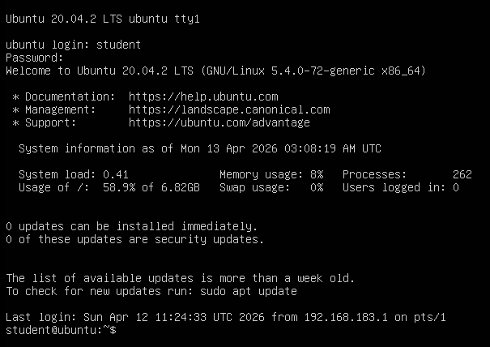

This is the GUI when powering on the virtual machinel, a Linux bash command only.
While executing commands on this GUI, it is dificult to read all contents, for example using cat only reveals some last line of a file. So I thought of an idea is to handle this virtual machine on my real host by using SSH connection.

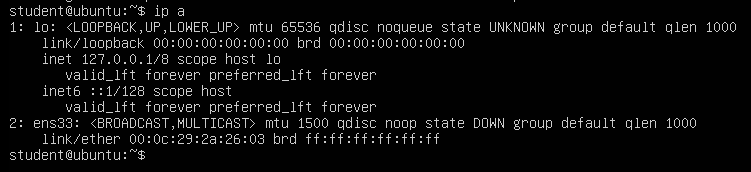

But the network interface is down, no SSH possible. Asking LLM for a little help and it works, I have the IP address used for SSH connection.

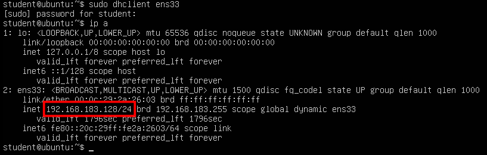

Now I can do it on my real machine.

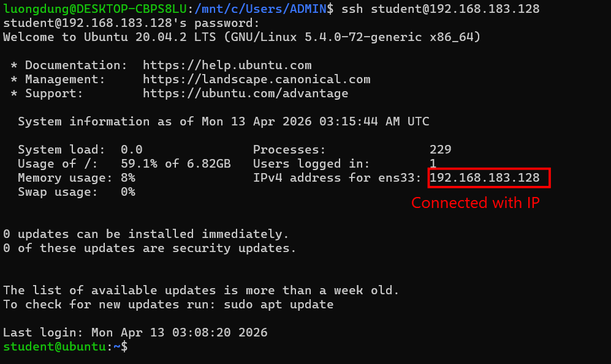

## Persistence suspicion
I first take a look for bash history, some strange command lines appears, but perhaps the attacker has successfully deleted all bash commands.

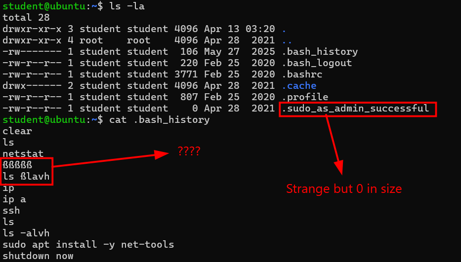

There is a strange file named .sudo_as_admin_successful which raised suspicion, but zero in size.
Since there is only the Linux bash GUI, my first thought of this case is that this VM can have some backdoor in it. So first I scan for users to see if any malicious user is logging in as root.

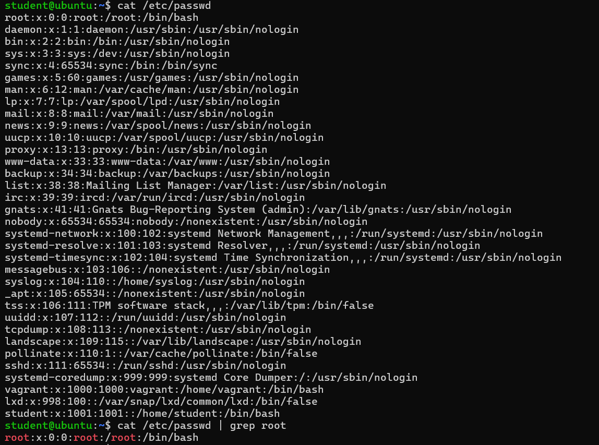

But nothing seems unusual. Continue to check for any unexpected users with sudo.!

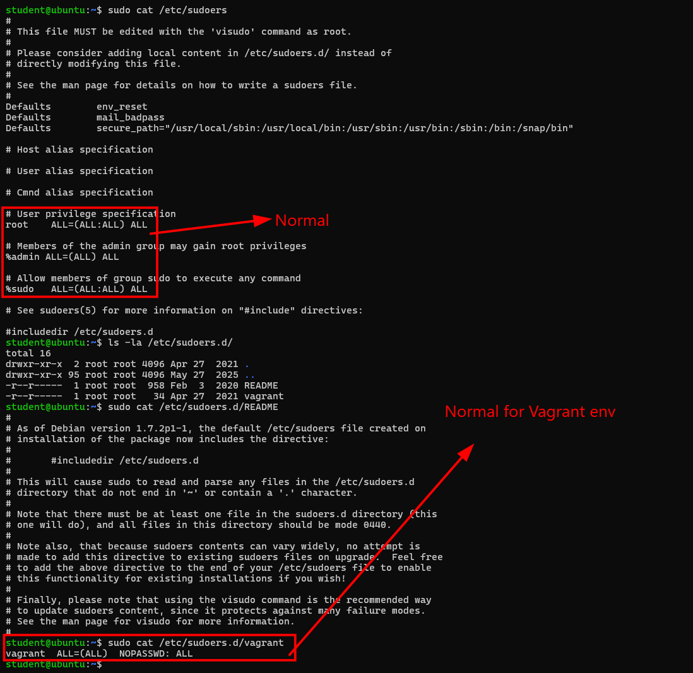

For Vagrant enviroment, this is totally standard.
But I suspect that if there are any SSH connection allowing attackers to connect to this Vagrant user. So I check for /.ssh/authorized_keys.

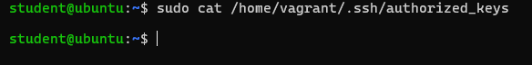

Nothing yet, or the attacker has deleted it ?

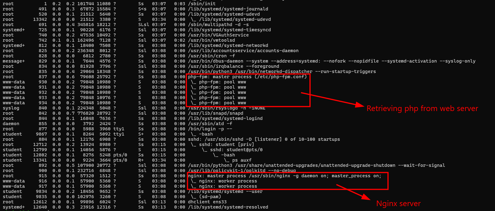

Checking for any malicious process using ps auxf, turns out this is Nginx Web Server.
Until now I can remove the idea of Persistence existence.

## RCE and Post Exploitation

### CVE-2019-11043
So the idea of Persistence and Backdoor failed.
I switch my attention to root directory, listing all files in /root I find a .viminfo.

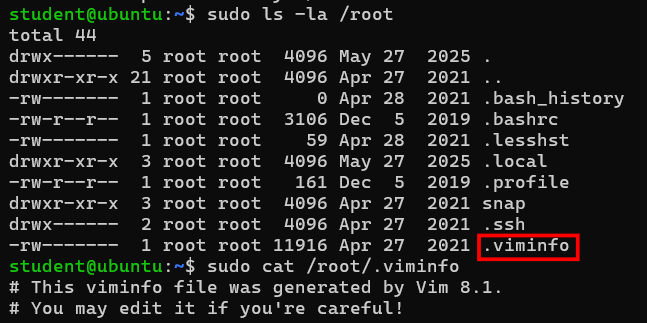

Doing some googling, Vim 8.1 is a 2018 update to the classic text editor that introduced a built-in terminal, allowing users to run shell commands and scripts directly within a window split. It also refined asynchronous processing, enabling plugins to perform background tasks like syntax checking without freezing the editor's interface.

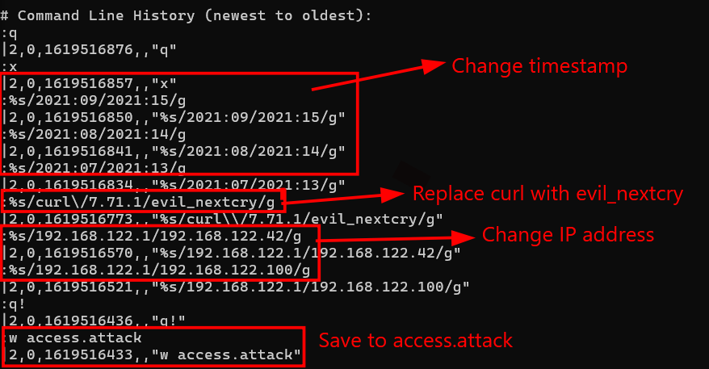

Finally something smells off. Inside .viminfo, I have found some malicious command history, including modify timestamps, replace curl with a tool named evil_nextcry, change the IP address and save to access.attack.
I also found the file marks which leads to two files, access.log and error.log. In Nginx web server, these are two most important files to monitor the system and diagnose malware existence.

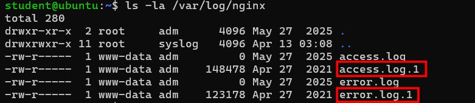

Notably access.log and error.log in size of 0, but access.log.1 and error.log.1 has content in it.
Checking error.log.1 reveals everything.

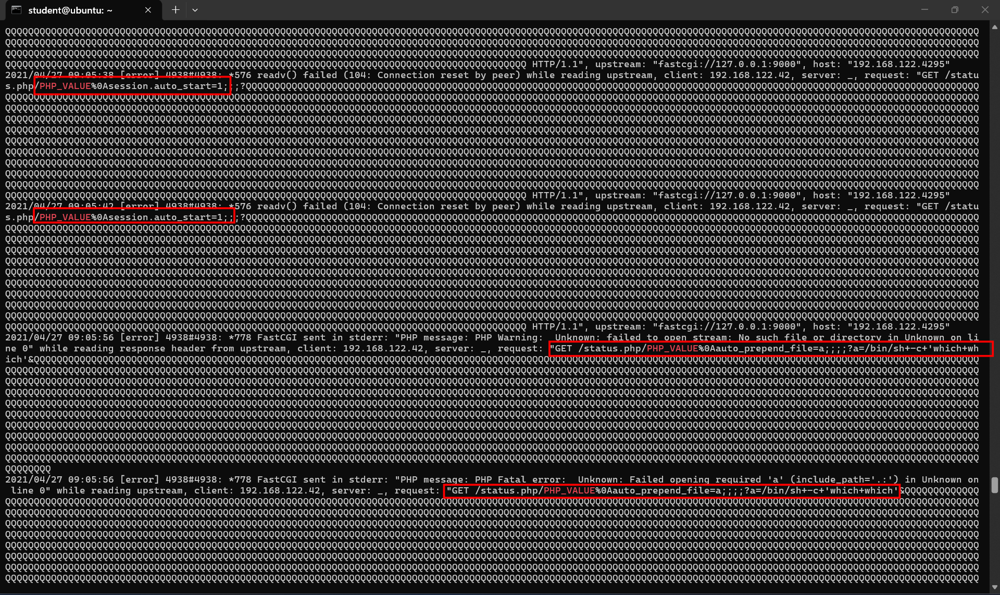

These are not normal requests anymore, the attacker is trying to inject PHP configuration directives through URL path, then force PHP to execute shell command. Furthurmore, some of those has been URL encoded.
For example:
\- GET /status.php/PHP_VALUE%0Asession.auto_start=1
\- GET /status.php/PHP_VALUE%0Aauto_prepend_file=a
\- GET /status.php/PHP_VALUE%0Aextension=%22$_GET%5Ba%5D%60%3F%3E%22?a=/bin/sh+-c+'which+which'
\- GET /status.php/PHP_VALUE%0Alog_errors=1
Searching for this requests on Google, turns out the attacker is using the gap of **CVE-2019-11043**.

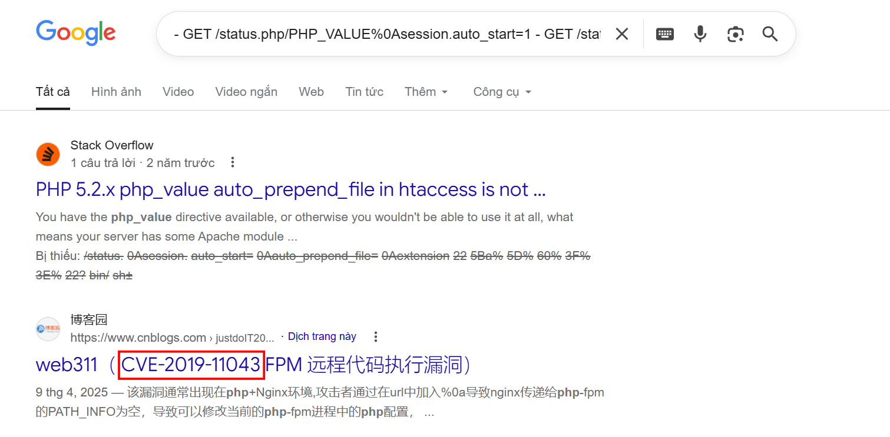

**CVE-2019-11043** is a critical vulnerability in PHP-FPM (FastCGI Process Manager) that, when combined with certain Nginx configurations, allows for **Remote Code Execution** (RCE). This flaw was famously used to spread the NextCry ransomware, targeting Nextcloud instances.
The whole attack chain is exactly previous requests:
\- The attacker uses the buffer underflow to set a PHP configuration like auto_prepend_file
\- They point auto_prepend_file to a location containing their malicious code
\- The PHP engine automatically executes the malicious script before any other code on the page, giving the attacker a shell or the ability to encrypt files
Thost long Qqqqqqqq... part I saw earlier in the picture are part of the exploit mechanics and fuzzing.

Diving a bit more in /var/log/php/access.log, I also saw signs of a brute force attack and fuzzing technique.

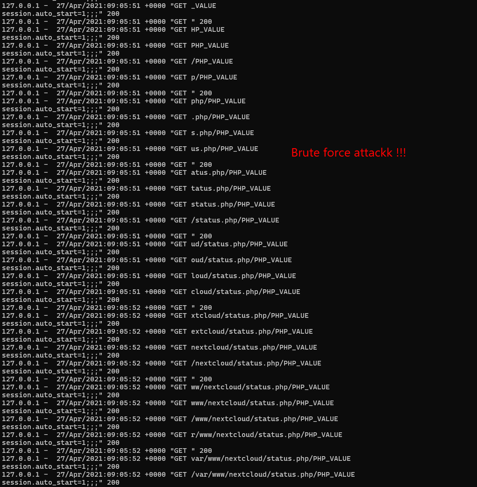

The attacker is trying different paths to find the real path of status.php

The sign of successful encryption can also be found in /var/log/php/error.log.

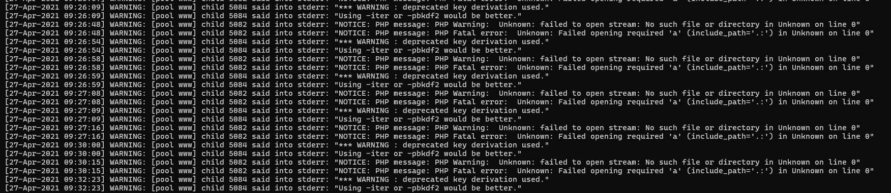

So I guess this is the Nginx Web Server of a company. And some process we saw earlier in the result of command **ps auxf** is actually when attacker execute malicious script.

### Post exploitation
In some last logs of error.log.1, there are signs of data exfiltration and data encryption.

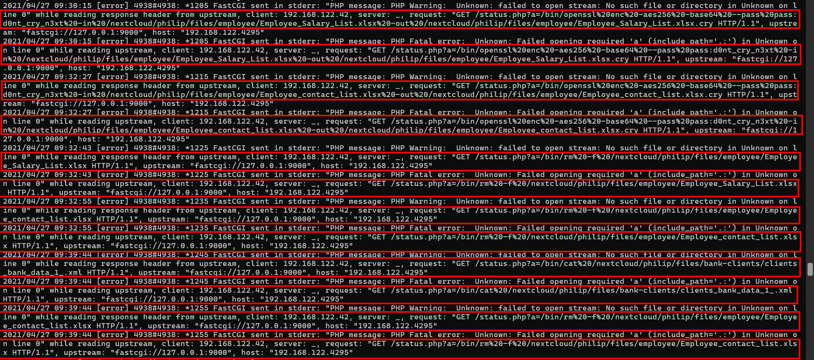

In directory /nextcloud/philip/files/employee, the attack has encrypted Employee_Salary_List.xlsx.cry and Employee_contact_list.xlsx using openssl and AES-256 encryption, and deleted original files. 

The attacker also read content in clients_bank_data_1_.xml. By having encrypted files with extention .cry, we can decrypt it to have the original files, since the AES-256 password is visible, which is d0nt_cry_n3xt.

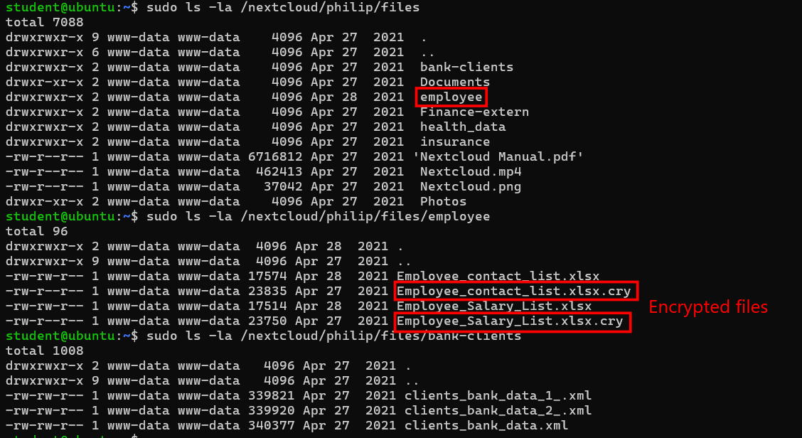

I have no idea why original files is still there, but from two .cry files, I can decrypt it and get the original content.
Extract those two files to my real machine and start decrypting.

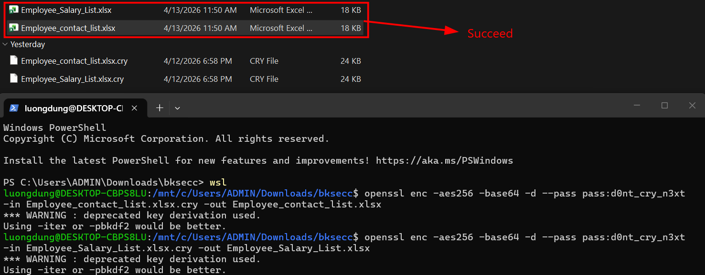

Restored the original data.

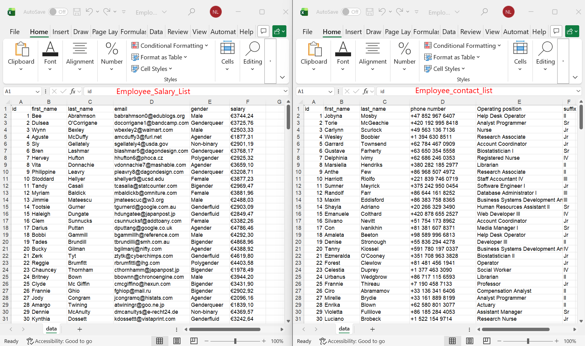

## Conclusion

In this virtual machine, the attacker was exploiting a Nginx Web Server of a company through CVE-2019-11043.
The attack started from 09:05 on 27/04/2021, performing fuzzing and brute-force discovery, exploiting PHP configuration via HTTP requests, obtained RCE. And in post exploitation (data exfiltration and data encryption) the attacker has encrypted two files using openssl and aes256, on the same day at 09:26.

Indicator of Compromise (I0Cs)
\- HTTP requests
GET /status.php/PHP_VALUE%0Asession.auto_start=1
GET /status.php/PHP_VALUE%0Aauto_prepend_file=a
...
meaning PHP configuration injection, RCE through auto_prepend_file

\- access.log.1 and error.log.1 log files

\- Encrypted files: Employee_Salary_List.xlsx.cry and Employee_contact_list.xlsx.cry

\- Hardcoded encryption password: d0nt_cry_n3xt
