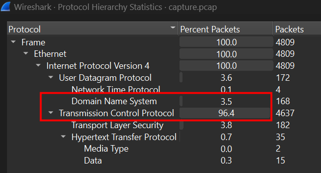
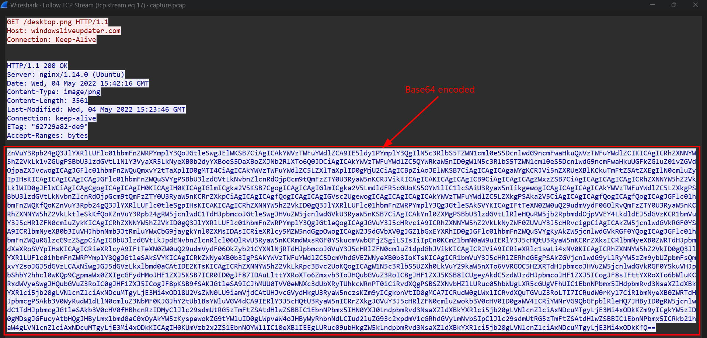
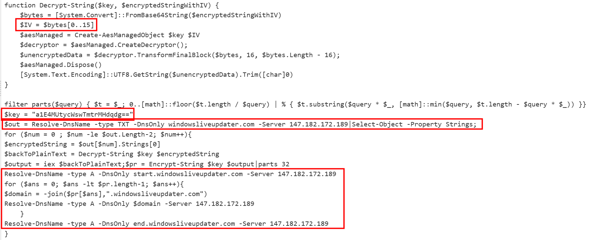
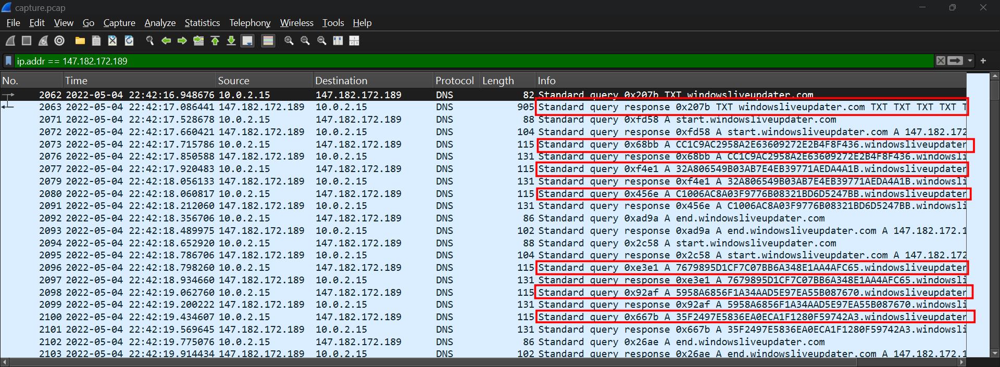
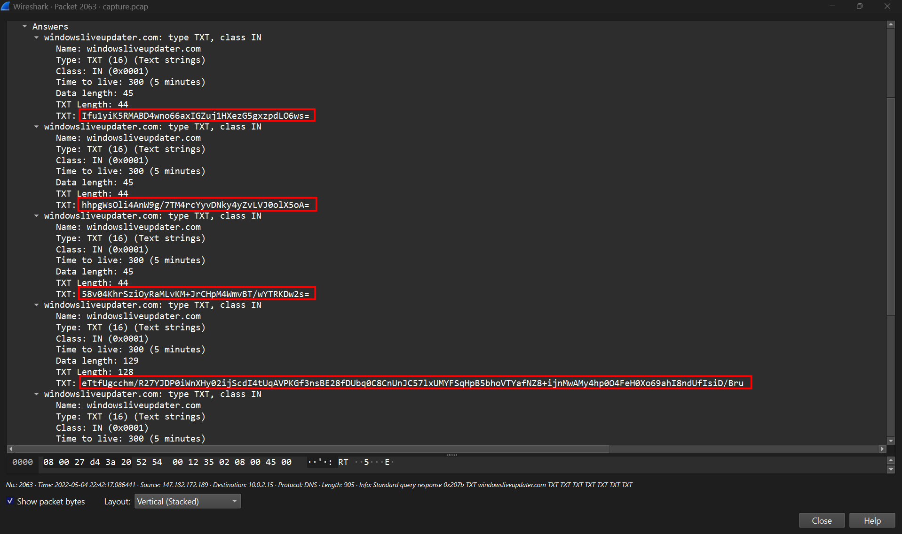
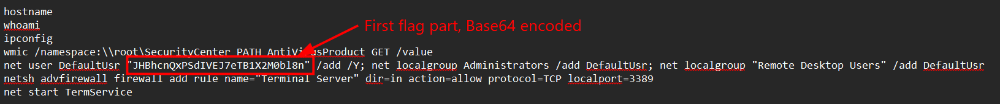
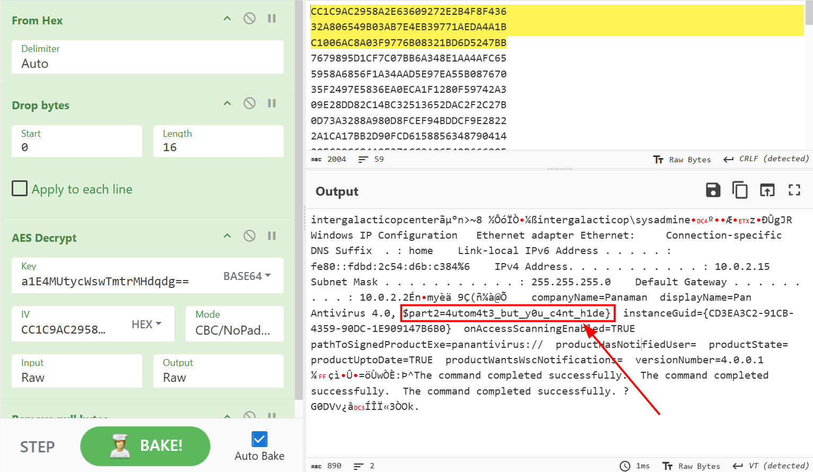

### Automation

#### Overview
The challenge gives solely a packet capture. Open the pcap and look for Hierarchy.

Over 96% of packets are transfer through TCP Protocol, which is engaging since the payload of this challenge is from DNS Protocol.
So I follow TCP Stream, at Stream 2 a .cab file, Microsoft Cabinet is downloaded, it is not the point but the first time I see this file extension. 
Comes to stream 17, instead of getting a PNG file, the server returns a Base64 encoded string.

#### Encrypt and decrypt mechanism
After decode I have a Powershell script. But I will just focus on this part.

The way to decrypt traffic is some how like Nimplant C2. The payload will leave first 16 bytes to become IV, the rest is ciphertext. It use AES-CBC to decrypt. 
Furthur more, the payload is AES encrypted and encode as hex before being sent as URL, for example ""hex...windowsliveupdater.com"". And sent to IP Server 147.182.172.189.
So I used ip.addr == 147.182.172.189 for better vision.

Each part of payload is encode and put between start.windowsliveupdater.com and end.windowsliveupdater.com

#### Decrypt traffic
So I start decrypting the traffic.
First is payload from Packet No 2063

Turns out it is powershell commands, and first part of the flag is found.

This set a new user DefaultUsr with password is "JHBh...l8n", add Administrators and "Remote Desktop User". A backdoor has been installed.
To find the second part of the flag, I extract all DNS query name with mentioned tail, joint them and decrypt.

This is totally the response of earlier commands execution.

**FLAG: HTB{y0u_c4n_4utom4t3_but_y0u_c4nt_h1de}**

---

