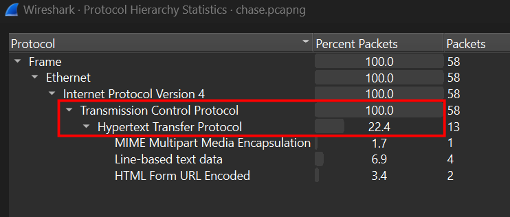
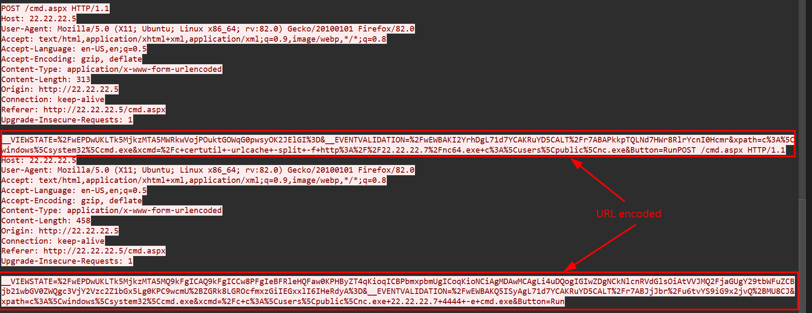
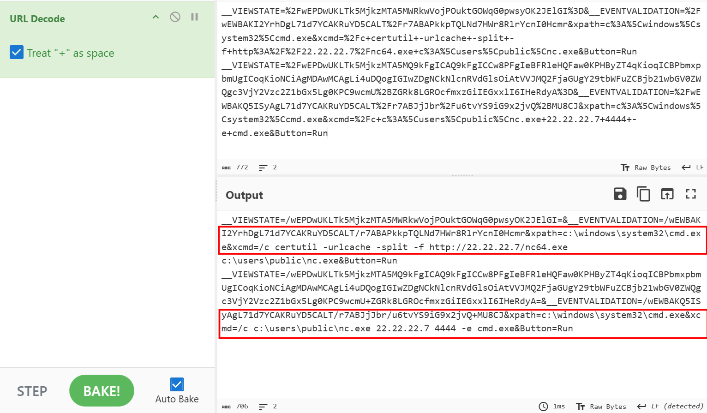
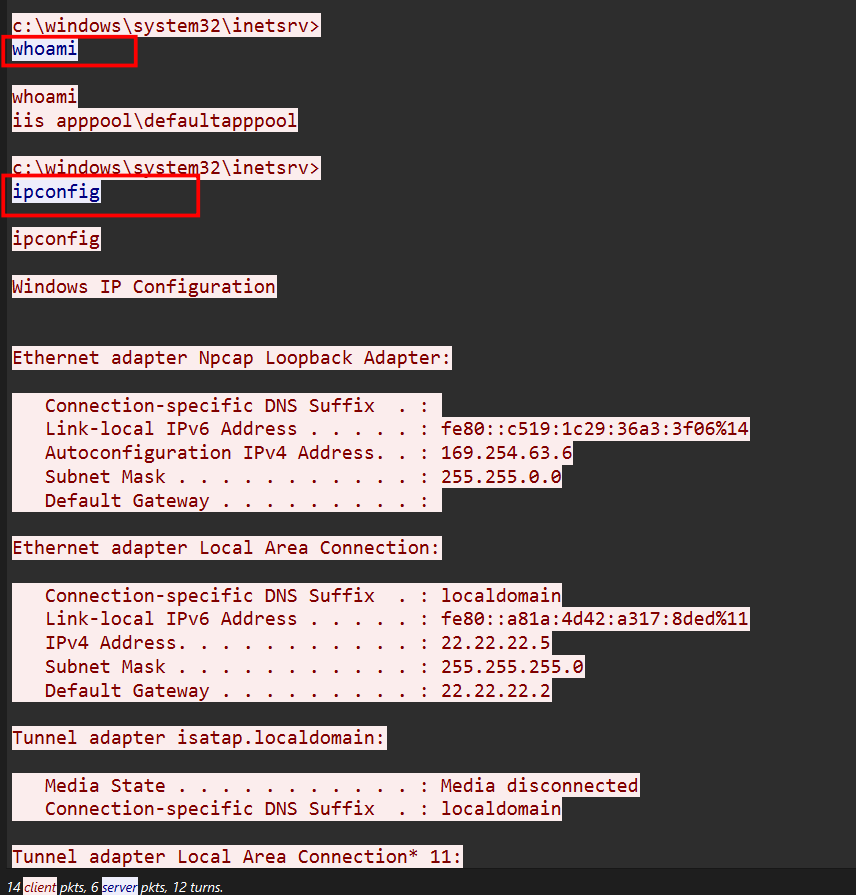
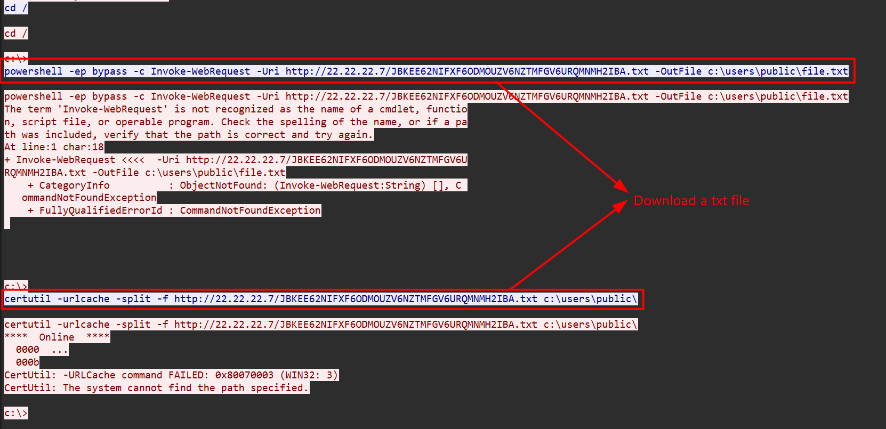
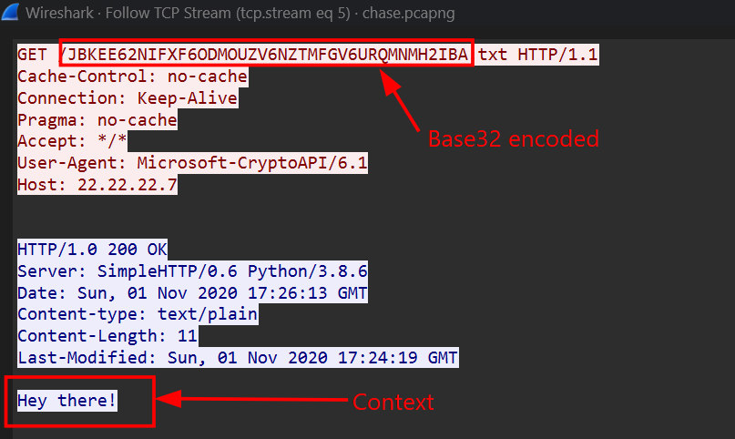
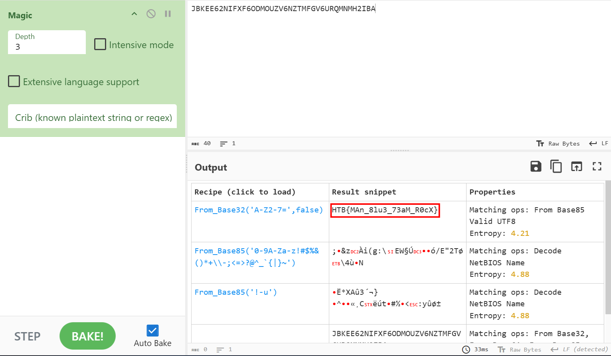

### Chase
**Challenge scenario**: One of our web servers triggered an AV alert, but none of the sysadmins say they were logged onto it. We've taken a network capture before shutting the server down to take a clone of the disk. Can you take a look at the PCAP and see if anything is up?

#### Overview
The challenge gives solely a pcap file, and my target is to look for any sign of unusual login. The Hierarchy indicates that all packets are tranfered through TCP Protocol, whereas 22,4% through HTTP. 

So I decide to follow TCP Stream. Right at Stream 0, scrolling down and I found some suspicious **GET** and **POST** commands, which has partuatially being URL encoded.

After decode I have understood two executable file downloaded from TCP Stream 1 and 2.

The attacker opened cmd.exe and used certutil to download nc64.exe from http://22.22.22.7. After that attacker use nc.exe to connect to IP 22.22.22.7 at port 4444.

#### Follow up
Continue to Stream 1 and 2 where two executable files are downloads. I tried to export files and using IDA with these but turns out these are just ordinary files to connect **netcat**. 

After establish a reverse connection back from client to server, the attacker starting to run commands and be seen in TCP Stream 3.

Scrolling down, the attacker used Powershell to download a txt file using Invoke_WebRequest and saved to *c:\users\public\file.txt*. Then attacker used certutil to download this file again and stores to *c:\users\public\*.

#### Decode flag

At stream 5 and 6, I can see the context of that txt file, but it just "Hey there!". Actually, the attacker can write a malware into that txt file to continue executing on client's machine. 

Finally, after using **Magic** recipe from cyberchef I recognize that txt's file name has been Base32 encoded and it is basically the flag of this challenge.

**FLAG: HTB{MAn_8lu3_73aM_R0cX}**

---

