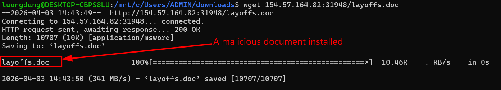
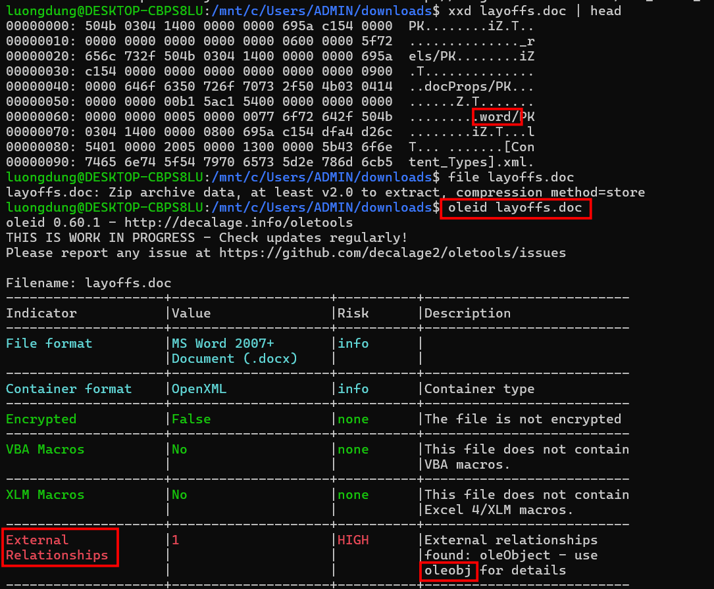
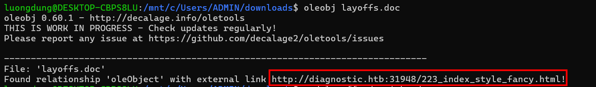
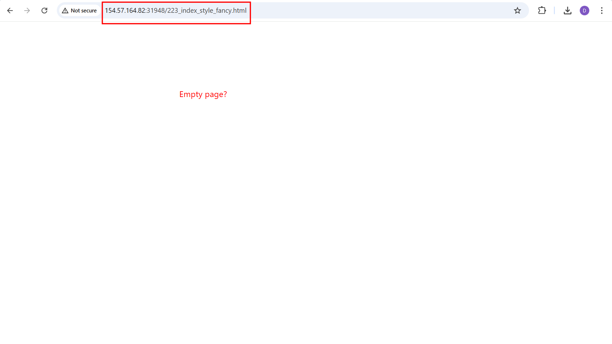
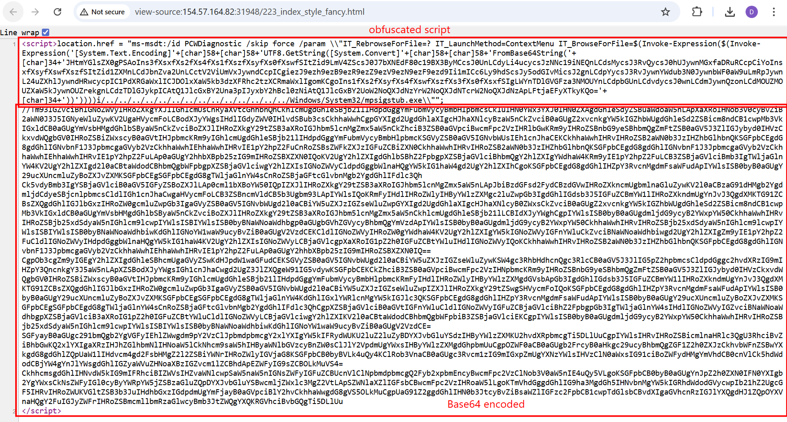
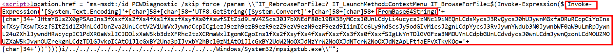
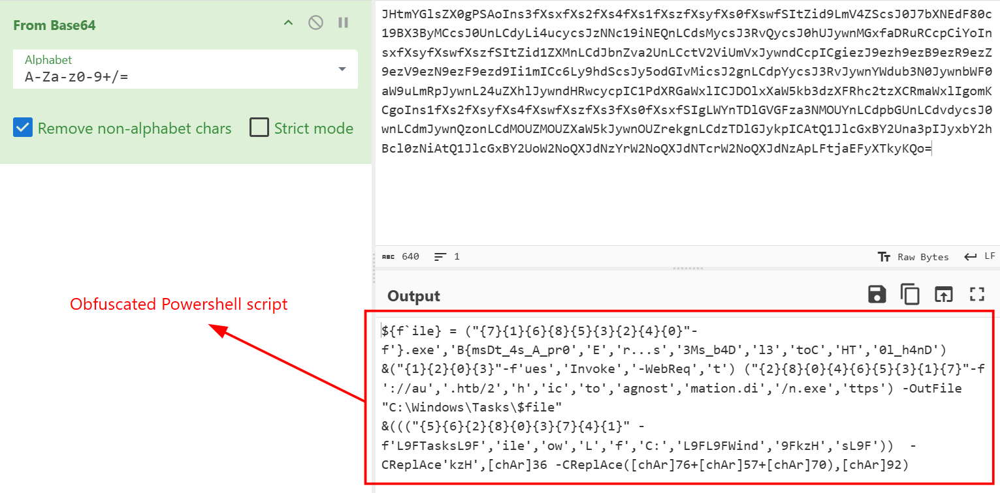
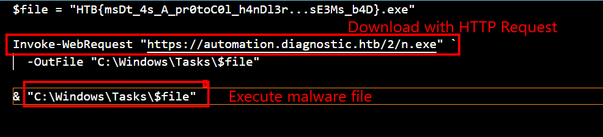

### Diagnostic
**Challenge scenario**: Our SOC has identified numerous phishing emails coming in claiming to have a document about an upcoming round of layoffs in the company. The emails all contain a link to diagnostic.htb/layoffs.doc. The DNS for that domain has since stopped resolving, but the server is still hosting the malicious document (your docker). Take a look and figure out what's going on.

#### Overview
The challenge provide a HTTP connection.

Connect and a document file is installed. Since this is a Microsoft file, I use ole tools for furthur investigation. And an external relationships appears.

Using oleobj for details.

An external link, but openning the link it just empty.

So I try to view its page source to see if anything is interesting.

#### Obfuscated script
An obfuscated script and base64 encoded strings.

That Base64 blog after decode it is perhaps just some song lyric?

Now for a cheer they are here,
triumphant!
Here they come with banners flying,
In stalwart step they're nighing,
With shouts of vict'ry crying,
We hurrah, hurrah, we greet you now,
Hail!

Far we their praises sing
For the glory and fame they've bro't us
Loud let the bells them ring
For here they come with banners flying
Far we their praises tell
For the glory and fame they've bro't us
Loud let the bells them ring
For here they come with banners flying
Here they come, Hurrah!

Hail! to the victors valiant
Hail! to the conqu'ring heroes
Hail! Hail! to Michigan
the leaders and best
Hail! to the victors valiant
Hail! to the conqu'ring heroes
Hail! Hail! to Michigan,
the champions of the West!

We cheer them again
We cheer and cheer again
For Michigan, we cheer for Michigan
We cheer with might and main
We cheer, cheer, cheer
With might and main we cheer!

Hail! to the victors valiant
Hail! to the conqu'ring heroes
Hail! Hail! to Michigan,
the champions of the West!
Now for a cheer they are here,
triumphant!
Here they come with banners flying,
In stalwart step they're nighing,
With shouts of vict'ry crying,
We hurrah, hurrah, we greet you now,
Hail!

Far we their praises sing
For the glory and fame they've bro't us
Loud let the bells them ring
For here they come with banners flying
Far we their praises tell
For the glory and fame they've bro't us
Loud let the bells them ring
For here they come with banners flying
Here they come, Hurrah!

Hail! to the victors valiant
Hail! to the conqu'ring heroes
Hail! Hail! to Michigan
the leaders and best
Hail! to the victors valiant
Hail! to the conqu'ring heroes
Hail! Hail! to Michigan,
the champions of the West!

We cheer them again
We cheer and cheer again
For Michigan, we cheer for Michigan
We cheer with might and main
We cheer, cheer, cheer
With might and main we cheer!

Hail! to the victors valiant
Hail! to the conqu'ring heroes
Hail! Hail! to Michigan,
the champions of the West!

Now for a cheer they are here,
triumphant!
Here they come with banners flying,
In stalwart step they're nighing,
With shouts of vict'ry crying,
We hurrah, hurrah, we greet you now,
Hail!

Far we their praises sing
For the glory and fame they've bro't us
Loud let the bells them ring
For here they come with banners flying
Far we their praises tell
For the glory and fame they've bro't us
Loud let the bells them ring
For here they come with banners flying
Here they come, Hurrah!

Hail! to the victors valiant
Hail! to the conqu'ring heroes
Hail! Hail! to Michigan
the leaders and best
Hail! to the victors valiant
Hail! to the conqu'ring heroes
Hail! Hail! to Michigan,
the champions of the West!

We cheer them again
We cheer and cheer again
For Michigan, we cheer for Michigan
We cheer with might and main
We cheer, cheer, cheer
With might and main we cheer!

Hail! to the victors valiant
Hail! to the conqu'ring heroes
Hail! Hail! to Michigan,
the champions of the West!Hark the sound of Tar Heel voices
Ringing clear and True
Singing Carolina's praises
Shouting N.C.U.

Hail to the brightest Star of all
Clear its radiance shine
Carolina priceless gem,
Receive all praises thine.

Neath the oaks thy sons and daughters
Homage pay to thee
Time worn walls give back their echo
Hail to U.N.C.

Though the storms of life assail us
Still our hearts beat true
Naught can break the friendships formed at
Dear old N.C.U.
Hark the sound of Tar Heel voices
Ringing clear and True
Singing Carolina's praises
Shouting N.C.U.

Hail to the brightest Star of all
Clear its radiance shine
Carolina priceless gem,
Receive all praises thine.

Neath the oaks thy sons and daughters
Homage pay to thee
Time worn walls give back their echo
Hail to U.N.C.

Though the storms of life assail us
Still our hearts beat true
Naught can break the friendships formed at
Dear old N.C.U.
    

And that's not what I am looking on. I shift my attention to the obfuscated script at the beginning and from **ms-msdt** phrase, do some google and turns out the attacker is applying CVE-2022-30190 which is Microsoft Support Diagnostic Tool (MSDT) RCE Vulnerability “Follina”.

It decodes another encoded Base64 string and run with Invoke-Expression.

And I found an obfuscated Powershell script.
Deobfuscate it and I found the flag of this challenge.

It download a malicious file name n.exe using a HTTP Request and execute it in "C:\Windows\Tasks\$file" directory.
**FLAG: HTB{msDt_4s_A_pr0toC0l_h4nDl3r...sE3Ms_b4D}**

---

