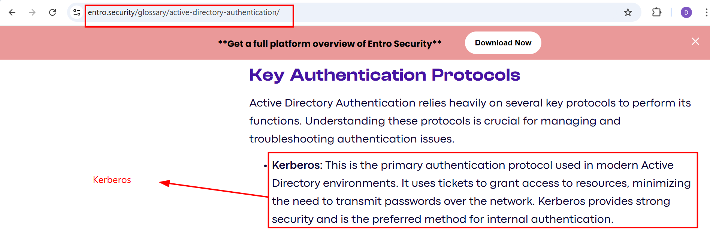
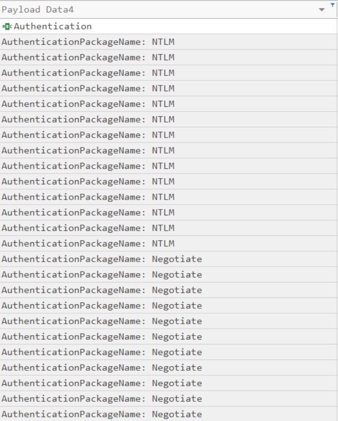
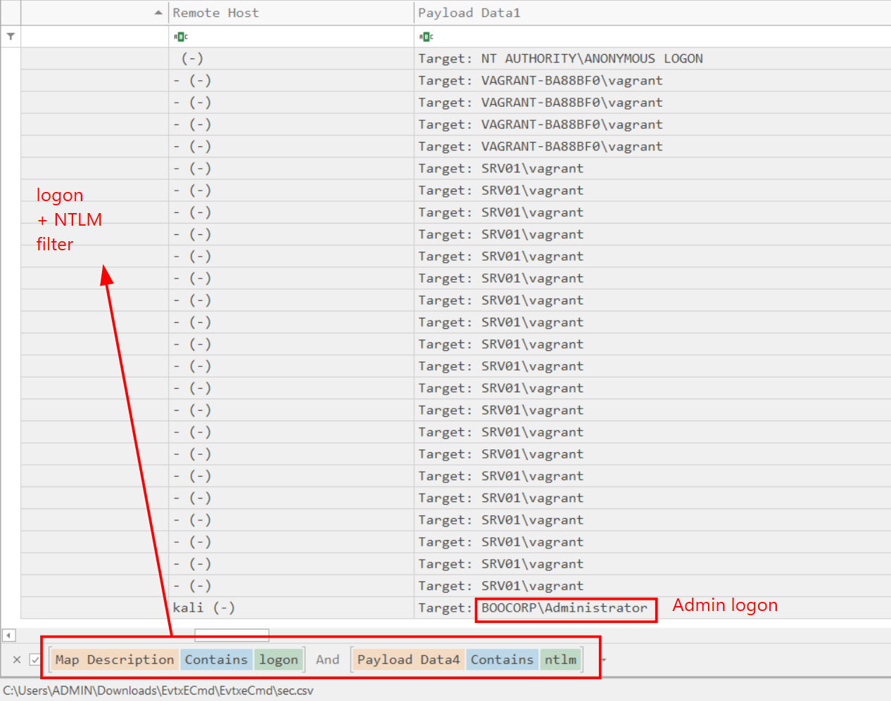
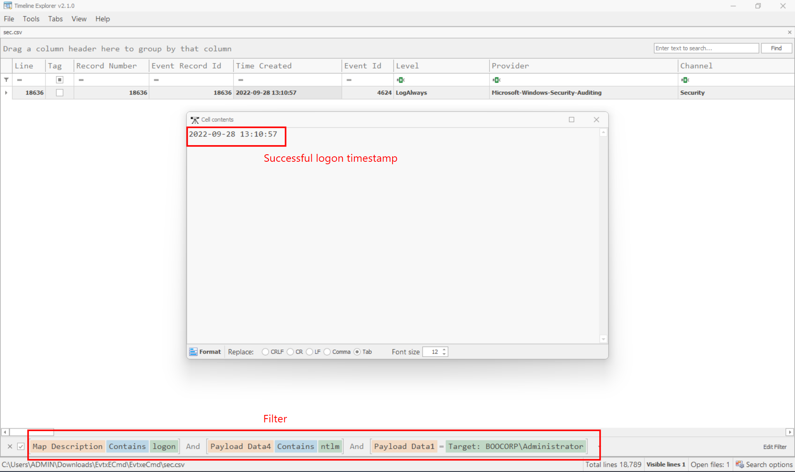

### Downgrade
**Challenge scenario**: During recent auditing, we noticed that network authentication is not forced upon remote connections to our Windows 2012 server. That led us to investigate our system for suspicious logins further. Provided the server&#039;s event logs, can you find any suspicious successful login? To get the flag, connect to the docker service and answer the questions.

#### First question: Which event log contains information about logon and logoff events?
The challenge provides a Log folders containing server's event logs. I need to find sign of any suspicious login, so Security.evtx will help.
**Answer: security**

#### Second question: What is the event id for logs for a successful logon to a local computer?
Still a question about theories that I does not have to examine any evtx files yet.
**Answer: 4624**

#### Third question: What is the default Active Directory authentication protocol?
Some googling reveals the answer

**Answer: Kerberos**

#### Fourth question: Looking at all the logon events, what is the AuthPackage that stands out as different from all the rest?
To look for all the logon events, I parse the Security.evtx file using EvtxECmd and open it with Time line Explorer.
Filter for AuthenticationPackageName and there are four AuthPackages, including NTLM, Negotiate, Kerberos and (-) means default.

Since Negotiate appears many times in this filtering, and Kerberos is the default protocol in Active Directory (as the answer of question 3) so the answer is NTLM.
**Answer: NTLM**

#### Fifth question: What is the timestamp of the suspicious login ?
Using the answer from question 4, I filter for NTLM AuthPackage and also events having logon in description.

Only one event having Administrator logon, so its timestamp is the answer of this challenge.

**Answer: 2022-09-28T13:10:57**

**FLAG: HTB{34sy_t0_d0_4nd_34asy_t0_d3t3ct}**

---

