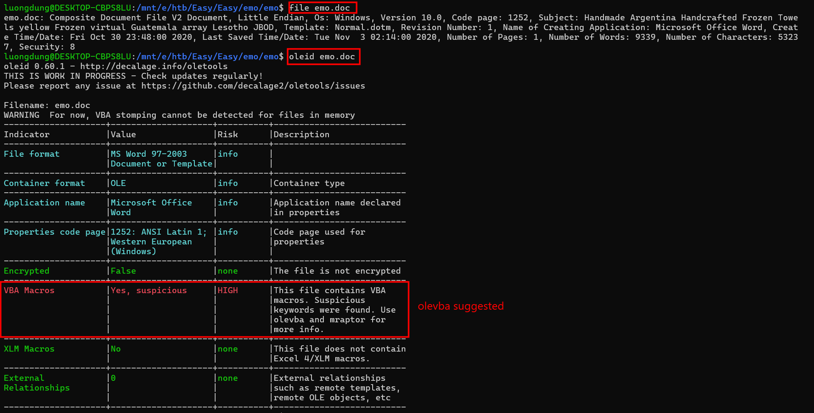
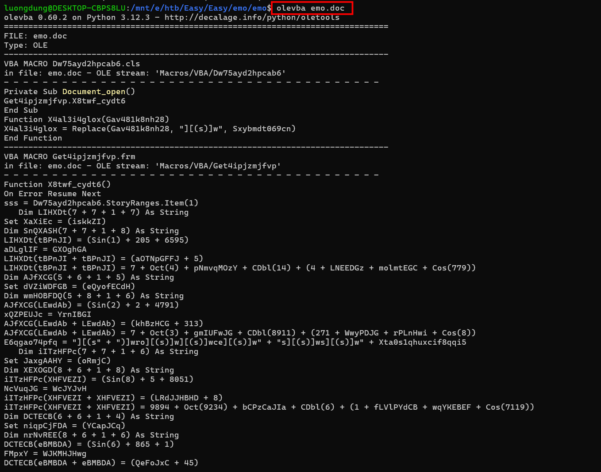
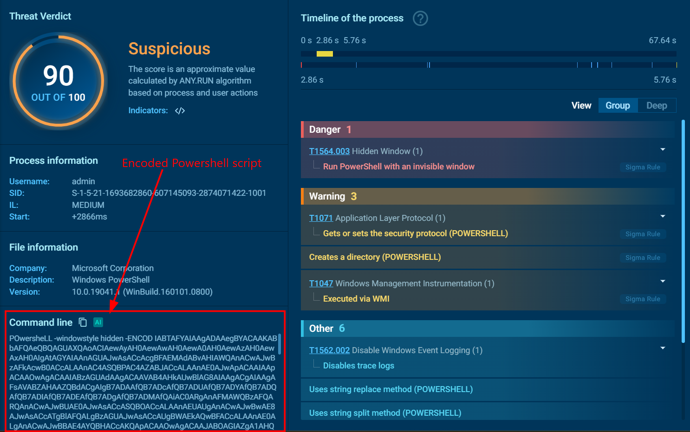
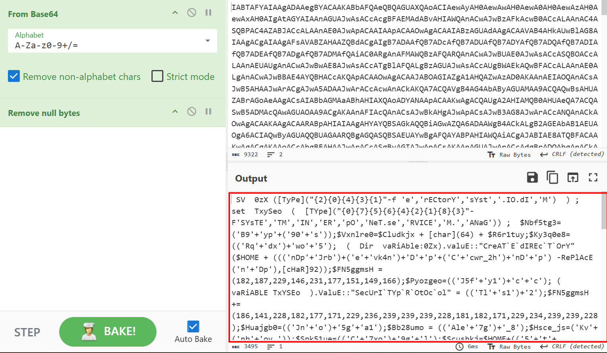
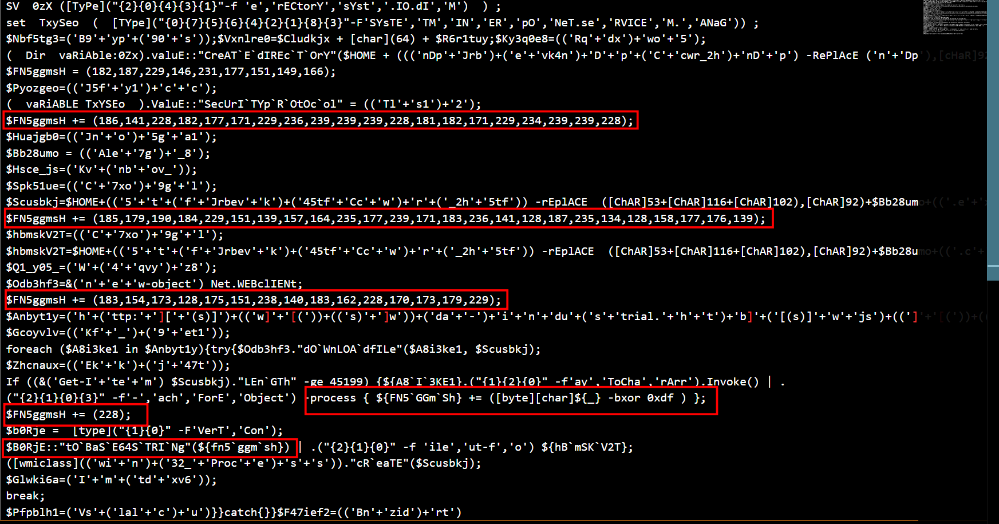
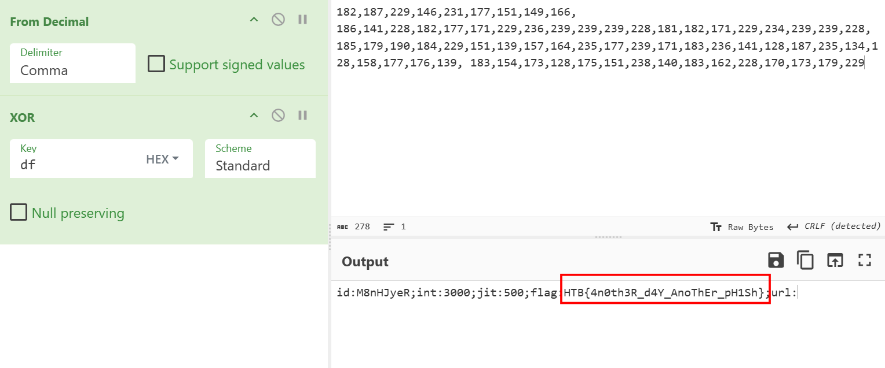

### Emo
**Challenge scenario**: WearRansom ransomware just got loose in our company. The SOC has traced the initial access to a phishing attack, a Word document with macros. Take a look at the document and see if you can find anything else about the malware and perhaps a flag.

#### Overview
So the challenge gives a .doc file.
Analyzing a bit, this files has been infected by VBA macros.

Using olevba returns a long obfuscated Powershell script.

Hmm... stuck for a while here.

#### Dynamic Analysis
I switch to dynamic analysis, which is running the malicious file to identify its behavior. But ofcourse not on my real machine, I used **any.run**.

Turns out if users open this document, it will somehow open powershell.exe and run that malicious script, using -windowstyle hidden to avoid being seen by users.
After decode Base64, I have a obfuscated Powershell script.

After some line break, I spotted an array doing some conversion.

The array is splited into pieces. The script execute XOR on every element in the array with key 0xdf, then encode Base64 for furthur actions.

#### Decode the flag
So I join parts of the array and XOR with 0xdf, I thought I also need to encode Base64, but the flag appears after XOR action.

**FLAG: HTB{4n0th3R_d4Y_AnoThEr_pH1Sh}**

---

