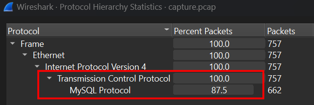
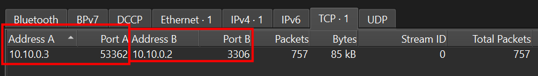
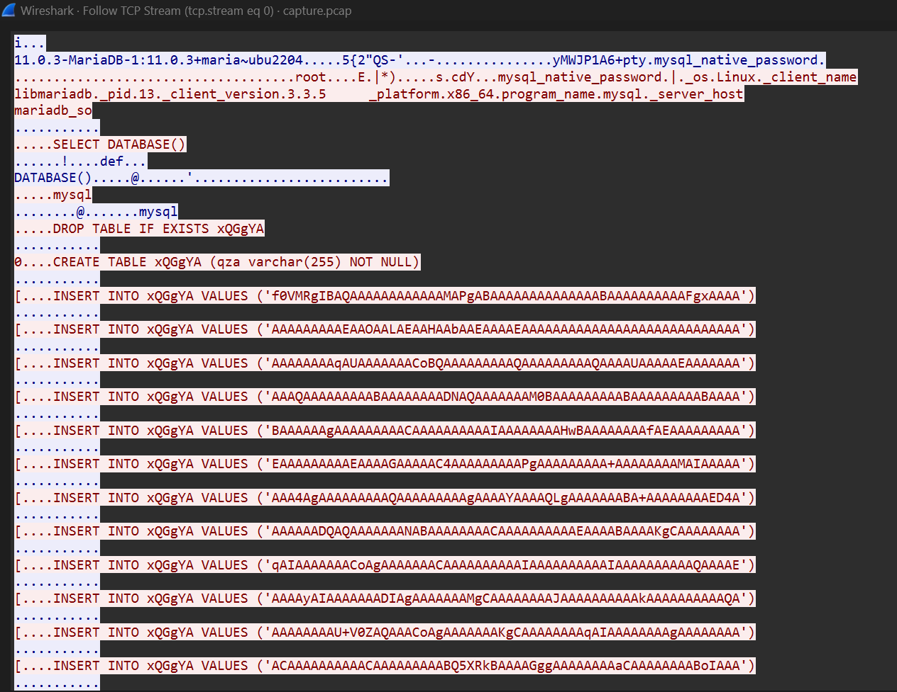
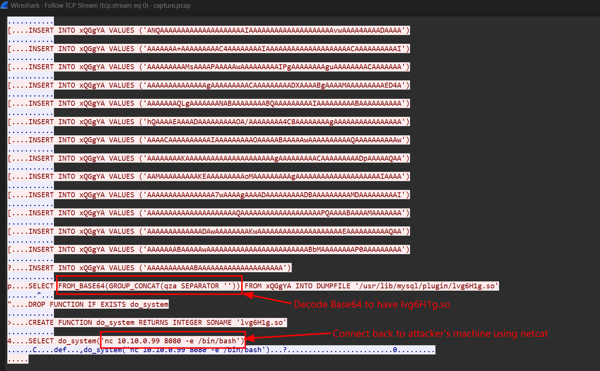
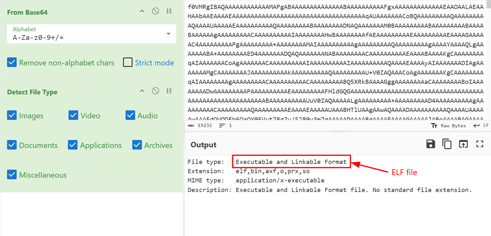
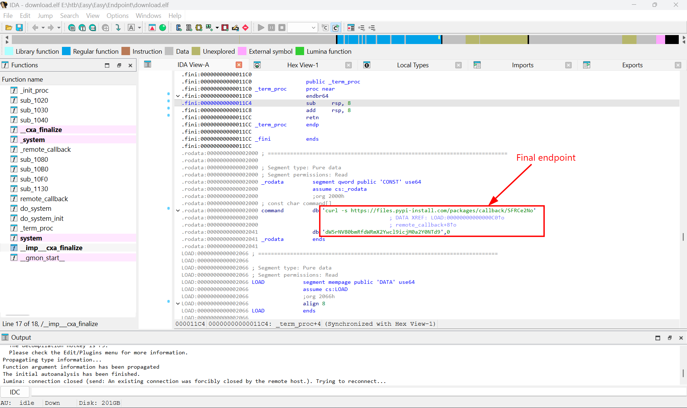
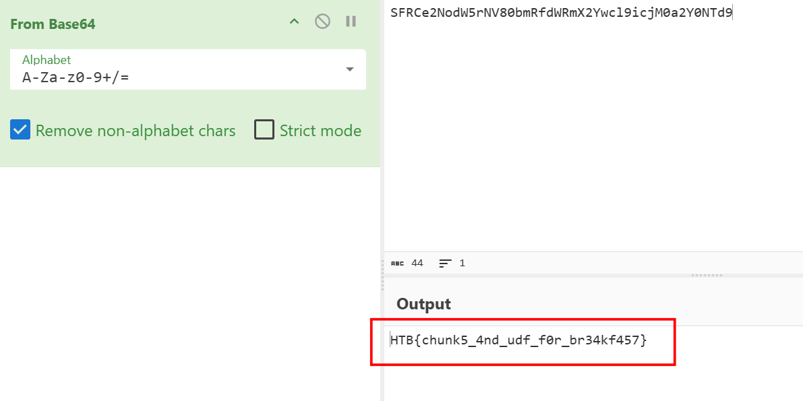
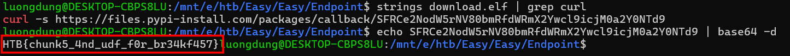
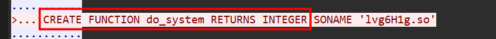

### Endpoint
**Challenge scenario**: E Corp's sinister control over society through the chemical compound "EverLast" must be stopped. Analyze the provided network traffic capture file to uncover critical information hidden within the malicious payload. Your task is to extract the key details, including a callback endpoint used in various missions to disseminate EverLast, to help the resistance dismantle the corporation's grip on the world.

A packet capture file is given, and my target is to look for the callback endpoint as mentioned in the scenario. 
#### Overview
Just like usual, I go for Protocol Heirarchy, and 100% packets go through TCP Protocol, whereas 87.5% through MySQL Protocol.

Furthurmore, I look for Conversations and there are only one conversation between these two IP.

So I follow TCP Stream.

This is patently a sign of SQL Injection
A table named xQGgYA is created, then attacker add each piece of a malicious file (after encode Base64) using **INSERT INTO xQGgYA VALUES**. Scrolling down, I saw that if I join all the pieces and decode Base64 it, I will have a .so file.

After that, the attacker open a reverse shell using **netcat** and open /bin/bash. The final intention is to RCE is computer.

#### Assemble pieces of that shared binary (.so) ####
So I used **tshark** to extract all piece of that malicious file and decode Base64. Turns out it is a ELF file. 

Using IDA for furthur investigation, I have found a curl command, which means this executable tried to download from pypi.

Decode that endpoint gives me the flag of this challenge.

A faster way to retrieve the flag without using any decompiler tool is to use **string** command.

Digging a bit more to know what the flag means, turns out udf stands for **User Define Function**, which has been mentioned previously inside the packet capture. 

This creates a UDF in MySQL, and CREATE FUNCTION calls to run code inside lvg6H1g.so.
**FLAG: HTB{chunk5_4nd_udf_f0r_br34kf457}**

---

