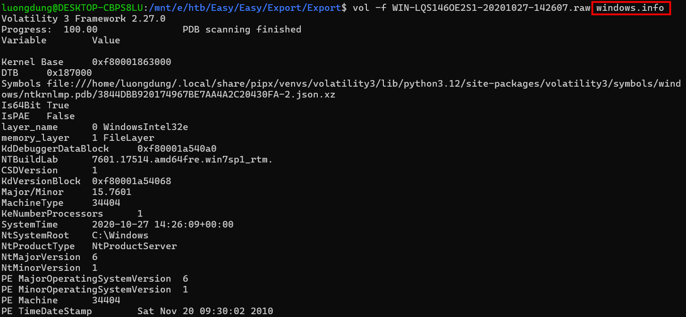
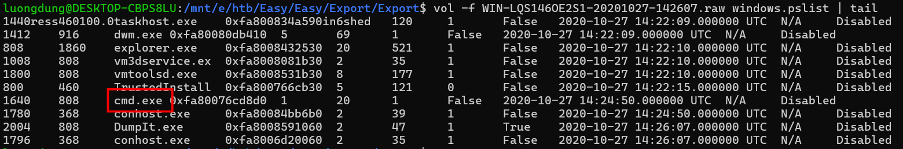
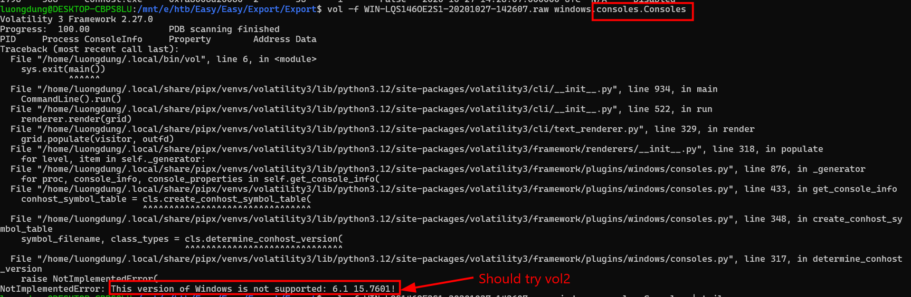
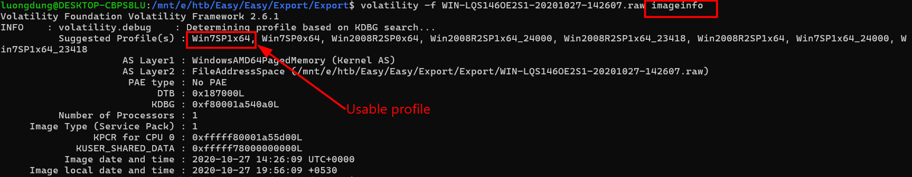
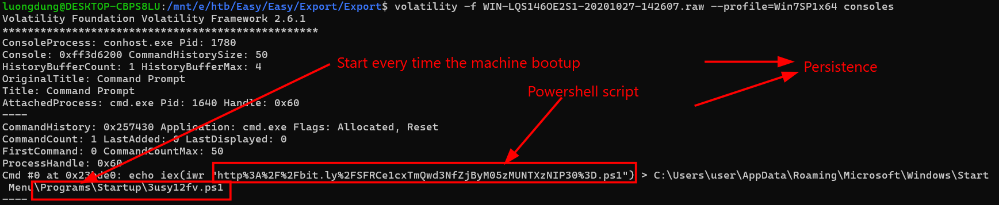
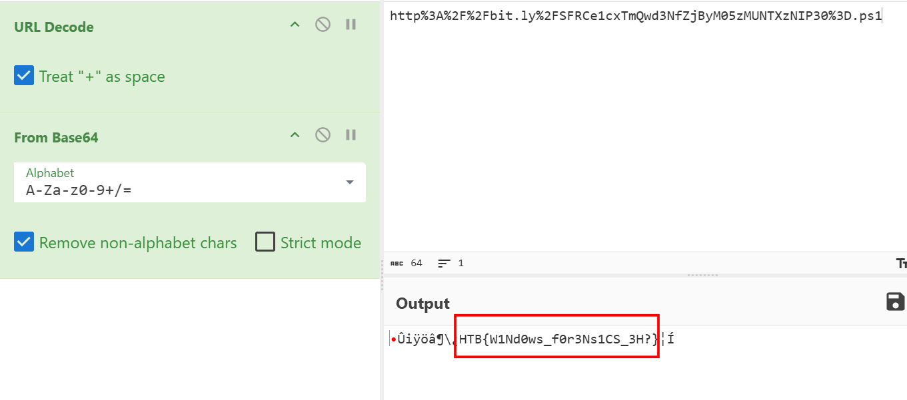

### Export
**Challenge scenario**: We spotted a suspicious connection to one of our servers, and immediately took a memory dump. Can you figure out what the attackers were up to?

#### Overview
The challenge provides a memory dump, so it is best to use volatility. Using **windows.info** gives me an overview of the machine being dump.

Continue to use pslist to search for suspicious process. Notably, the attacker has run cmd.

But when I use **CmdScan** or **Consoles** to look for any suspicious command that the attacker used, those doesn't work.

After consulting ChatGPT, it suggests that this version of memory dump may not suitable for Volatility 3. So I switch my attention to Volatility 2.

#### Using volatility 2
To use volatility 2, I must identity its profile first, so I use **imageinfo** for details.

I choose **Win7Sp1x64**, continue to use **consoles** to search for any malicious commmand.

The attacker download a Powershell script from an URL using **iwr** (Invoke-WebRequest), and stores this script to ...\Programs\Startup\\...ps1 so that every time the machine starts, it executes code inside this script.
Which means this is a persistence.
Moreover, the URL has been URL encoded, after decode it is the flag of this challenge being encode Base64.

**FLAG: HTB{W1Nd0ws_f0r3Ns1CS_3H?}**

---

