### Fake Boost
**Challenge scenario**: In the shadow of The Fray, a new test called &quot;Fake Boost&quot; whispers promises of free Discord Nitro perks. It&#039;s a trap, set in a world where nothing comes without a cost. As factions clash and alliances shift, the truth behind Fake Boost could be the key to survival or downfall. Will your faction see through the deception? KORPâ„¢ challenges you to discern reality from illusion in this cunning trial.

#### Overview
The challenge provides solely a packet capture. First, I look for hiararchy as usual.
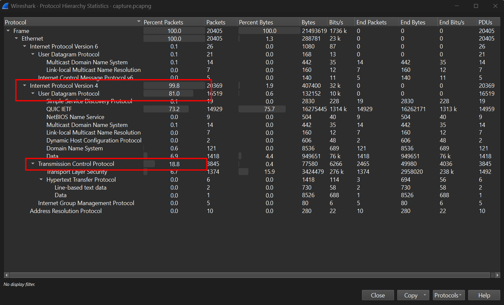
Well 81% of packets use UDP Protocol, so my first though is to follow UDP Stream. But nothing where accept for some discord domain, probaly a hint for this challenge
#### TCP Stream
So I change to follow TCP Stream, and some interesting things appears.
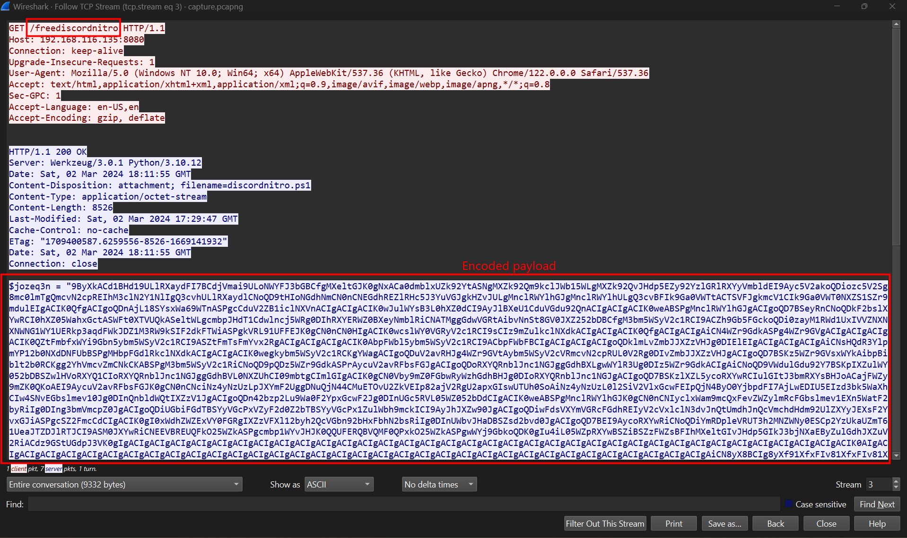
The client truly believe in free discord nitro...
So he/she download a malicious file which contain malicious script. Scrolling down and I found out how this script get encoded.
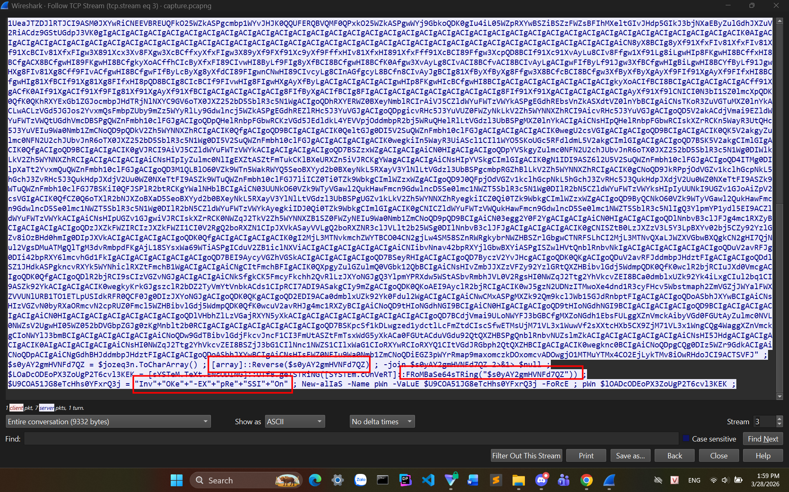
Reverse the script, decode Base64 and then used Invoke-Expression to execute malware.
After reverse this, I have a Powershell malware.

#### Analyze malware
Steal function through files and search for Discord token.
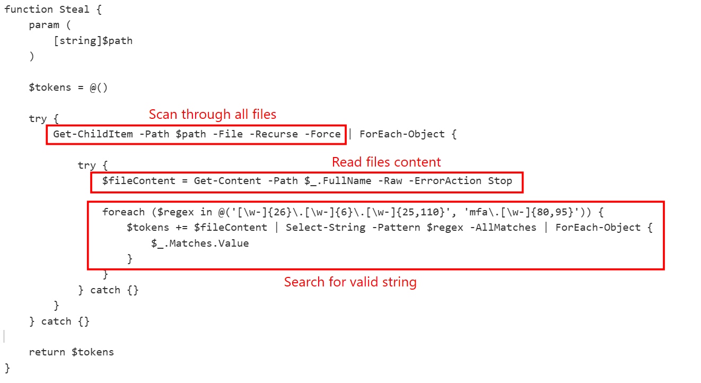
GenerateDiscordNitroCodes function will generate a normal Discord Nitro to distract client from suspicion.
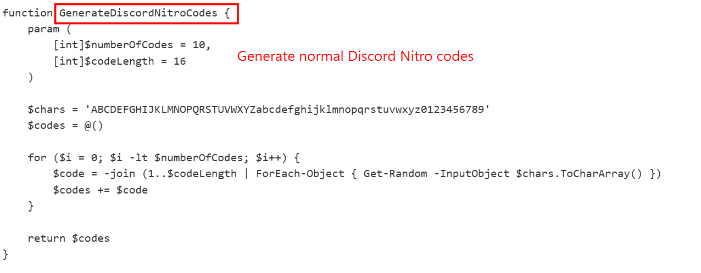
Get-DiscordUserInfo use the variable $Token collected from Steal function, and make a HTTP Request to Discord.
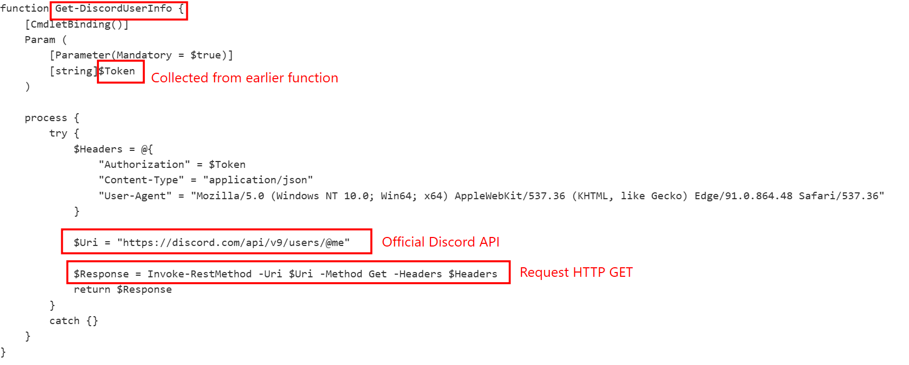
It also reveals its encryption mechanism send to server at IP 192.168.116.135:8080.
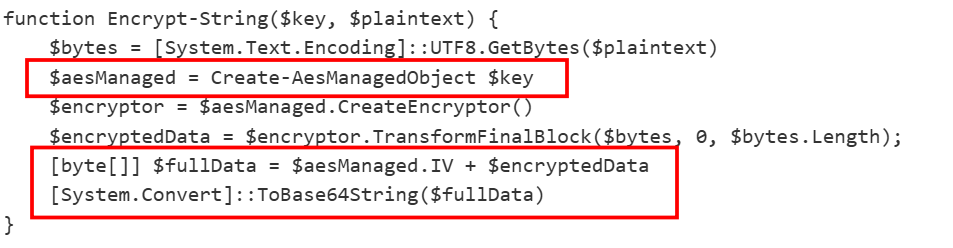
Move down a bit I found the AES key, and also the first part of the flag which has been encode Base64.
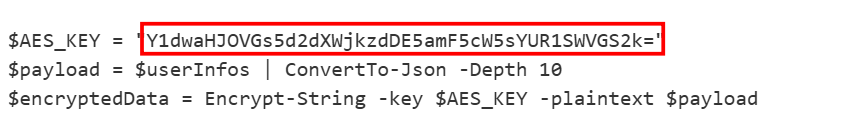

#### Decrypt payload
So the flow is clear now, decrypt the payload sent to Server to get client's information.
I filter for POST in Wireshark, because after collected neccesary data, the attacker must use POST to send it (after encryption).
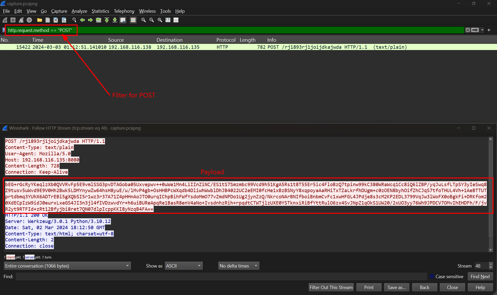
There is only one packet satisfy.
Using cyberchef to decrypt this payload, extract first 16 bytes as IV, the rest is ciphertext.
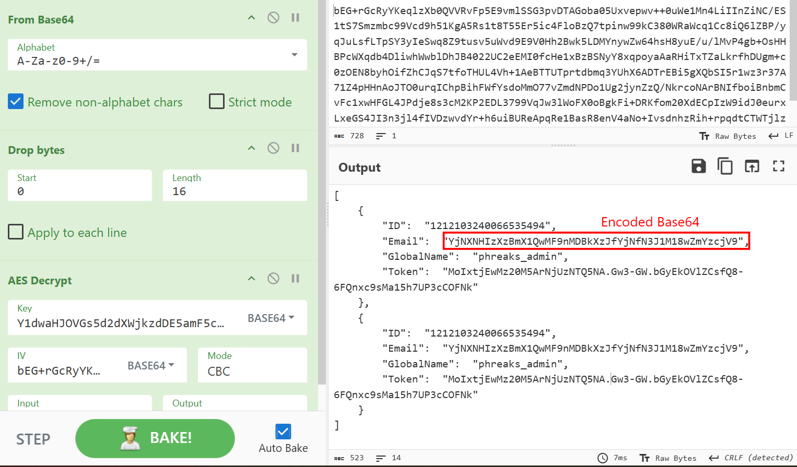
The data is store under JSON. And the mail is no such like normal ones, it has been encoded Base64. Decode it gives me the rest of the flag.
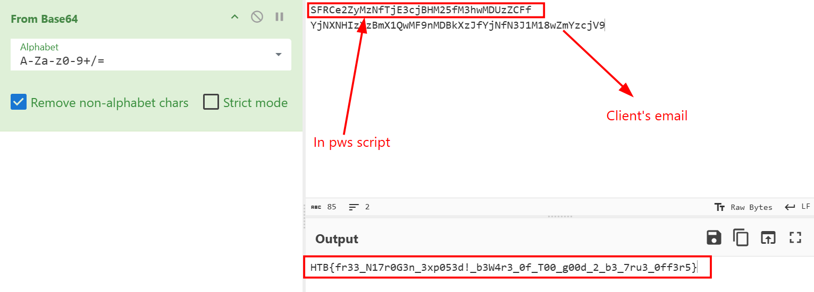
**FLAG: HTB{fr33_N17r0G3n_3xp053d!_b3W4r3_0f_T00_g00d_2_b3_7ru3_0ff3r5}**

---

