### Fishy HTTP
**Challenge scenario**: I found a suspicious program on my computer making HTTP requests to a web server. Please review the provided traffic capture and executable file for analysis. (Note: Flag has two parts)

#### Overview
So the challenge provides a packet capture and an executable. Let's open pcap file first.
Hiararchy shows that 16.3% of packets go through TCP Stream, including HTML Form URL Encoded, which raise suspicion.
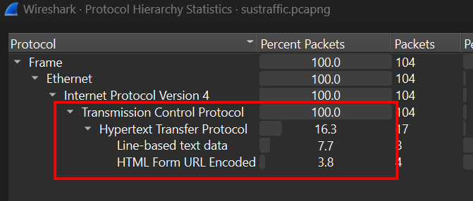
Follow TCP Stream, and it shows how HTML context got encoded right at stream 0.
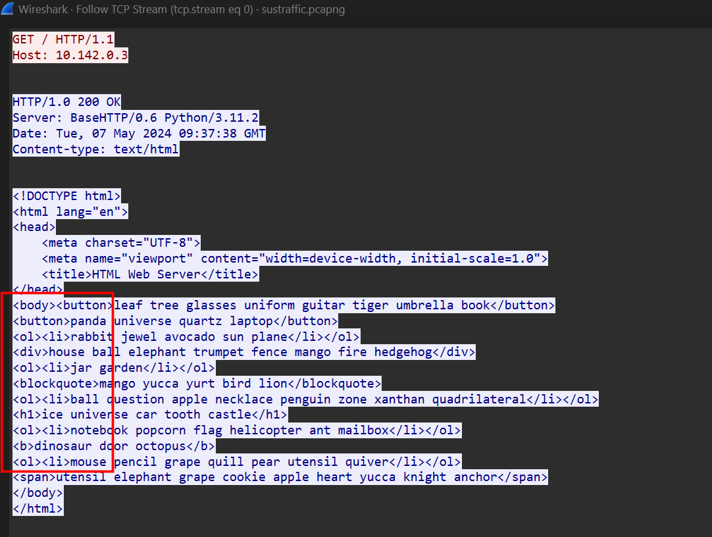
Perhaps those nonsence tags means something and is mutable.
Moreover, I also see the sign of Base64 encoded.
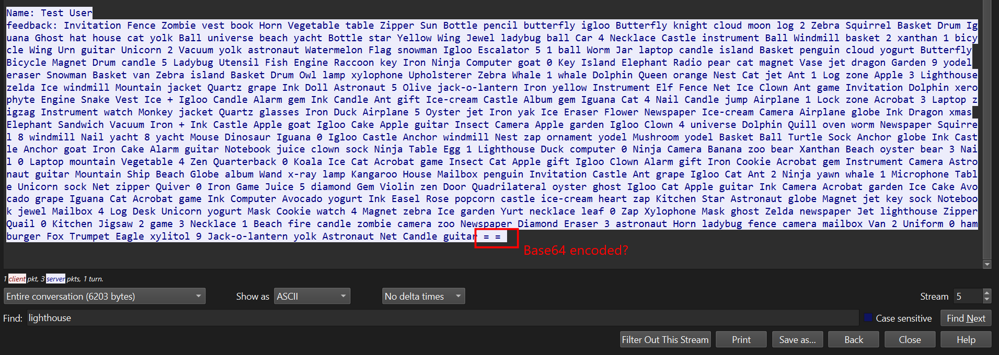

#### Executable
To know what those tags actually means, I open the executable with dotPeek. And all mechanisms, encryption and decryption tracks appears.
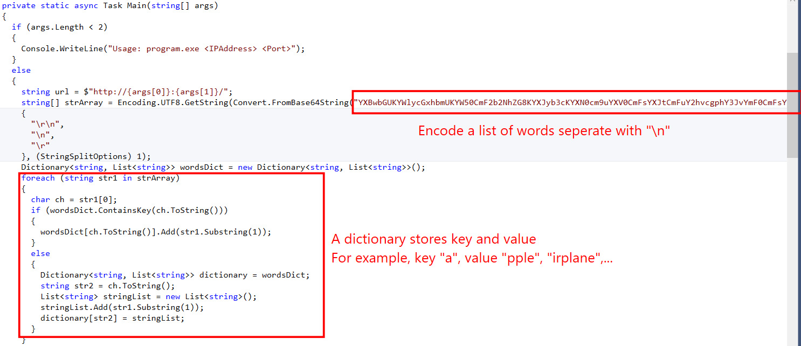
First, strArray stores an Array of word, one word per line. Nextup in the loop, it creates a dictionary such that if a word is "apple," the dictionary will store the key as "a" and the value as "pple."
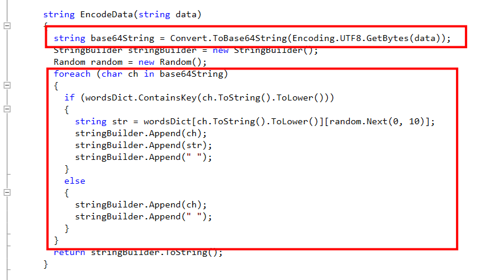
This explain how payload look alike Base64 encoded from earlier being encode. This function will encode Base64 the data, then after encoded, it will loop through every character in that string and search in the dictionary earlier any word that starts with it. Which means for the payload I saw in Wireshark, if I take only the first character of each words and join them, decode Base64 I can get the original data.
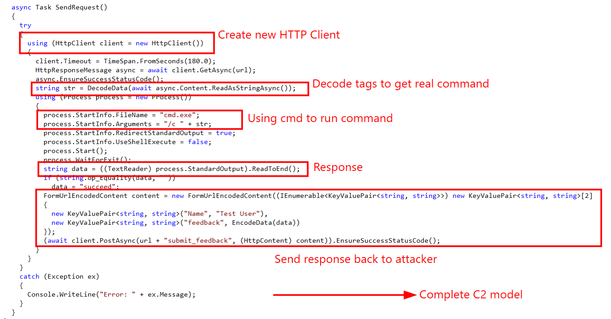
This is a complete C2 (Command & Control) model. The function creates a new HTTP Client, decode tag to get real commands and using cmd.exe to run, such as whoami, ipconfig... Then the response is encoded and sent back to attacker.
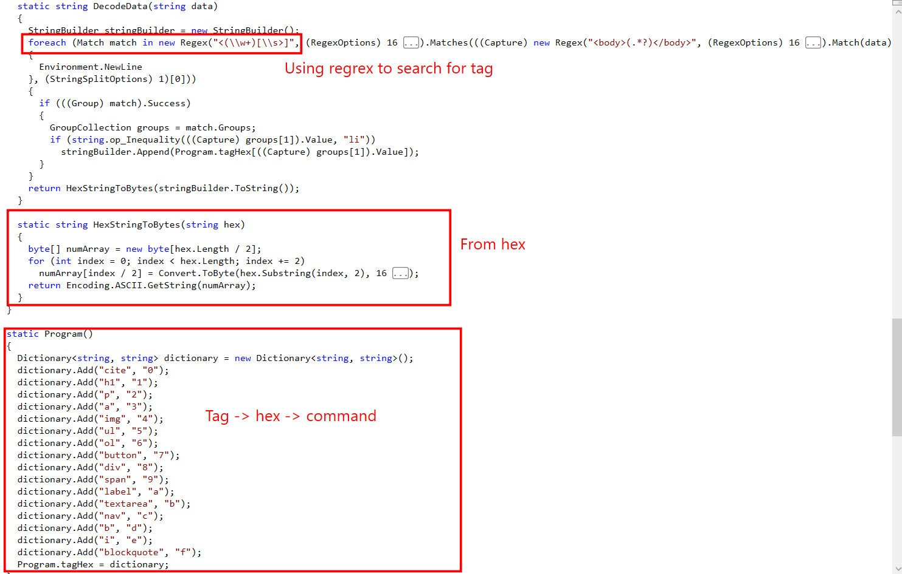
This final code explain how the command get encoded. For every tag shown in the dictionary, it converts to hex, and from hex to real command.

#### Decode traffic
So I get every thing I need to decode this traffic.
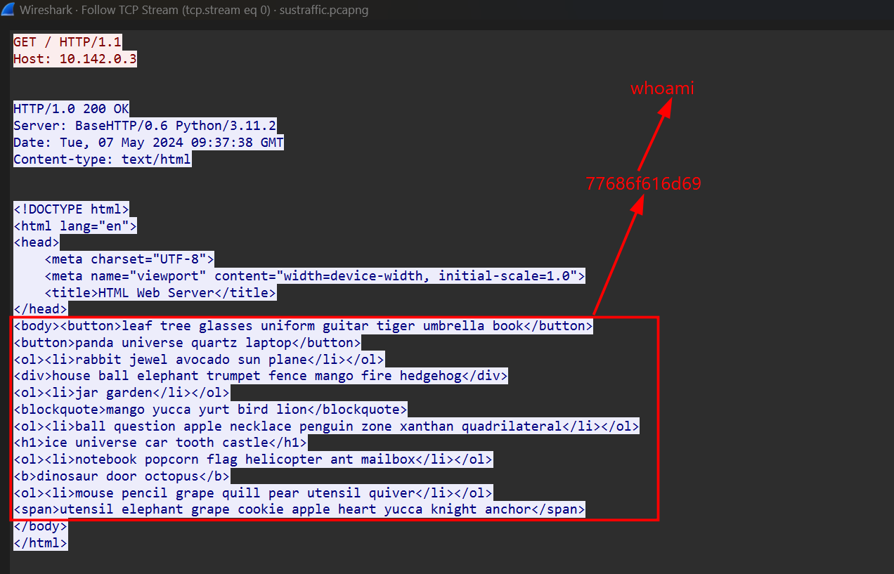
The first command that the attacker execute is whoami.
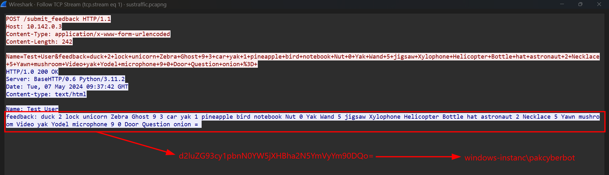
Response from client.
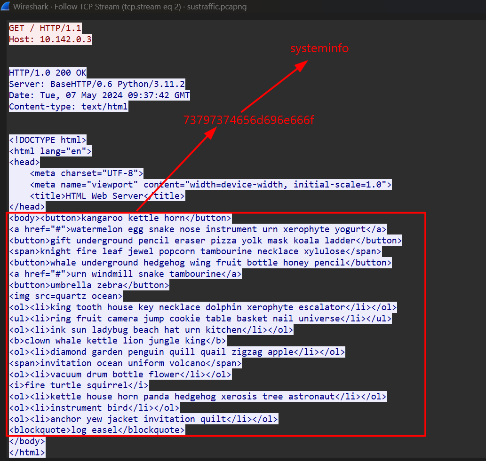
Command systeminfo is called.
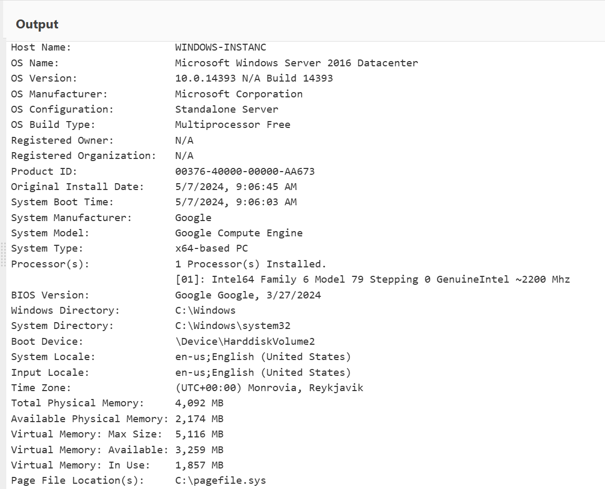
Response back for systeminfo.
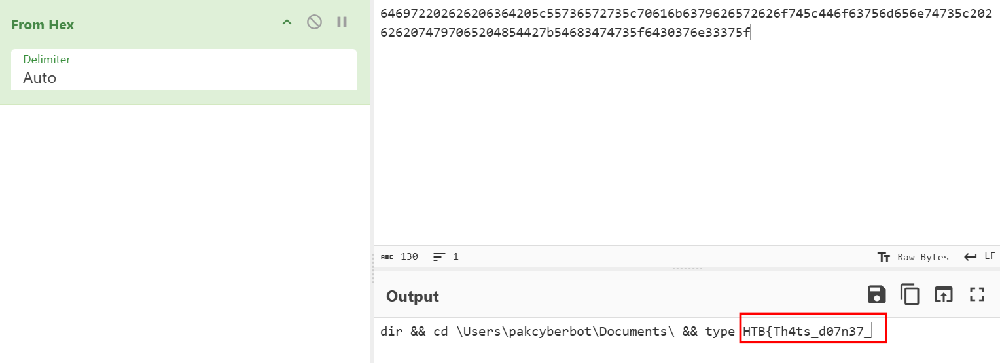
The following command executed, and first flag part appears.
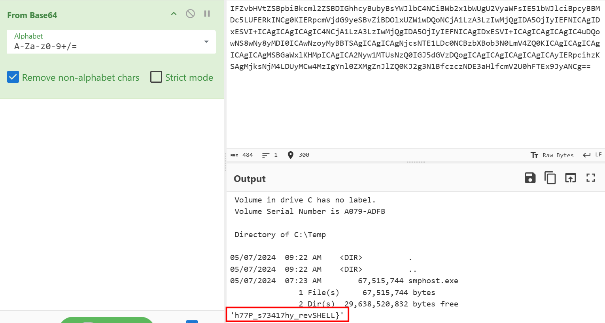
Response from client, also contains the second part of the flag.
Interesting challenge by the way.
**FLAG: HTB{Th4ts_d07n37_h77P_s73417hy_revSHELL}

---

