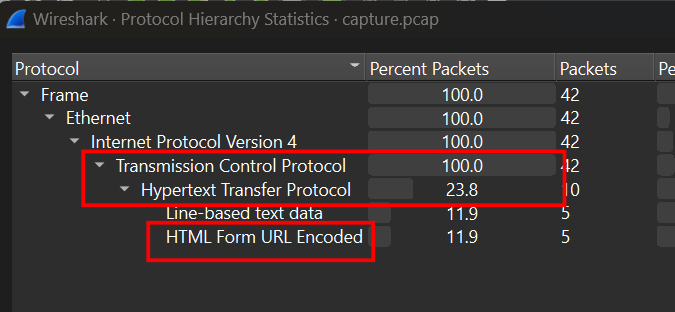
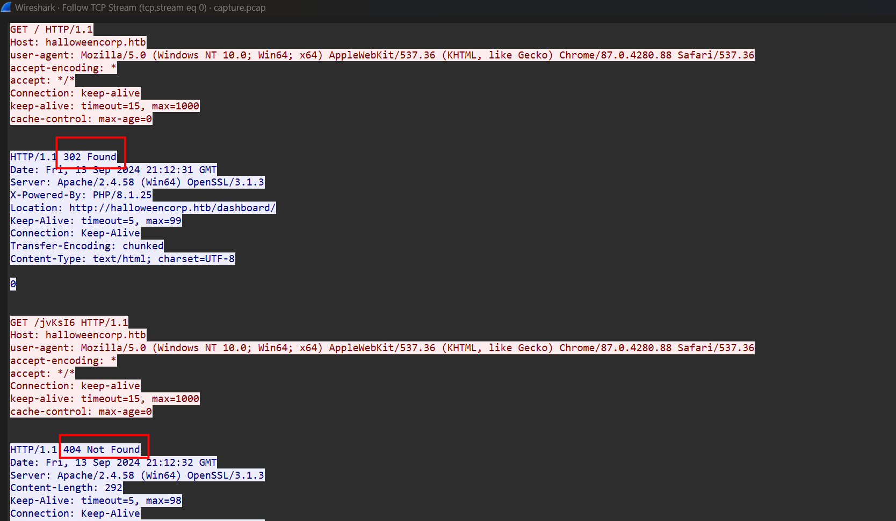
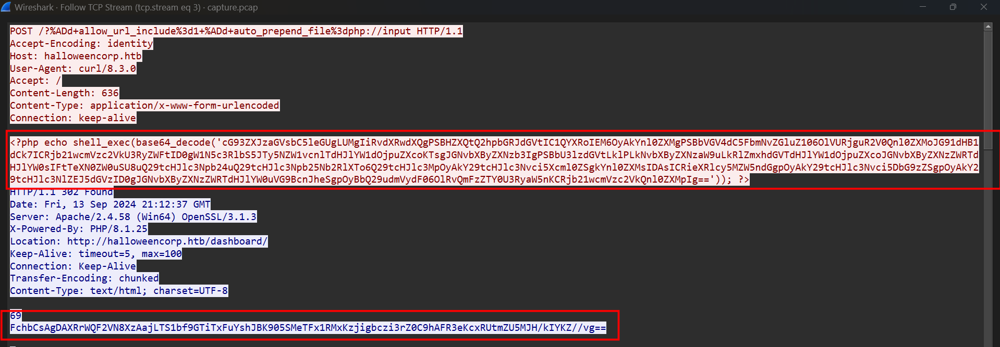
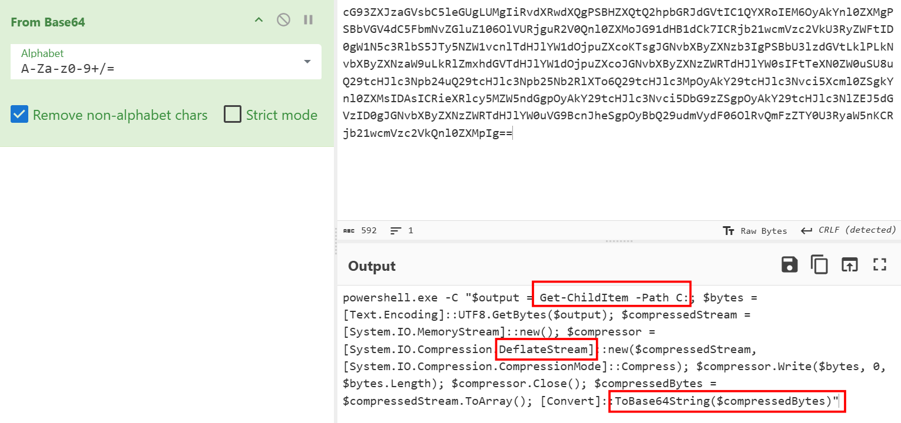
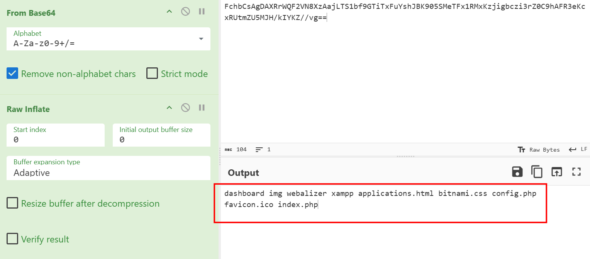
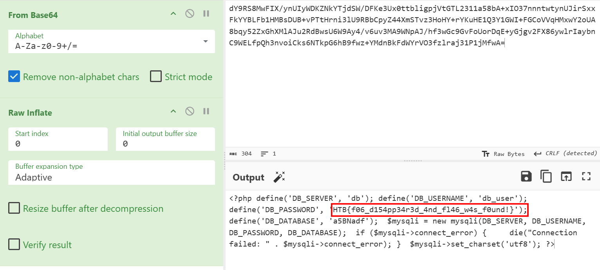

### Foggy Intrusion
**Challenge scenario**: On a fog-covered Halloween night, a secure site experienced unauthorized access under the veil of darkness. With the world outside wrapped in silence, an intruder bypassed security protocols and manipulated sensitive areas, leaving behind traceable yet perplexing clues in the logs.

#### Overview
The challenge provides solely a pcap file.
Look for Hiararchy as usual.

All packets are transfered through TCP Stream, including 23.8% through HTTP and 11.9% with HTML Form URL Encoded.
At first thought, I thought that it is some kind of tag encode like **Fishy HTTP**, but it is not.

#### TCP Stream
I follow TCP Stream, in Stream 0, the client tried to GET multiple files, but mostly 302 Found and 404 Not Found. Same as for Stream 1 and 2.

But to stream 3 is where something happens.

A php command which execute malicious script on Powershell.

List all files or folders in C directory, converts to real bytes then Deflate it and encode Base64.
So in order to decode the payload sent to attacker, I just need From Base64 and Raw Inflate from Cyberchef.

Continue to decode the traffic, the attacker list all files and folders in C:\xampp, read content in file C:\xampp\properties.ini.
And when the attacker use Get-Content -Path C:\xampp\htdocs\config.php, the flag appears.

**FLAG: HTB{f06_d154pp34r3d_4nd_fl46_w4s_f0und!}**

---

