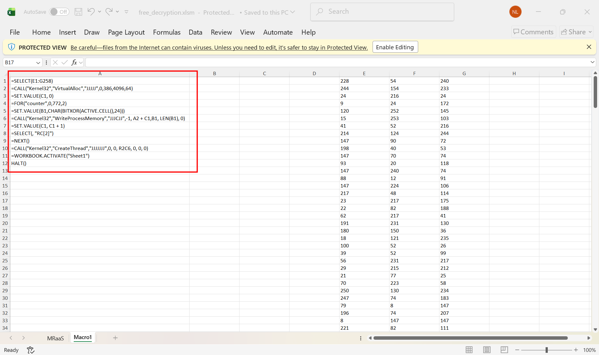
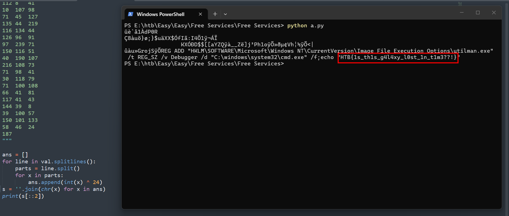

### Free Service
**Challenge scenario**: Intergalactic Federation stated that it managed to prevent a large-scale phishing campaign that targeted all space personnel across the galaxy. The enemy&#039;s goal was to add as many spaceships to their space-botnet as possible so they can conduct distributed destruction of intergalactic services (DDOIS) using their fleet. Since such a campaign can be easily detected and prevented, malicious actors have changed their tactics. As stated by officials, a new spear phishing campaign is underway aiming high value targets. Now Klaus asks your opinion about a mail it received from &quot;sales@unlockyourmind.gal&quot;, claiming that in their galaxy it is possible to recover it&#039;s memory back by following the steps contained in the attached file.

#### Overview
Well the scenario is very long but does not give much information, the challenge provides a Microsoft Excel file with extension .xlsm. 
Open the file and I see the malware immediately.

It collects data from E1 to G258, requires to alloc a virtual memory space using **VirtualAlloc**. XOR every number in data collected earlier with 24 (in decimal) and use **WriteProcessMemory** to write decoded byte directly into memory. Specially, it skip all number in F column using **RC[2]**. Finally use **CreateThread** to execute this process, or file, or something...

#### Decode data
So I code a very simple Python script, copy all value in column E, F, G, and XOR with 24. After that use [::2] to skip values in column F.

After some findings, eventually this is to edit registry, create key utilman.exe and add Debugger cmd.exe. So everytime the client runs utilman.exe, it opens cmd.exe.
--> This is some kind of priviledge escalation and backdoor.
And also print out the flag of this challenge.
**FLAG: HTB{1s_th1s_g4l4xy_l0st_1n_t1m3??!}**

---

