### Getting closer
**Challenge scenario**: Tasked with defending the antidote's research, a diverse group of students united against a relentless cyber onslaught. As codes clashed and defenses were tested, their collective effort stood as humanity's beacon, inching closer to safeguarding the research for the cure with every thwarted attack. A stealthy attack might have penetrated their defenses. Along with the Hackster's University students, analyze the provided file so you can detect this attack in the future. Note:* Make sure you edit /etc/host so that any hostnames found point to the Docker IP.

#### First stage
A obfuscated Javascript script is given where variables are set very long.
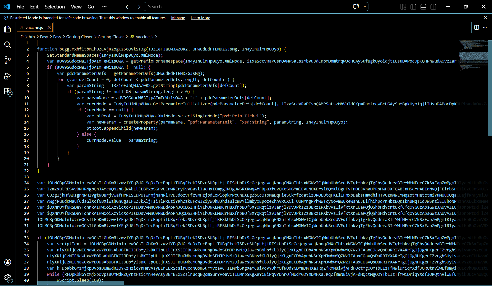
At first I try to understand this source code.
This is the most dangerous part of this code.
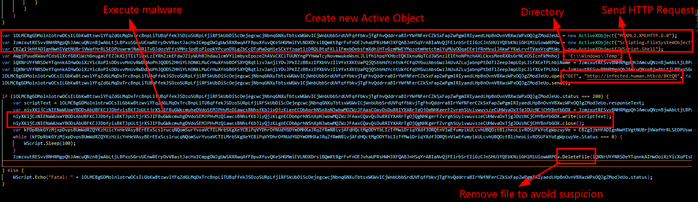
This blob creates objects to download file and execute the malware, create a random file name with extension .vbs in Temp directory. Download the suspicious file by sending a HTTP Request. After that write the payload down and run with WScript. Finally use DeleteFile to remove this suspicious program. 
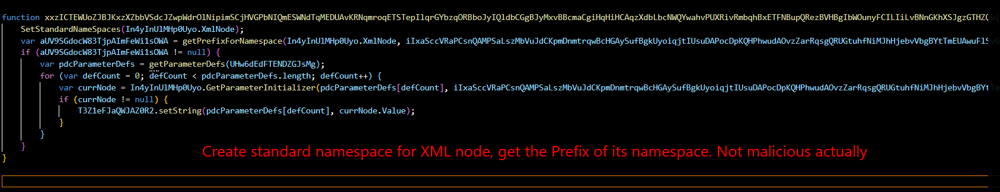
This function just create standard namespaces for XML node. Takes the corresponding to its namespace, takes the currNode.Value and written in targetStore.
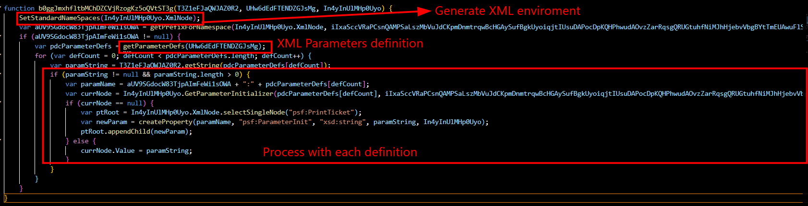
This part just generate namespace for XMl, find prefix and its definition. This is not actually the malware so I did not put much attention to it. 

#### Second stage
Using docker's IP to download the vbs, I got another obfuscated VBS script.
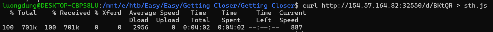
Although the script is 930 lines long, its malware is easy to understand.
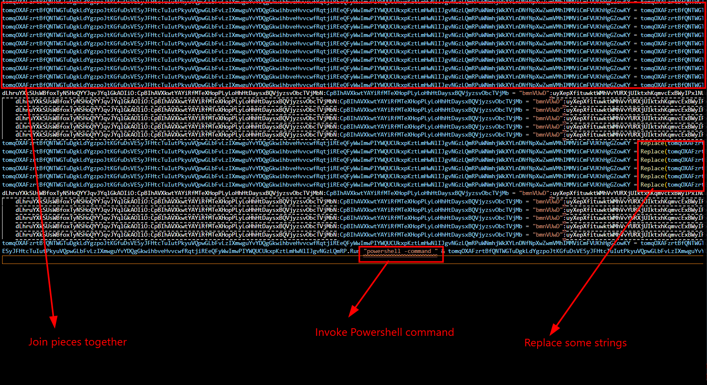
It join pieces of tom.. variable together, replace some string and it is finally a Powershell command. Running this script after some modification in the last line I have.
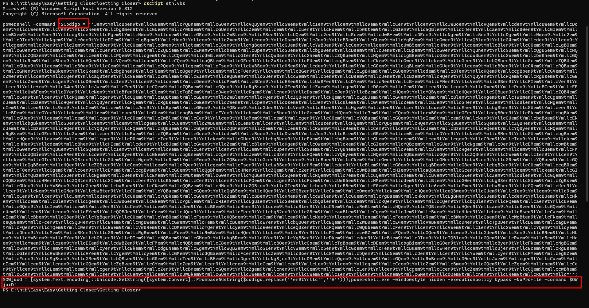
Decode Base64 that code blob, replace a string and run with Powershell.
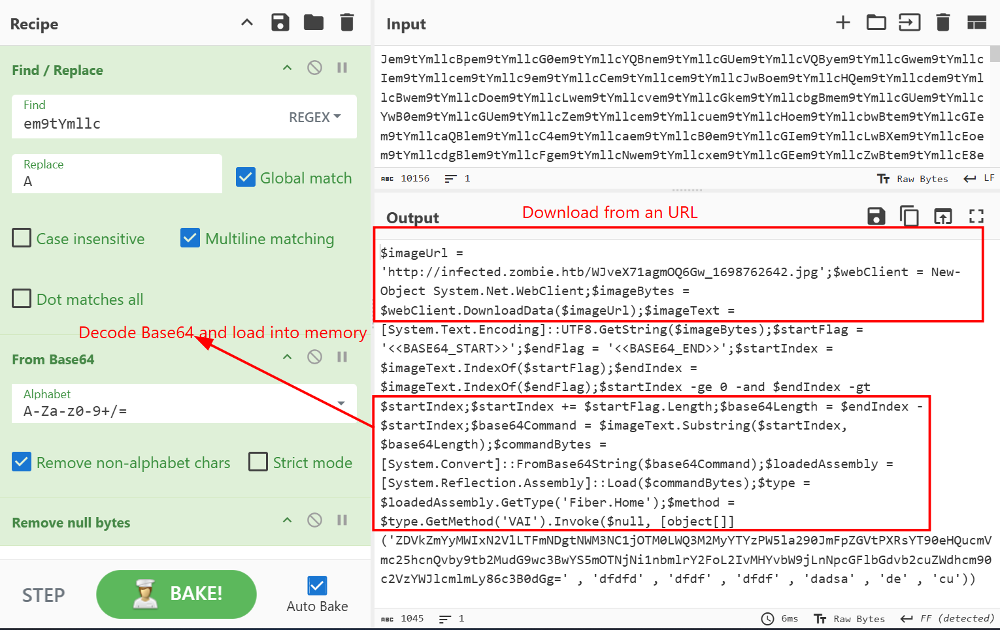
It download a file with jpg extension from an URL, doing some Base64 decode and load directly into memory

#### Third stage
I downloaded that jpeg file for furthur analysis.
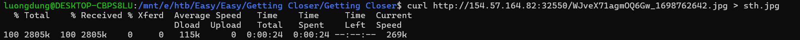
From the ealier code, I extracted the Base64 blob from the picture, which is the data exfiled after IEND ending of a picture.

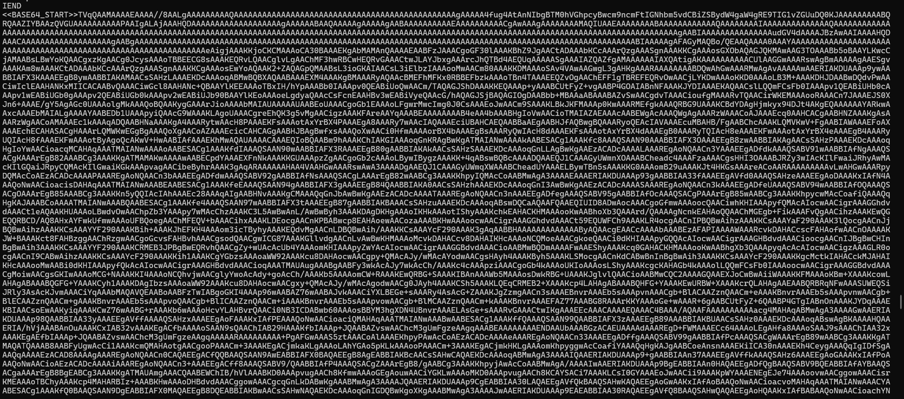

As I remember, the heading TVqQ is from a executable with header MZ, and it is truly is.
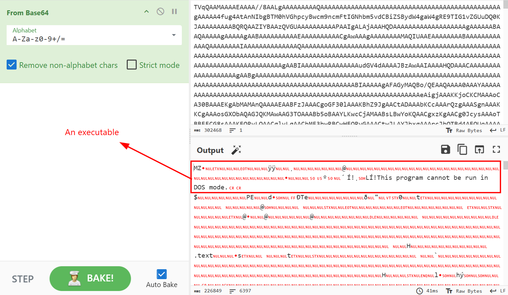

Scrolling down and the flag appeared.
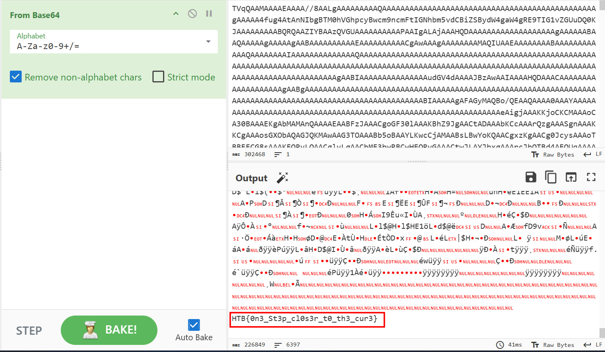

**FLAG: HTB{0n3_St3p_cl0s3r_t0_th3_cur3}**

---

