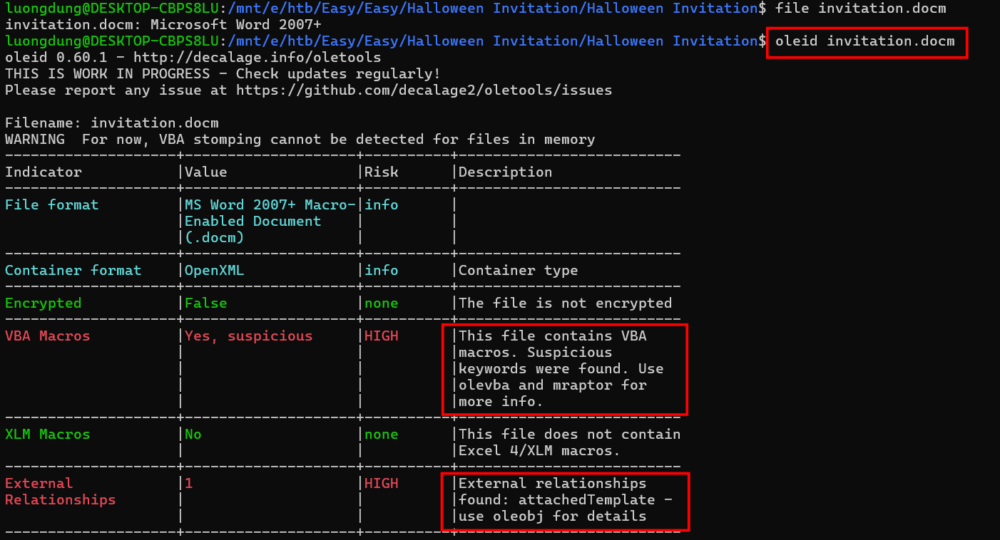
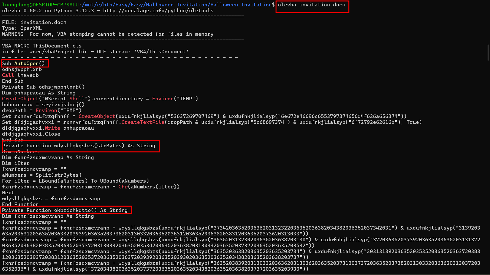
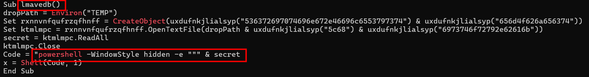
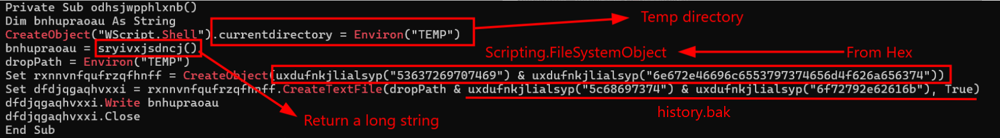
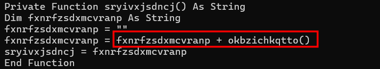
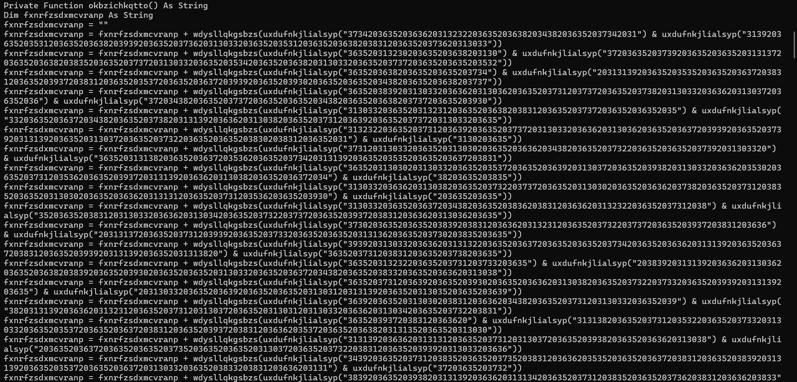
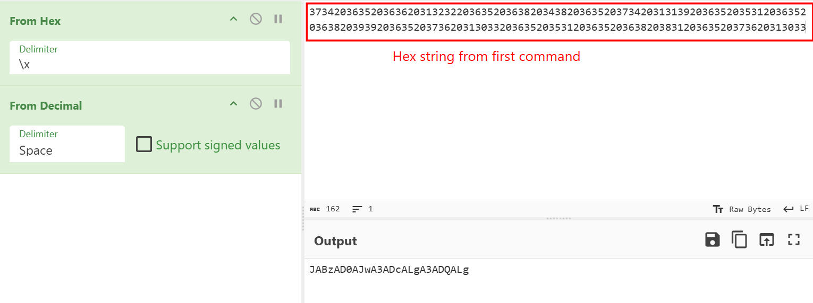
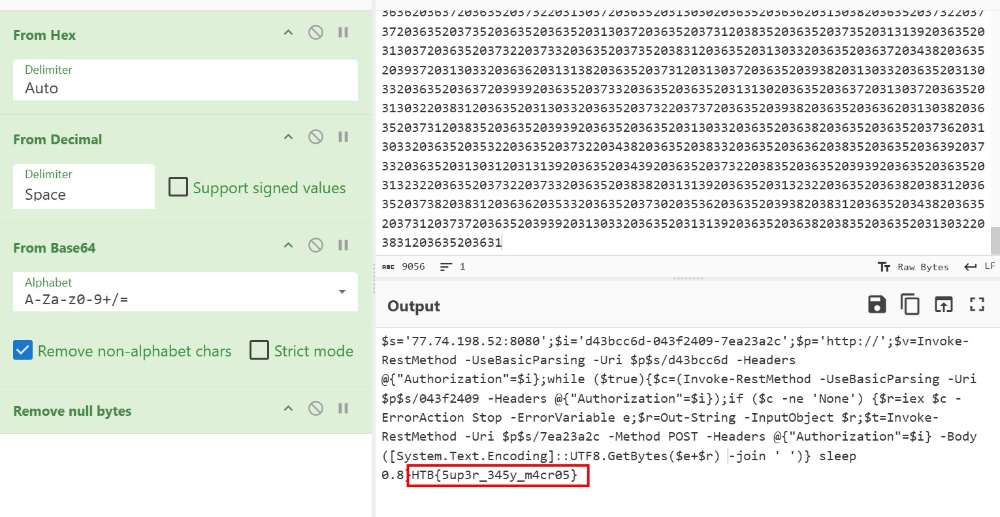
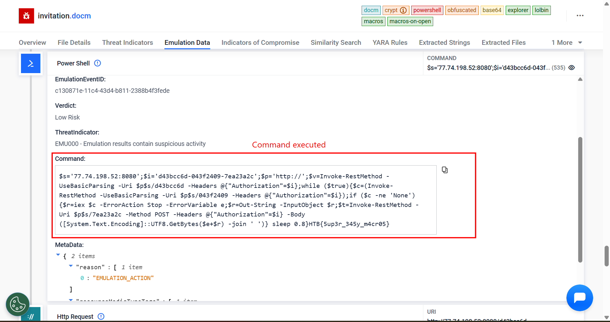

### Halloween Invitation
**Challenge scenario**: An email notification pops up. It's from your theater group. Someone decided to throw a party. The invitation looks awesome, but there is something suspicious about this document. Maybe you should take a look before you rent your banana costume.

#### Overview
The challenge provides solely a Microsoft Document file with extension .docm. Open it seeing nothing suspicious. So I use ole tools to handle this file.

#### VBA Macro

So this document contains VBA Macro, and also have External Relationships.
Using olevba return a very long VBA script.

**AutoOpen()** will automatically run this Macro when the document is open, and call for two functions **odhsjwpphlxnb** and **lmavedb**.

**lmavedb** will execute Powershell script which save as secret, let's find out what the secret here.

For **odhsjwpphlxnb** function, goes to TEMP directory, it gets payload from **sryivxjsdncj** function, create file history.bak.
Since the payload is taken from **sryivxjsdncj**, let's take a look at it.

It's continue calling for **okbzichkqtto** function.

A very long script for this function, executing repeated commands. But overall, it decode each of these commands to become the final payload. 

#### Executed Powershell command

Finally, I decode the rest of this payload using Cyberchef. It has been encoded base64. Decode it reveals the flag of this challenge

A HTTP Reverse Shell. Connect to C2 Server, take and execute commands on client's computer and send result back.

#### Notable websites while doing this challenge
Reverse this VBA Macro by hand is a bit complex and time consuming. But it is helpful such that I can learn more about VBA Macro.
I have discover a online website name filescan.io, it reverse this macro automatically and returns the flag. The only thing I need to do is just upload the file.

But ofcourse I did this after completely solved for the flag =)))
**FLAG: HTB{5up3r_345y_m4cr05}**

---

