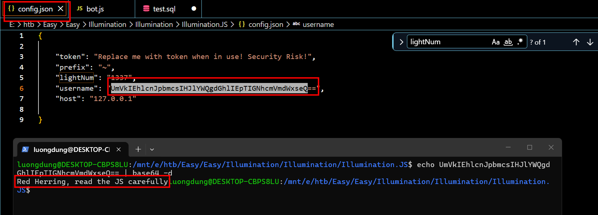
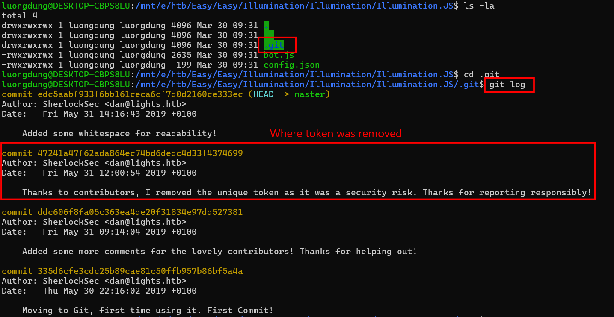
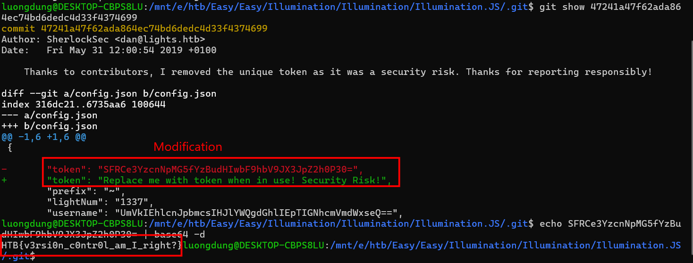

### Illumination
**Challenge scenario**: A Junior Developer just switched to a new source control platform. Can you find the secret token?

#### Overview
The challenge provides a folder which contains two files bot.js and config.json
Reading its code provides not much information, the only notable is this Base64 encoded string.

But nothing in JS file is worth-mentioning.

#### Git commits
Suprisingly, using **ls -la** shows a hidden folder .git.

Guessing the challenge is about git commits, I used git log to show all git commit messages taken. And commit 47241a47f62ada864ec74bd6dedc4d33f4374699 is where the secret tokem mentioned in the scenario is removed.

#### Show commits
So I just easily use git show to reveal the hidden token, which is the flag of this challenge being encoded Base64.

**FLAG: HTB{v3rsi0n_c0ntr0l_am_I_right?}**

---

