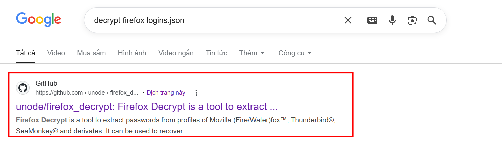
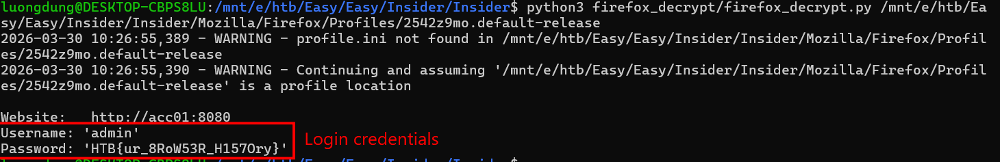

### Insider
**Challenge scenario**: A potential insider threat has been reported, and we need to find out what they accessed. Can you help?

#### Overview
Related folders are provided. Digging a bit I found Mozilla\Firefox\Profiles\2542z9mo.default-release\logins.json where contains encrypted Username and Password.

#### Decrypt credentials
So I do some googling to look for any tools that helps decrypt this, and a github repository appears.

Using this tool helps decrypt Username and Password, which reveals the flag.

**FLAG: HTB{ur_8RoW53R_H157Ory}**

---

