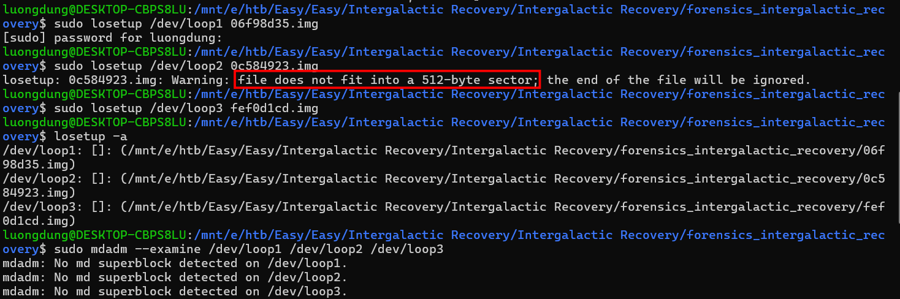
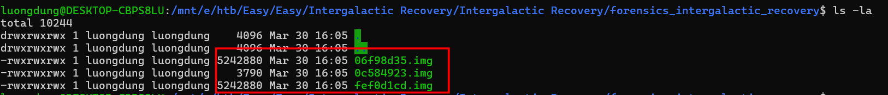
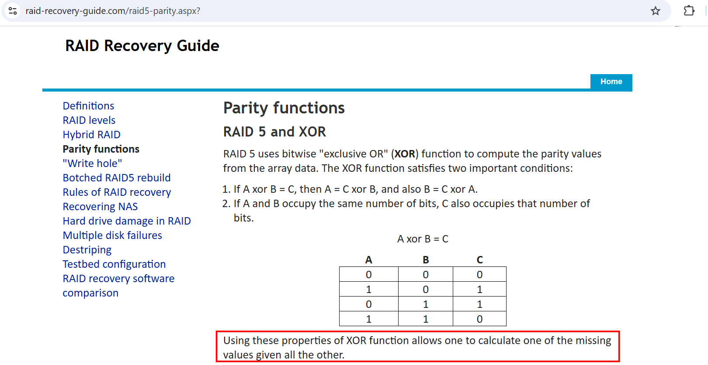
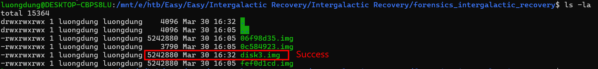
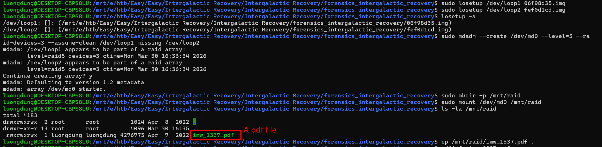

### Intergalactic Recovery
**Challenge scenario**: Miyuki's team stores all the evidence from important cases in a shared RAID 5 disk. Especially now that the case IMW-1337 is almost completed, evidences and clues are needed more than ever. Unfortunately for the team, an electromagnetic pulse caused by Draeger's EMP cannon has partially destroyed the disk. Can you help her and the rest of team recover the content of the failed disk?

#### Overview
So my task is to recover the content of the failed disk. This is partly like "suzuki RAIDer" from BKSEC Training.
So I tried to do the same, but it failed because of size differences.
.
Checking its size again, only two disks of size 5MB, the remaining one is only 3KB.

#### Recover disks
But to recover RAID 5, we need at least 3 disks. So I have found out from this website is that if we operate XOR on two disks, we can get the third one. 

Yup and it successes.

So I already have three over five disks needed to mount.

A PDF file is taken.
Open the pdf reveals the flag of this challenge.
**FLAG: HTB{f33ls_g00d_t0_b3_interg4l4ct1c_m0st_w4nt3d}**

---

