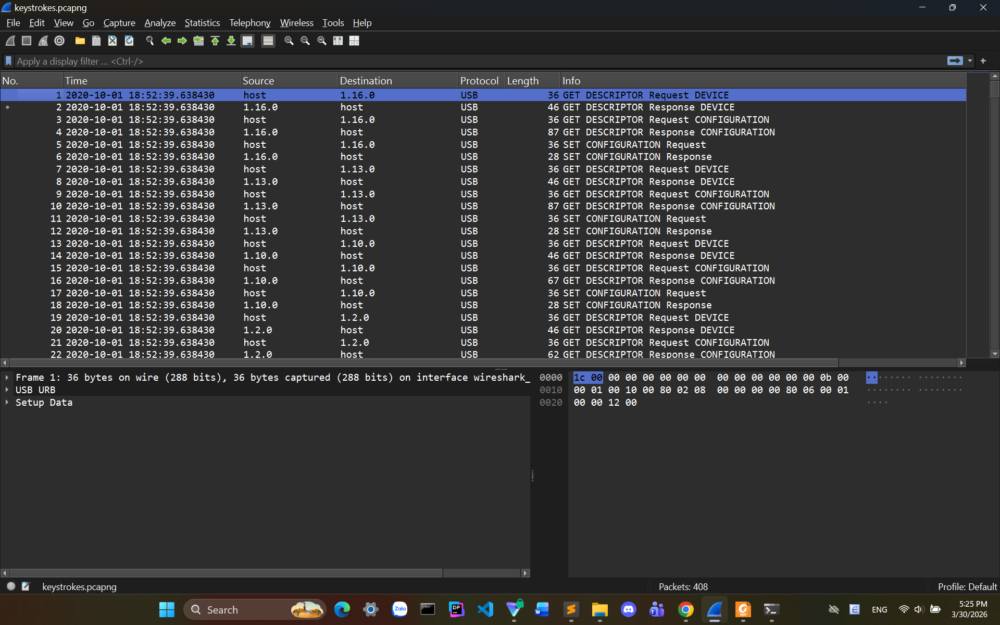
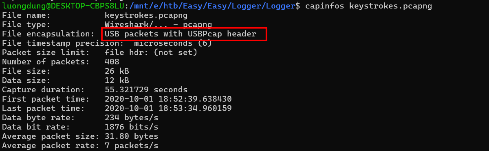
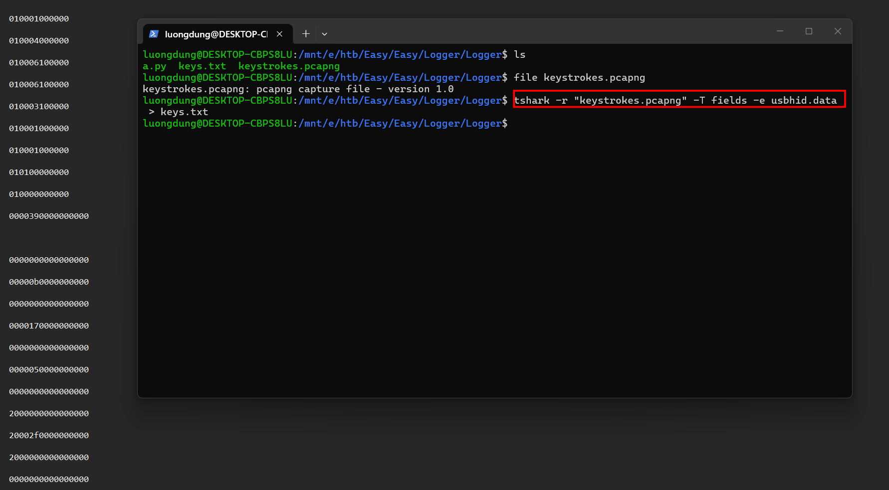

### Logger
**Challenge scenario**: A client reported that a PC might have been infected, as it's running slow. We've collected all the evidence from the suspect workstation, and found a suspicious trace of USB traffic. Can you identify the compromised data?

#### Overview
A packet capture is provided.

It seems like only USB Protocol, comblines with the result of command capinfos shows that this is a USB keyboard capture

#### Decode keyboard
This challenge is nothing different to "American bee" from BKSEC Training, so I just do the same way. Using extract field containing USB HID keyboard by -e usbhid.data.

From here, I decoded the keycode, handle buttons like CapsLock, Underscore... which is the flag of this chalenge.

**FLAG: HTB{i_C4N_533_yOUr_K3Y2}**

---

