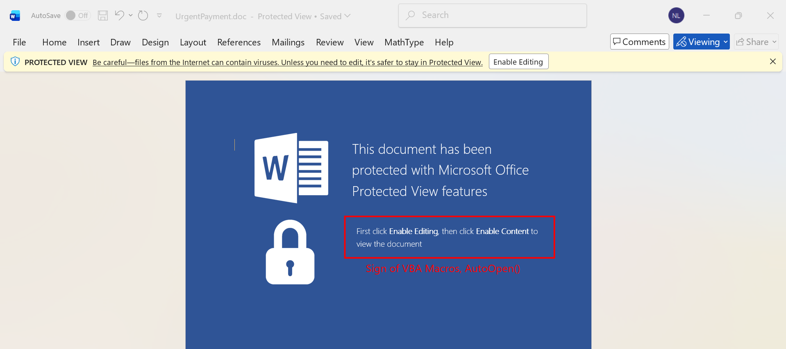
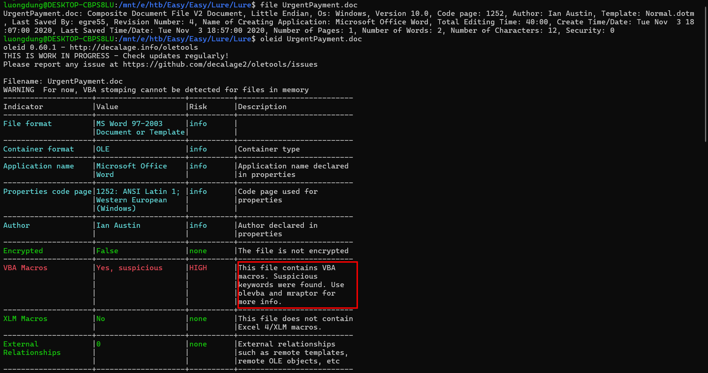
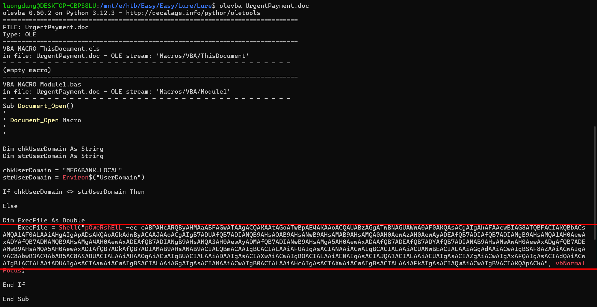
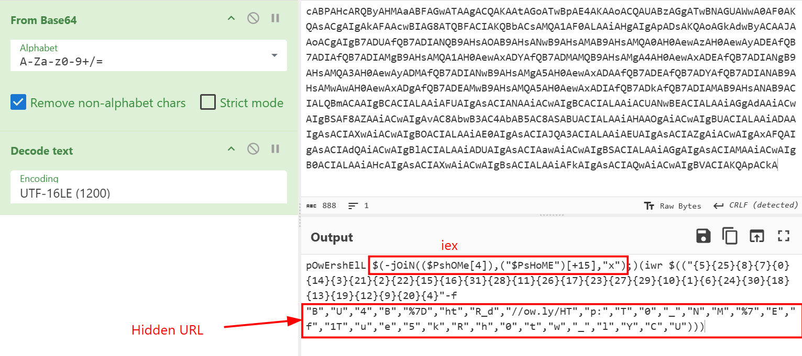
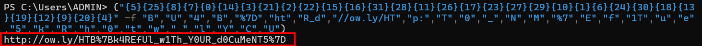
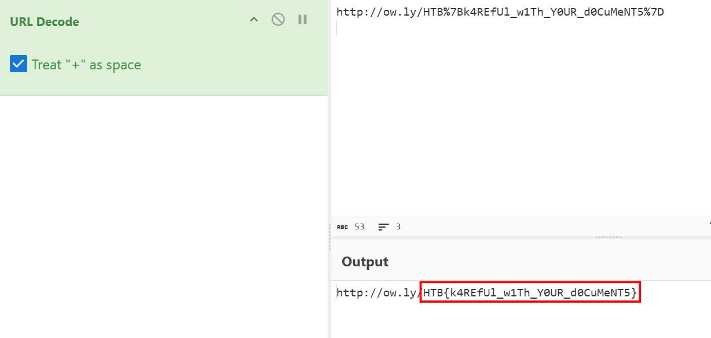

### Lure
**Challenge scenario**: The finance team received an important looking email containing an attached Word document. Can you take a look and confirm if it&#039;s malicious?

#### Overview
The challenge brings a Word document. 

This raised suspicion about VBA Macros.
**Oleid** confirms it.

#### VBA Macros

No AutoOpen() function as usual, but instead Document_Open(). This macro will run whenever clients open this document. A powershell command will be executed, it is encoded Base64.

So this Powershell script downloads something from an URL and execute it. $PshOMe and $PsHoME are two enviroment variables available in Powershell.

#### Decode URL
Rebuild the URL expose the flag of this challenge.

Partly being URL encoded.

**FLAG: HTB{k4REfUl_w1Th_Y0UR_d0CuMeNT5}**

---

