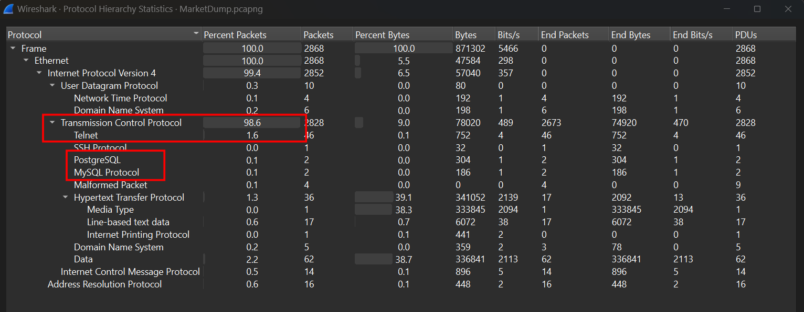
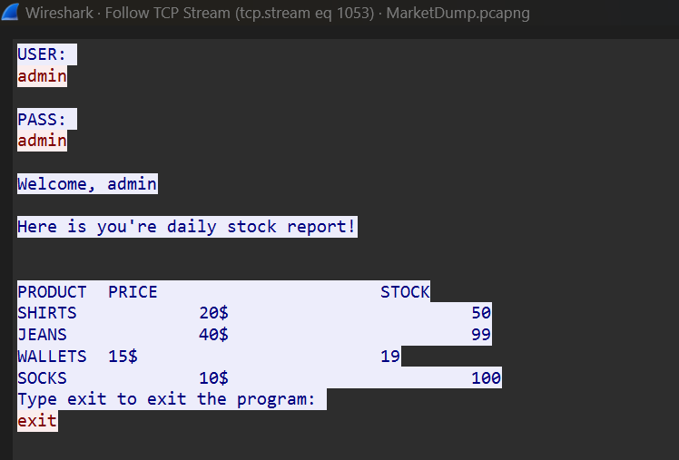
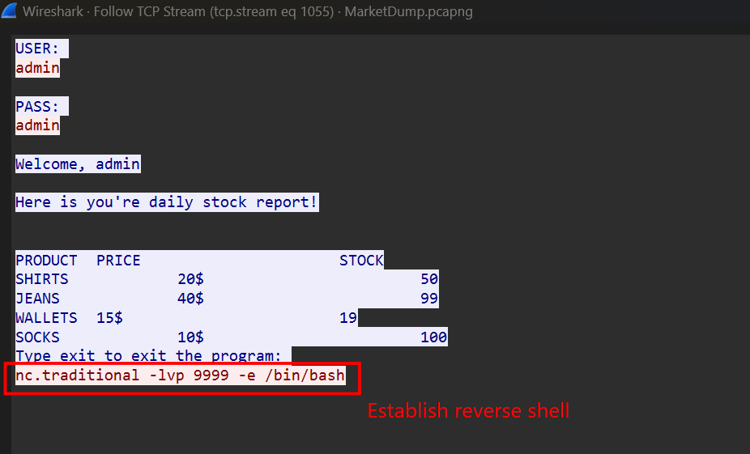
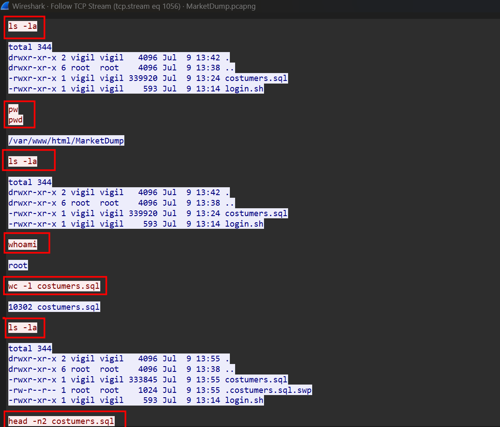
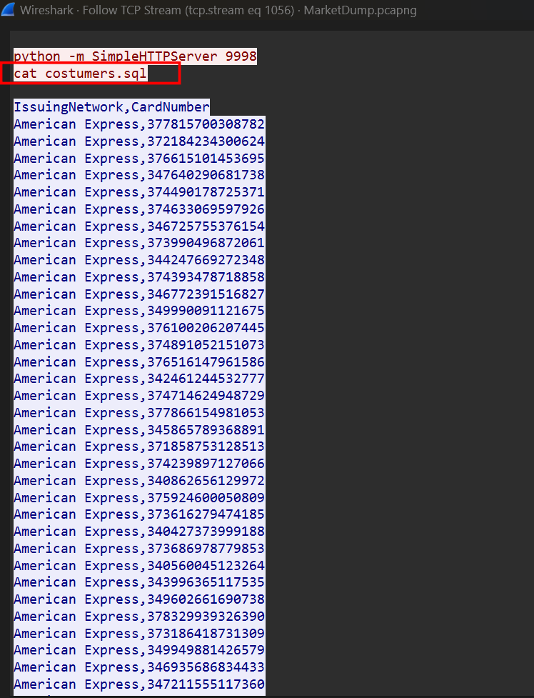
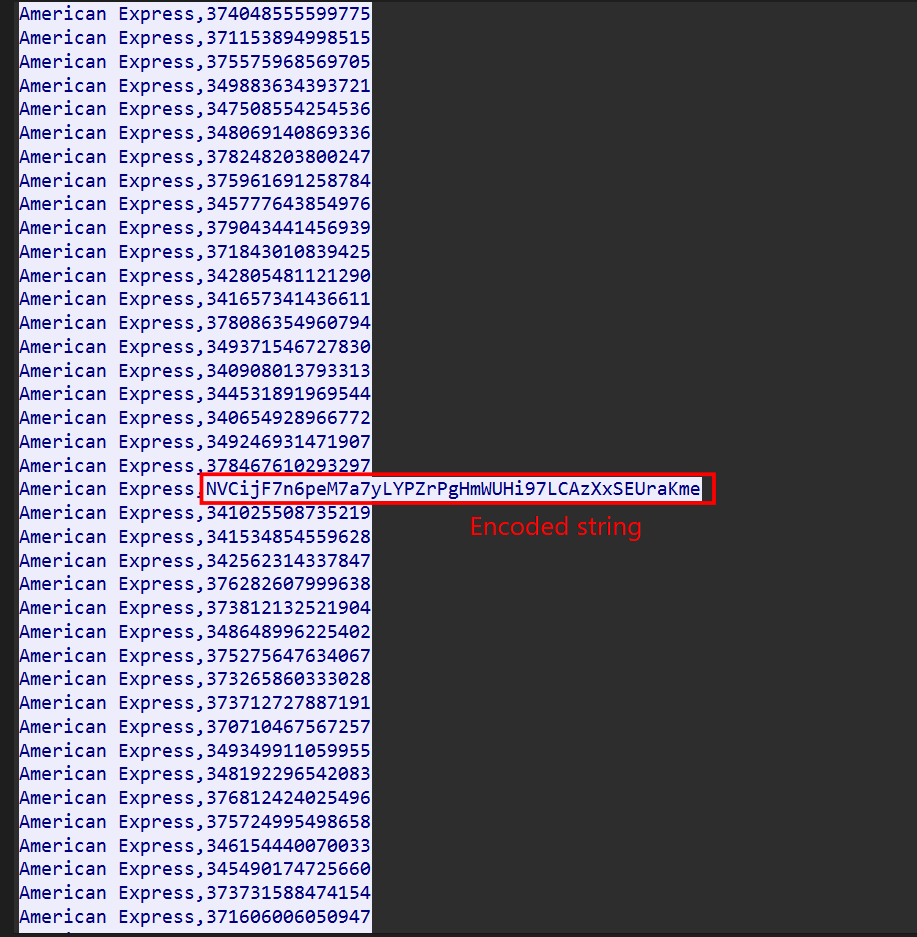
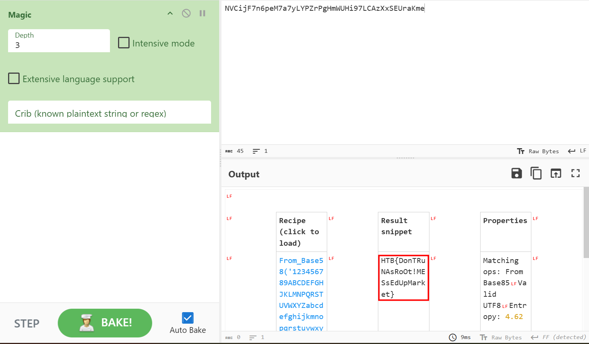

### MarketDump
**Challenge scenario**: We have got informed that a hacker managed to get into our internal network after pivoiting through the web platform that runs in public internet. He managed to bypass our small product stocks logging platform and then he got our costumer database file. We believe that only one of our costumers was targeted. Can you find out who the customer was?

#### Overview
So my objective is to find which costumers got attacked.
Open Hiararchy for better overview of the situation.

Packets are mainly transfered through TCP Stream, furthurmore the data of customers are accessible using MySQL Database.
Telnet has also be used.

#### TCP Stream
Following the TCP Stream shows that the attacker has successfully logon with admin.

Next up, the attacker using netcat connection to eatablish a reverse shell to its machine.

C2 control.

The attacker execute commands on client's machine and get result back.

#### costumers.spl
Scrolling down, the attacker reads the content of all costumers from a .sql file.

A suspicious encoded string appears.

Turns out it has been Base58 encoded.

**FLAG: HTB{DonTRuNAsRoOt!MESsEdUpMarket}**

---

