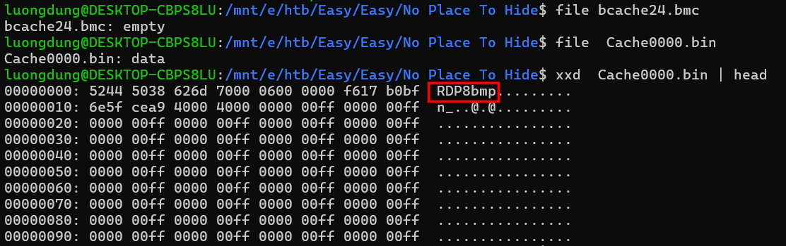
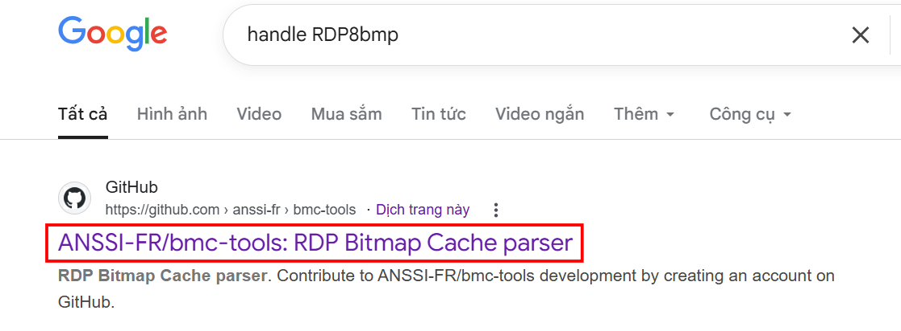
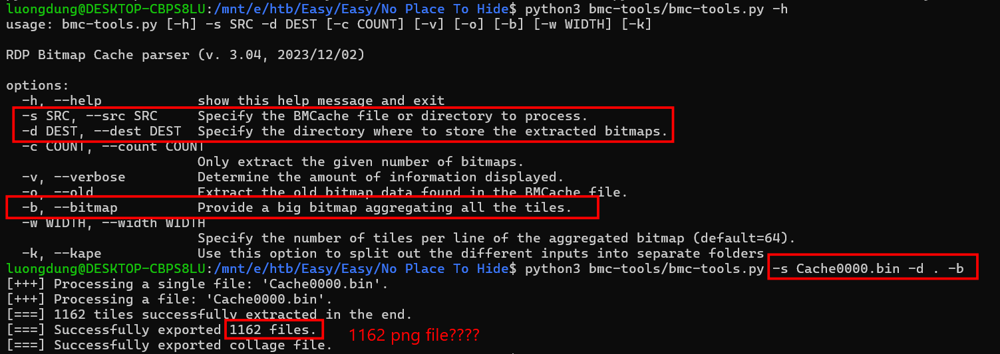
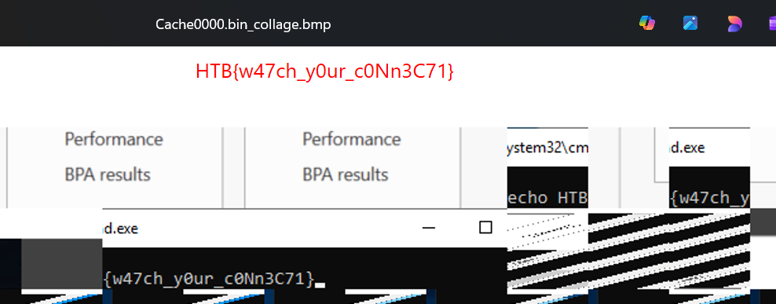

### No place to hide
**Challenge scenario**: We found evidence of a password spray attack against the Domain Controller, and identified a suspicious RDP session. We'll provide you with our RDP logs and other files. Can you see what they were up to?

#### Overview
So my objective is to find what's in that RDP Session. RDP stands for Remote Desktop Protocol allowing user to control another computer remotely, such like Ultraview. 
The challenge has an empty .bmc file, a file with header RDP8bmp, storing bitmap of remote screen to increase cache

After some findings, RDP8bmp is the Bitmap Cache file of RDP, and is created when users use Remote Desktop on Windows.

#### Effective tools
To analyze file type, I have found the bmc-tools from a Github Repository.

Cloning to my local machine and start utilize it.

Returning 1162 PNG files????
Searching for a bit and I found the flag in this picture.

**FLAG: HTB{w47ch_y0ur_c0Nn3C71}**

---

