### Obscure
**Challenge scenario**: An attacker has found a vulnerability in our web server that allows arbitrary PHP file upload in our Apache server. Suchlike, the hacker has uploaded a what seems to be like an obfuscated shell (support.php). We monitor our network 24/7 and generate logs from tcpdump (we provided the log file for the period of two minutes before we terminated the HTTP service for investigation), however, we need your help in analyzing and identifying commands the attacker wrote to understand what was compromised.
From scenario's hint, I need to understand attacker's commands hidden in artifacts.
A obfuscated script and a pcap file is given. Open for Hiararchy first.
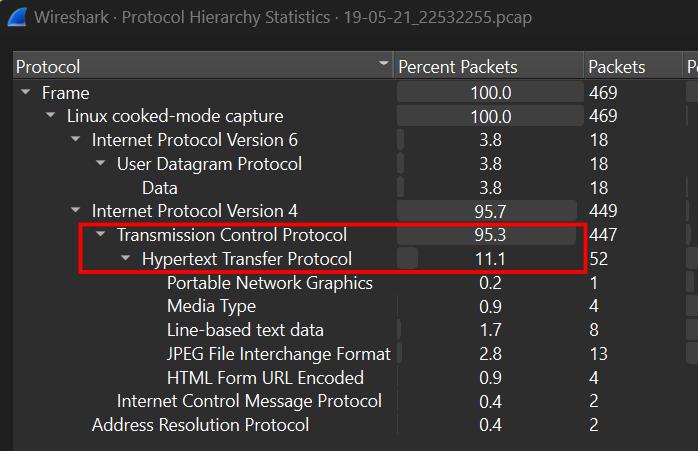
TCP Stream is going to be my target.
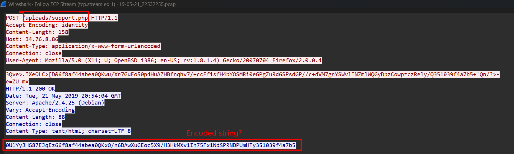
In Stream 1, where the client upload the support.php file, which is also the file given from challenge. So I guess the responce from server is going to be some kind of commands or result.

#### Obfuscated script
Open obfuscated script, the script is obfuscate basically, so it do not take long time to deobfuscate. This is the script after deobfuscate.
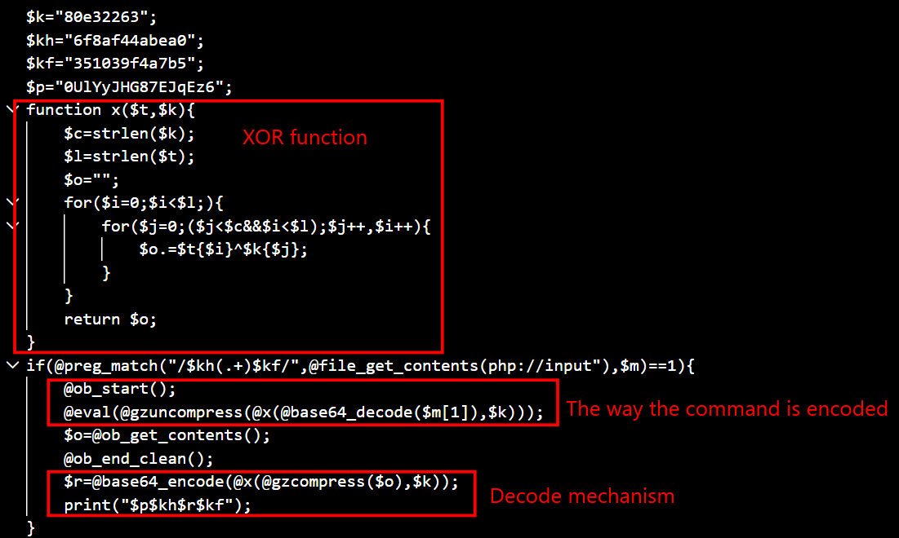
So, the content has been gz compress or zlib deflate, XOR with key k, and encode base64. Moreover, the encoded string is hidden betwwen $p$kh and $kf.

#### Decode traffic
So I use cyberchef to decode this traffic.
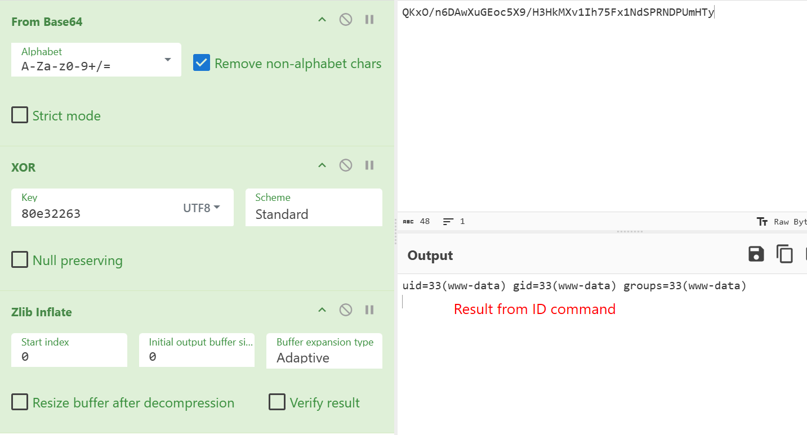
id command is executed.
I sorted for HTTP POST containing uri support.php, and there are only four sessions between victim's and attacker's computer. And the ID commmand is the first one.
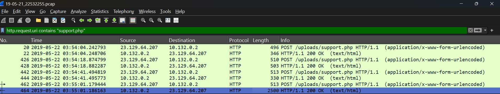
Continue to decode I have
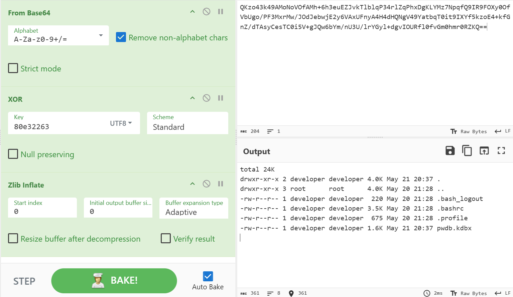
Second session, and a kdbx file is found. This is result of command ls -lah.
A KDBX file is an encrypted database file used by KeePass Password Safe, required a master password to open by Keepass, but can be found through **keepass2john** tool.
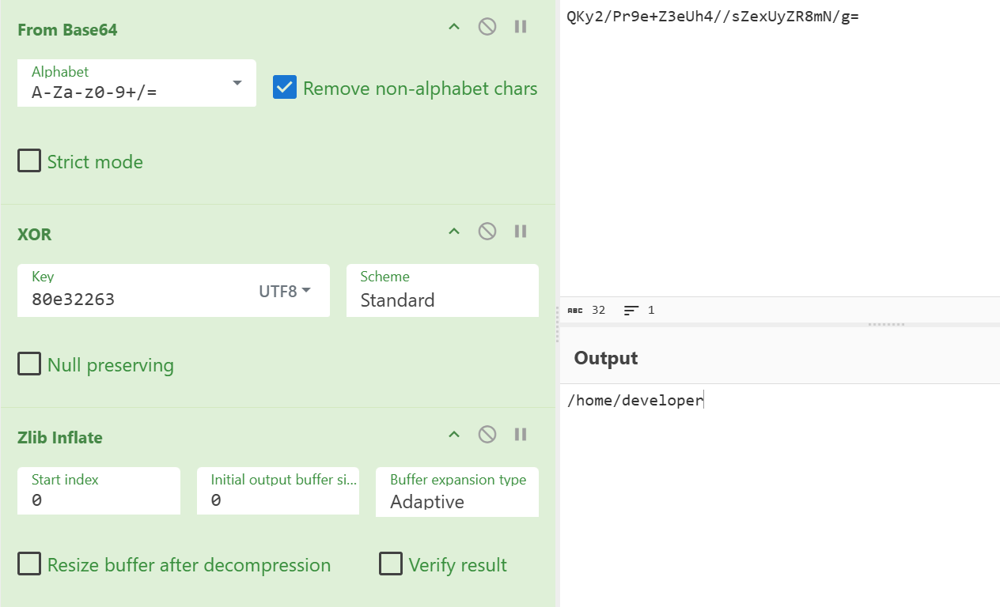
Third session, move to /developer developer directory.
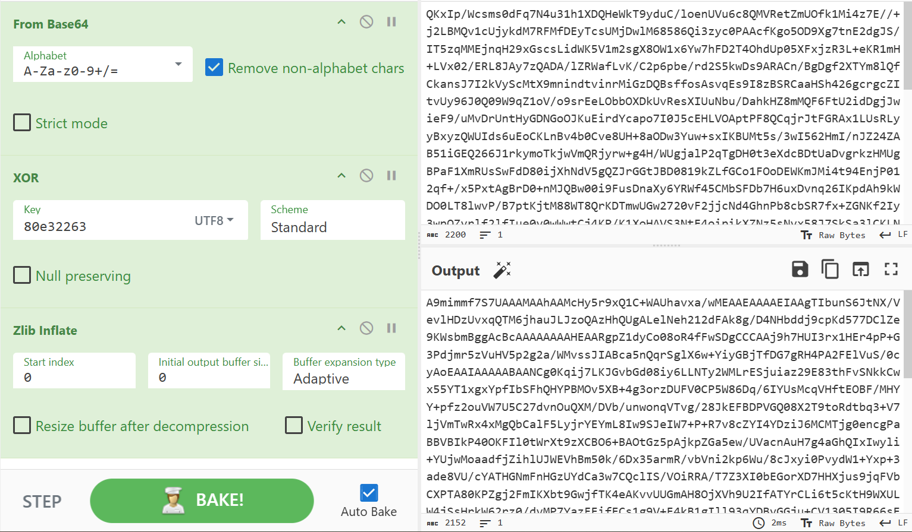
The last session, looking confused, I export it for better investigation.
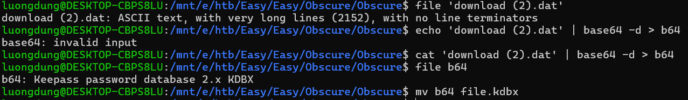
So the KDBX file's content has been encoded Base64 one more time. 

#### Open Keepass
I am going to use keepass2john tool to find the Master password from rockyou.txt list, a list containing all famous password with size of 130MB. Extract hash first
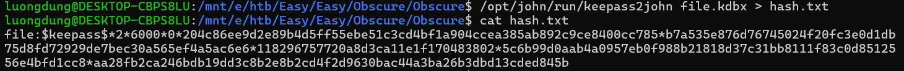
Find password from rockyou.txt
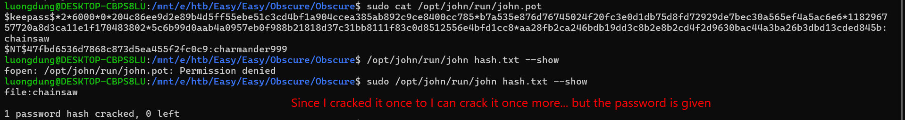
chainsaw is what we have to find.
Open with KeePass reveals the flag of this challenge.
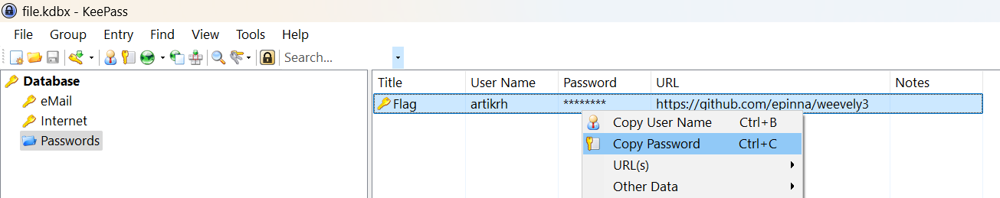
**FLAG: HTB{pr0tect_y0_shellZ}**

---

