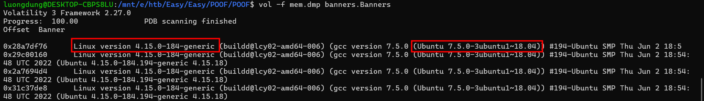
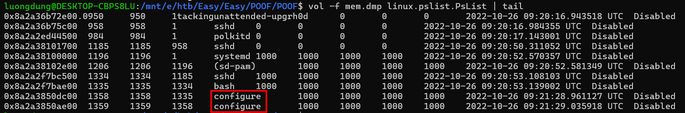
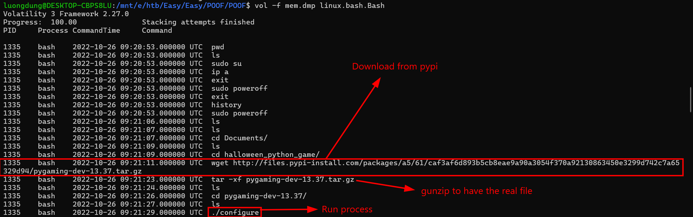
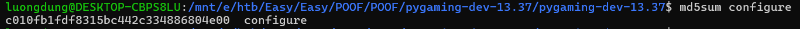
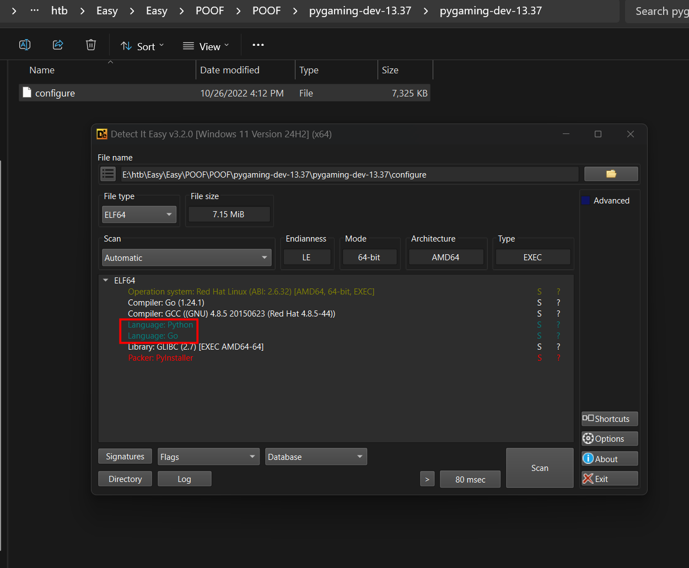
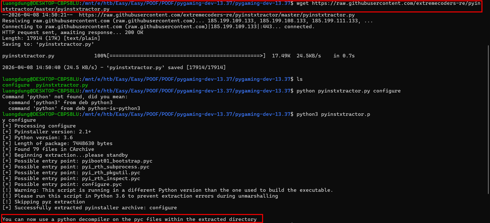
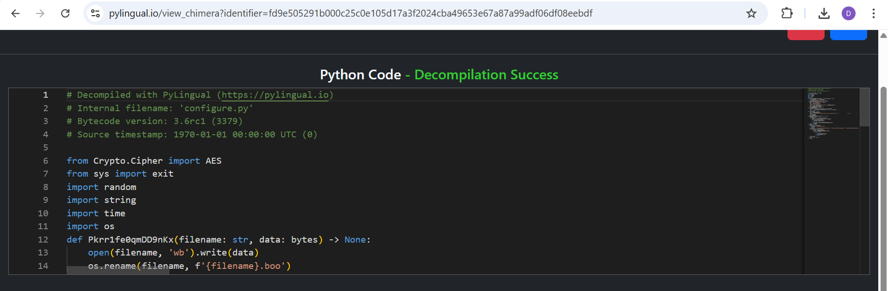
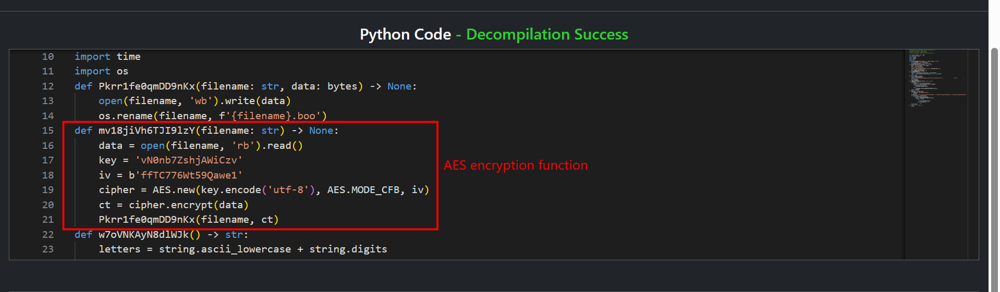
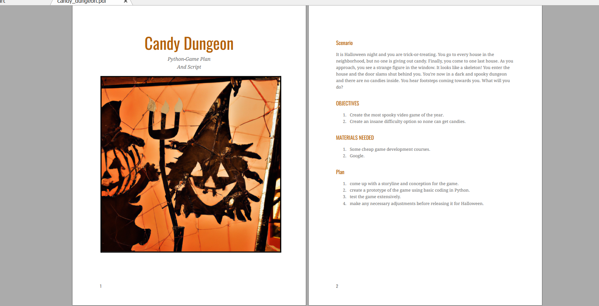
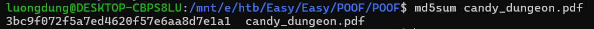

### POOF
**Challenge scenario**: In my company, we are developing a new python game for Halloween. I'm the leader of this project; thus, I want it to be unique. So I researched the most cutting-edge python libraries for game development until I stumbled upon a private game-dev discord server. One member suggested I try a new python library that provides enhanced game development capabilities. I was excited about it until I tried it. Quite simply, all my files are encrypted now. Thankfully I manage to capture the memory and the network traffic of my Linux server during the incident. Can you analyze it and help me recover my files? To get the flag, connect to the docker service and answer the questions.

#### Question 1: Which is the malicious URL that the ransomware was downloaded from ?
The challenge provides a packet capture, a memory dump from a Linux machine and a zip folder.
To answer the first question I use volatility with the dump file. Since this is the Linux's memory dump, I look for its banners first.

Using pslist reveals a suspicious configure process.

Checking for bash history, I found out that the attacker has run ./configure, and that's why it appears in pslist.

**Answer:** http://files.pypi-install.com/packages/a5/61/caf3af6d893b5cb8eae9a90a3054f370a92130863450e3299d742c7a65329d94/pygaming-dev-13.37.tar.gz

#### Question 2: What is the name of the malicious process?
**Answer**: configure

#### Question 3: Provide the md5sum of the ransomware file

**Answer**: c010fb1fdf8315bc442c334886804e00

#### Question 4: Which programming language was used to develop the ransomware?
Detect It Easy helps with this.

**Answer**: python

#### Question 5: After decompiling the ransomware, what is the name of the function used for encryption?
So I must search for any tool that can decompile a Python ELF executable. 

It suggests me to use a python decompiler, and it is PyLingual.

Scroll down to look for the encryption function.

**Answer**: mv18jiVh6TJI9lzY

#### Question 6: Decrypt the given file, and provide its md5sum.
The encryption mechanism is clear, using AES-CFB mode with provided Key and IV. But somehow I cannot decrypt it using cyberchef. GPT said that is beacause of the difference in CFB segment size. So I must use a python script instead.

This is the original PDF file that was being encrypted.

**Answer:** 3bc9f072f5a7ed4620f57e6aa8d7e1a1

**FLAG: HTB{Th1s_h4ll0w33n_w4s_r34lly_sp00ky}**

---

