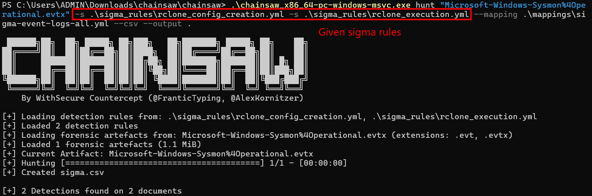
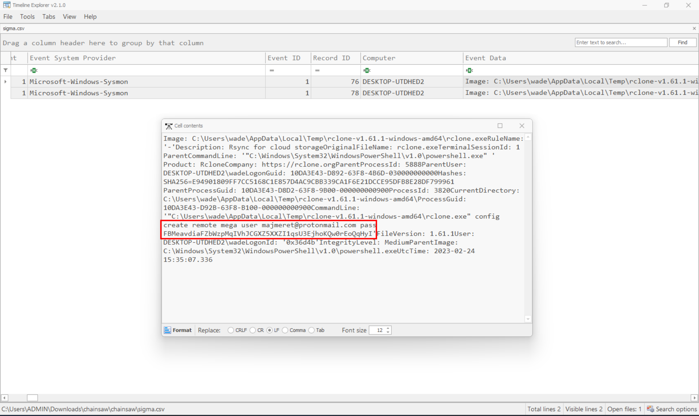
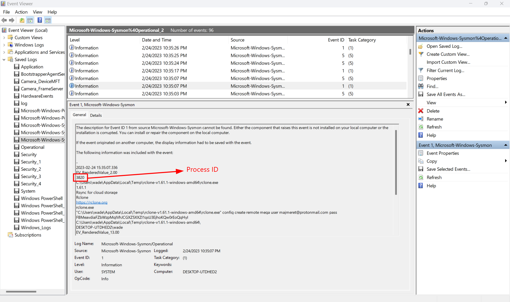
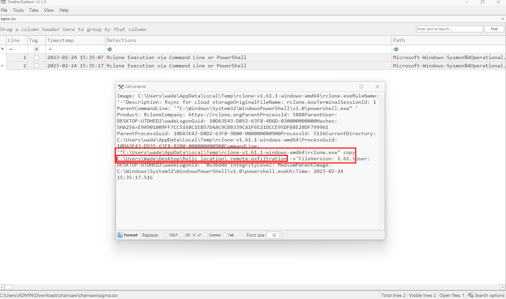

### Packet Cyclone
**Challenge scenario**: Pandora's friend and partner, Wade, is the one that leads the investigation into the relic's location. Recently, he noticed some weird traffic coming from his host. That led him to believe that his host was compromised. After a quick investigation, his fear was confirmed. Pandora tries now to see if the attacker caused the suspicious traffic during the exfiltration phase. Pandora believes that the malicious actor used rclone to exfiltrate Wade's research to the cloud. Using the tool called "chainsaw" and the sigma rules provided, can you detect the usage of rclone from the event logs produced by Sysmon? To get the flag, you need to start and connect to the docker service and answer all the questions correctly.

#### Question 1: What is the email of the attacker used for the exfiltration process?
The scenario clearly hint me using chainsaw with given sigma rules.
After parsing the Sysmon's event logs using chainsaw, nearly all the questions are plainly.

Only two events satisfied these rules.

**Answer**: majmeret@protonmail.com

#### Question 2: What is the password of the attacker used for the exfiltration process?
**Answer**: FBMeavdiaFZbWzpMqIVhJCGXZ5XXZI1qsU3EjhoKQw0rEoQqHyI

#### Question 3: What is the Cloud storage provider used by the attacker?
**Answer**: mega

#### Question 4: What is the ID of the process used by the attackers to configure their tool?
I did not find the Process ID in this timeline explorer, so I just normally use Event Viewer to check for its PID.

**Answer**: 3820

#### Question 5: What is the name of the folder the attacker exfiltrated; provide the full path.
Check the remaining event in Timeline Explorer for answer

**Answer**: C:\Users\Wade\Desktop\Relic_location\

#### Question 6: What is the name of the folder the attacker exfiltrated the files to?
**Answer**: exfiltration

**FLAG: HTB{Rcl0n3_1s_n0t_s0_inn0c3nt_4ft3r_4ll}**

---

