### Perseverance
**Challenge scenario**: During a recent security assessment of a well-known consulting company, the competent team found some employees' credentials in publicly available breach databases. Thus, they called us to trace down the actions performed by these users. During the investigation, it turned out that one of them had been compromised. Although their security engineers took the necessary steps to remediate and secure the user and the internal infrastructure, the user was getting compromised repeatedly. Narrowing down our investigation to find possible persistence mechanisms, we are confident that the malicious actors use WMI to establish persistence. You are given the WMI repository of the user's workstation. Can you analyze and expose their technique?

#### Overview
At first I do not know what WMI means, and did some google.
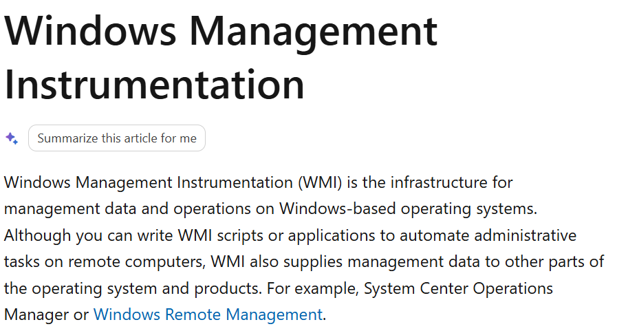
Windows Management Instrumentation (WMI) is the infrastructure for management data and operations on Windows-based operating systems. Although you can write WMI scripts or applications to automate administrative tasks on remote computers, WMI also supplies management data to other parts of the operating system and products.
So beside its possitive aspect allowing automate administrative tasks on remote computers, it is also a perfect tool for RCE, and in this challenge is persistence.
Including three main component, first one is event filter, which is the condition, for example when the system boot up. Second one is event consumer, the action. Final one is FilterToConsumerBinding meaning if filter then cosumer.

#### Parse tools
All five files given are unreadable, so I search for any file which can parse through this and found a github repository.
https://netsecninja.github.io/dfir-notes/wmi-forensics/
Cloning into my computer and start using it. But some modules in its code cannot be defined, such as funcy. I tried to download those module, but it does not work.
So firstly I create a virtual enviroment venv.
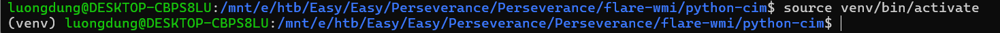
Install some required modules and it is usable.
The challenge is so new to me so I did have AI a bit. It suggests using show_filtertoconsumerbindings.py to find all filter, consumer and binding.
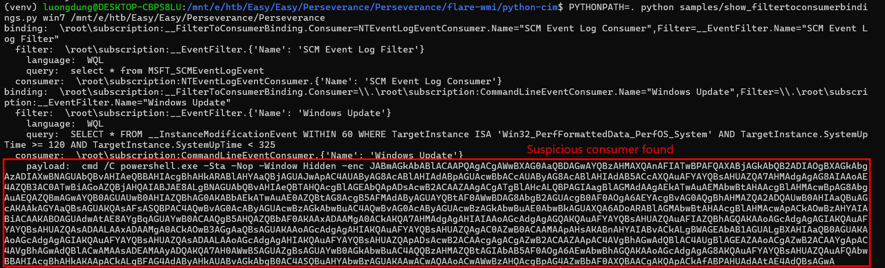
Decode it I have
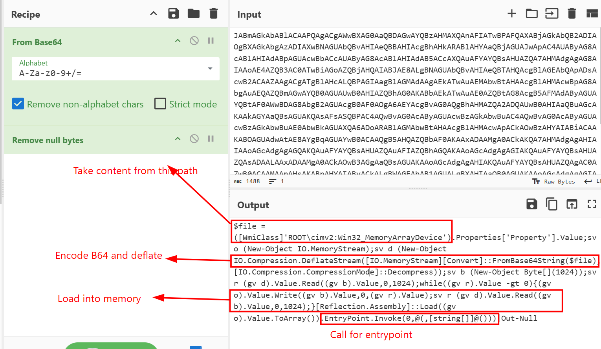
It takes content from a specific path, decode it and load directly into memory, perhaps a .NET assembly file and calls for entrypoint, perhaps the main function.
So now I need to find what is in that Win32_MemoryArrayDevice
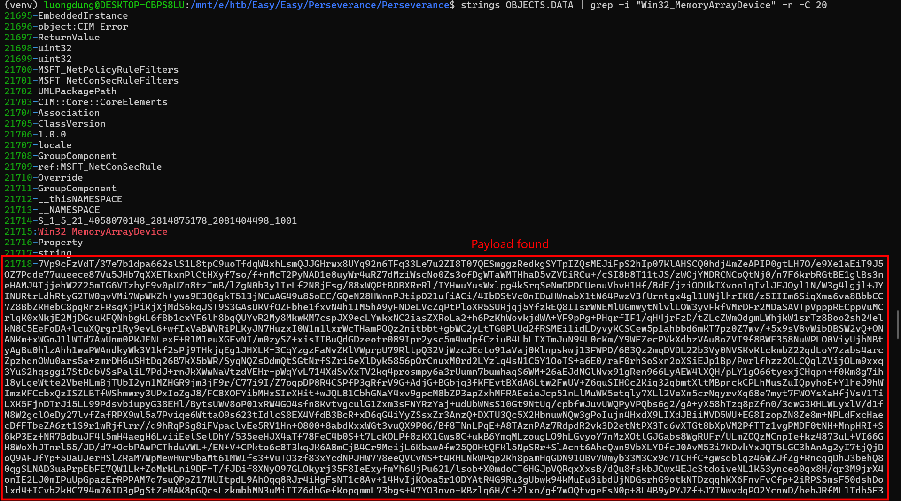
Decode the payload and I have a .NET executable.
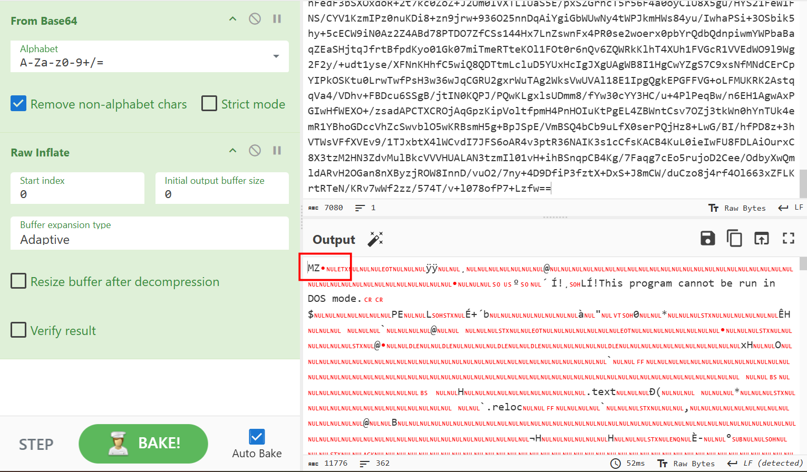
From Detect It Easy, this file is compiled in C# so I use dotPeek for furthur analysis.

#### .NET executable
This is Covenant Grunt stager written in C#. Since the entry point called is Main function, let's start from here.
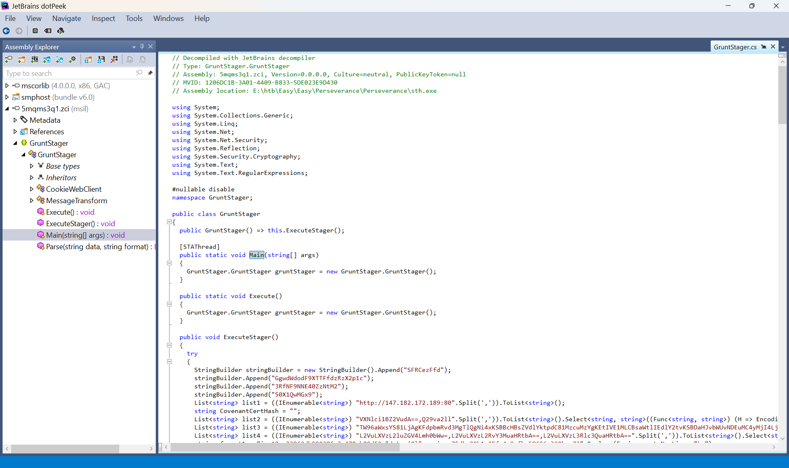
Main function just create a new Object GruntStager and call directly to Execute Stager.
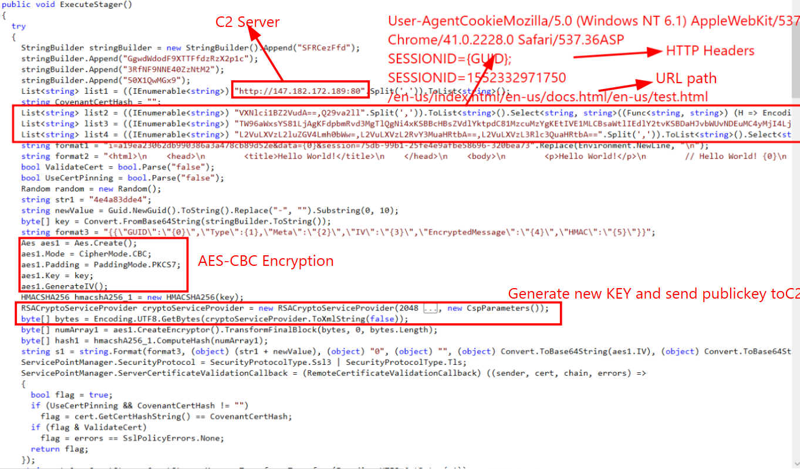
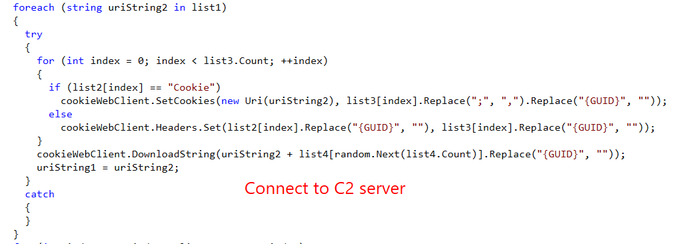
So complex... this should be in Medium not Easy.
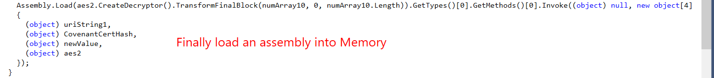

It does tons of processed and finally load a .NET payload into memory.

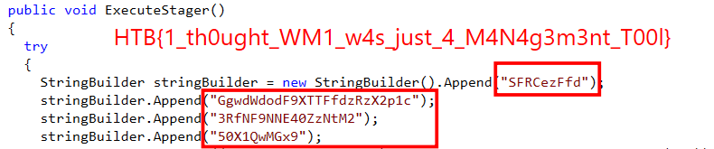

The flag can be found after decode Base64 the StringBuilder variable at the beginning of function ExecuteStager, which is used to be AES key.
**FLAG: HTB{1_th0ught_WM1_w4s_just_4_M4N4g3m3nt_T00l}**

---

