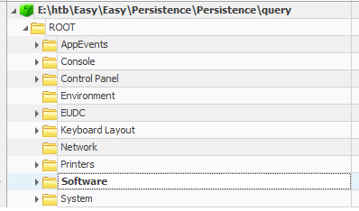
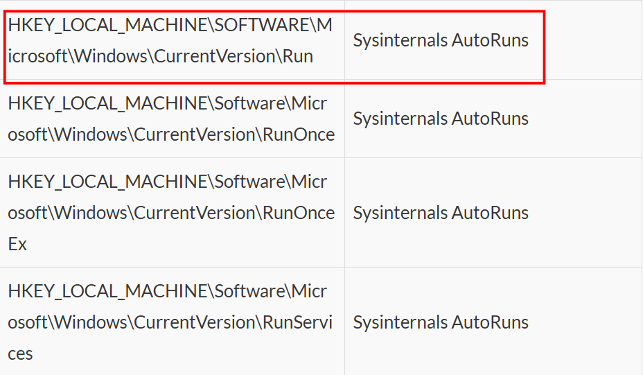
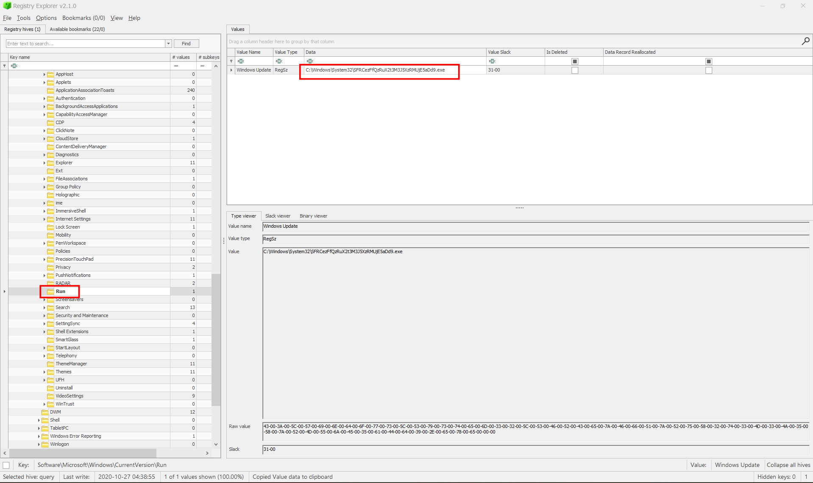

### Persistence
**Challenge scenario**: We're noticing some strange connections from a critical PC that can't be replaced. We've run an AV scan to delete the malicious files and rebooted the box, but the connections get re-established. We've taken a backup of some critical system files, can you help us figure out what's going on?

#### Overview
So I have to scan for the malicious file which pass AntiVirus scan and remain persistence in this machine. 
The challenge provide a MS Windows registry file. From **first second third** I have known a tool name RegistryExplorer to examine these files.

There must be millions of files and folder inside. So I google to find where can the Persistence path be.

#### Suspicious file detected

Thanks to this website and I have what I need.

It all located to one directory which is Software\Microsoft\Windows\CurrentVersion.
So I move to this directory and found the flag, which has been encoded Base64 and is shown as the name of a .exe file.

Decode it reveals the flag.
**FLAG: HTB{1_C4n_kw3ry_4LR19h7}**

---

