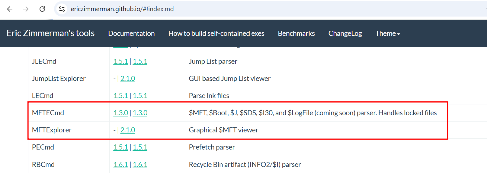
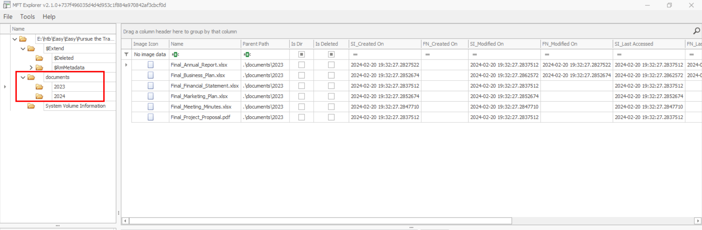
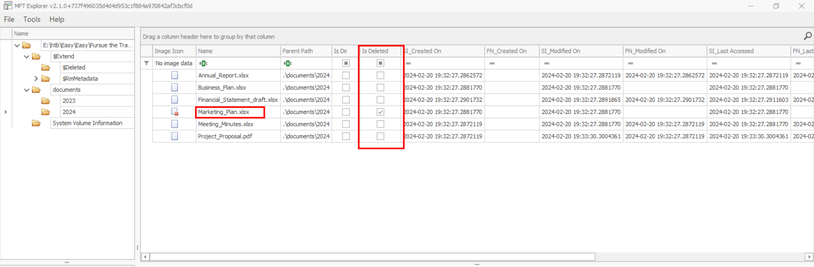
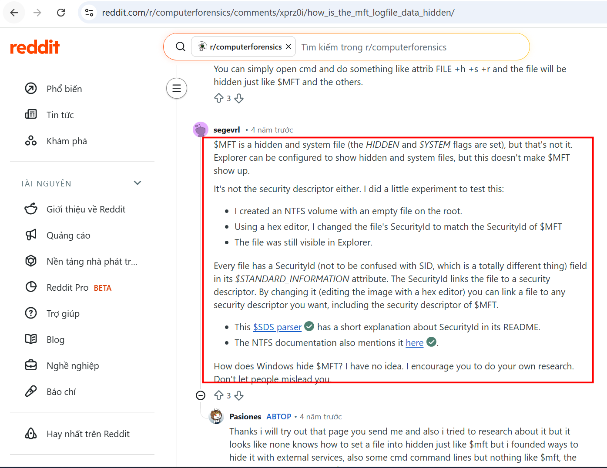
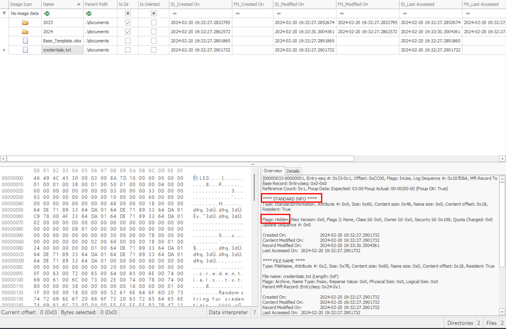
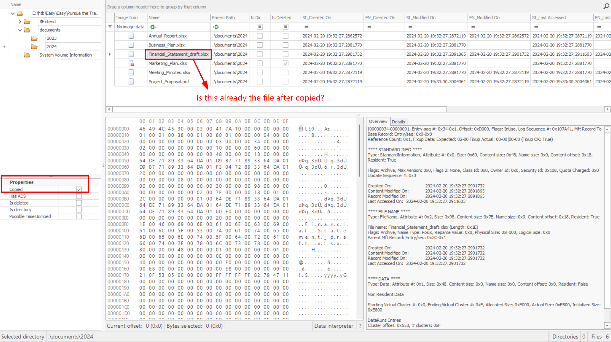
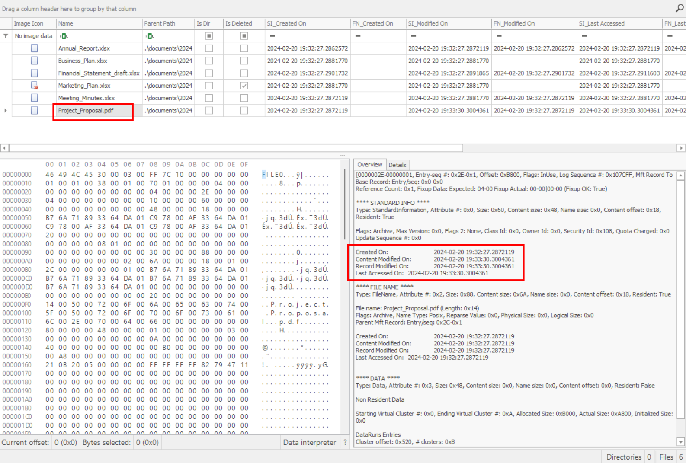
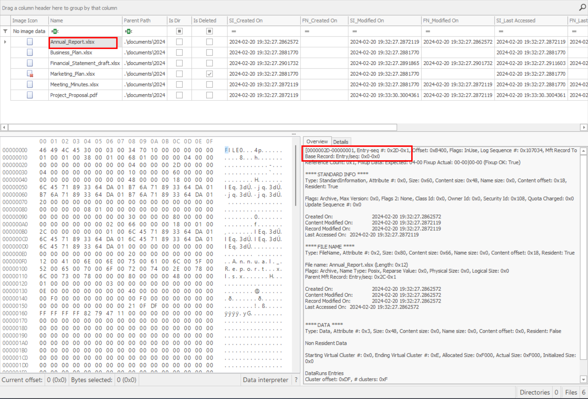
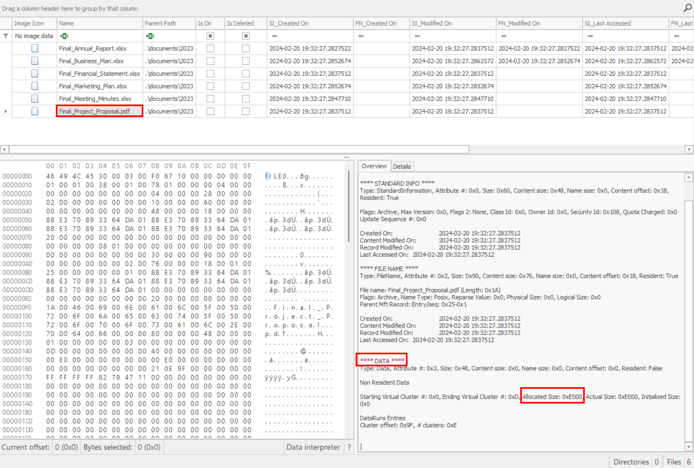

### Pursue the tracks
**Challenge scenario**: Luxx, leader of The Phreaks, immerses himself in the depths of his computer, tirelessly pursuing the secrets of a file he obtained accessing an opposing faction member's workstation. With unwavering determination, he scours through data, putting together fragments of information trying to take some advantage on other factions. To get the flag, you need to answer the questions from the docker instance.

#### First question: Files are related to two years, which are those ?
The challenge relating analyze a MFT (Master File Table), I found 2 tools by Eric Zimmerman, one is a GUI and one is execute on cmd.

For the first question, I used the GUI first.

**Answer: 2023 2024**

#### Second question: There are some documents, which is the name of the first file written ?
Base on the image, I can see the file with the earliest time creation.
**Answer: Final_Annual_Report.xlsx**

#### Third question: Which file was deleted?
The deleted file is in 2024 folder.

**Answer: Marketing_Plan.xlsx**

#### Fourth question: How many of them have been set in hidden mode?
Somebody on reddit helped me in this question

Check in Standard information and check for Hidden or System Flag.
Checking in all files and there is only one satisfy named credentials.txt

**Answer: 1**

#### Fifth question: What is the filename of the important TXT file that was created ?
It is also the file set in hidden mode
**Answer: credentials**

#### Sixth question: A file was also copied, what is the new filename ?
I noticed that on the side of the GUI there is a Copied box, so I search for any file with that box ticked.

After some exploration, I found out that it has already the new filename.
**Answer: Financial_Statement_draft.xlsx**

#### Seventh question: Which file was modified after creation ?
I search for any file having the last modification time is later than the creation time.

**Answer: Project_Proposal.pdf**

#### Eight question: What is the name of the file located at the record number 45 ?
The base record in MFTExplorer is in hexadecimal, and 45 in decimal is 0x2D in hex. So I search for the file having Base Record is 0x2D.

**Answer: Annual_Report.xlsx**

#### Ninth question: What is the size of the file located at the record number 40 ?
Again I find the file having Base Record 0x28 (since 40 in dec = 0x28 in hex), and its size is shown in allocated size in data.

It means 57344 in decimal.
**Answer: 57344**

**FLAG: HTB{MFT_p4rs1ng_1s_r34lly_us3full!}**

---

