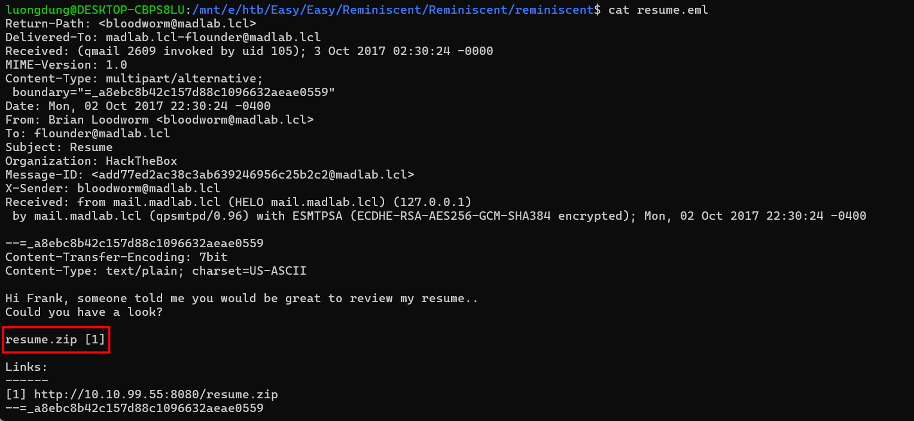
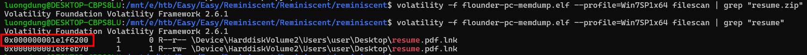
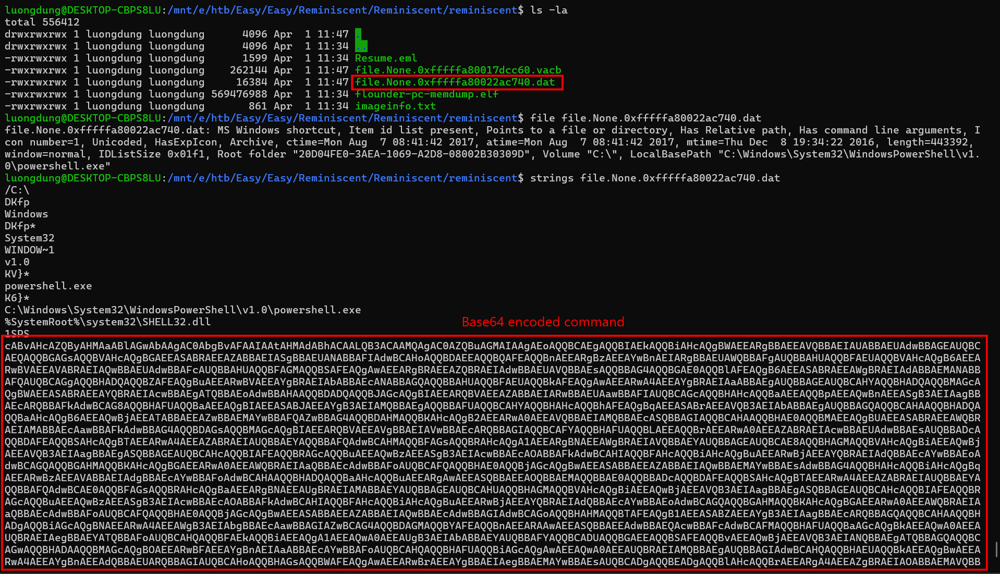
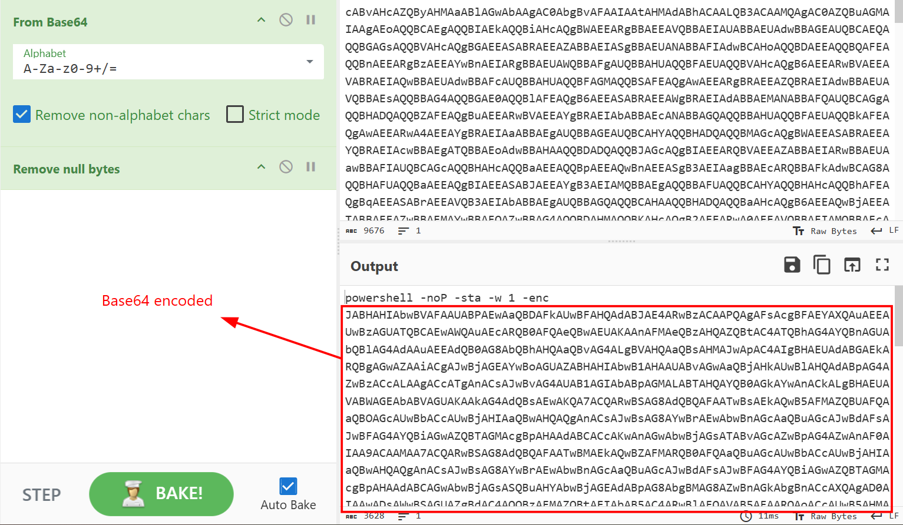
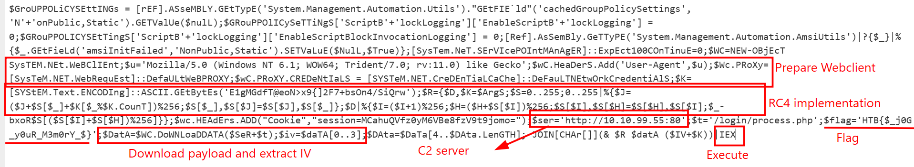

### Reminiscent
**Challenge scenario**: Suspicious traffic was detected from a recruiter&#039;s virtual PC. A memory dump of the offending VM was captured before it was removed from the network for imaging and analysis. Our recruiter mentioned he received an email from someone regarding their resume. A copy of the email was recovered and is provided for reference. Find and decode the source of the malware to find the flag.

#### Overview
The challenge provide a memory dump, an imageinfo.txt file suggesting us to use Volatility 2, and an email.
Check for the email first I found that perhaps I should check for that resume.zip file.


From imageinfo.txt, I got the Profile and do filescan.

Using given offset I dump out the file.
Using strings and a Base64 encoded Powershell command appears
.
Decode it and I have another encoded Powershell command.

Decode again and I found the flag.

It takes payload from C2 server, decrypt with extracted IV and use given key to have the final payload and execute it using IEX.

**FLAG**: 
```text
HTB{$_j0G_y0uR_M3m0rY_$}
```

---

