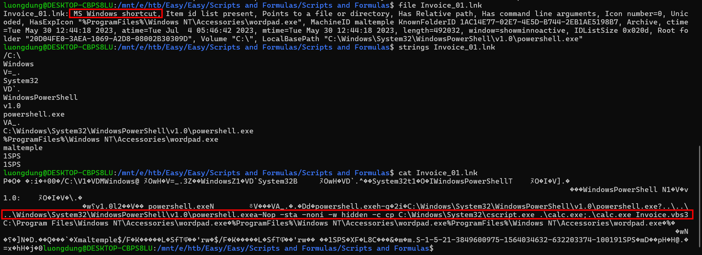
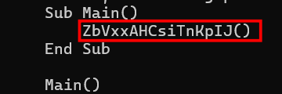
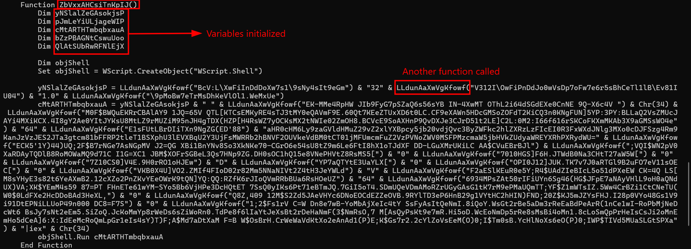
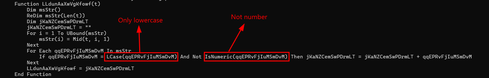
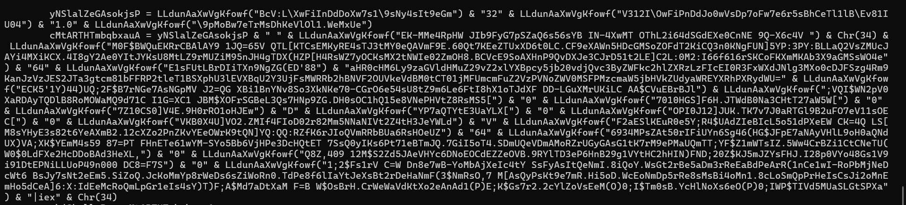
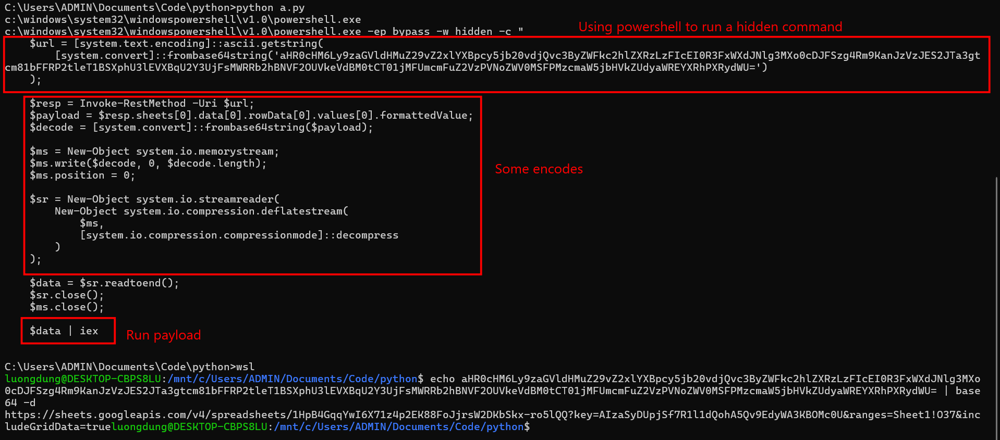
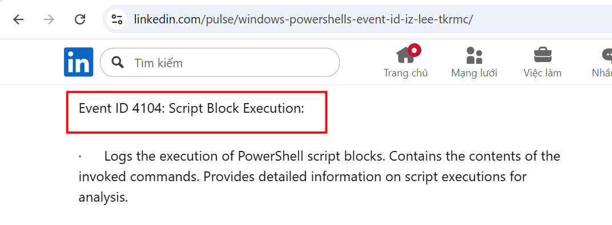
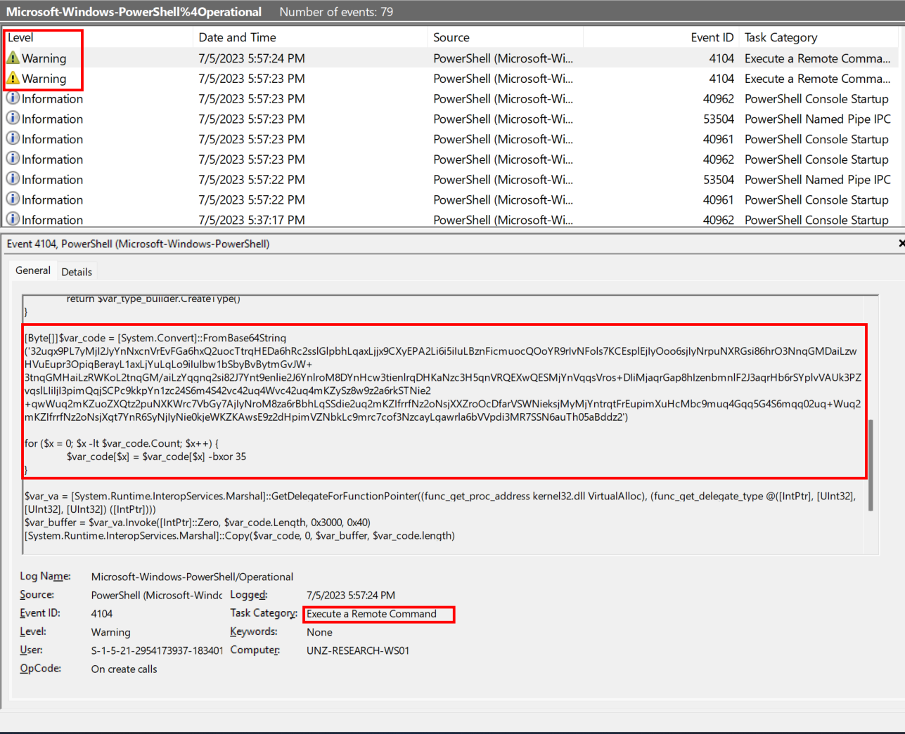

### Scripts and Formulas
**Challenge scenario**: After the last site UNZ used to rely on for the majority of Vitalium mining ran dry, the UNZ hired a local geologist to examine possible sites that were used in the past for secondary mining operations. However, after finishing the examinations, and the geologist was ready to hand in his reports, he mysteriously went missing! After months, a mysterious invoice regarding his examinations was brought up to the Department. Being new to the job, the clerk wasn't aware of the past situation and opened the Invoice. Now all of a sudden, the Arodor faction is really close to taking the lead on Vitalium mining! Given some Logs from the Clerk's Computer and the Invoice, pinpoint the intrusion methods used and how the Arodor faction gained access!

#### First question: What program is being copied, renamed, and what is the final name? 
The challenge provide two files and one Logs folder. Inspecting the MS Windows shortcut file first.

It used a powershell command to rename cscript.exe to calc.exe, execute that executable to have the .vbs file.
**Answer: cscript.exe:calc.exe**

#### Second question: What is the name of the function that is used for deobfuscating the strings, in the VBS script?
Now I must analyze that vbs script.

The main function calls for ZbVxxAHCsiTnKpIJ()

It continue to calls for LLdunAaXwVgKfowf() function.

This function loops through all character in the string and only keeps the ones with lowercase and only from a -> z.

Go back to ZbVxxAHCsiTnKpIJ() function and decode this block, I have

This malicious run a Powershell command, take data from a Google Sheets link being encoded Base64, retrieve payload from every cell, decode it and load directly into RAM, deflate the payload again and run with iex (Invoke-Expression)
So the answer for the upcoming questions is pretty clear.
**Answer: LLdunAaXwVgKfowf**

#### Third question: What program is used for executing the next stage?
**Answer**: powershell.exe

#### Fourth question: What is the Spreadsheet ID the malicious actor downloads the next stage from?
**Answer**: 1HpB4GqqYwI6X71z4p2EK88FoJjrsW2DKbSkx-ro5lQQ

#### Fifth question: What is the Sheet Name and Cell Number that houses the payload? (Eg: Sheet1:A1)
**Answer**: Sheet1:O37

#### Sixth question: What is the Event ID that relates to Powershell execution? (Eg: 5991)
Google helped me with this.

**Answer**: 4104**

#### Seventh question: In the final payload, what is the XOR Key used to decrypt the shellcode? (Eg: 1337)
The only question where the log files are essential.
I check for Operational.evtx file, and find a malicious Powershell script, including the XOR key which is the answer for this question.

It decode Base64 that blob, xor with 35 and execute in memory.
**Answer**: 35

**FLAG: HTB{GSH33ts_4nd_str4ng3_f0rmula3_1s_4_g00d_w4y_f0r_byp4ss1ng_f1r3w4lls!!}**

---

