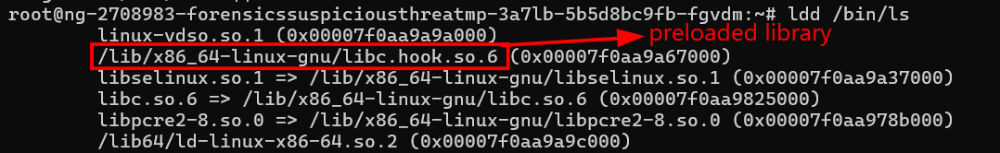
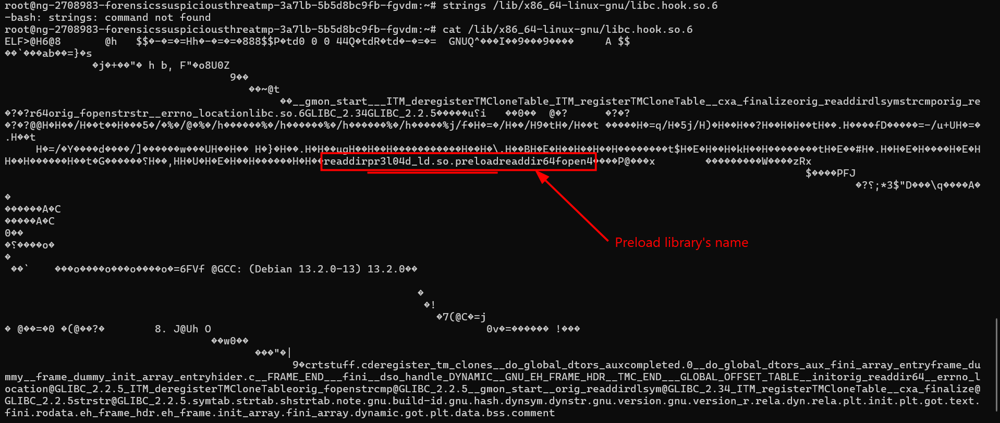
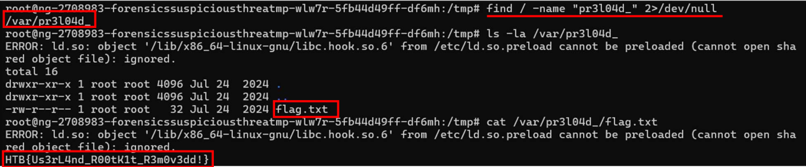

### Suspicious Threat
**Challenge scenario**: Our SSH server is showing strange library linking errors, and critical folders seem to be missing despite their confirmed existence. Investigate the anomalies in the library loading process and filesystem. Look for hidden manipulations that could indicate a userland rootkit.

#### Overview
So a container challenge with SSH connection. And my target is to find information about that strange linking library.
Connect to the container and start looking for upnormal library. Firstly I use ldd to list all shared library that /bin/ls depends on when execute and the suspicious library appears.

#### Preloaded library
Library libc.hook.so.6 which refer to rootkit userland that we need to find.
Since strings is not usable in this container, I use cat instead and try to search for any valuable things in this file.

pr3l04d_ which refers to the library designed to disassemble files. Since this is a directory so I used find to look for any directories with the same name.

Yes and it returned a directory /var/pr3l04d_, listing all file existence in here reveals the flag of this challenge in file flag.txt.
**FLAG: HTB{Us3rL4nd_R00tK1t_R3m0v3dd!}**

---

