### Tangle Heist
**Challenge scenario**: The survivors' group has meticulously planned the mission 'Tangled Heist' for months. In the desolate wasteland, what appears to be an abandoned facility is, in reality, the headquarters of a rebel faction. This faction guards valuable data that could be useful in reaching the vault. Kaila, acting as an undercover agent, successfully infiltrates the facility using a rebel faction member's account and gains access to a critical asset containing invaluable information. This data holds the key to both understanding the rebel faction's organization and advancing the survivors' mission to reach the vault. To get the flag, spawn the docker instance and asnwer the questions!

#### First question: Which is the username of the compromised user used to conduct the attack?
An packet capture is provided. Check for its Hiararchy first.
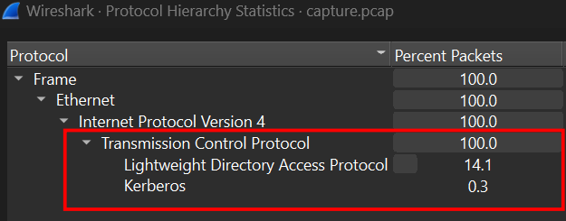
100% through TCP Protocol, including LPAD and Kerberos
LDAP (Lightweight Directory Access Protocol) is an application-layer protocol used to access and manage directory services over TCP/IP.
I noticed some packages with info containing bindRequest and bindResponse, so I search for Google and Gemini helps.
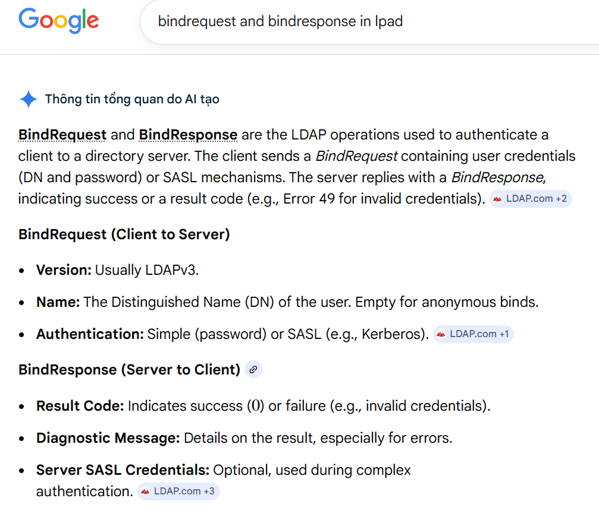
BindRequest containing user credentials (DN and password) or SASL mechanisms. The server replies with a BindResponse, indicating success.
The traffic confirms this.
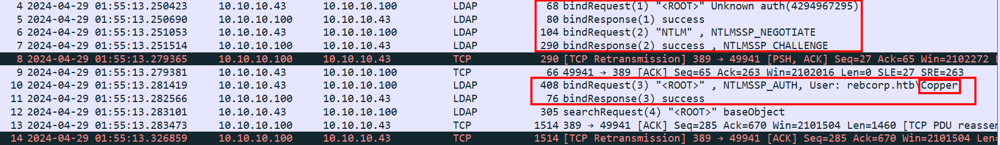
**Answer**: Copper

#### Second question: What is the Distinguished Name (DN) of the Domain Controller? 
All new knowledge so I google one more time.
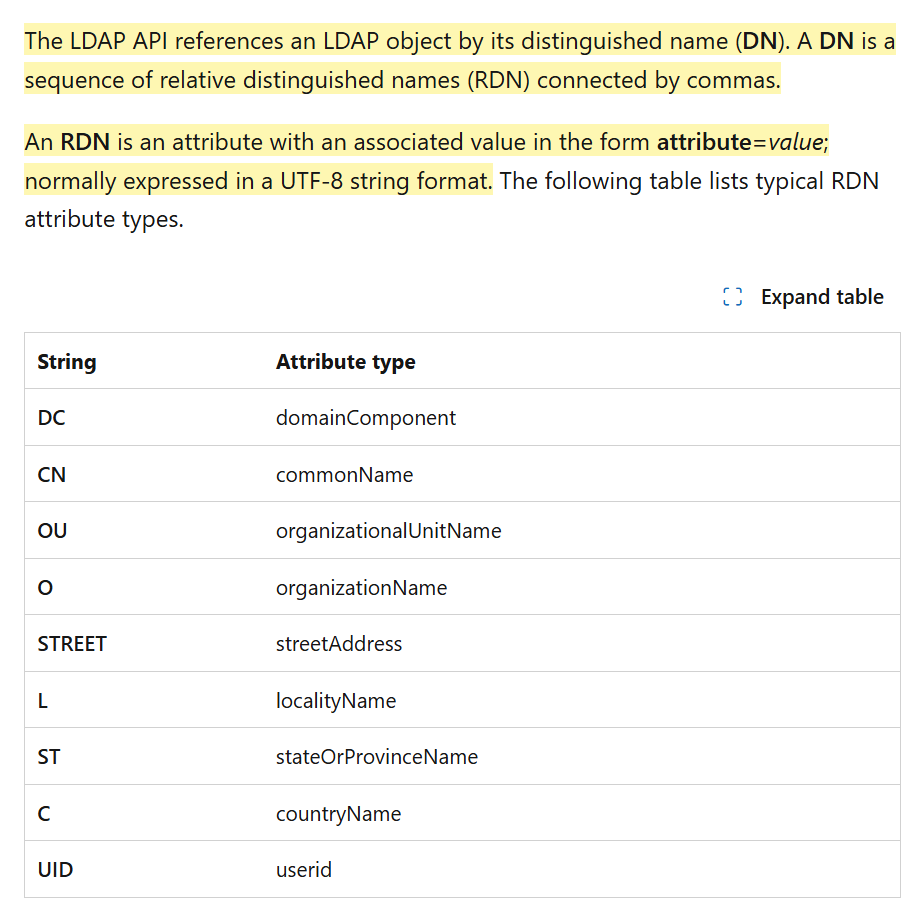
From this information, I search for the matching pattern in traffic and it is in packet No 19.
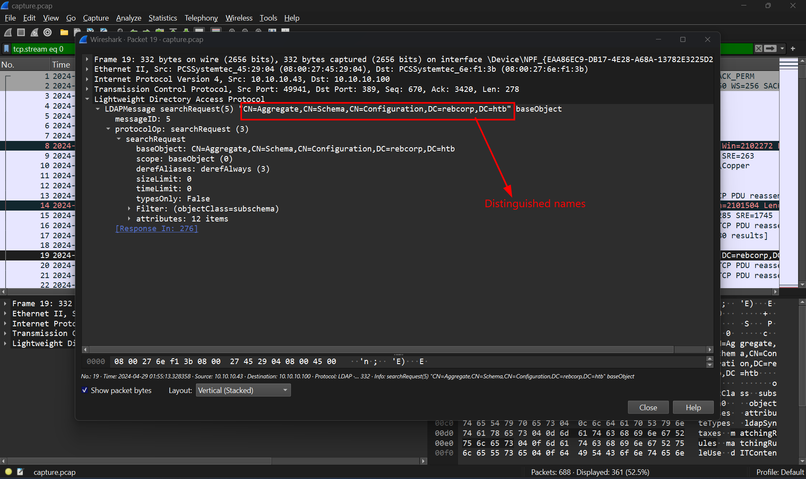
**Answer**: CN=Aggregate,CN=Schema,CN=Configuration,DC=rebcorp,DC=htb

#### Third question: Which is the Domain managed by the Domain Controller?
The answer is clear after question 2, and the Domain is just the merge of DC (domainComponent)
**Answer**: rebcorp.htb

#### Fourth question: How many failed login attempts are recorded on the user account named ‘Ranger’?
I first filter for LPAD traffic containing "ranger", and only two packages satisfy.
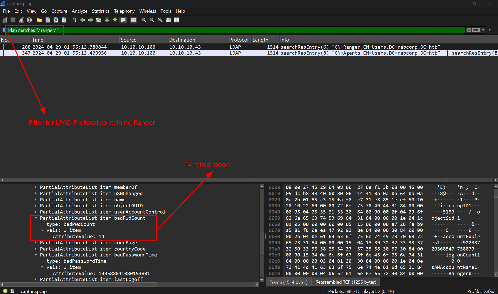
The number of failed login can be found in badPwnCount, as it name.
**Answer**: 14

#### Fifth question: Which LDAP query was executed to find all groups?
Using Google hint this
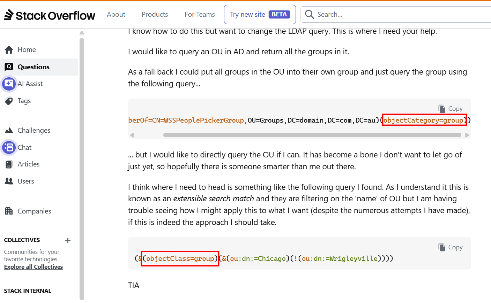
So I filter for any packages having "groups" inside their info and found this packet stands odd one out.
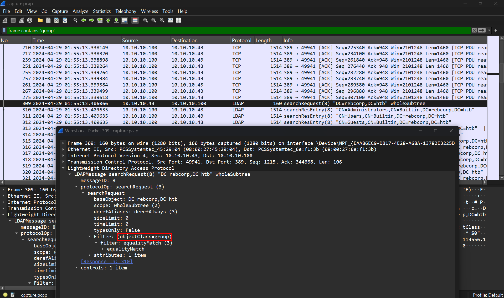
**Answer**: objectClass=group

#### Sixth question: How many non-standard groups exist?
I cannot find any documents matches with this, but ChatGPT do.
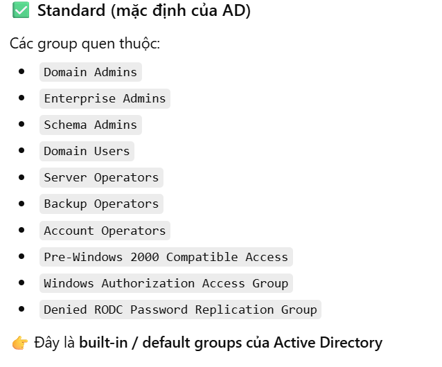
Which means that those having CN not in this can be concluded as non-standard.
I use filter lpad contains "group"
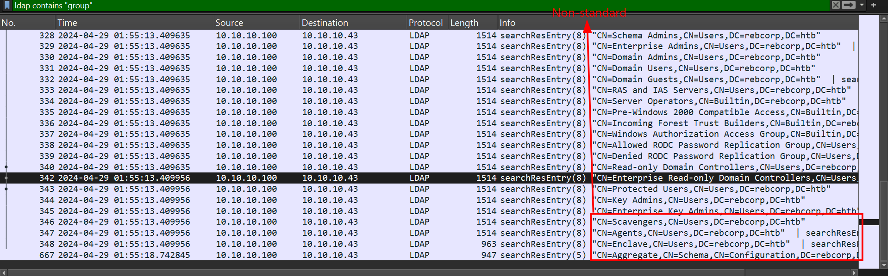
I thought it was 4, but Agents and Watchers are on the same response...
**Answer**: 5

#### Seventh question: One of the non-standard users is flagged as ‘disabled’, which is it?
The non-standard users is flagged as disabled when userAccountControl is set as 514. So I filter for any LPAD packages containing 514, and luckily there are only 6. Checking all of those and only this users has userAccountControl 514.
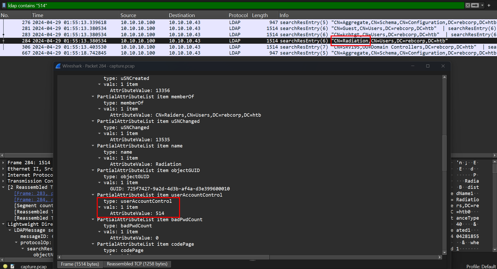
**Answer**: Radiation

#### Eighth question: The attacker targeted one user writing some data inside a specific field. What is the field name?
I noticed some modifyRequest and modifyResponse in LDAP traffic, so I filter for it.
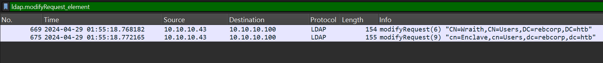
We can see field name in
Lightweight Directory Access Protocol/modifyRequest/changes/modification/modification item/modification
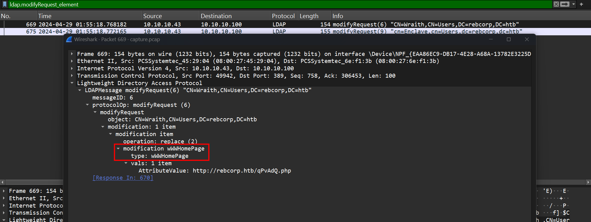
**Answer**: wWWHomePage

#### Nineth question: Which is the new value written in it?
The answer also appears in the previous picture, shown in AttributeValue.
**Answer**: http://rebcorp.htb/qPvAdQ.php

#### Tenth question: The attacker created a new user for persistence. What is the username and the assigned group?
While doing sixth question, I noticed the addRequest but does not pay much attention to what it is. Eventually it was used to create a new user.
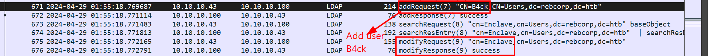
**Answer**: B4ck,Enclave

#### Eleventh question: The attacker obtained a hash for the user 'Hurricane' that has the UF_DONT_REQUIRE_PREAUTH flag set. Which is the correspondent plaintext for that hash?
The only tricky one in this challenge. UF_DONT_REQUIRE_PREAUTH flag means Kerberos pre-authentication is not required. It is an UserAccountControl (UAC) flag in Active Directory (AD).
Normally, when users sign in with Kerberos, users sent request to Domain Controller, prove their identity by encrypt timestamp by password hash which prevent brute-force attack and protect their password.
But with UF_DONT_REQUIRE_PREAUTH flag, pre-authentication is not neccessary and still get the AS-REP (Authentication Service Response). We can see that the attacker has successfully get AS-REP in these two packets.
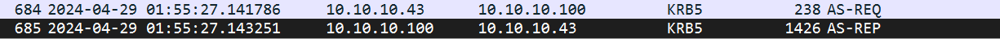
So I extract the hash using tshark command, since hash is in enc-part so I extract to .pdml file (Packet Details Markup Language). This is the XML format of packet capture.
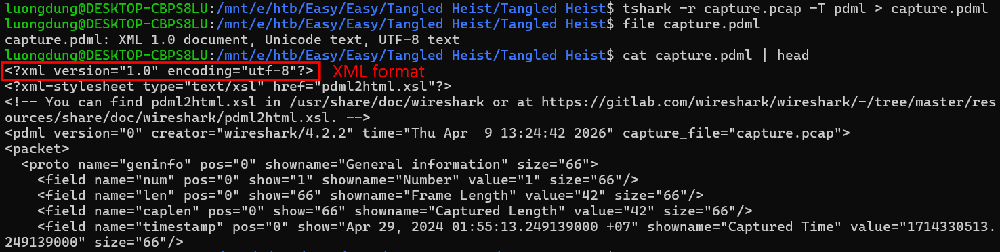
Using krb2john to get the hash file and finally crack it using wordlist rockyou.txt storing most famous passwords.
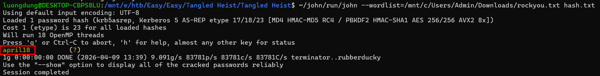

**Answer**: april18

**FLAG: HTB{1nf0rm4t10n_g4th3r3d_fr0m_ld4p_4nd_th3_w1r3!}**

---

