### TrueSecrets
**Challenge scenario**: Our cybercrime unit has been investigating a well-known APT group for several months. The group has been responsible for several high-profile attacks on corporate organizations. However, what is interesting about that case, is that they have developed a custom command & control server of their own. Fortunately, our unit was able to raid the home of the leader of the APT group and take a memory capture of his computer while it was still powered on. Analyze the capture to try to find the source code of the server.

#### Overview
A memory dump is provided. Normally when obtaining a memory dump I usually check for its fundamental information and running process. And that's my way.
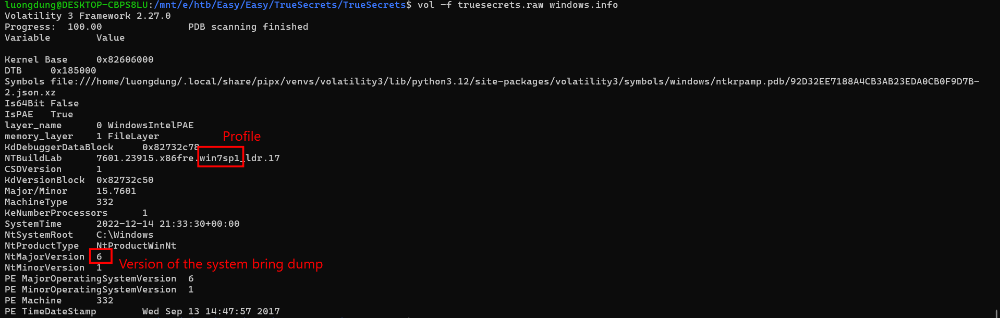
Check for pstree to see any malicious processes.
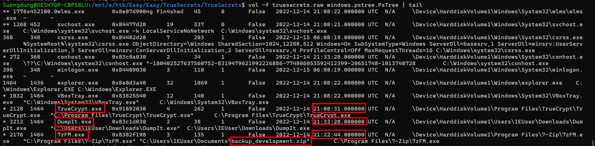
Focusing on the highlighted, there are three suspicious processes, which all comes from explorer.exe (since same Parent PID).
From the timeline I take into consideration that from TrueCrypt.exe generate that backup_development.zip file, 7zFM.exe will interact with it, such like reconstruct .Net file or something, and finally DumpIt.exe will dump out this file and execute malware on memory.

#### Extracting malicious file
So I extract backup_development.zip for further analysis. But first I need to know its physical offset first. Filescan helps this.
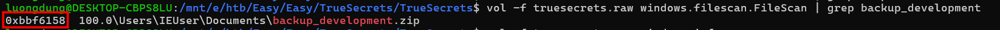
With known physical offset, I can dump the file now using --physaddr.
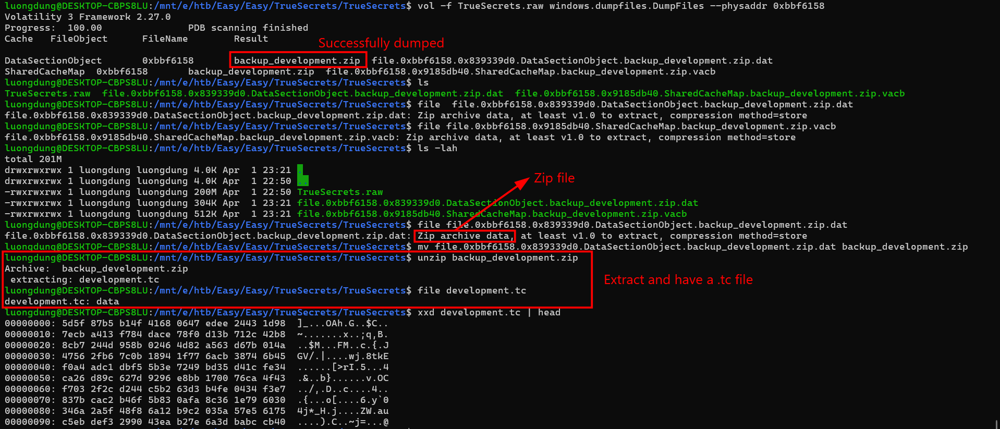
Compressed inside that zip file is a .tc file.
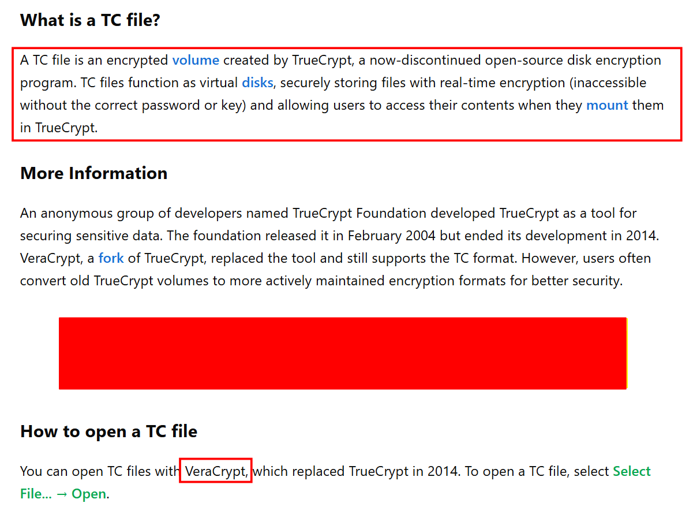
Google a bit and it is a encrypted volume created by TrueCrypt. Storing files with password. And to open this file I need VeraCrypt, and its password.
Luckily, volatility include a plugin to show out the password.
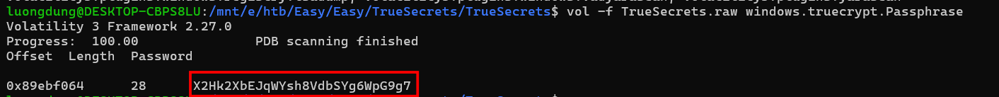
Here it is.

#### Decrypt final payload
After Mount with VeraCrypt, I have a folder containing two directories and four files.
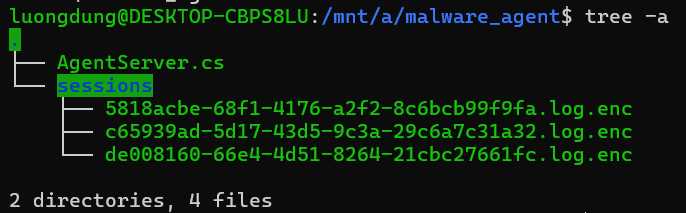
Read the C# source code to see what's this files doing.
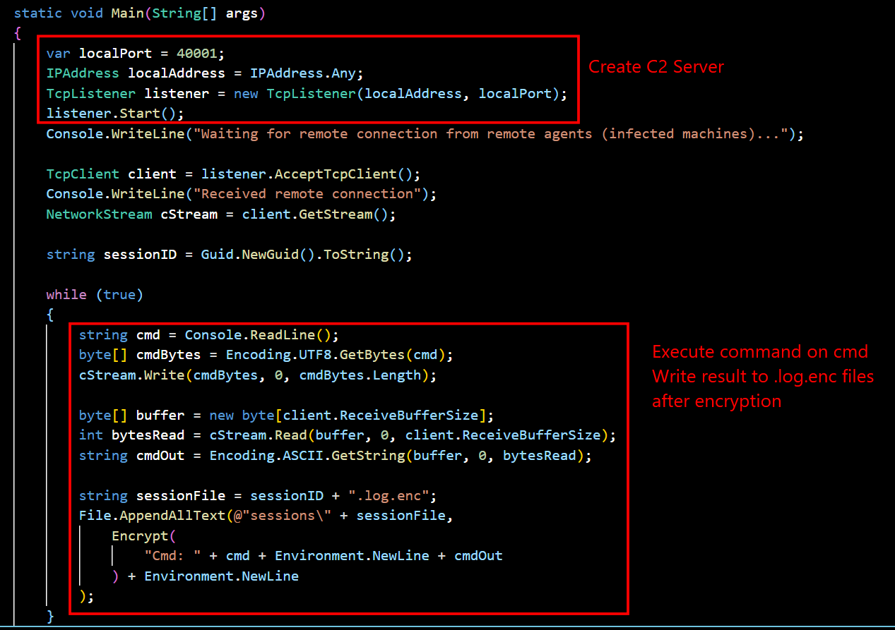
It connect to a C2 server, execute command on cmd and encrypt the result. Finally write to .log.enc files.
And the encryption technique.
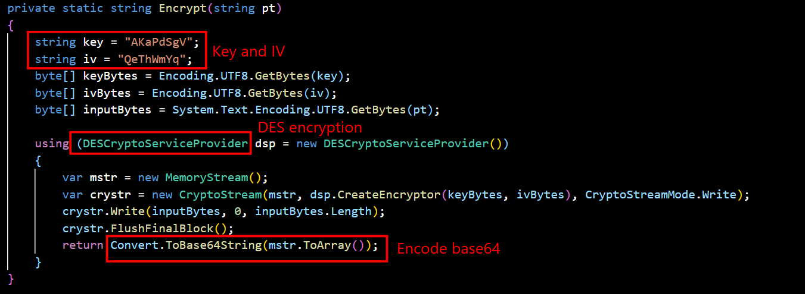
Encrypt DES with known Key and IV and encode Base64. From here I can decrypt all the payload in three .log.enc files.
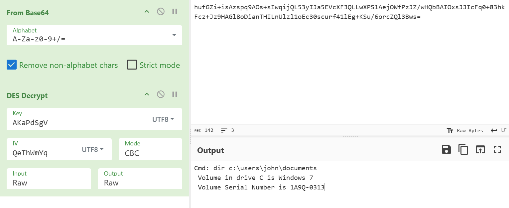
Command executed, for example this one.
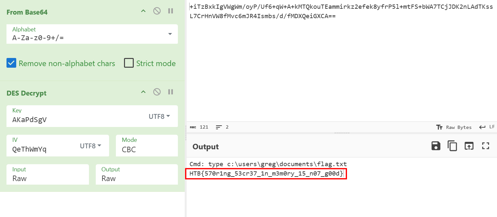
Decrypt all payloads and I found the flag of this challenge.
**FLAG: HTB{570r1ng_53cr37_1n_m3m0ry_15_n07_g00d}**

---

