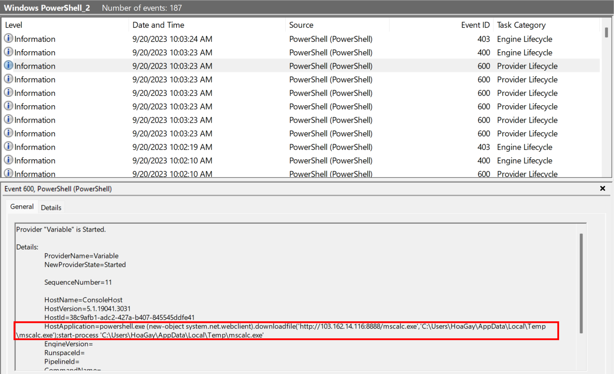
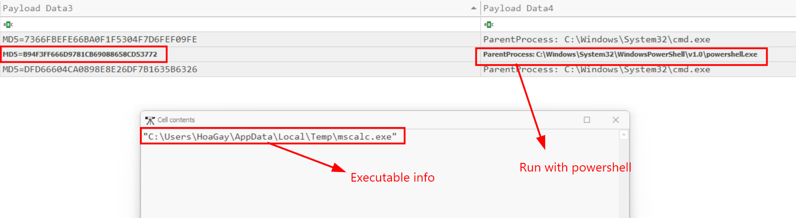
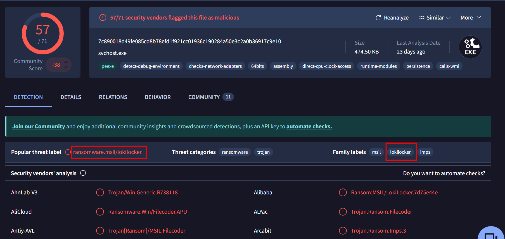
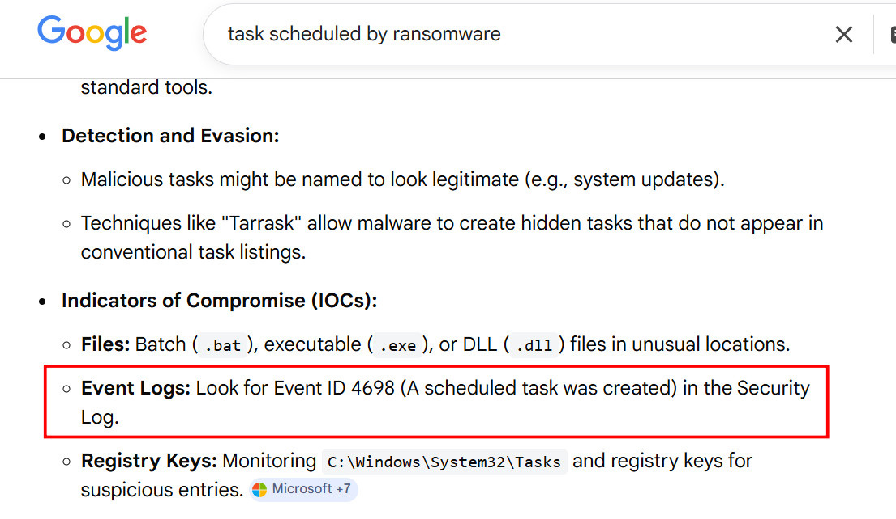
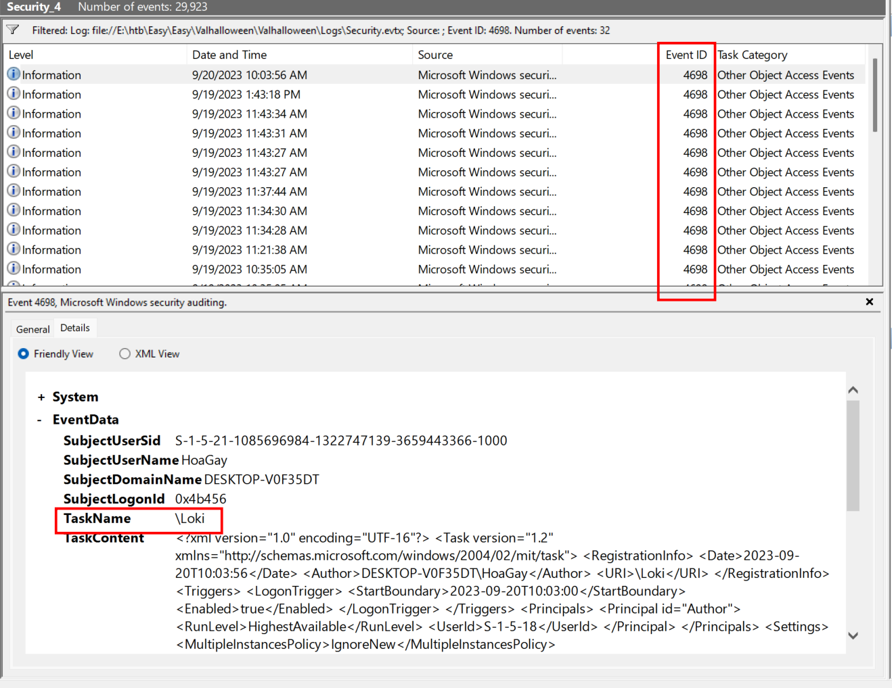
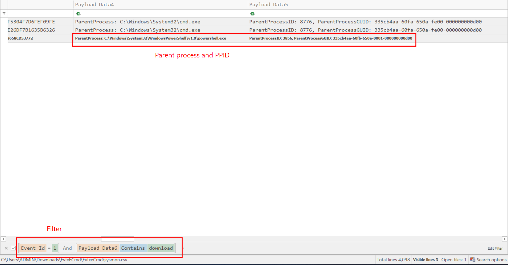
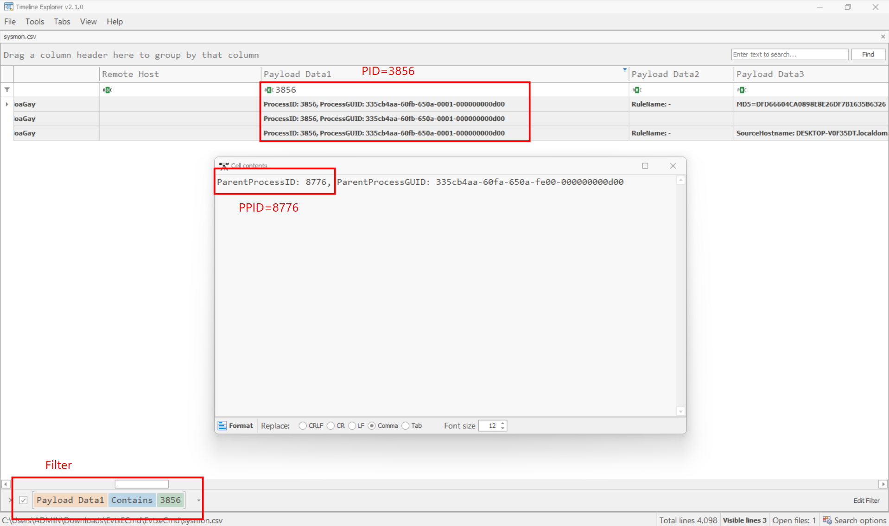
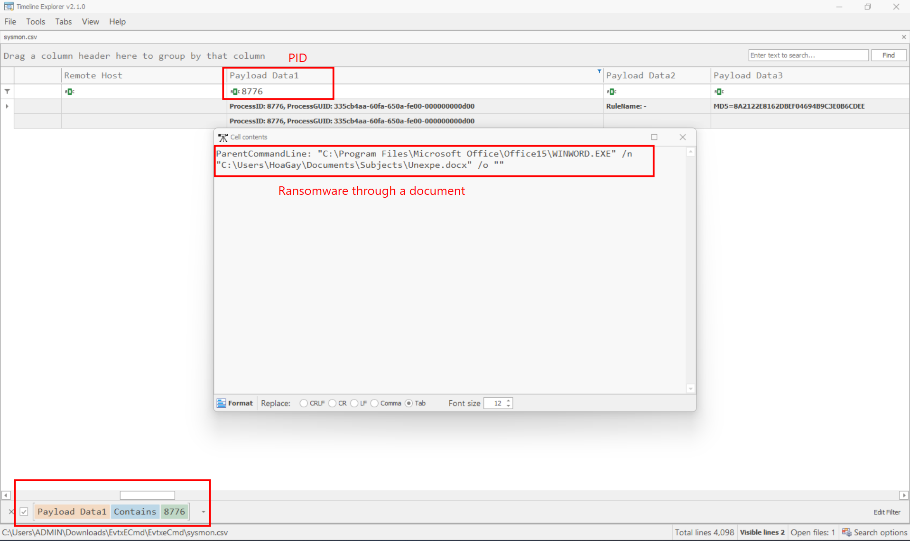
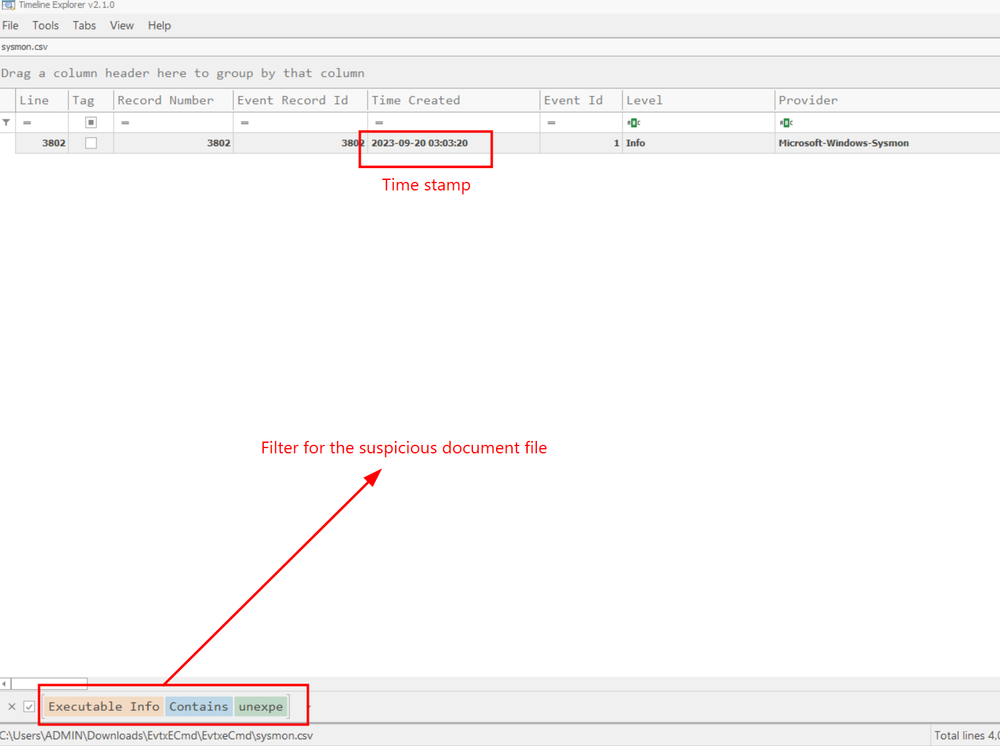

### Valhalloween
**Challenge scenario**: As I was walking the neighbor's streets for some Trick-or-Treat, a strange man approached me, saying he was dressed as "The God of Mischief!". He handed me some candy and disappeared. Among the candy bars was a USB in disguise, and when I plugged it

#### First question: What is the IP address and the port from which the malware was downloaded ?
Another logs analysis challenge, usually the attacker will use a powershell command to download something, so I check for Windows Powershell.evtx file first, and the suspicious download command execution appears.

An executable is downloaded, and run it using strart-process.
**Answer: 103.162.14.116:8888**

#### Second question: According to the sysmon log, what is the MD5 hash of the ransomware ?
To answer this question, I parse the Operational.evtx Event Logs using EvtxECmd, and filter for event ID 1, because in event ID 1 it will show all the command excuted and file hash dump.

**Answer: B94F3FF666D9781CB69088658CD53772**

#### Third question: Based on the hash found, determine the family label of the ransomware in the wild from online reports such as Virus Total, Hybrid Analysis, etc.
So I just use VirusTotal, enter the hash dump and the answer appears.

**Answer: lokilocker**

#### Fourth question: What is the name of the task scheduled by the ransomware?
I did some google first.

It suggests me to search for Event ID 4698 in Security log, I did the same and found the answer.

Other logs having normal TaskName except for this one.
**Answer: Loki**

#### Fifth question: What is the parent process's name and ID of the ransomware ?
Again, in sysmon log I filter for event ID 1 and download in command.

**Answer: powershell.exe_3856**

#### Sixth question: Following the PPID, provide the file path of the initial stage in the infection chain.
I trace back using its PPID, filter for process ID 3856 I have

But this is still not where the ransomware start, so I trace back one more time using PID 8776. 

**Answer: C:\Users\HoaGay\Documents\Subjects\Unexpe.docx**

#### Seventh question: When was the first file in the infection chain opened (in UTC)?
Filter for that suspicious document I have the timestamp.

**Answer: 2023-09-20 03:03:20**

**FLAG: HTB{l0k1_R4ns0mw4r3_w4s_n0t_sc4ry_en0ugh}**

---

