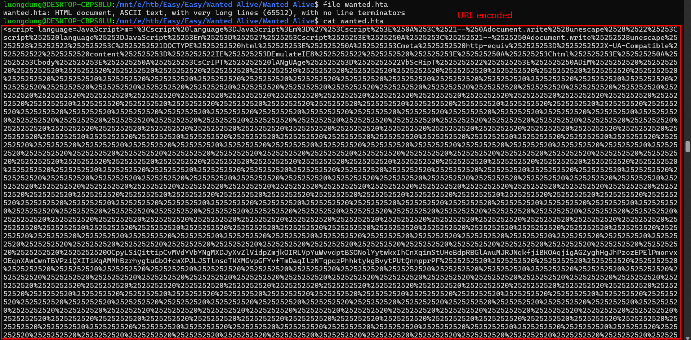
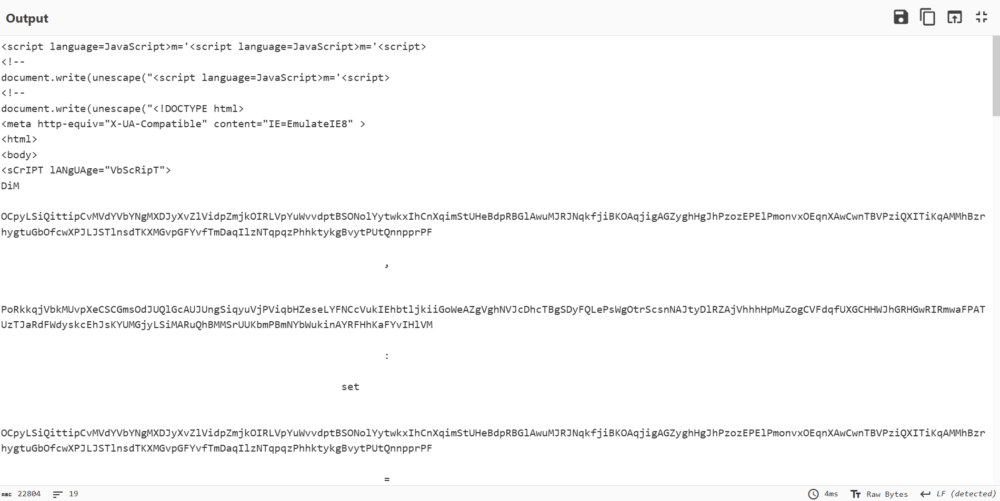
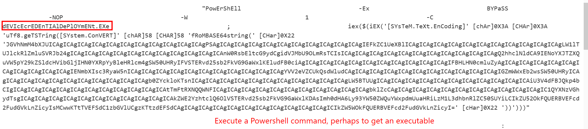
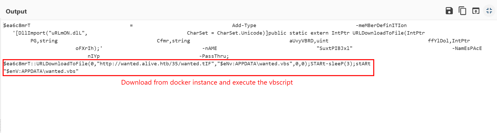
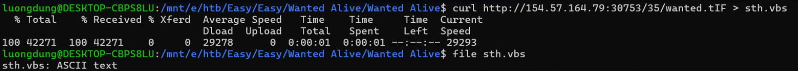

### Wanted alive
**Challenge scenario**: From Spreadsheet

#### First stage
Well we have nothing from the scenario, the challenge provide a .hta file, stands for HTML Application.

The Javascript script has been URL encoded multiple times. 

Decode it I have a VBS script, notably there is a Powershell command being encoded Base64.

Decode Base64 it I have

A VBscript has been installed through instance IP.

#### Second stage
An very long VBScript

