# Data siege
**Challenge scenario**: It was a tranquil night in the Phreaks headquarters, when the entire district erupted in chaos. Unknown assailants, rumored to be a rogue foreign faction, have infiltrated the city's messaging system and critical infrastructure. Garbled transmissions crackle through the airwaves, spewing misinformation and disrupting communication channels. We need to understand which data has been obtained from this attack to reclaim control of the communication backbone. Note: Flag is split into three parts.

## Overview
The challenge provide solely a packet capture. As usual, I look for its Hiararchy.
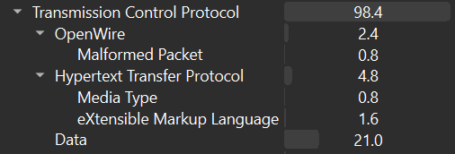
Mostly packets are transfered through TCP trafic, including some through HTTP. I followed TCP stream for more details.
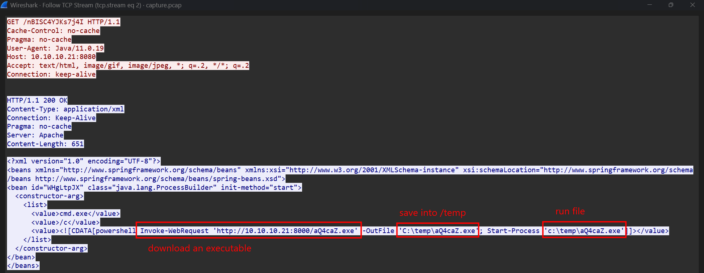
In this stream, the server has returned a suspicious xml script, where it downloaded an executable using Invoke-WebRequest, saved it into /temp directory and executed it. Meaning victim's machine has been compromised by this PE file.
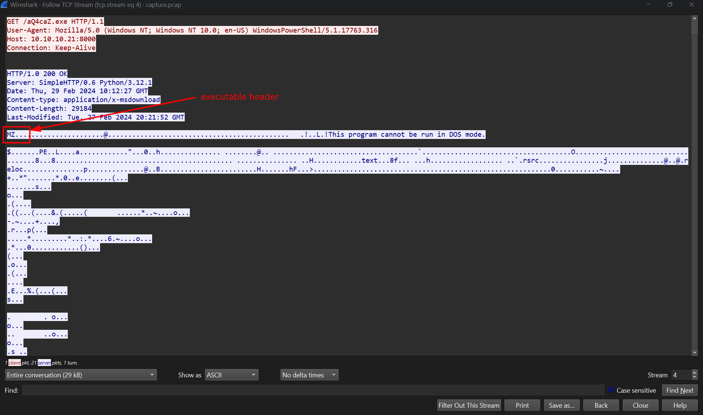
In stream 4, we can see the header of a Portable Executable file, MZ. So I extract this file for furthur investigation.
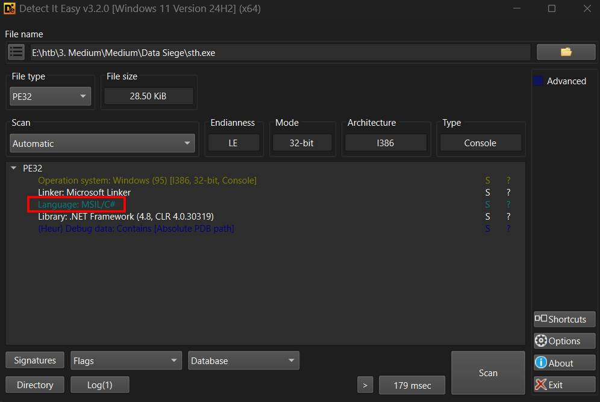
From DIE, since it is compiled in C# so it is possible to use dotPeek or dnSpy to read its source code. Here I choose dotPeek.

In the next TCP Stream, there are some encrypted strings, perhaps the executable will help decrypt them.
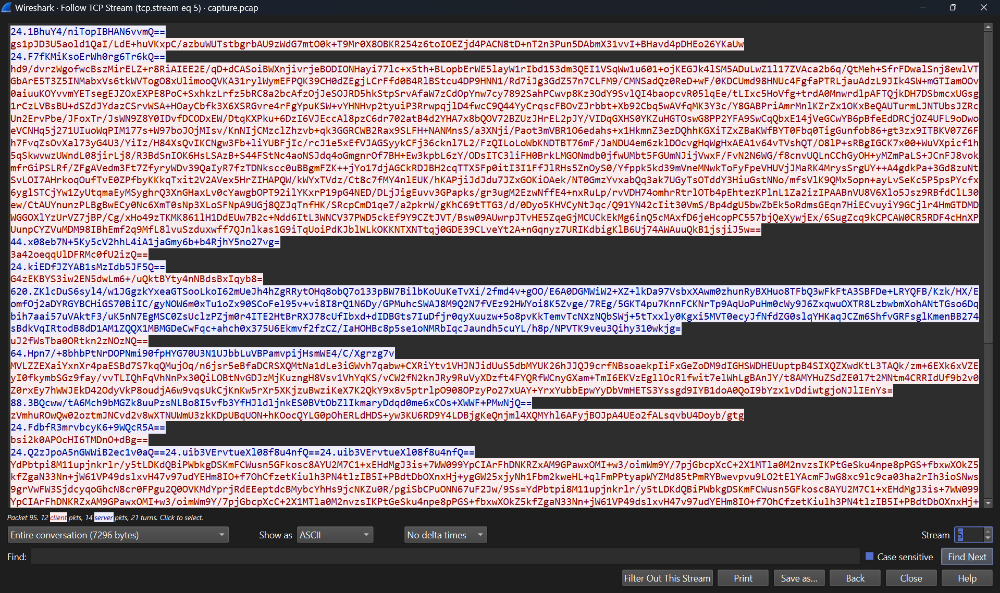

## Executable analysis
I checked for EZRATClient.EZRATClient.Program.Main() first.
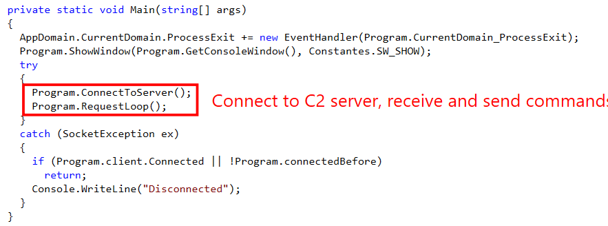
It calls for two functions which is ConnectToServer() and RequestLoop(), from my guess ConnectToServer() will just trying to connect back to C2 server, whereas RequestLoop will receive commands from server, execute on victim's machine and send results back to server. So I check for RequestLoop().
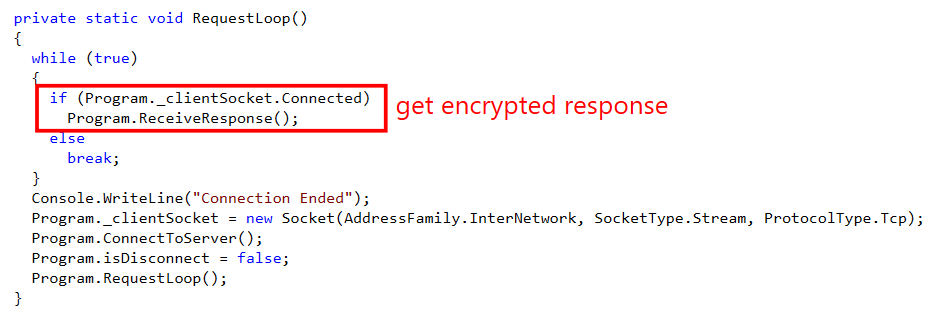
This function calls to ReceiveResponse(), perhaps to get encrypted responses and commands from server, as its name.
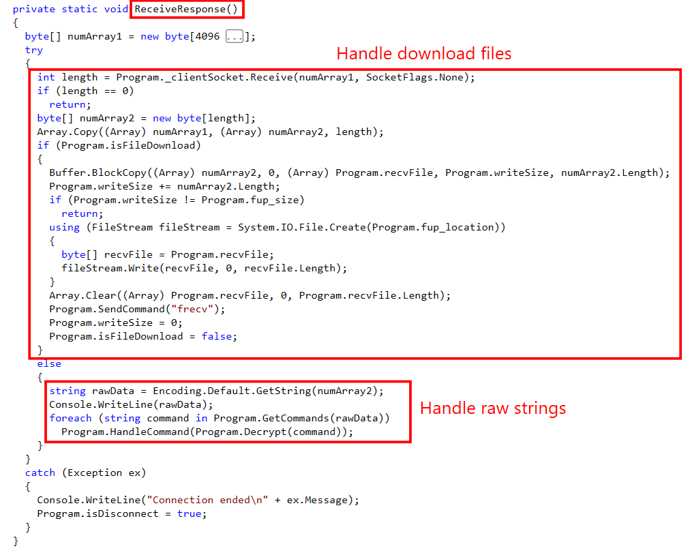
This function receives data from a socket connection and processes it. If a file is being downloaded, it collects incoming bytes until the full file is received, then saves it to disk. Otherwise, it treats the data as text commands, decrypts them, and executes them. Here I notice the SendCommand() function with suspicious "frecv" variable.
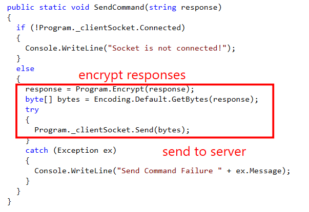
This function will encrypt responses and send back to C2 server, so I took a look for Encrypt() function.
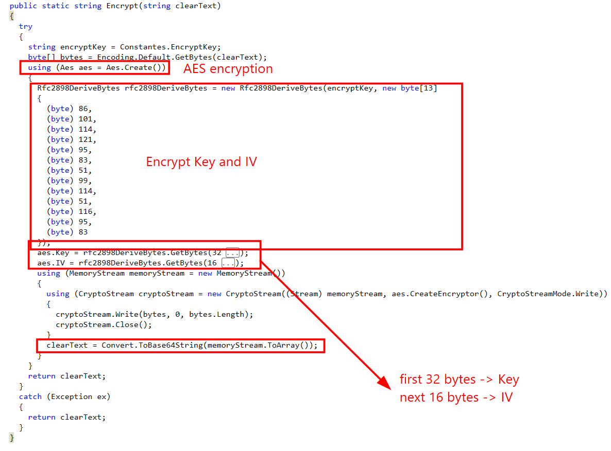
Turns out the output we saw earlier in TCP Stream 5 in PCAP has been AES ecrypted and Encode Base64, the Key and IV used for encryption taken from first 32 bytes and last 16 bytes respectively, from the output of Rfc289DeriveBytes(encryptKey) with fixed salt is Very_S3cr3t_S (from those bytes into ASCII letters).
So the last thing we need to get the Key and IV is encryptKey variable.
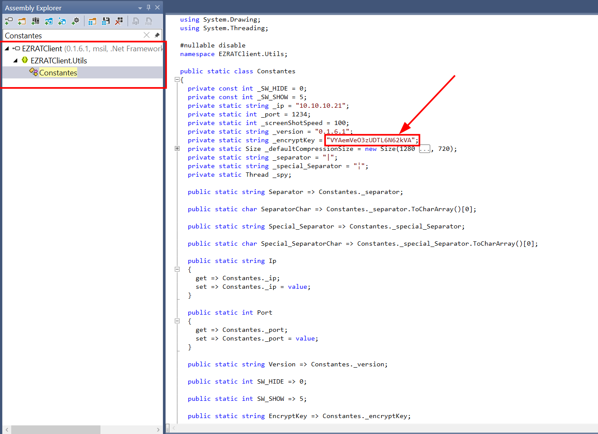
It is located in EZRATClient.Utils.Constances.
With all given information, I used LLM a bit to generate a function that prints out Key and IV.
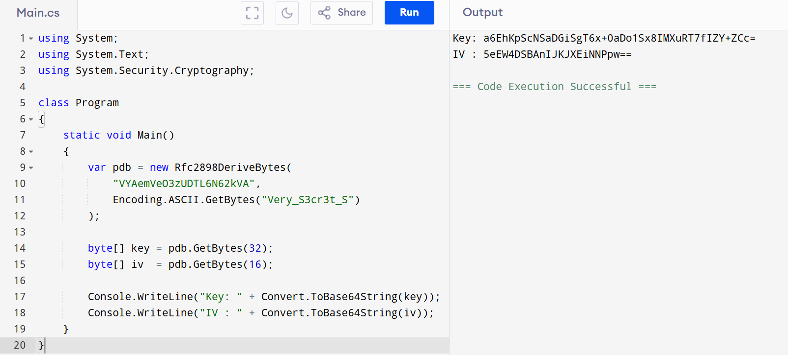

## Decrypt traffic
I can now start decrypting this traffic by decode Base64 and Decrypt AES. Some are commands like whoami or hostname and get result from victim's machine. Notably, the attacker has establish a public RSA key which allows him to get login access without password.
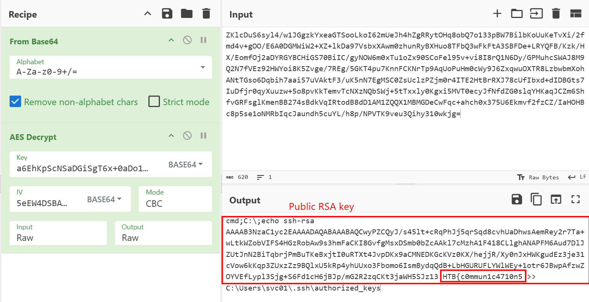
Nextup, the attacker get the information stored in C:\Users\svc01\Documents\credentials.txt, where the second part of the flag is found.
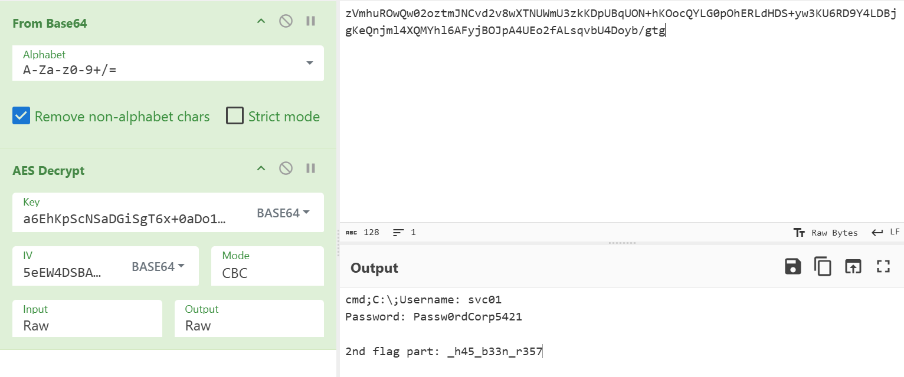
Finally, the attacker downloaded a Powershell script and located it in /temp.
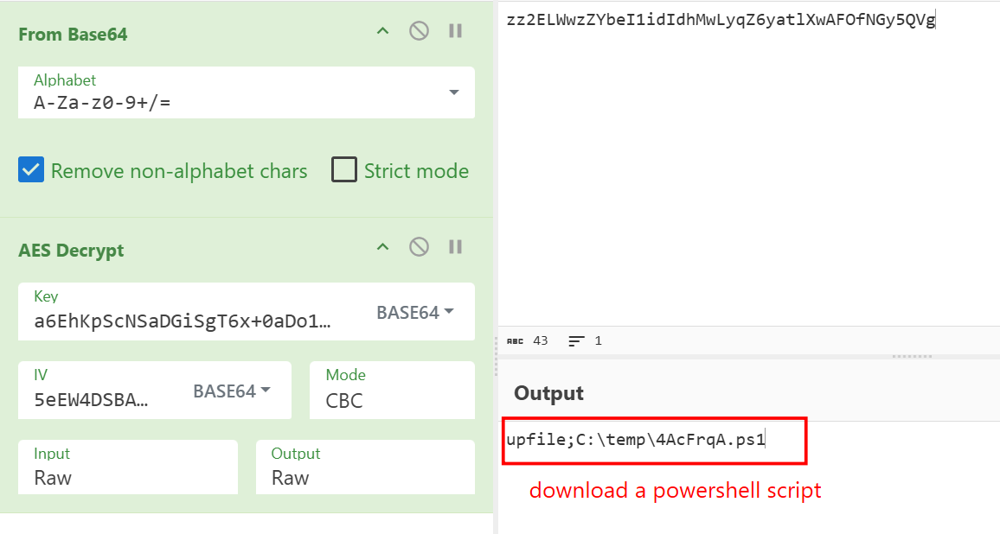
From traffic, I got an encoded Powershell command.
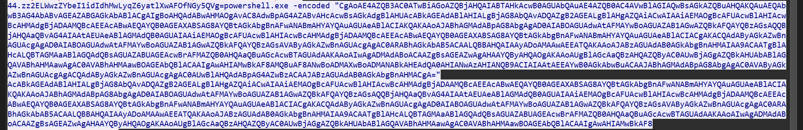
Decode it we have
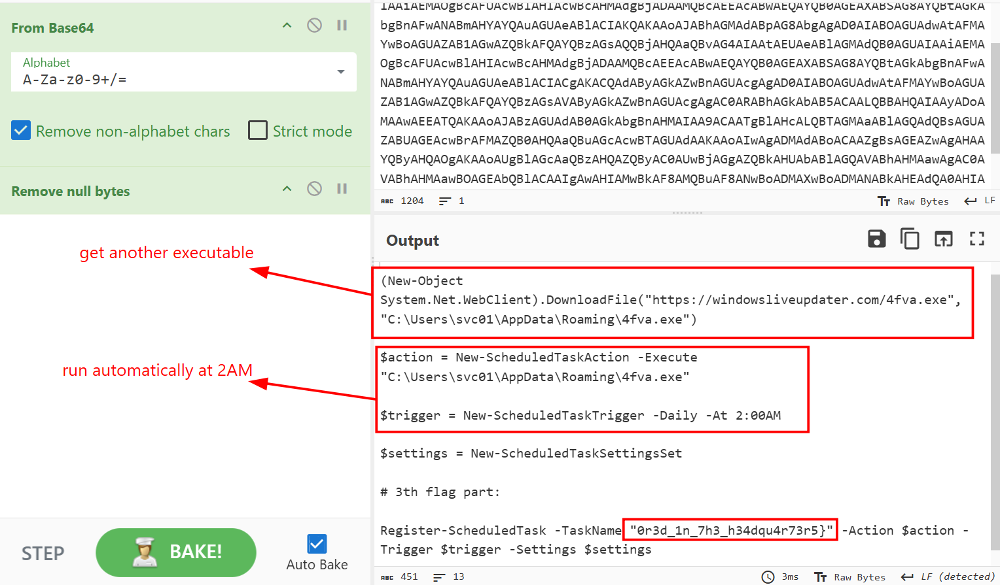
Another executable was downloaded, furthurmore, the attacker also establish a persistence by setting an automatic runtime at 2AM.

**FLAG: HTB{c0mmun1c4710n5_h45_b33n_r3570r3d_1n_7h3_h34dqu4r73r5}**

