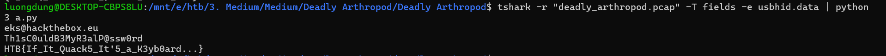

# Deadly Arthropod
**Challenge scenario**: Our operatives have intercepted critical information. Origin? Classified.  Objective: Retrieve the flag!

## Overview
A packet capture is provided, it is a USB Keyboard Capture. So just like Made in USA in BKSEC Training or Logger in HTB Easy, I extracted all fields containing USB HID keyboard by -e usbhid.data and used a python scrtipt to decode it.

Although it has some special buttons such as left arrow or right arrow which makes this challenge a bit more complicate, it just should be in Easy category.

**FLAG: HTB{If_It_Quack5_It'5_a_K3yb0ard...}**

---

