# Hypercraft
**Challenge scenario**: This email seems to have come from one of our agents, Axel Knight, but Axel has been missing for weeks, and we believe him to be compromised. The email claims to have information that could be vital to our winning this war, but before we use it, we want to make sure it is safe to open. Analyze the given email and see if it's real, or if it's just the Arodorians trying to phish us, and find the flag.

## First stage
An .eml file is provided, which is the extension of Outlook email.
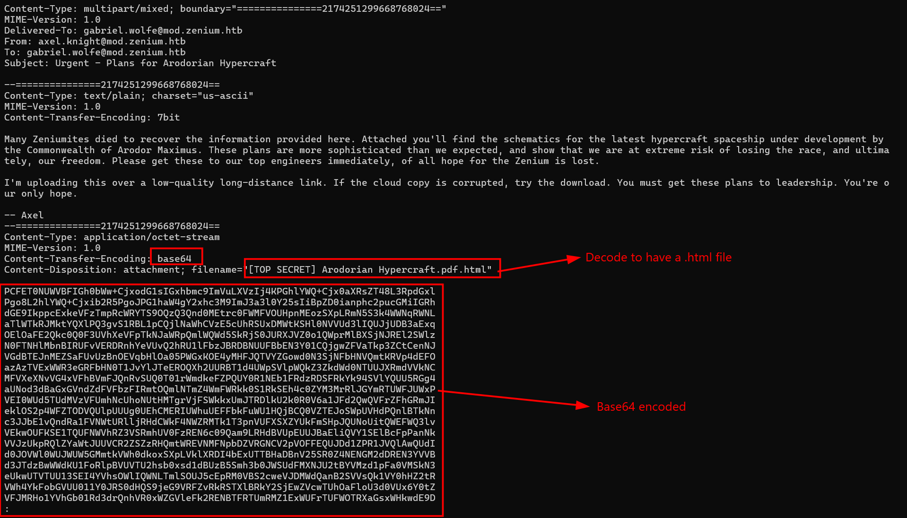
A very long Base64 encoded string is given, which is a html document.
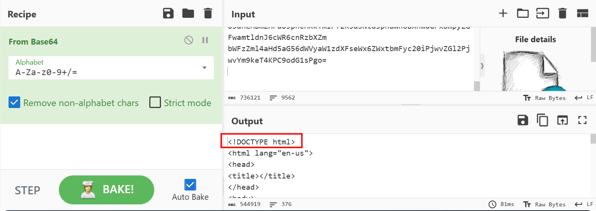
I saved the output into a sth.html, when I openned it, a website appeared and a zip file is auto downloaded.
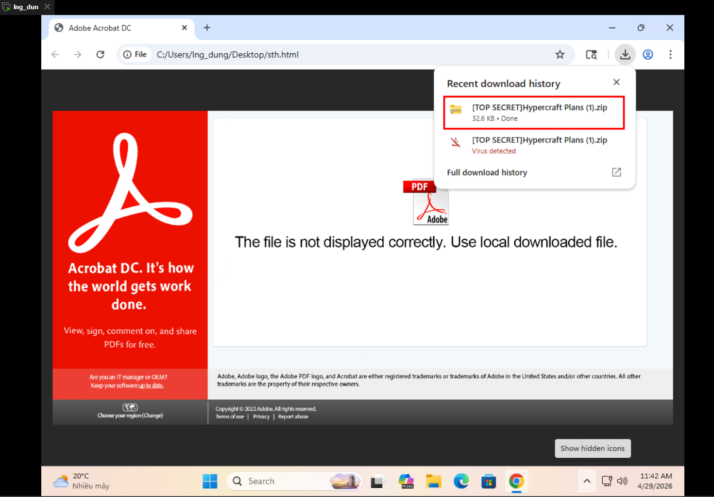
Unzipped it reveals an obfuscated Javascript block.

## Second stage
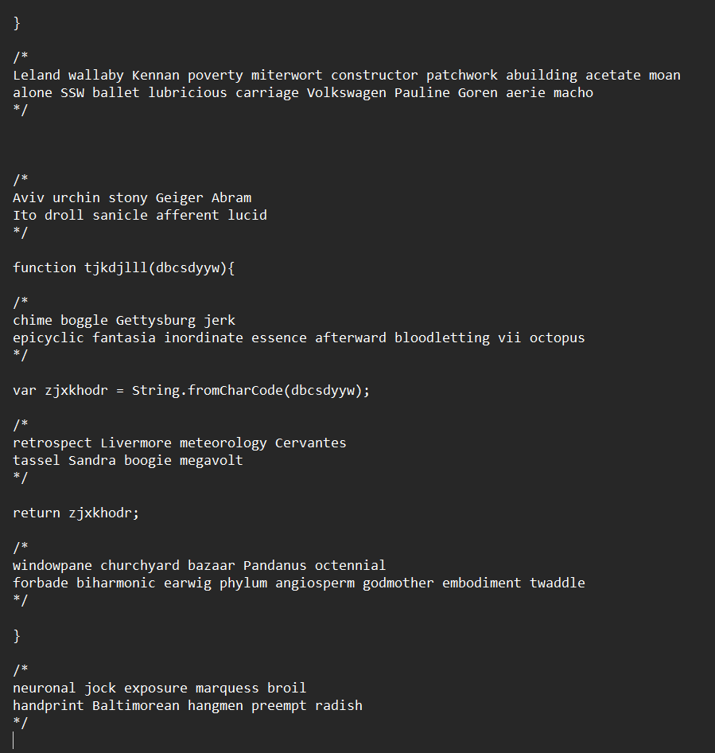
Obfuscationn....
Removed all those nodes reveals the hidden malware.
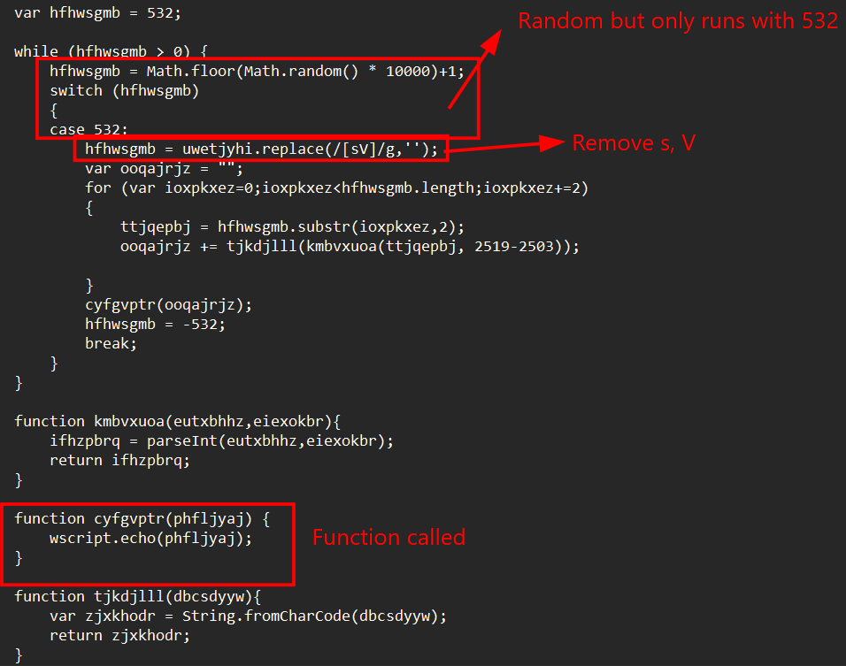
It will remove all s, V in string uwetjyhi. It iterates through the cleaned string in pairs of 2 characters at a time. Converts into hex string and finally calls out phfljyaj. Here I used wscript.echo() to prints out the result.
Executed that malicious script revealed another Javascript block.
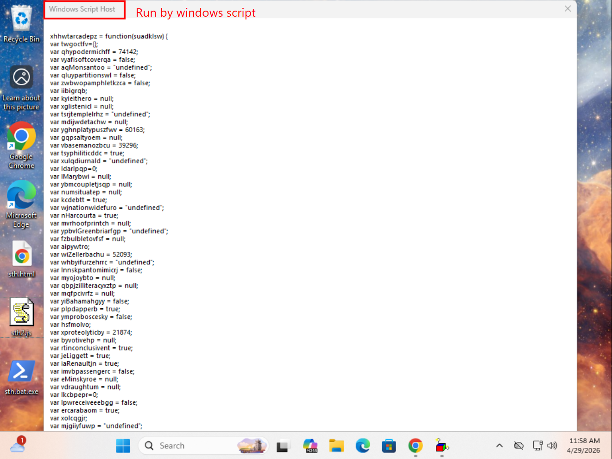

## Third stage
Continuing with dynamic analysis, where I executed that script on a Virtual Machine, instead of static analysis. 
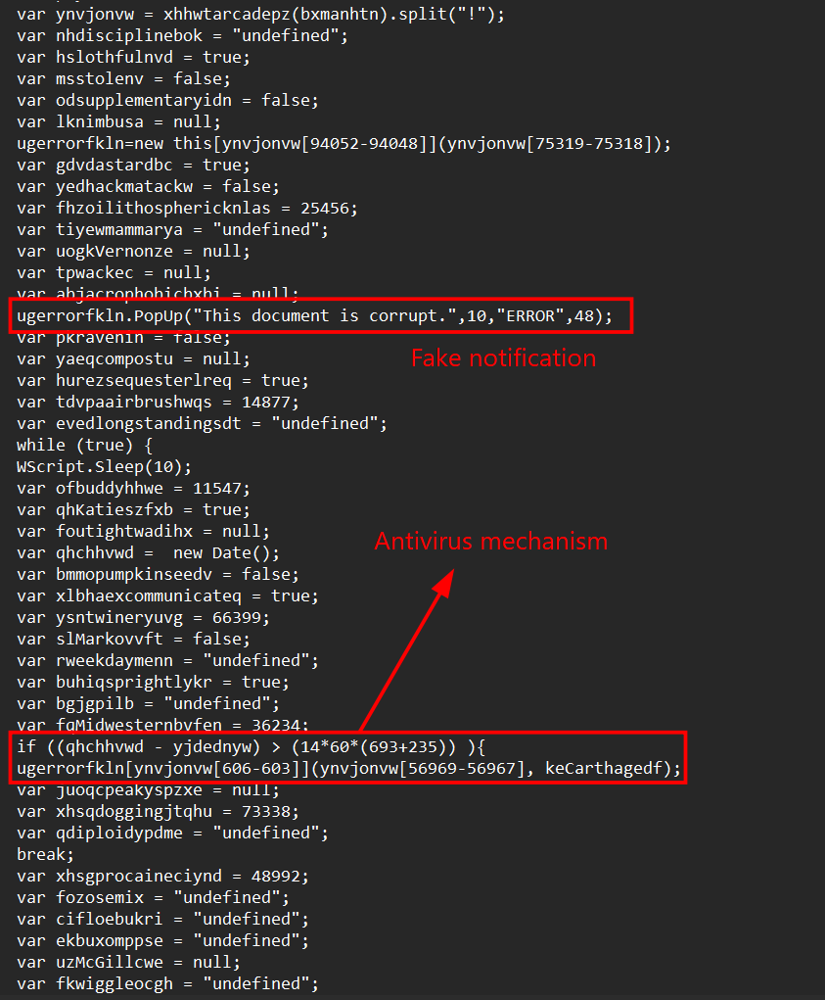
In some last line, the script will pop up a fake notification, bypass antivirus mechanism, while the real malware is still running in victim's machine.
I also notice that variable ynvjonvw also doing some .split("!"), so perhaps there must be something in it. Using wscript.echo() again to see the result.
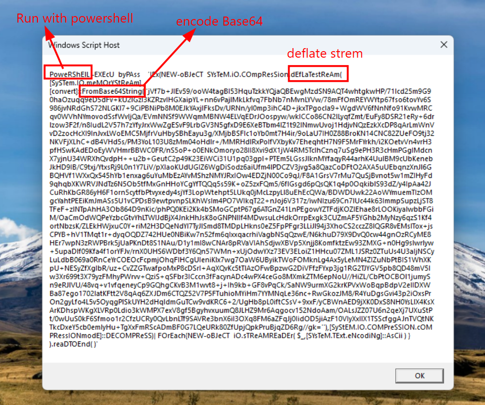
It will decode Base64 and deflate a malicious string to get the next payload.

## Fourth stage
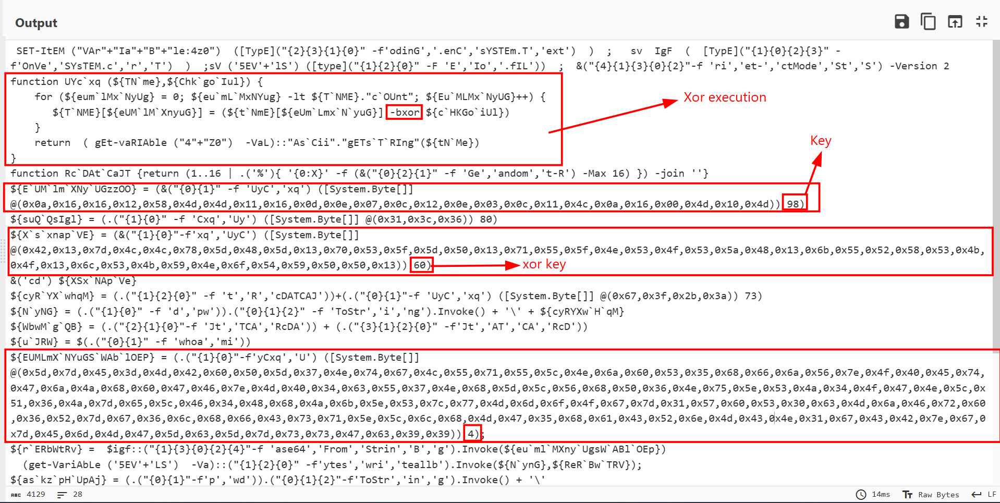
There is a uycxq() function which executes XOR actions from a hex characters and a XOR key.
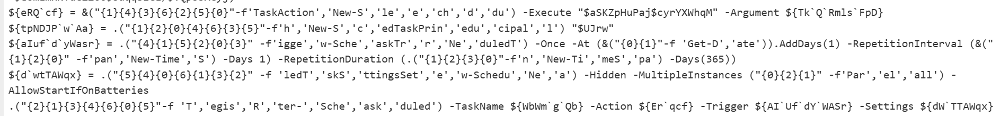
I also found this block which are some last lines of that malicious obfuscated script. Creating the task action, setting user principal, and configuring task settings.
So I started decoding those hex strings for more details.
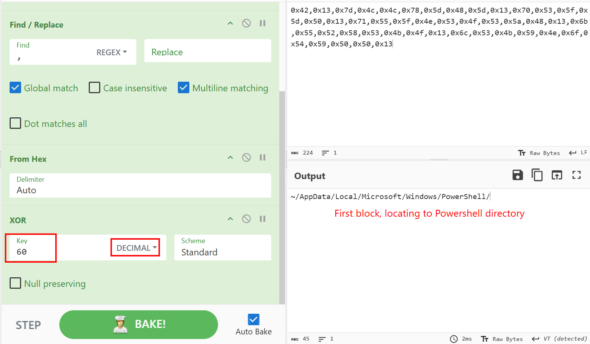
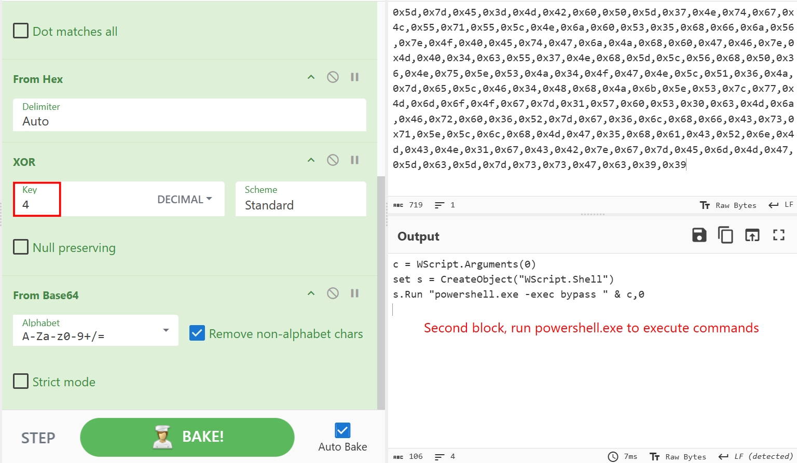
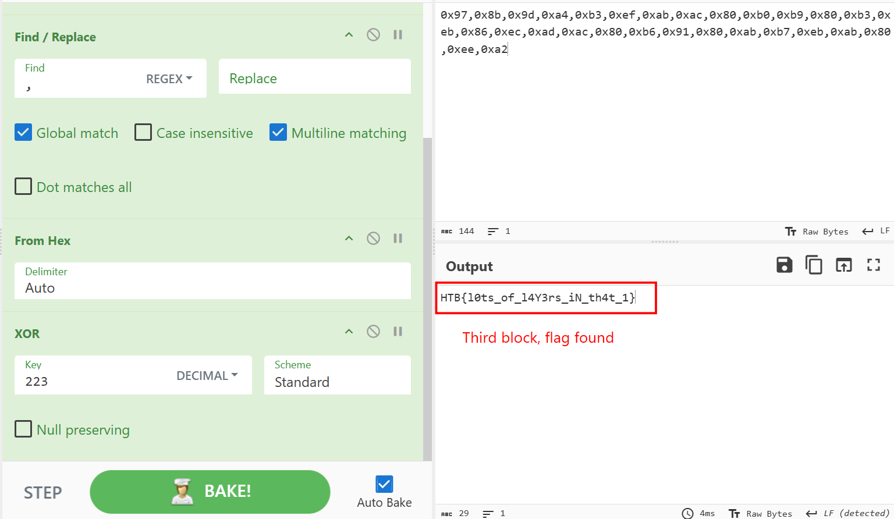
The attacker has used Powershell to execute harmful commands focusing on persistence establishment.

**FLAG: HTB{l0ts_of_l4Y3rs_iN_th4t_1}**

---

