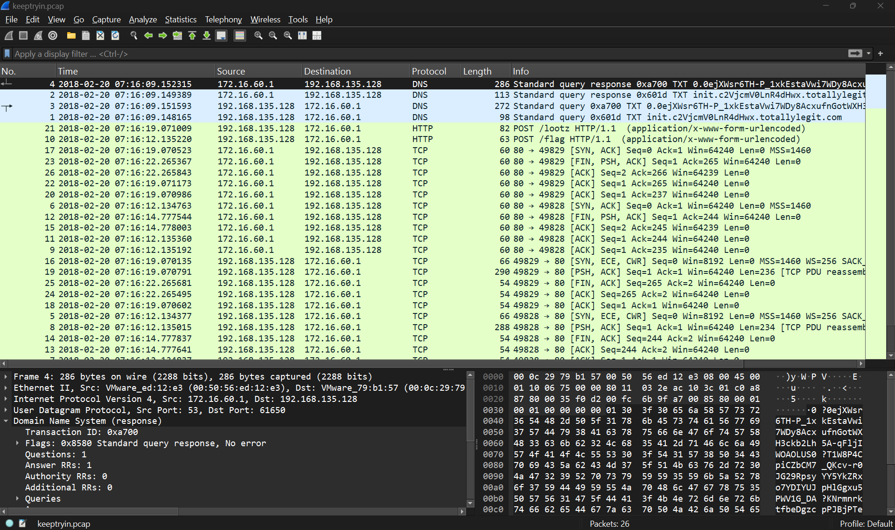
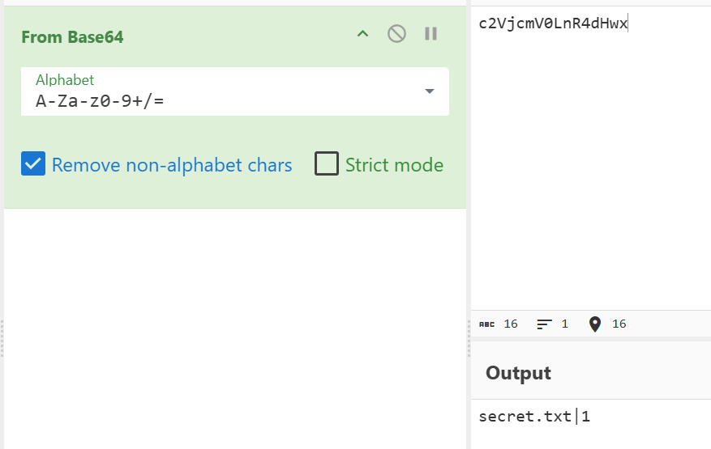
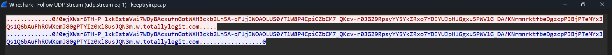
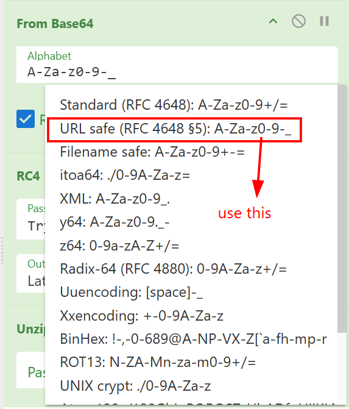
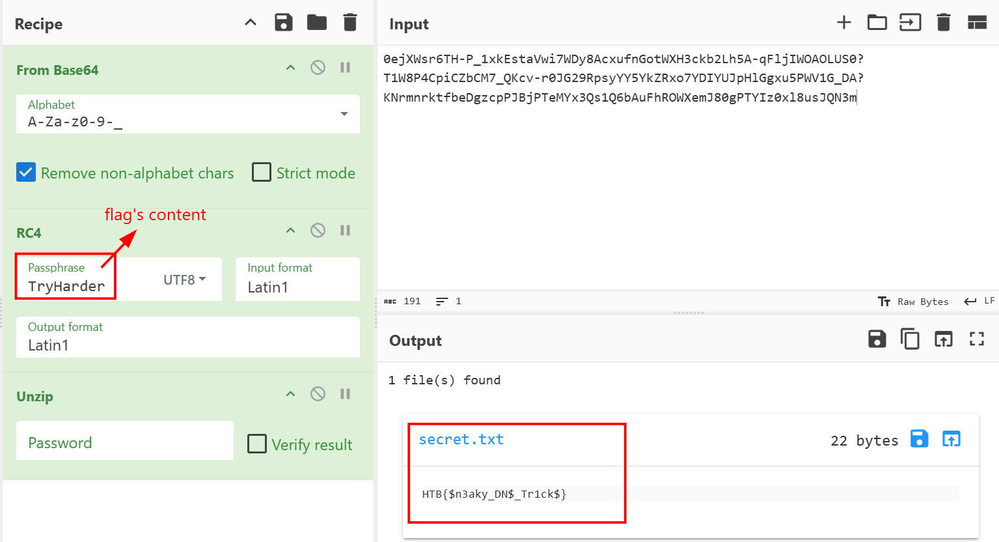

# Keep Tryin'
**Challenge scenario**: This packet capture seems to show some suspicious traffic

## Overview
Only a packet capture is provided. 

There are 26 packets only, including 4 packages are transfered through DNS Protocol, the rest used TCP. 
I followed TCP Stream first, and the attacker has uploaded two files, one is **flag** and one is **lootz**, which is contents are TryHarder and Keep trying, buffy (after decode Base64) correspondingly. But it seems like nothing here.
So I switched my attention to DNS requests, the attacker has used a very suspicious domain named something.totallylegit.com. The first domain, when I decode Base64 it is

A secret.txt file, but what is its content? I analyzed the other domain.

But decode Base64 normally this returns trash only. So after times of findings and tryings, I found out that in DNS subdomain, it does not allow special characters such as "-" or "+", instead, it is *_* and "+" correspondingly.
So I must used URL safe.

But it still did not reveal anything. The flag's content which is TryHarder is not for decoy, it is the key to decrypt RC4. Because RC4 is a symmetric key algorithm, beside, it only requires the key, IV is no needed like AES or DES.
An finally I have a zip file, unzipped it to have the secret.txt file, which containing the flag of this challenge.


```
**FLAG: HTB{$n3aky_DN$_Tr1ck$}**
```

---

