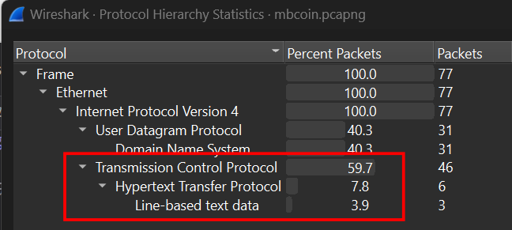
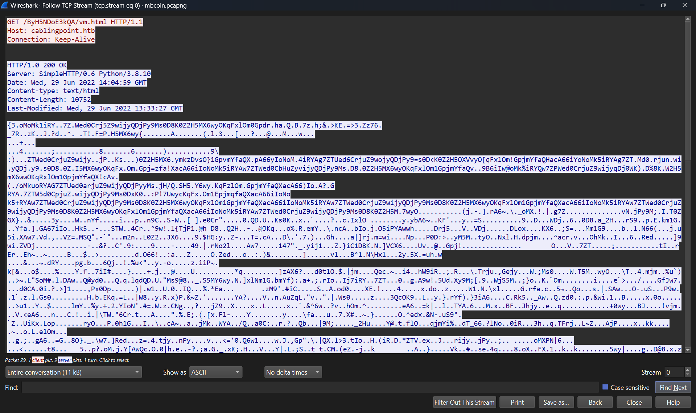
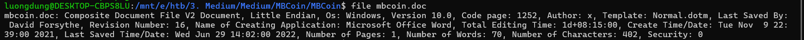
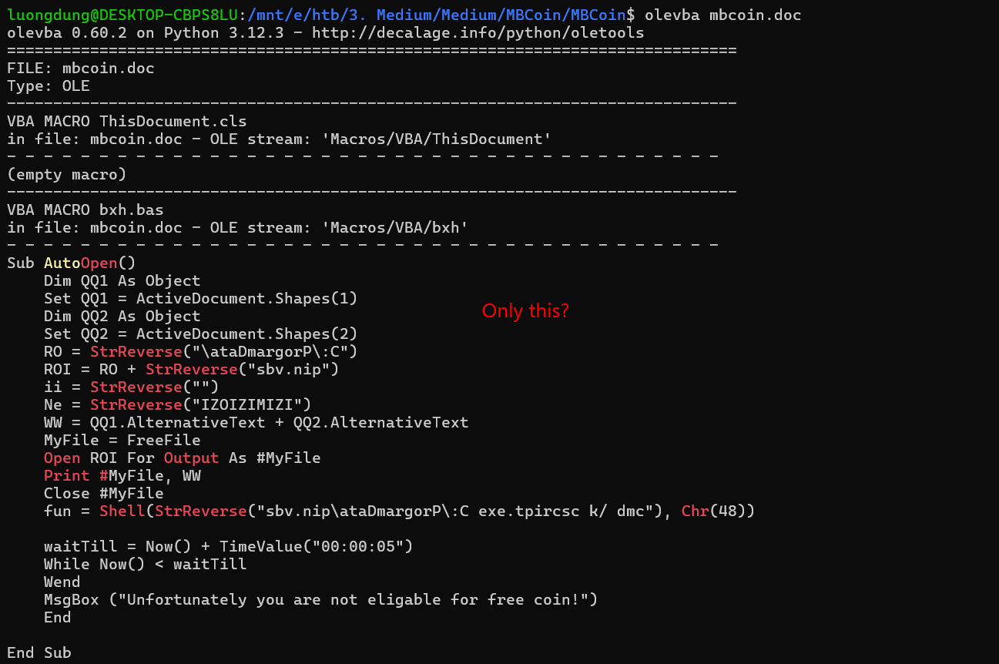
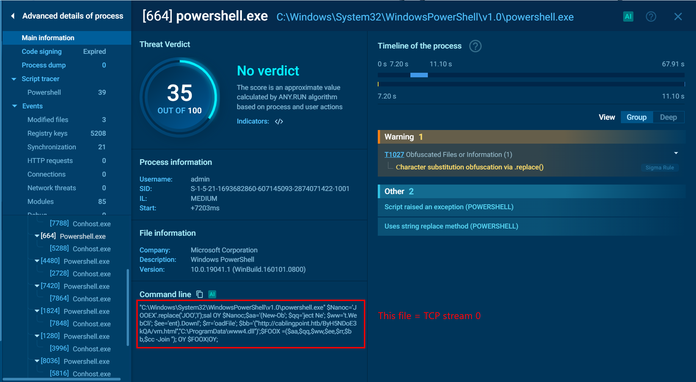
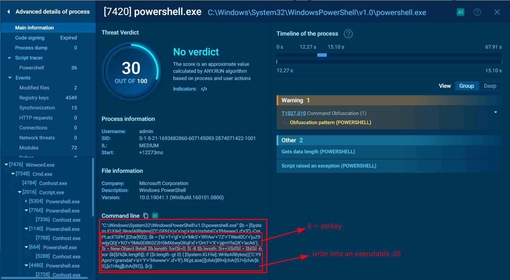
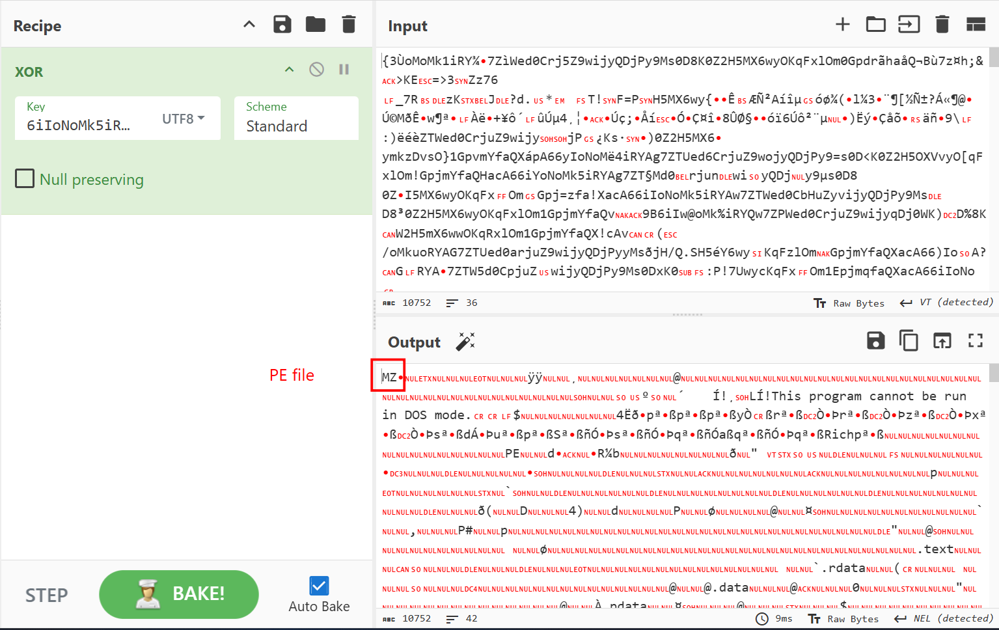
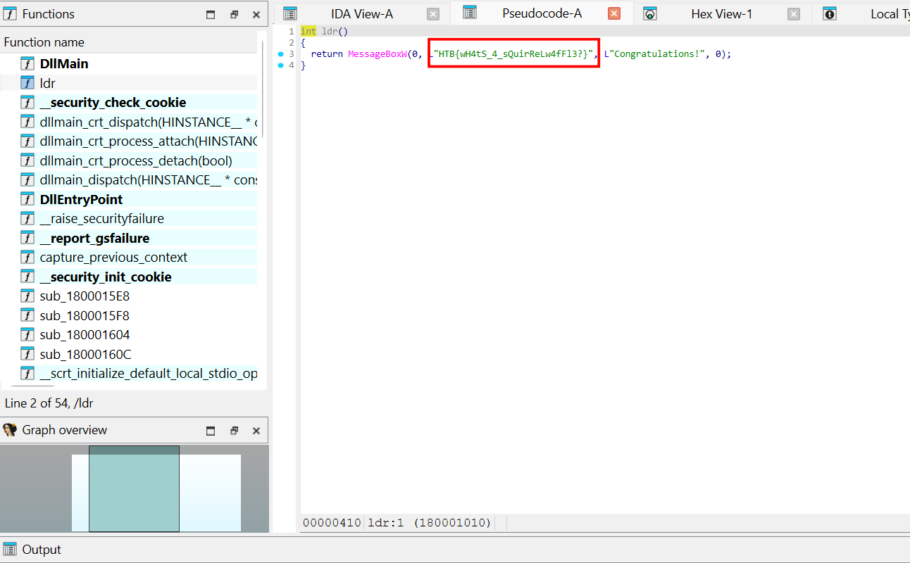

# MBCoin
**Challenge scenario**: We have been actively monitoring the most extensive spear-phishing campaign in recent history for the last two months. This campaign abuses the current crypto market crash to target disappointed crypto owners. A company's SOC team detected and provided us with a malicious email and some network traffic assessed to be associated with a user opening the document. Analyze the supplied files and figure out what happened.

## Analyzing packet capture
As decripted in the scenario, an email and a packet capture is provided. I openned the packet capture first and most of packages are transfered through TCP Protocol.

I followed TCP Stream, there are 3 streams in total. All of them are used to download some html documents. But only one of them is shown in plain text, the rest two is somehow encrypted.

And perhaps that malicious document will help understanding its encryption mechanism.

## Malicious document

This file type is such like emo.doc in emo challenge.
Using oleid revealed that this document contains VBA macros, so I used olevba.

So I change my approach, used any.run for dynamic analysis instead.
When the user opens this document, there are many suspicious powershell commands executed hidddenly, such as this one.

It will download a encrypted html block code, save into C:\ProgramData\www4.dll. Next, it will execute XOR with a fixed key (there are 5 all files, each one has its own xor key). Finally, save the output to C:\ProgramData\www.dll.

## Decrypt traffic
So I save the encoded files in TCP Stream as raw, XOR with its corresponding XOR key to get the origin executable with a MZ header.

Since it is compiled in C++, I used IDA for furthur analysis, and the flag is shown in plain sight in ldr() function.

**FLAG: HTB{wH4tS_4_sQuirReLw4fFl3?}**

---

