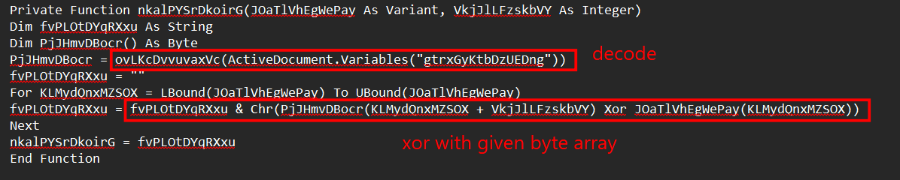
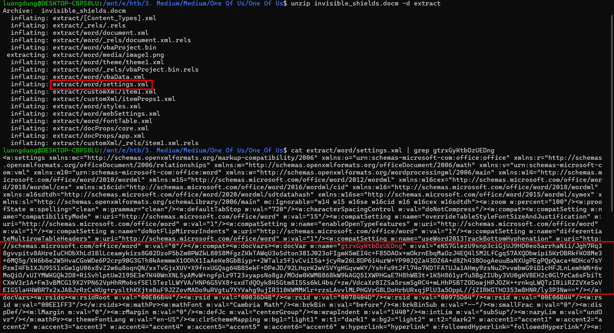
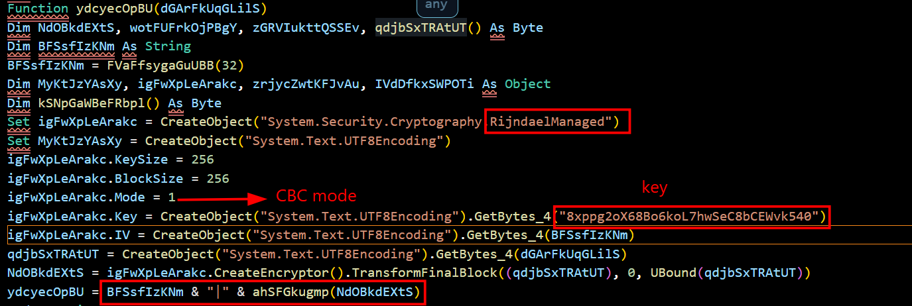
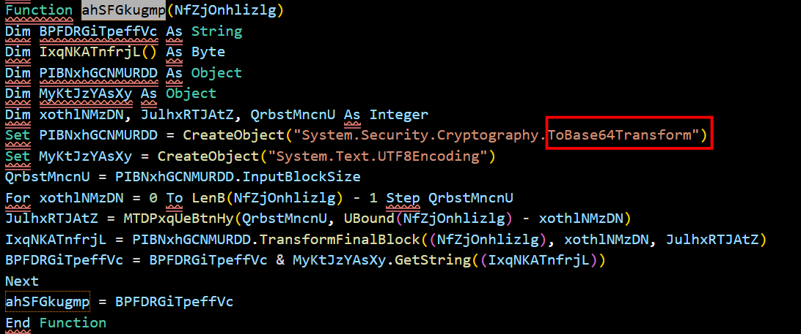
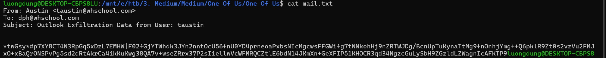
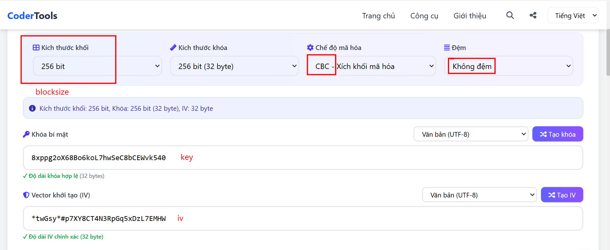
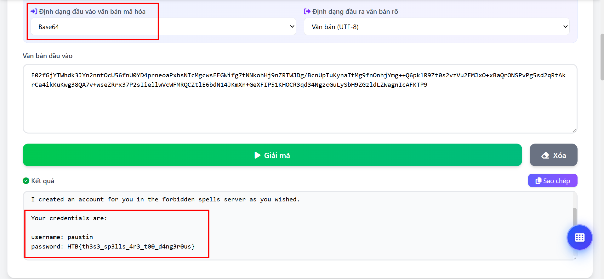

# One of us
**Challenge scenario**: Dark Pointy Hats are causing trouble again. This time, they have targeted Invisible Shields and the protectors of the forbidden spells. They developed a specific spyware that aims to get access to the forbidden spells server. We managed to retrieve a sample of the spyware and suspicious mail that seems to be produced by the spyware. Can you analyze the provided files and find out what happened?

## Overview
The challenge provided a doc file containing vba macros, and an encrypted mail.txt. I checked for macros first, and noticed that this function is called many times.

It takes document variable named **gtrxGyKtbDzUEDng**, decode it by ovLKcDvvuvaxVc() function, and XOR it with the corresponding bytes in a given array.
So I searched for the content in gtrxGyKtbDzUEDng variable. Since a .docm file is actually a zip file, and Words's document variables do not lie in vba, they are stored in document's configuration file
```
word/settings.xml
```

Found it.
Then I asked LLM to generate a python script to deobfuscate whereever calls nkalPYSrDkoirG() function.

## Encryption
The final deobfuscated VBA script is much easier to analyze. And I found this encrypting function at the beginning.

Here the encryption use AES-CBC mode. But it not like normal AES, it is RijndaelManaged, which is a worthy coding class for .NET, implementing the Rijndael algorithm. It has BlockSize of 256, so it does not like normal AES (CyberChef failed) since it is 128 in BlockSize.
The key is given in the macro. IV and ciphertext is seperated by a "|". But the ciphertext must surpass a ahSFGkugmp() function. 

Well it just encode base64.
So I got what I need to decrypt the mail.txt, which can be found as an artifact of the challenge.

I used a online tool for decryption.


And it is the credentials of paustin user.

**FLAG: HTB{th3s3_sp3lls_4r3_t00_d4ng3r0us}**

